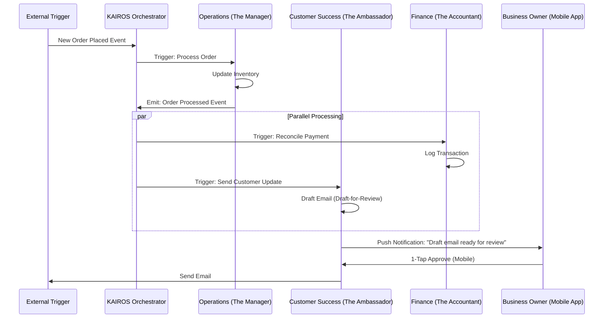

# Issue Brief: AI Agent Department Architecture

## Title
OHC AI Agent Department Orchestration & Coordination

## Problem Statement
Small business owners (Maya, Carlos, Priya) do not want to manage complex workflows, read manuals, or configure API integrations. They need a system that acts like a real team of employees, operating invisibly in the background to handle operations, marketing, sales, customer success, finance, legal, and business advisory. The challenge is designing an architecture where these AI "departments" can coordinate seamlessly, share context, and execute tasks autonomously while maintaining strict tenant isolation and ensuring the business owner retains ultimate control via simple 1-tap approvals.

## Research Report
- **Competitive Landscape**: Traditional platforms like Shopify or Wix rely on user-installed plugins and manual rule configuration (e.g., Zapier) which are too complex for non-technical users. OHC replaces plugins with autonomous "Departments".
- **Agentic Workflow Constraints**: Agents need access to shared context (memory) to avoid duplicate actions or contradictory behaviors. For example, "The Promoter" shouldn't advertise a product that "The Manager" knows is out of stock.
- **Trust & Control**: A critical friction point for small business owners adopting AI is the fear of the AI doing something wrong (e.g., sending an incorrect quote). The system must differentiate between low-risk autonomous actions and high-risk actions requiring "Draft-for-Review".

## Design Doc

### 1. The Departments
The system is divided into 7 core departments, mapping to familiar business roles:
- **Operations ("The Manager")**: Order and booking processing, inventory tracking, fulfillment, refunds.
- **Marketing & Advertising ("The Promoter")**: Website design, SEO, social media posts, promotional content, QR codes, link-in-bio pages.
- **Sales & Acquisition ("The Salesperson")**: Quote generation, lead follow-up, referral tracking, upsell suggestions.
- **Customer Success ("The Ambassador")**: Message replies, order updates, review requests, re-engagement campaigns.
- **Finance & Payments ("The Accountant")**: Payment processing, financial reports, subscription billing, tax summaries.
- **Legal & Compliance ("The Protector")**: Terms/policies, contracts, GDPR compliance, license tracking, liability disclaimers.
- **Business Advisory ("The Advisor")**: Weekly health reports, next-action suggestions, seasonal trends, pricing recommendations.

### 2. Coordination & Trigger Mechanisms
Departments are triggered via three mechanisms:
- **Event-Driven (Reactive)**: Triggered by a central pub/sub mechanism or shared task queue.
- **Scheduled (Proactive)**: Triggered on a schedule (e.g., "The Advisor" runs every Monday at 8 AM).
- **On-Demand (Interactive)**: Direct user prompts via the mobile app.

**Coordination Architecture Diagram (Mermaid.js)**

### 3. Memory & Context Retrieval
All departments share a centralized, tenant-isolated memory store (`autodream_memories`).
- **Semantic Search**: Agents must be able to perform semantic searches over past memories to find relevant interactions.
- **Memory Consolidation**: Short-term session data is compressed and stored as long-term memory overnight, allowing agents to "remember" seasonal trends or specific customer quirks.
- **Isolation**: Every query must be strictly filtered by `tenant_id` at the database level to ensure complete isolation.

### 4. Approval Workflows (Draft-for-Review vs. Auto-Execute)
To build trust, actions are categorized by a risk matrix:
- **Low-Risk (Auto-Execute)**: Internal state changes, tagging, inventory decrements. Executed instantly.
- **High-Risk (Draft-for-Review)**: External communications, refunds, social media posts. The agent generates a draft and places a task in the KAIROS Shared Task List. The owner receives a push notification and can approve the action with a single tap on their mobile device.

### 5. Mobile UX Flow (375px First)
1.  **Notification**: "The Ambassador has drafted a reply to Customer X."
2.  **Review Screen**: Displays the drafted message in a clean, Glassmorphism card with large, readable text (Outfit font).
3.  **Action Bar**: Two massive, thumb-friendly buttons at the bottom: "Approve & Send" and "Edit".
4.  **Optimistic UI**: Upon tapping "Approve", the card instantly dismisses with a subtle success animation, while the KAIROS Orchestrator handles the actual execution in the background.

### 6. Usage Budgeting & Throttling
AI usage is metered per tenant based on their SaaS Tier (Free, Starter, Pro, Business).
- **Token/Action Tracking**: Each agent action increments a fast data store counter for the tenant's current billing cycle.
- **Throttling**: If a limit is approached, the Orchestrator gracefully pauses non-critical scheduled tasks and prompts the "Advisor" to suggest a tier upgrade.

## Implementation Prompt
**To Implementer Agent:**
Implement the core KAIROS Orchestrator framework to support the 7 AI Departments. Create a central event bus to allow departments to publish and subscribe to cross-department events (e.g., `order.processed`, `insight.trending`). Implement the `Draft-for-Review` state machine, ensuring that high-risk actions generate a pending task in the database rather than executing immediately. Build the corresponding mobile-optimized API endpoint for the business owner to fetch pending drafts and submit 1-tap approvals. Ensure all database interactions strictly enforce `tenant_id` isolation. Provide tests to verify the routing logic.

## Priority
P0

## Estimated Scope
Large
