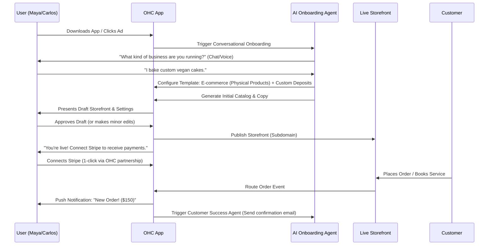

# [Research] Business Journey Architecture

## Problem Statement

Small business owners—from bakers running Instagram shops to handymen relying on word-of-mouth—struggle to digitize their operations because existing platforms (Shopify, Wix, Squarespace) require too much manual configuration, technical knowledge, and time. Users need a system that feels less like building a website and more like hiring a digital manager who sets everything up for them in under 10 minutes. The gap is the friction between realizing the need for a digital presence and actually having a live, fully functional, and AI-managed business platform.

## Research Report

**Competitive Landscape:**
- **Shopify:** Excellent for traditional e-commerce but overwhelming for service providers or casual side-hustles. Requires extensive manual setup (themes, payment gateways, shipping zones).
- **Wix/Squarespace:** Website-first rather than business-first. Users spend hours tweaking layouts rather than launching their business. Not optimized for mobile-first management.
- **GoDaddy:** Often pushes domain sales first, with a clunky, dated builder experience.

**User Pain Points (OHC Personas):**
- **Maya (Baker):** Spends too much time answering repetitive DMs ("Do you do vegan cakes?") and managing custom order deposits manually.
- **Carlos (Handyman):** Has no website because he thinks it requires a laptop and coding. Needs a simple booking and quoting system on his Android phone.
- **Priya (Boutique):** Struggles with syncing in-store and online inventory. Needs a unified dashboard.
- **Leo (Tutor):** Juggling calendar links, payment links, and Zoom links. Needs an integrated booking flow.
- **Fatima (Food Cart):** Needs a simple, multi-lingual interface to manage pre-orders without a complex POS system.

**Key Findings:**
1. **Mobile-First is Non-Negotiable:** Most target users run their business entirely from their phones.
2. **"Done for You" > "Do it Yourself":** AI must actively build the initial setup (storefront, catalog, booking settings) based on minimal input, rather than just providing templates.
3. **Omnichannel from Day 1:** Integration with social media (Instagram DMs, TikTok link-in-bio) is as important as the website itself.

## Design Doc

### Architecture Diagram

### Mobile UX Flow (375px First)
1. **Welcome Screen:** "Let's launch your business. What do you do?" (Simple text input or voice recording).
2. **AI Magic Loading (10s):** "Generating your storefront... Writing descriptions... Setting up your booking calendar..."
3. **Review & Tweak:** A live preview of the mobile storefront. The user can swipe through generated products or services and tap to edit.
4. **Go Live:** A single, prominent "Publish" button.
5. **Dashboard:** "You are live! Here is your link to share on Instagram. Next step: Connect your bank to get paid."

### Key Design Decisions
1. **Conversational Onboarding over Forms:** Users describe their business naturally; the AI Agent translates that into platform configurations (Business Type, Required Modules, Initial Data).
2. **Zero-Configuration Defaults:** The system makes opinionated choices (e.g., standard deposit amounts, default shipping rates) so the user doesn't have to, but allows them to change it later.
3. **Deferred Complexity:** Bank connections, custom domains, and advanced tax settings are not required to see the initial value (the generated storefront). They are introduced post-activation.

### AI Agent Integration Points
- **Onboarding Agent:** Acts as the interviewer to gather business context.
- **Copywriter Agent:** Generates product descriptions, about pages, and policy documents based on the business type.
- **Setup Agent:** Automatically configures the appropriate modules (e.g., enabling the Calendar module for Carlos, the Product Catalog for Maya).

## Implementation Prompt

**Title:** Implement AI-Driven Conversational Onboarding Flow

**User Journey (CUJ):**
A new user downloads the OneHumanCorp app. Instead of being presented with a traditional signup form and dashboard of empty settings, they are greeted by an AI agent that asks, "Tell me about your business." The user types or speaks a brief description (e.g., "I fix plumbing issues in Seattle"). The app then displays a "magic loading" screen for a few seconds before presenting a fully generated, functional storefront tailored to their business type (e.g., a booking page with standard plumbing services pre-filled). The user can review the preview, make minor edits if desired, and click "Publish" to go live instantly.

**Acceptance Criteria:**
1. A conversational UI is present at the start of the onboarding flow.
2. The user's input is processed to determine the correct business type (Physical Products, Digital Products, Services & Bookings, etc.).
3. A draft storefront is generated, including relevant default modules (e.g., Calendar for services, Cart for products) and AI-generated sample data (catalog/services, descriptions).
4. The user is presented with a mobile-optimized preview of the generated storefront.
5. The user can successfully publish the draft storefront to a live state with a single action.
6. Complex configurations (payment gateways, domains) are deferred until after the initial publish action.

**Priority:** P0
**Estimated Scope:** Large
