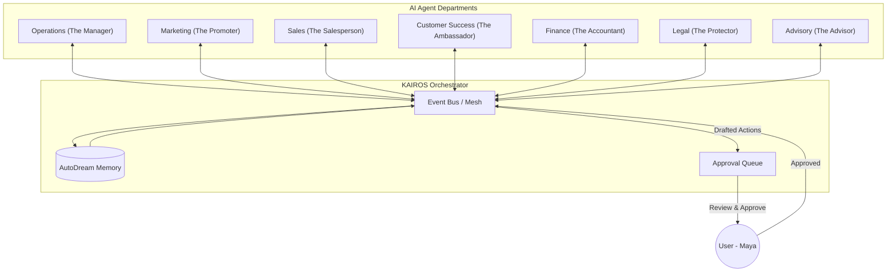

# Architecture Brief: AI Agent Department Architecture

## Title
OHC AI Agent Departments: Invisible Swarm Orchestration & Collaboration

## Problem Statement
Small business owners (Maya, Carlos, Priya) do not want to manage "AI Assistants", "LLM Contexts", or "System Prompts." They want to run a business. They need an invisible support team that mirrors a real business structure—Operations, Marketing, Sales, Customer Success, Finance, Legal, and Advisory. Currently, there is no unified architecture governing how these departments trigger, collaborate, share memory, and seek user approval, leading to a disjointed, overly technical user experience that fails the Grandmother Test.

## Research Report
- **User Mental Models**: Real-world SMB owners understand organizational departments. A "Salesperson" is intuitive; an "AI Quote Generator Bot" is technical and intimidating.
- **Workflow Gaps**: Current SaaS platforms require users to manually string together triggers via Zapier. OHC's value proposition is zero-configuration coordination. If Operations processes an order, Customer Success must seamlessly know to send a confirmation without the user building a workflow.
- **Trust & Oversight**: Owners are hesitant to let AI "run wild." They need a robust approval mechanism (Draft-for-Review vs. Auto-Execute) that is as simple as swiping right on a Tinder profile to approve a drafted email.
- **Resource Constraints**: High AI usage can quickly deplete margins. We need an architectural constraint to budget and throttle AI usage per tenant tier, ensuring fair access without complex token accounting for the user.

## Design Doc

### Key Design Decisions
1.  **Departmental Abstraction**: The Swarm is strictly organized into seven recognizable departments. Users interact with the department's persona (e.g., "The Advisor"), not the underlying technology.
2.  **Event-Driven Coordination**: Departments do not directly call each other via hardcoded APIs. They subscribe to core business events (e.g., `Order.Created`, `Invoice.Paid`). The KAIROS Orchestrator routes these events to the relevant departments.
3.  **Unified Memory Plane**: All departments share a common memory context scoped to the `organization_id`. "The Ambassador" knows what "The Salesperson" promised because they read from the same AutoDream memory space.
4.  **Tinder-Style Approval Queue**: The default behavior for outbound communications is "Draft-for-Review." Users review a unified feed of agent actions on their mobile device and approve them with a single tap. Once trust is established, users can toggle "Auto-Execute."
5.  **Tier-Based Budgeting**: AI action limits are enforced at the orchestration level. When a tenant nears their tier's limit, "The Advisor" proactively suggests upgrading or pausing non-critical departments.

### Architecture Diagram (Mermaid.js)

### Department Triggers & Coordination
-   **Operations**: Triggered by user/customer events (e.g., order placed, refund requested).
-   **Marketing**: Triggered on schedule (e.g., daily social post) or on demand (e.g., "build me a landing page").
-   **Sales**: Triggered by lead capture events or website inquiries.
-   **Customer Success**: Coordinates tightly with Operations. When Ops finishes fulfillment, CS is triggered to send a follow-up.
-   **Finance**: Triggered by payment events and on schedule (e.g., monthly tax summary).
-   **Legal**: Triggered on demand (e.g., "draft a contract") or by system audits.
-   **Advisory**: Triggered on schedule (e.g., Monday morning briefing) or on event (e.g., approaching usage limits).

### Mobile UX Flow (375px First) & Wireframes
-   **The Agent Feed**: The core mobile screen. A unified, chronological feed of what the departments are doing.
-   **Action Cards**: Each item in the feed is an Action Card. Examples:
    -   *The Ambassador drafted a reply to Carlos.* [Review & Send]
    -   *The Accountant reconciled 5 payments.* [View Details]
    -   *The Promoter suggests a weekend sale.* [Approve & Launch]
-   **Approval Interaction**: For "Draft-for-Review" items, the user taps the card to see the proposed action (e.g., an email draft). A clear, large "Approve" button (≥ 44x44px) executes the action.
-   **Department Settings**: A simple toggle list. "Let The Ambassador reply automatically to FAQs" (On/Off).

## Implementation Prompt
**To Implementer Agent:**
Implement the core KAIROS Agent Department Orchestration layer. Define the seven core department personas and their event subscription models. Implement the unified "Approval Queue" data structure and the API to serve the "Agent Feed" for the mobile UI. Ensure that all agent actions are logged to the shared memory plane and that the `TierService` intercepts and throttles requests based on the tenant's current plan limits. Build the mobile-first (375px) "Action Card" UI components, allowing a user to review and approve a drafted action with a single tap. Do not prescribe specific queue runners or LLM implementations; focus on the event routing, the approval state machine, and the user-facing mobile feed. Include comprehensive unit tests for the approval state transitions and E2E tests for the mobile feed rendering.

## Priority
P0

## Estimated Scope
Large
