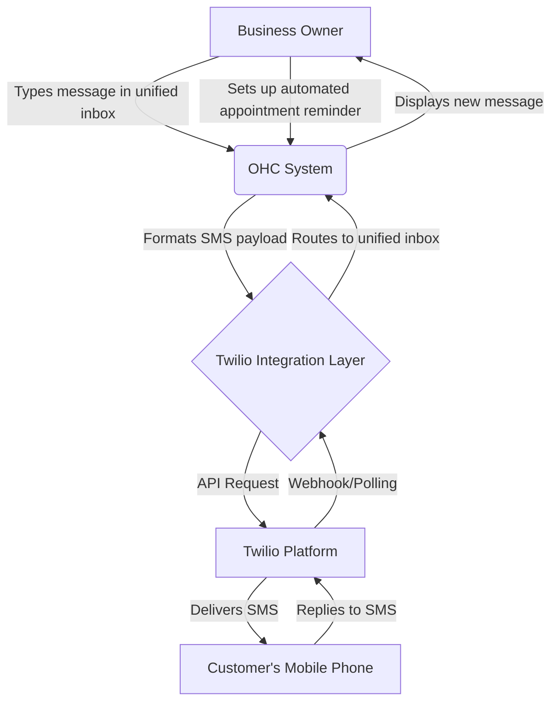
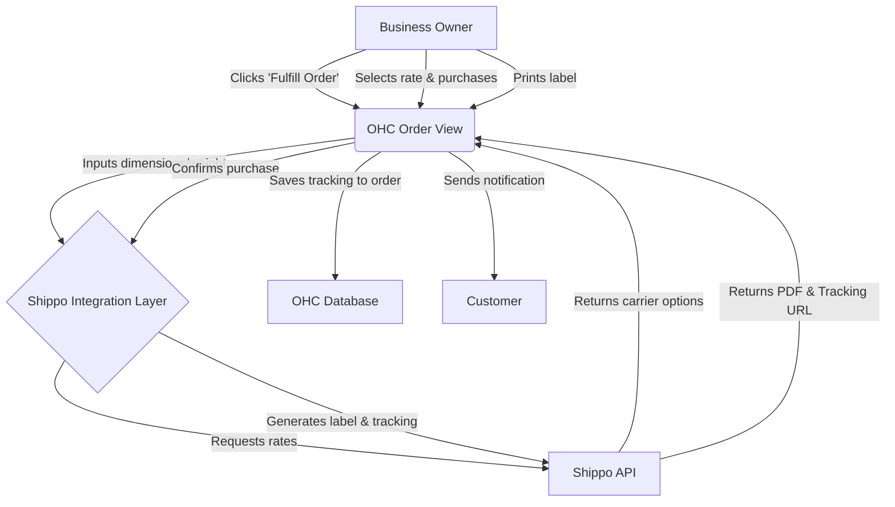
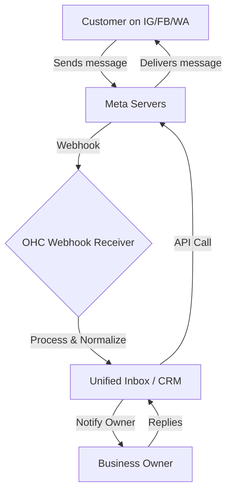
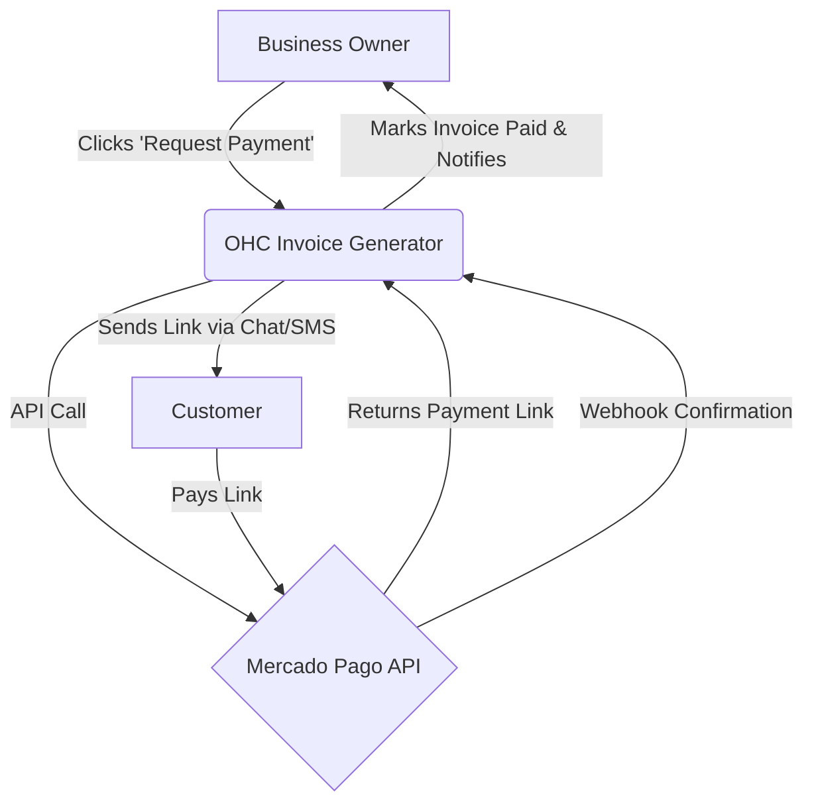
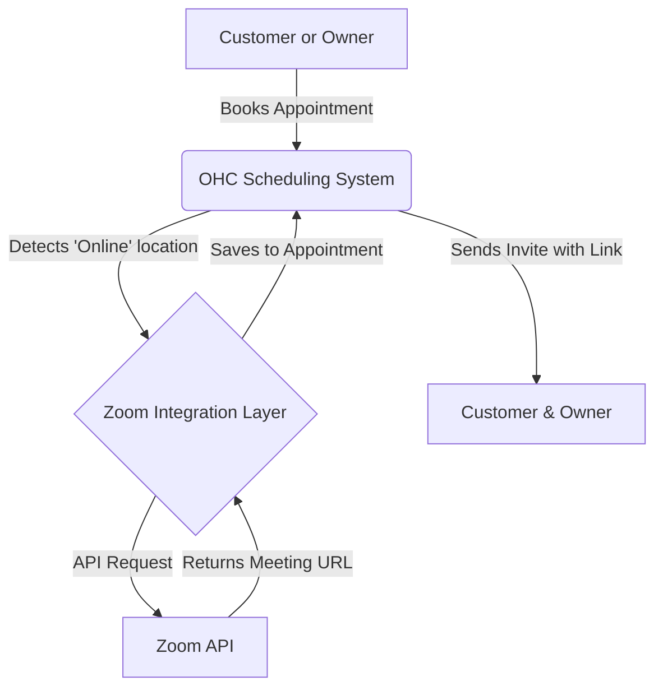

# 📱 Issue Brief: SMS & Notifications Tool Integration (Twilio)

## Title
Integrate Reliable SMS Notifications for Customer Updates

## Problem Statement
Many small business owners, particularly those in areas with lower English proficiency or unreliable internet access, rely heavily on SMS to communicate with their customers. Currently, sending updates about appointments, orders, or support issues requires manual typing and context switching, leading to missed messages, typos, and an inconsistent customer experience. Business owners need a simple, automated way to send reliable SMS notifications directly from their unified inbox, ensuring customers always receive timely updates on their phones.

## Research Report
*   **Tool Evaluated:** Twilio
*   **Target Persona:** Service providers (e.g., plumbers, cleaners) and local retail shops.
*   **Ease of Use:** For the end-user (business owner), it should be entirely invisible. They simply click "Send SMS" or configure automated triggers, and the message goes out. Twilio provides robust infrastructure.
*   **Key Advantages:** Global reach, ultra-reliable delivery, scalable, programmable.
*   **Key Risks:** Spam compliance (A2P 10DLC registration required in the US which can be complex for small businesses), ongoing per-message costs.
*   **Pricing:** Pay-as-you-go. Extremely cost-effective for small volumes, typically fractions of a cent per message in the US, varying globally.
*   **Reputation & Reliability:** Industry leader, highly reliable, global carrier coverage.
*   **Cloud vs. Standalone:**
    *   *Cloud:* Easily integrated via API for multi-tenant setups.
    *   *Standalone:* Can be integrated if the local instance has internet access to reach the Twilio API, requiring the owner to provide their own Twilio API key in settings.

## Design Doc
The integration will add SMS capabilities to the unified inbox and automated workflow triggers.



**Mobile Parity Focus:** The UI for sending an SMS or reading a reply must be natively integrated into the mobile view of the unified inbox, visually distinct from email or internal notes, perhaps using a distinct color bubble (e.g., green for SMS).

## Implementation Prompt
Implement a Twilio integration that allows business owners to send and receive SMS messages directly from the OHC unified inbox. The feature should support automated outgoing messages (e.g., appointment reminders) and route incoming replies back to the correct customer thread. The user should be able to toggle SMS notifications on/off for specific events. Focus on a seamless mobile experience where sending an SMS feels as natural as texting from a personal phone.

## Priority
P1 (High)

## Estimated Scope
Medium

---

# 📅 Issue Brief: Calendar & Scheduling Integration (Cal.com)

## Title
Automated Appointment Scheduling and Calendar Sync

## Problem Statement
Service-based small businesses (tutors, consultants, salons) spend a disproportionate amount of time negotiating appointment times over email or text. This back-and-forth is inefficient, leads to double bookings, and frustrates both the owner and the client. Business owners need a unified way to share their availability, allow clients to self-book, and have those appointments automatically sync with their personal or business calendars (Google Calendar, Outlook).

## Research Report
*   **Tool Evaluated:** Cal.com (Open Source Alternative to Calendly)
*   **Target Persona:** Service providers, consultants, health & wellness practitioners.
*   **Ease of Use:** Provides a very clean, consumer-friendly booking page. The setup for the business owner involves connecting their calendar and setting working hours, which is a standard paradigm.
*   **Key Advantages:** Open source, generous free tier, integrates well with standalone mode, highly customizable.
*   **Key Risks:** Complexity in handling complex routing rules if a business scales, managing calendar authentication (OAuth) drops.
*   **Pricing:** Has a generous free tier for individuals. Open-source nature aligns well with OHC's standalone philosophy.
*   **Reputation & Reliability:** Strong reputation in the developer and open-source community, rapidly growing feature set.
*   **Cloud vs. Standalone:**
    *   *Cloud:* Can leverage their hosted API or self-host a multi-tenant instance alongside OHC.
    *   *Standalone:* Extremely strong fit. As an open-source tool, elements of Cal.com could potentially be bundled or tightly integrated into the standalone deployment, offering a premium feature without monthly SaaS fees.

## Design Doc
The integration will embed a scheduling interface into the OHC platform and provide a public booking link for customers.

```mermaid
graph TD
    A[Customer] -->|Clicks booking link| B(Public Booking Page)
    B -->|Selects time slot| C{Scheduling Engine}
    C -->|Checks availability| D[Owner's External Calendar]
    C -->|Confirms booking| E(OHC System)
    E -->|Creates customer record & task| F[Unified Inbox / CRM]
    E -->|Sends confirmation (Email/SMS)| A
    E -->|Adds event| D
```

**Mobile Parity Focus:** The public booking page must be fully responsive and optimized for mobile tap targets. The business owner's view of their daily schedule must be easily digestible on a small screen, prioritizing upcoming appointments.

## Implementation Prompt
Integrate a scheduling engine (evaluating Cal.com) that allows business owners to generate a public booking link. Customers should be able to select available times, which automatically sync with the owner's connected calendar. The resulting appointment should automatically create or update a customer profile in OHC and appear in the daily agenda view. The setup process for the business owner must be simple, guiding them through connecting their calendar and setting their availability.

## Priority
P1 (High)

## Estimated Scope
Large

---

# 📦 Issue Brief: Shipping & Logistics Integration (Shippo)

## Title
Streamlined Shipping Rate Calculation and Label Printing

## Problem Statement
For local retail shops or e-commerce businesses scaling out of their garage, fulfilling orders is a massive bottleneck. Manually calculating shipping rates across different carriers, purchasing labels on third-party sites, and copy-pasting tracking numbers back to the customer is error-prone and time-consuming. Business owners need a one-click solution to compare rates, buy labels, and notify customers, all from within the order management screen.

## Research Report
*   **Tool Evaluated:** Shippo
*   **Target Persona:** E-commerce, local retail doing mail-order, crafters.
*   **Ease of Use:** Simplifies complex carrier APIs into a unified interface. For the business owner, they just need to input package weight/dimensions and see a list of options.
*   **Key Advantages:** Aggregated discounted carrier rates, multi-carrier support, simple API.
*   **Key Risks:** International shipping complexities (customs forms), refunds for unused labels can be slow.
*   **Pricing:** Pay-as-you-go per label or monthly subscription. Often provides discounted carrier rates which benefits the small business owner directly.
*   **Reputation & Reliability:** Well-established, reliable API, extensive carrier network (USPS, UPS, FedEx, DHL, etc.).
*   **Cloud vs. Standalone:**
    *   *Cloud:* Standard API integration via webhooks and REST calls.
    *   *Standalone:* Requires internet access to hit Shippo's API. The business owner will need to connect their own Shippo account via an API key in the settings panel.

## Design Doc
The integration will add a "Fulfill Order" flow to the customer/order view.



**Mobile Parity Focus:** While printing might happen on a desktop, the ability to *view* shipping status, track packages, and perhaps even purchase a label (if connected to a mobile printer) should be functional on the mobile app. The tracking timeline must be clearly visualized on mobile screens.

## Implementation Prompt
Build a shipping integration using Shippo that allows business owners to purchase and generate shipping labels directly from an order record in OHC. The system should display real-time rates from multiple carriers, allow the user to select the best option, and automatically attach the resulting tracking number to the order. Once the label is generated, the system should offer to automatically notify the customer (via email or SMS) with their tracking information.

## Priority
P2 (Medium)

## Estimated Scope
Medium

---

# 💬 Issue Brief: Social Media Integration (Meta Graph API)

## Title
Unified Inbox for Facebook, Instagram, and WhatsApp

## Problem Statement
Small business owners often manage communications across multiple social media platforms. Checking Instagram DMs, Facebook comments, and WhatsApp messages individually is time-consuming and leads to missed inquiries. They need a single, unified inbox where they can view and respond to all social interactions without switching apps.

## Research Report
*   **Tool Evaluated:** Meta Graph API (Official API for Meta platforms)
*   **Target Persona:** B2C businesses, creators, local shops relying on social discovery.
*   **Ease of Use:** High ease of use post-setup; all messages flow into one UI. Setup requires the owner to connect their Meta business accounts.
*   **Key Advantages:** Official access to the most popular platforms, comprehensive reach.
*   **Key Risks:** Meta's review process and strict policies on messaging windows (e.g., the 24-hour rule for WhatsApp). Setup can be confusing for non-technical users.
*   **Pricing:** API access is free, but WhatsApp Business API has per-conversation charges.
*   **Reputation & Reliability:** Highly reliable API but subject to sudden policy changes from Meta.
*   **Cloud vs. Standalone:**
    *   *Cloud:* Ideal; handles webhook delivery to a centralized server.
    *   *Standalone:* Difficult; requires a stable public IP/domain to receive Meta webhooks, unless using a cloud-relay service.

## Design Doc
Connect Meta channels into the existing unified inbox architecture.



**Mobile Parity Focus:** The unified inbox should display small icons indicating the source of the message (Instagram, WhatsApp, etc.). The reply experience should perfectly mimic native messaging apps on mobile.

## Implementation Prompt
Integrate Meta's APIs to pull direct messages and comments from Instagram, Facebook, and WhatsApp into OHC's unified inbox. The business owner must be able to authenticate their social accounts securely. Incoming messages should create or append to customer profiles, and replies sent from OHC should be reliably delivered back to the respective platform. Include handling for Meta's 24-hour messaging window constraints.

## Priority
P0 (Critical)

## Estimated Scope
Large

---

# ✉️ Issue Brief: Email Marketing Integration (MailerSend / SendGrid)

## Title
Integrated Email Campaign Management

## Problem Statement
Many small businesses maintain customer lists but lack a simple way to send out newsletters, promotions, or announcements. Using separate tools like Mailchimp requires constantly exporting/importing CSVs. They need a basic way to draft a nice-looking email and blast it to their customer segments directly from their CRM.

## Research Report
*   **Tool Evaluated:** MailerSend (or SendGrid as alternative)
*   **Target Persona:** Retailers, online stores, service providers sending updates.
*   **Ease of Use:** Drafting an email should be as easy as writing a regular message, with simple templating options. List management is handled automatically by OHC.
*   **Key Advantages:** High deliverability, rich analytics (open/click rates), transactional and marketing capabilities in one API.
*   **Key Risks:** Account bans if the user sends spam; requires strict adherence to unsubscribe (CAN-SPAM/GDPR) compliance.
*   **Pricing:** Generous free tiers (e.g., 3,000 emails/month on MailerSend). Very affordable for small lists.
*   **Reputation & Reliability:** Excellent deliverability and uptime.
*   **Cloud vs. Standalone:**
    *   *Cloud:* Easy to integrate and scale.
    *   *Standalone:* The owner needs to configure their own API key and potentially verify their sending domain, which can be a significant technical hurdle.

## Design Doc
A new "Campaigns" tab that leverages the existing CRM contact list.

```mermaid
graph TD
    A[Business Owner] -->|Drafts email & selects segment| B(OHC Campaign Manager)
    B -->|Handles Unsubscribes/Opt-ins| C[OHC CRM Database]
    B -->|API Request (Batch)| D{MailerSend API}
    D -->|Delivers Email| E[Customer Inbox]
    E -->|Opens/Clicks| D
    D -->|Webhook| B
    B -->|Updates Analytics| A
```

**Mobile Parity Focus:** While drafting complex templates might be easier on a desktop, the mobile app must allow the owner to send quick text-based blasts, view campaign performance, and manage subscriber lists.

## Implementation Prompt
Build a basic email marketing feature using MailerSend. It should allow the owner to select a group of customers from the CRM, draft an email (with basic formatting), and send it out. The integration must handle unsubscribe links automatically and update the contact record. Display basic analytics (open rates, click rates) after a campaign is sent.

## Priority
P2 (Medium)

## Estimated Scope
Medium

---

# 💳 Issue Brief: Payment Processing Integration (Mercado Pago / Alternative)

## Title
Frictionless Invoicing and Payments

## Problem Statement
While Stripe is popular, it doesn't cover every market effectively (e.g., LATAM). Small business owners need to send invoices and accept payments using the methods their customers actually use (PIX, Boleto, local credit cards) without jumping through hoops or using clunky third-party interfaces. They need to generate a payment link instantly from a chat.

## Research Report
*   **Tool Evaluated:** Mercado Pago (focusing on LATAM market)
*   **Target Persona:** Service providers, freelancers, local shops in LATAM.
*   **Ease of Use:** Extremely common in its target markets. Generating a payment link should take one click inside OHC.
*   **Key Advantages:** Deep penetration in target markets, supports local payment methods that global processors miss.
*   **Key Risks:** Geographically limited; integrating multiple regional payment processors increases code complexity.
*   **Pricing:** Transaction-based fees typical for payment processors.
*   **Reputation & Reliability:** Highly trusted in its operating regions.
*   **Cloud vs. Standalone:**
    *   *Cloud:* Standard API integration.
    *   *Standalone:* Owner provides their API credentials to securely process payments.

## Design Doc
Add "Request Payment" actions directly into the chat/inbox interface.



**Mobile Parity Focus:** The flow to generate and send a payment link must be optimized for mobile, allowing the owner to tap a quick action while chatting with a customer.

## Implementation Prompt
Integrate a regional payment processor (like Mercado Pago) to allow business owners to generate and send payment links via SMS or email directly from the unified inbox. When a customer pays, the system should automatically receive a webhook, mark the invoice as paid, and notify the business owner. Ensure the integration supports local payment methods crucial for the target region.

## Priority
P1 (High)

## Estimated Scope
Medium

---

# 🎥 Issue Brief: Video Conferencing Integration (Zoom API)

## Title
Automated Video Meeting Links for Consultations

## Problem Statement
Tutors, therapists, and consultants who offer online services struggle with manually creating Zoom or Google Meet links for every appointment and sending them to clients. They need a system that automatically generates a unique meeting link when an appointment is booked and includes it in the confirmation message.

## Research Report
*   **Tool Evaluated:** Zoom API (and Google Meet via Google Workspace API)
*   **Target Persona:** Online educators, consultants, remote service providers.
*   **Ease of Use:** Completely automated post-setup. The owner connects their Zoom account once.
*   **Key Advantages:** Ubiquity of Zoom, ensures secure, unique meeting rooms for every client.
*   **Key Risks:** Handling OAuth token expiration can be tricky. Free Zoom accounts have 40-minute limits which might confuse users if they aren't aware.
*   **Pricing:** Integration is free, but requires a Zoom account (free or paid).
*   **Reputation & Reliability:** Industry standard for video conferencing.
*   **Cloud vs. Standalone:**
    *   *Cloud:* Managed OAuth flow.
    *   *Standalone:* Can be tricky due to redirect URI requirements for OAuth; may require a proxy service or careful configuration.

## Design Doc
Link generation is triggered upon appointment confirmation (tying into the Calendar integration).



**Mobile Parity Focus:** The appointment details view on mobile must prominently display a large "Join Meeting" button that directly opens the Zoom app when it's time for the appointment.

## Implementation Prompt
Integrate the Zoom API to automatically generate unique video conferencing links when an online appointment is scheduled. This should work in tandem with the scheduling system. Provide a flow for the business owner to authorize their Zoom account. Ensure the meeting link is embedded in the calendar invite and prominently displayed in the appointment details on the mobile app.

## Priority
P2 (Medium)

## Estimated Scope
Medium
