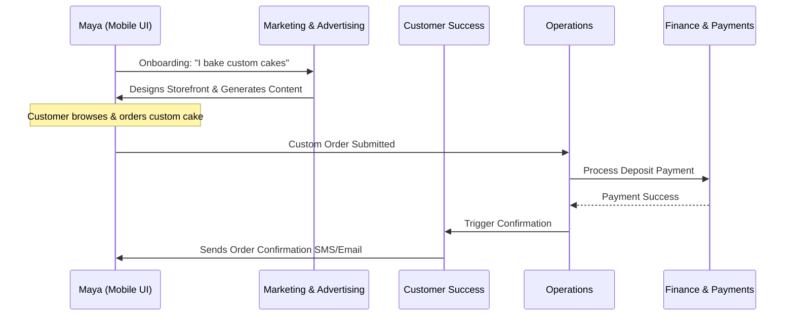
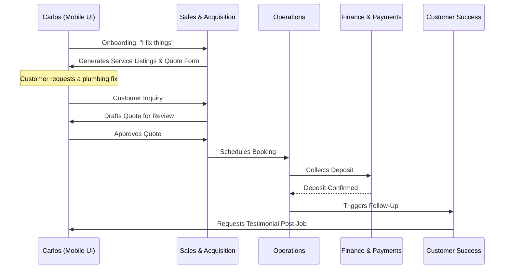
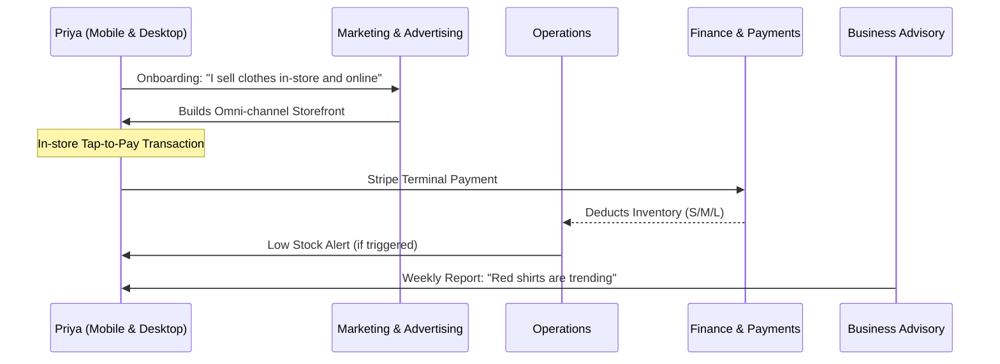
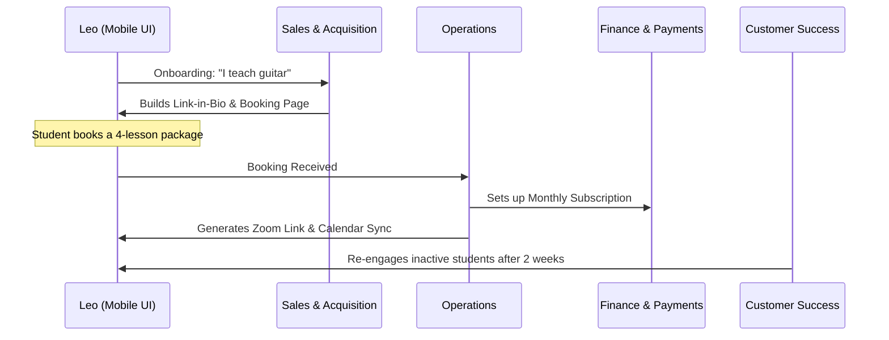
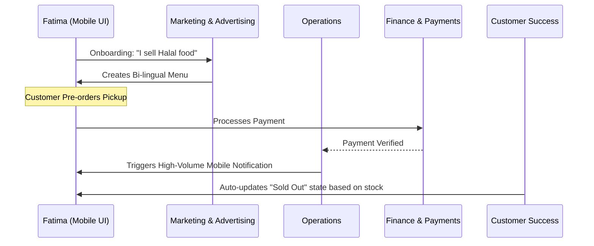

# [architecture] Business Journey Architecture

## Title
End-to-End Business Journey Architecture for OHC Personas

## Problem Statement
Small business owners—ranging from home bakers to freelance handymen—often lack the technical expertise to piece together fragmented solutions (e.g., website builder + booking calendar + CRM + AI chatbots) to run their operations. They need a simple, guided, and cohesive journey to start, operate, and grow their businesses without ever encountering complex configurations or code. The friction of setting up multi-tool workflows typically leads to abandonment. We need a unified Business Journey Architecture that works flawlessly across all key personas, particularly on a mobile 375px display, offloading all complexities to specialized AI Agent Departments.

## Research Report
Current market solutions (Shopify, Wix, Squarespace, GoDaddy) cater well to users who are somewhat tech-savvy or willing to invest 30-60 minutes in setup. However, they fall short for true non-technical users who require an instant, mobile-first experience.
- **Shopify:** Powerful but overwhelming; requires 30-60 minutes. Better suited for pure e-commerce.
- **Wix:** Highly customizable, but AI features (Wix AI) are often disjointed add-ons.
- **Squarespace:** Great for portfolios but requires a desktop for efficient initial setup.
- **GoDaddy:** Simple but lacks the depth needed for specialized businesses like service bookings or food cart pre-orders.

**OHC Differentiation:**
OHC's advantage is its invisible AI infrastructure that handles complexity from Day 1. By treating the AI as "departments," the business owner experiences a seamless journey.

## Design Doc

### Architecture Diagrams (Mermaid.js)

#### 1. Maya (The Home Baker) Journey

#### 2. Carlos (The Freelance Handyman) Journey

#### 3. Priya (The Boutique Owner) Journey

#### 4. Leo (The Music Tutor) Journey

#### 5. Fatima (The Food Cart Operator) Journey

### UI Wireframes & Screen Flow (375px First)
1. **Onboarding (The 10-Minute Launch):**
   - **Screen 1:** "What do you do?" (Input: Text or Voice).
   - **Screen 2:** "What's the business name?"
   - **Screen 3:** "Connecting your AI Departments..." (Loading animation with Glassmorphism).
   - **Screen 4:** "Your business is live! Here is your link."

2. **Dashboard (The Daily Hub):**
   - **Top Card:** "Today's Action Items" (e.g., "1 New Quote to Approve", "2 Custom Cake Deposits Paid").
   - **Middle Grid:** Quick Actions (Add Product, Scan QR, New Post).
   - **Bottom List:** AI Department Updates (e.g., Business Advisory: "Yesterday was your busiest day!").

3. **Mobile UX Flow:**
   - **Navigation:** Bottom app bar with Home, Inbox (Customer Success), Orders (Operations), Settings.
   - **Forms:** Native keyboard inputs. Large touch targets (44x44px minimum).
   - **Visuals:** Outfit font for headings, Inter for body. Dark/light mode support with blur backdrops.

### AI Agent Integration Points
- **Onboarding:** "Marketing & Advertising" uses initial inputs to generate branding and structure.
- **Inbox:** "Customer Success" reads incoming DMs and drafts replies for 1-tap approval.
- **Reporting:** "Business Advisory" aggregates weekly data and pushes a natural language notification every Monday morning.

### Key Design Decisions
- **Mobile-First Everything:** Since Carlos and Fatima only use phones, all management interfaces (including adding inventory or approving quotes) must be flawless on a 375px screen.
- **1-Tap Approvals:** High-risk actions (sending quotes, drafting emails) require human oversight but minimal effort.
- **Unified Department Orchestration:** Using the KAIROS Orchestrator to route events (e.g., Order -> Payment -> Customer Success follow-up) ensures a cohesive experience rather than disjointed notifications.

## Implementation Prompt
**Task for Implementer:**
Implement the end-to-end Onboarding and Activation flow for the OHC mobile client.
- **User-Facing Outcome:** A non-technical user can input their business idea in a simple text field, and within 3 screens, reach a fully populated dashboard with their personalized storefront link ready to share.
- **CUJ:** User opens app -> Enters business description -> System orchestrates "Marketing & Advertising" AI to generate a business profile -> User lands on Dashboard seeing their first AI Advisory message.
- **Acceptance Criteria:**
  - Must display perfectly on a 375px width screen without horizontal scrolling.
  - Touch targets must be at least 44x44px.
  - The flow must communicate with the KAIROS Orchestrator to instantiate the business tenant.
  - Must include E2E Playwright tests verifying the UI journey from initial launch to the populated dashboard.

## Priority
P0

## Estimated Scope
Large

