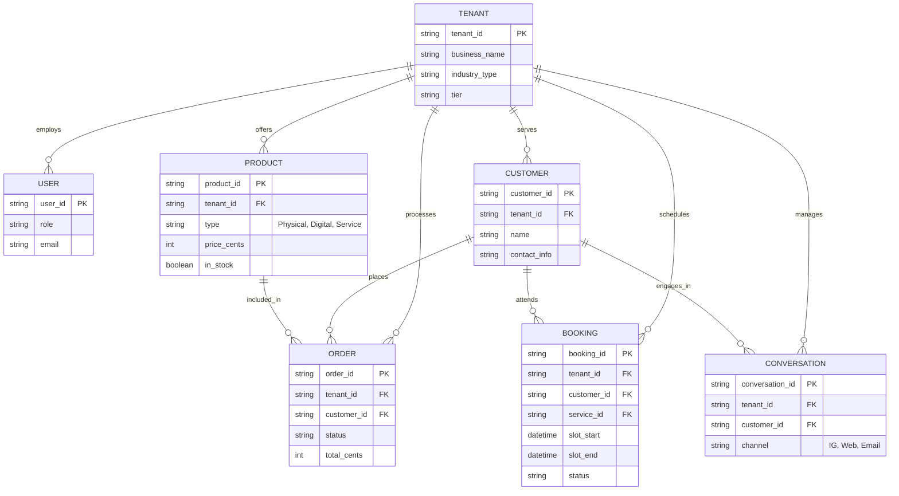

# [architecture] Data Model Architecture for OHC

## Title
Unified Multi-Tenant Data Model Architecture for Small Business Operations

## Problem Statement
Small business owners—whether they're baking custom cakes or running a mobile handyman service—currently face fragmented data. Customer interactions happen on Instagram, orders are tracked in a notebook or basic spreadsheet, payments run through an isolated terminal, and marketing goes out from yet another separate app. As a non-technical owner, trying to stitch these together is confusing and exhausting. If an AI agent drafts an email, it needs to instantly know the customer's purchase history, their upcoming appointments, and their recent support queries without the owner manually connecting dots. The lack of a robust, unified data model creates friction and makes the AI seem out of touch with the reality of the business.

## Research Report
Current SMB platforms struggle with cross-domain data integration:
- **Shopify**: Exceptional at product and order data, but service bookings or deep customer support context usually require third-party apps, making data fragmented. A chatbot app does not inherently know about a separate booking app.
- **Wix & Squarespace**: Provide basic booking and e-commerce, but their underlying architectures are page-centric rather than entity-centric. Customizing relationships (e.g., a customer who both buys merchandise and books services) is clunky.
- **GoDaddy**: Fast setup, but limited data relationships. It lacks a cohesive "brain" connecting interactions across a business’s lifecycle.

**Key Findings:**
1. **Holistic View**: To make "AI agents do the work invisibly," agents need a 360-degree view of an entity. A `Customer` must be inextricably linked to their `Orders`, `Bookings`, `Conversations` (Inbox), and `Reviews`.
2. **Multi-Tenancy is Non-Negotiable**: Data leaks between businesses would destroy trust. OHC must enforce strict tenant boundaries so Maya the Baker’s data is never visible to Carlos the Handyman.
3. **Versatility**: The core schema must be flexible enough to handle a `Physical Product` (inventory, shipping) just as elegantly as a `Service Booking` (calendar, duration).

## Design Doc

### Key Invariants
- **Strict Multi-Tenancy**: Every entity must belong to a specific `tenant_id` (the business organization). Row-Level Security (RLS) in PostgreSQL will ensure that a business owner can only ever see their own tenant's data.
- **Agent Visibility**: AI Agents operate contextually. When queried, an agent accesses data bound exclusively to the tenant it serves.
- **Immutability of Financials**: Orders, Payments, and Invoices cannot be physically deleted; they must support state transitions (e.g., Refunded, Cancelled).

### Architecture Diagram (Entity-Relationship)

### Key Access Patterns
- **AI Agent Querying Customer History**: When drafting an Instagram DM reply, the Customer Success Agent retrieves the `CUSTOMER` record via contact info, then fetches associated `ORDER`, `BOOKING`, and past `CONVERSATION` records using the `customer_id` and `tenant_id`.
- **Mobile App Fetching Orders**: The mobile app (e.g., used by Fatima at her food cart) authenticates and queries `ORDER` records filtered by `tenant_id` and `status="Pending"`, sorted by timestamp to see what to prepare next.

### UI Wireframes / Screen Flow Description (375px first)
1. **Dashboard Home**: A unified feed showing recent Orders, new Bookings, and unread Conversations.
2. **Customer Detail View**: Tapping a customer reveals their holistic profile—a timeline of their purchases, past appointments, and chat history—giving the business owner immediate context.
3. **Data Management**: Simple lists for Products/Services where adding a new item dynamically asks for shipping info (if physical) or duration/calendar sync (if service).

### Mobile UX Flow
- The owner opens the app.
- They tap "Customers" in the bottom navigation.
- They search for "Jane".
- They see Jane's profile: "Bought 2 cakes, Booked 1 consultation, Sent 1 IG message yesterday."
- AI suggestion at the top: "Jane hasn't ordered in 6 months. Tap to generate a re-engagement offer."

### AI Agent Integration Points
- **The Ambassador (Customer Success)** reads the unified `CUSTOMER` timeline to personalize responses.
- **The Manager (Operations)** updates `ORDER` and `BOOKING` statuses and triggers fulfillment workflows.
- **The Advisor (Business Advisory)** analyzes aggregate `ORDER` and `PRODUCT` data to generate the weekly health report.

### Key Design Decisions and Why
- **Unified `CUSTOMER` Record**: Instead of keeping store customers and booking clients separate, a single entity allows for cross-selling and unified communication.
- **Single `PRODUCT` Table with Types**: Differentiating physical goods, digital downloads, and bookable services via a `type` field simplifies the schema and allows a unified storefront catalog.

### Migration Strategy
1. Introduce the new unified schema iteratively alongside the existing structures.
2. Use background worker jobs to migrate data tenant-by-tenant (e.g., transforming legacy isolated store orders and standalone calendar bookings into the unified `ORDER` and `BOOKING` tables linked to the central `CUSTOMER`).
3. Dual-write during the transition phase.
4. Once verified, deprecate the old unlinked tables.

## Implementation Prompt
**To the Implementer:**
Design and implement the core multi-tenant data layer for the OHC platform. Ensure that physical products, services, bookings, and customer communications all tie back to a single, unified customer profile per business (tenant). Ensure that Row-Level Security (RLS) is strictly enforced so that a user logged into a specific tenant can only access that tenant's records. You should enable an AI agent to fetch a 360-degree view of a customer in a single query. The user-facing outcome is that Maya the Baker can tap a customer's name and instantly see their cake orders, deposit payments, and Instagram messages all in one place, while the AI uses this same view to draft accurate replies. Implement the API handlers, database queries, and repository layer to support these holistic access patterns. Validate your implementation with end-to-end tests starting from a UI login.

## Priority
P0

## Estimated Scope
Large