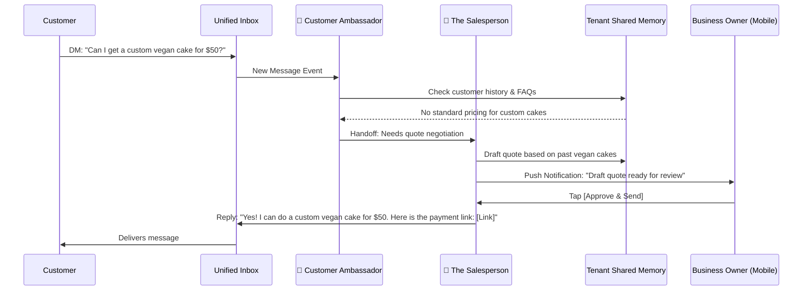

# [architecture] AI Agent Department Architecture

## Title
AI Agent Department Architecture: Invisible Coordination of Autonomous SMB Operations

## Problem Statement
Small business owners (like Maya the baker or Fatima the food cart operator) spend 40-60% of their time on administrative tasks: answering repetitive DM inquiries ("do you have vegan options?"), tracking inventory, sending payment reminders, and formatting social media posts. They do not have the time, technical skills, or budget to configure complex Zapier-style automations, set up separate CRM/ERP software, or write prompt templates. They need these operations handled automatically and invisibly in the background, matching how a real-world business operates with specialized human roles, requiring zero manual configuration and manageable from a mobile phone under 30 seconds.

## Research Report
**Market & Competitive Context:**
- **Shopify Flow / Wix Automations:** Require technical thinking (trigger-condition-action logic). Overwhelming for non-technical users. High abandonment rate during setup.
- **GoDaddy / Squarespace:** Basic auto-responders, but lack deep context. Cannot negotiate quotes or proactively draft marketing content based on slow-moving inventory.
- **Current SMB Reality:** Users cobble together WhatsApp, Instagram DMs, a notebook, and a basic website. Context is fragmented.
- **Pain Points Identified:**
  - "I forget to follow up with leads who asked for custom cake quotes." (Maya)
  - "I don't know what to post on Instagram today." (Priya)
  - "I am too busy cooking to text people when their food is ready." (Fatima)

**Opportunity:**
Abstract complex AI agents into "Departments" that mirror real business functions. Instead of configuring an "LLM workflow", the user simply "hires" the Marketing Promoter or the Customer Ambassador with one tap.

## Design Doc

### Architectural Vision
The OHC AI Agent Departments operate as a unified, invisible swarm. Each tenant (business) has an instance of these departments. They run autonomously, communicating via a centralized memory layer and event bus, but present a simple, unified feed of "Actions Taken" and "Drafts for Review" to the business owner.

### Core Departments
1. **The Manager (Operations):** Watches order flows, adjusts inventory, triggers fulfillment workflows.
2. **The Promoter (Marketing):** Analyzes sales trends and inventory (e.g., "We have 10 extra vegan cakes") and drafts social media posts or email campaigns.
3. **The Salesperson (Acquisition):** Responds to complex DMs, negotiates quotes for custom orders, and tracks lead follow-ups.
4. **The Ambassador (Customer Success):** Answers FAQ DMs, sends order status updates, requests reviews post-purchase.
5. **The Accountant (Finance):** Reconciles payments, flags unpaid invoices, generates weekly revenue summaries.
6. **The Protector (Legal/Compliance):** Ensures tax settings are applied, generates GDPR compliant banners based on location, drafts liability waivers for services.
7. **The Advisor (Strategy):** Reviews weekly performance and surfaces 1-2 plain-language recommendations ("Demand for Tuesday tutoring is high, consider raising prices by 10%").

### Mobile UX & Interaction Flow (375px First)
**The "Grandmother Test" Compliance:**
- **Zero Configuration:** No prompt writing. Departments are toggled ON or OFF.
- **Approval Flow (Tinder-style):** The main interface for AI is a morning "Briefing" feed.
  - *Card 1:* "The Promoter drafted an Instagram post about your new Summer Dresses. [Approve & Post] [Edit] [Discard]"
  - *Card 2:* "The Ambassador answered 4 questions about business hours while you slept."
- **Visuals:** Uses Glassmorphism (`backdrop-filter: blur(20px) saturate(200%)`), Outfit font for headers, Inter for body text. Minimum 44x44px touch targets for all action buttons.

### Architecture Diagrams (Mermaid.js)

#### 1. Unified Department Event Flow


#### 2. Cross-Department Coordination (The Invisible Swarm)
```mermaid
graph TD
    classDef department fill:#f9f9f9,stroke:#333,stroke-width:2px,rx:10px,ry:10px;
    classDef memory fill:#e1f5fe,stroke:#0288d1,stroke-width:2px,rx:10px,ry:10px;
    classDef external fill:#f3e5f5,stroke:#8e24aa,stroke-width:2px,rx:10px,ry:10px;

    E1((New Order Event)) --> Manager[The Manager: Operations]
    Manager -->|Updates Inventory| M[(Tenant Shared Memory)]
    M -->|Triggers| Promoter[The Promoter: Marketing]
    Promoter -->|Drafts Post: Low Stock Alert| OwnerView

    Manager -->|Triggers| Ambassador[The Ambassador: Support]
    Ambassador -->|Sends 'Preparing Order' SMS| Cust[Customer Phone]

    E2((Weekly Trigger)) --> Accountant[The Accountant: Finance]
    Accountant -->|Saves Report| M
    M -->|Reads Data| Advisor[The Advisor: Strategy]
    Advisor -->|Drafts Insight: "Raise Prices"| OwnerView[Owner Morning Briefing Feed]

    class Manager,Promoter,Ambassador,Accountant,Advisor department;
    class M memory;
    class E1,E2,Cust external;
```

#### 3. Execution Modes & Throttling
- **Auto-Execute:** Trusted actions (e.g., answering "what are your hours?").
- **Draft-for-Review:** High-stakes actions (quotes, public posts, refunds).
- **Throttling/Limits:** Tied to SaaS tiers. The system tracks "AI Actions" consumed per month.
  - *Free Tier:* Reaches 100 actions -> Graceful degradation to manual routing with a friendly prompt: "Your AI assistants have been working hard! Upgrade to Starter to keep them running automatically."

## Implementation Prompt
**To the Implementer:**
Implement the underlying event coordination and memory retrieval systems for the AI Departments. You must establish the shared memory context that all agents can read/write to, and the unified event bus that triggers them.
1. Create the architecture that allows a "Manager" agent and a "Promoter" agent to subscribe to the same business events (e.g., Inventory Change).
2. Implement the "Morning Briefing" unified feed where pending agent actions are surfaced to the business owner for 1-tap approval.
3. Ensure the mobile UX strictly follows OHC design standards: Glassmorphism, Outfit/Inter typography, and 44x44px minimum touch targets.
4. Integrate SaaS tier limits gracefully (soft limits with friendly upgrade prompts, not hard crashes).
5. Add comprehensive E2E tests validating that an event correctly triggers the appropriate agent department and surfaces in the owner's feed.
*Note: Do not define specific SQL schemas, LLM provider choices, or API route structures. Focus on building the robust, multi-tenant coordination layer that delivers the described user experience.*

## Priority
**P0** (Critical path for core OHC platform value proposition)

## Estimated Scope
**Large**
