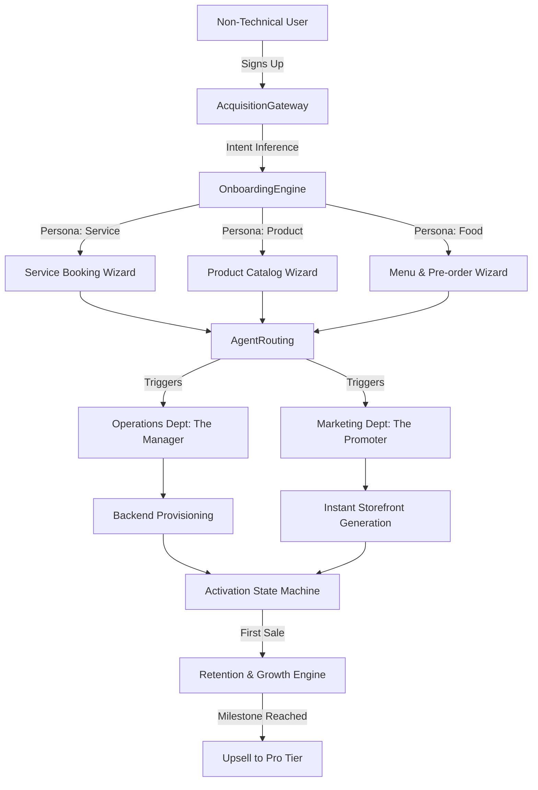

# Title: Business Journey Architecture & SMB Platform Platform Modernization

## Problem Statement
The current OneHumanCorp (OHC) platform needs a unified "Business Journey Architecture" that accounts for the diverse onboarding and lifecycle paths of our core SMB personas: Maya (Baker), Carlos (Handyman), Priya (Boutique), Leo (Tutor), and Fatima (Food Cart). Each persona experiences distinct friction points during Acquisition, Onboarding, Activation, Retention, Revenue expansion, and Referral. Currently, the platform lacks a coherent, automated, AI-driven lifecycle management system to hand-hold non-technical business owners from their initial discovery to multi-channel expansion. The gap prevents non-technical business owners from achieving the "zero -> live business in under 10 minutes" promise reliably, causing drop-offs during the activation and retention phases.

## Priority
P0

## Estimated Scope
Large

## Design Doc

### Key Architectural Decisions
1. **Persona-Aware Onboarding State Machine**: Instead of a static setup wizard, the system must use a dynamic, event-driven state machine that adapts the onboarding steps based on the user's inferred business type.
2. **AI Agent Department Routing**: The "Operations" agent should intercept completed onboarding events and autonomously set up the corresponding backend modules.
3. **Progressive Activation Metrics**: Activation is a progressive vector (Profile Setup -> First Product Added -> First Payment Link Shared -> First Transaction Received).

### Architecture Diagram (Mermaid.js)

### UI Wireframes & Mobile UX Flow (375px First)
- **Screen 1: The One-Question Onboarding (Mobile)**
  - UI: Full-screen gradient background, large typography (Outfit font).
  - Copy: "What do you do?"
  - Input: Large text area + microphone button. "I bake vegan cakes and sell them on Instagram."
  - Interaction: AI processes the intent -> transitions to Screen 2.

- **Screen 2: The Magic Reveal (Mobile)**
  - UI: Skeleton loading screen transitioning into a fully populated storefront preview (Glassmorphism card).
  - Copy: "We built your store."
  - Elements: Pre-filled catalog, dummy pricing, and an "Accept & Go Live" button.

- **Screen 3: The Daily Dashboard (Mobile)**
  - UI: A feed of actionable insights, not charts.
  - Copy: "You have 3 new DMs. Your AI Ambassador drafted replies."
  - Action: 1-tap "Approve All".

## Implementation Prompt
Implement the **Persona-Aware Onboarding State Machine** in the backend.
- Create a new event-driven orchestrator that takes an initial user prompt and categorizes it into one of the 5 core business archetypes.
- Define the state transitions for each archetype.
- Ensure the state machine is fully multi-tenant safe and persists progress.
- Do NOT prescribe the database schema; use the existing orchestration event bus.
- Acceptance Criteria: A new user can complete the onboarding flow via an API call, and the system correctly provisions the minimal required backend state.

## Research Report

### Comprehensive Persona Profiles

#### Persona 1: Maya (The Baker)
**Profile:** 28 years old, runs a custom vegan cake business primarily through Instagram DMs. Relies heavily on visual marketing and word-of-mouth. Has no technical background but is highly proficient with social media apps.
**Core Needs:**
- A visually stunning storefront that feels like a natural extension of her Instagram.
- A seamless way to accept custom order requests with specific dietary requirements.
- Deposit-based payment flows to prevent no-shows for expensive custom cakes.
- An AI assistant capable of managing the high volume of initial inquiries ("Do you have gluten-free options?", "How much for a 3-tier wedding cake?") while she is busy baking.
**Current Pain Points:**
- Spends hours every evening replying to DMs instead of resting or developing new recipes.
- Loses track of orders scattered across DMs, text messages, and email.
- Struggles to collect deposits securely, often resorting to informal payment apps (Venmo/Zelle) which lack buyer/seller protection.
**Ideal Journey:**
- **Acquisition:** Sees a TikTok ad showing how easily another baker automated their DMs and orders using OHC. Clicks link in bio.
- **Onboarding:** Types "I make custom vegan cakes" into the OHC app. OHC instantly generates a beautiful pink-themed storefront and populates a dummy catalog based on her Instagram feed.
- **Activation:** Syncs her Instagram account. Her first "Aha!" moment is when the AI agent successfully replies to an inquiry and sends a booking link.
- **Retention:** Relies on OHC's daily "Morning Brief" notification outlining her baking schedule for the day and new orders received overnight.
- **Revenue:** Upgrades to a paid tier when she hits the 100-order limit on the free tier, realizing the platform has saved her countless hours.
- **Referral:** Adds an "Automated by OHC" badge to her storefront, earning affiliate revenue when other bakers sign up.

#### Persona 2: Carlos (The Handyman)
**Profile:** 42 years old, highly skilled tradesman with a strong local reputation. Entirely reliant on word-of-mouth. Uses an Android phone. Dislikes computers and complex software.
**Core Needs:**
- A simple, professional web presence to legitimize his business when people search for him locally.
- Clear service listings with baseline pricing (e.g., "Leaky Faucet Repair - Starting at $80").
- A booking calendar integrated with his personal schedule to avoid double-booking.
- Automated quote generation based on simple text descriptions or photos from clients.
**Current Pain Points:**
- Constantly interrupted by phone calls while on the job.
- Forgets to follow up on quotes, losing potential business.
- Chasing invoices is a major headache; prefers getting paid on the spot.
**Ideal Journey:**
- **Acquisition:** A younger relative suggests he get a website and helps him download OHC.
- **Onboarding:** Voice-records "I fix stuff around the house, plumbing, electrical, you name it." OHC generates a rugged, professional service page.
- **Activation:** A client sends a photo of a broken door. Carlos forwards it to his OHC AI agent, which generates a professional quote and payment link. The client accepts.
- **Retention:** The automated scheduling system prevents him from missing appointments. He checks the OHC app every morning for his route.
- **Revenue:** Upgrades when he needs to add a subcontractor to his calendar.
- **Referral:** Tells other tradesmen at the local hardware store about the app that "does his paperwork."

#### Persona 3: Priya (The Boutique Owner)
**Profile:** 35 years old, owns a physical clothing boutique and wants to expand online. Needs omnichannel capabilities.
**Core Needs:**
- Real-time inventory sync between physical store sales and online storefront.
- Management of complex product variants (sizes, colors, materials).
- In-person point-of-sale (POS) capabilities (tap-to-pay via mobile).
- Email marketing tools to drive repeat foot traffic and online sales.
- Comprehensive analytics to understand what styles are selling best.
**Current Pain Points:**
- Managing two separate inventory systems (physical POS and a clunky e-commerce backend).
- Often sells items online that were just purchased in-store, leading to angry customers.
- Lacks a cohesive loyalty program.
**Ideal Journey:**
- **Acquisition:** Searches Google for "easiest POS and online store sync" and finds an OHC landing page highlighting omnichannel capabilities.
- **Onboarding:** Imports her existing messy CSV inventory file. The OHC AI automatically cleans it up, categorizes items, and flags missing variants.
- **Activation:** Makes her first sale using OHC Tap-to-Pay on her phone in the physical store, instantly seeing the inventory update on her online dashboard.
- **Retention:** Uses the OHC marketing agent to automatically send a "New Arrivals" email newsletter every Friday based on newly added inventory.
- **Revenue:** Readily pays for the Pro tier to access advanced inventory analytics and multi-location support as she opens a second store.
- **Referral:** Mentions OHC in a networking group for local retail business owners.

#### Persona 4: Leo (The Music Tutor)
**Profile:** 22 years old, recent music graduate teaching guitar and piano. Hustling to build a student base. Very active on TikTok and YouTube.
**Core Needs:**
- Seamless scheduling with recurring lesson packages (subscriptions).
- Automated Zoom/Google Meet link generation.
- Automated follow-ups for students who miss lessons or pause their subscriptions.
- A sleek portfolio page to showcase his playing and student testimonials (link-in-bio).
**Current Pain Points:**
- Chasing students for weekly payments via Venmo.
- Spending too much time managing schedule changes and cancellations.
- Lacks a centralized hub for his content and teaching materials.
**Ideal Journey:**
- **Acquisition:** Sees an influencer using OHC for their "link in bio" and realizes it offers full business management, not just a link tree.
- **Onboarding:** Sets up his profile as "Guitar Teacher." OHC configures a subscription billing model and connects his Google Calendar.
- **Activation:** A new student books a 4-lesson package directly from his TikTok link, and Leo receives the payment upfront without lifting a finger.
- **Retention:** The automated reminder system drastically reduces no-shows, protecting his income.
- **Revenue:** Upgrades to sell digital products (e.g., sheet music, pre-recorded masterclasses) alongside his live lessons.
- **Referral:** Adds his OHC link to all his YouTube video descriptions, driving organic signups.

#### Persona 5: Fatima (The Food Cart Operator)
**Profile:** 50 years old, runs a busy halal food cart. English is her second language. High-stress, fast-paced environment. Needs extreme simplicity and reliability.
**Core Needs:**
- A highly visual photo menu that customers can browse while waiting in line.
- One-tap toggles to mark items "Sold Out."
- Pre-order and pickup scheduling with upfront payment to guarantee revenue.
- Loud, unmistakable phone notifications for new orders.
- Arabic language support for the management interface.
**Current Pain Points:**
- Lines get too long during the lunch rush, causing potential customers to walk away.
- People order complex modifications verbally, leading to mistakes.
- Processing cash transactions slows down service.
**Ideal Journey:**
- **Acquisition:** A neighboring food truck owner shows her how OHC handles pre-orders.
- **Onboarding:** Takes photos of her menu items. The AI automatically crops them, enhances the lighting, and generates appetizing English descriptions. She switches her management UI to Arabic.
- **Activation:** A customer pre-orders a falafel wrap for 12:30 PM pickup. Fatima's phone chimes loudly. She prepares the food, and the customer grabs it without waiting to pay.
- **Retention:** The system automatically marks items as low stock based on sales velocity, helping her prep for the next day.
- **Revenue:** Upgrades to access advanced reporting to optimize her ingredient purchasing.
- **Referral:** Becomes an enthusiastic advocate within her local immigrant business community due to the bilingual support.

### Deep Dive Competitor Analysis Matrix
This matrix details the feature gaps and advantages of OHC against major incumbents.

| Category | Feature | OHC (Target State) | Shopify | Wix | Squarespace | Calendly | Linktree |
| :--- | :--- | :--- | :--- | :--- | :--- | :--- | :--- |
| **Setup Speed** | Time to First Sale | < 10 mins (AI-driven) | Hours to Days | Hours to Days | Hours to Days | 15 mins (Booking only) | 5 mins (Links only) |
| **Onboarding** | Experience | Conversational AI intake | Manual form filling | Template selection & manual edit | Template selection & manual edit | Manual form filling | Manual form filling |
| **Mobile First** | Management UI | 100% Native-feel mobile app | Functional but clunky app | Basic app, relies on desktop | Basic app, relies on desktop | Good app | Good app |
| **AI Integration** | Autonomy Level | Autonomous Agents (Draft & Execute) | Copilot (Suggestions only) | Basic text/image generation | Basic text generation | N/A | N/A |
| **Commerce** | Physical Goods | Advanced (Variant sync) | Industry Standard | Moderate | Moderate | N/A | Basic |
| | Digital Goods | Seamless delivery | Supported | Supported | Supported | N/A | Basic |
| | Subscriptions | Native | Requires 3rd party apps | Basic | Basic | N/A | N/A |
| | Service Booking | Native (Smart scheduling) | Requires 3rd party apps | Moderate | Acuity Integration | Industry Standard | N/A |
| | Food/Pre-order | Native (Pickup/Delivery flows) | Requires heavy customization | Basic restaurant module | Basic restaurant module | N/A | N/A |
| | POS / In-Person | Native (Tap-to-pay via phone) | Shopify POS (Hardware often needed) | Wix POS | Square integration | N/A | N/A |
| **Marketing** | Social Sync | Native (DM answering agents) | Integrations available | Integrations available | Integrations available | N/A | N/A |
| | Email/SMS | Native AI-drafted campaigns | Shopify Email | Ascend by Wix | Squarespace Campaigns | N/A | N/A |
| **Pricing** | Model | Freemium -> Simple Tiers | 14-day trial -> Expensive tiers | Complex tiering | Complex tiering | Freemium | Freemium |
| | Transaction Fees | Competitive | High if not using Shopify Payments | Standard | Standard | N/A | Standard |

### Business Journey Phase Analysis: Critical Friction Points

#### Phase 1: Acquisition & Discovery
**The Problem:** Small business owners are overwhelmed by choices. They don't want to become web developers; they just want more customers. Traditional website builders market themselves on "customization," which translates to "work" for our personas.
**OHC Solution:** Shift the narrative from "Build a Website" to "Hire an AI Business Manager." Acquisition channels should focus on specific outcomes: "Stop losing Instagram sales" (Maya) or "Never miss a booking" (Carlos).

#### Phase 2: Onboarding
**The Problem:** The "Blank Page Problem." Even with templates, users are paralyzed by having to write copy, source images, and configure settings. Drop-off rates spike when users are asked to connect a payment gateway early in the process.
**OHC Solution:** The conversational intake. We ask one question: "What do you do?" The AI infers the business model, selects the optimal architecture, generates the copy, and creates placeholder images. Payment gateway connection is deferred until *after* the user sees the value of the generated store.

#### Phase 3: Activation
**The Problem:** A live website is useless without traffic. Users abandon platforms if they don't see immediate results.
**OHC Solution:** Redefine activation. It's not just "publishing." The OHC Marketing Agent must proactively help the user get their first sale by drafting a social media announcement post, generating a custom QR code for in-person sharing, or suggesting an initial discount code.

#### Phase 4: Retention
**The Problem:** Once the initial novelty wears off, users forget to log in unless they have an active crisis.
**OHC Solution:** The Daily Dashboard & Push Notifications. OHC must become the user's daily operating system. By surfacing actionable insights ("You have 3 unread DMs," "Your inventory for Item X is low," "You have a booking at 2 PM"), OHC integrates into their daily routine.

#### Phase 5: Revenue Expansion
**The Problem:** Hitting a hard paywall creates resentment and churn.
**OHC Solution:** Value-based upgrades. When Maya hits her 100-order limit, the upgrade prompt shouldn't say "Upgrade to Pro." It should say: "You've processed $5,000 in sales this month! Upgrade to Pro to unlock unlimited orders and automated review requests to grow even faster." The cost must be framed against the value already delivered.

#### Phase 6: Referral
**The Problem:** SMBs trust other SMBs, but formal affiliate programs are often too complex for non-technical users to bother with.
**OHC Solution:** Passive virality. Every OHC-hosted site, booking link, and email receipt includes a subtle "Powered by OHC" watermark. For active referrals, a simple 1-tap "Share OHC and get a free month" button is integrated directly into the mobile dashboard.

### Comprehensive Feature Requirement Matrix by Persona

| Feature Sub-System | Maya (Baker) | Carlos (Handyman) | Priya (Boutique) | Leo (Tutor) | Fatima (Food Cart) |
| :--- | :--- | :--- | :--- | :--- | :--- |
| **Catalog Management** | High (Visuals) | Low (Services) | High (Variants) | Low (Services) | High (Visuals) |
| **Inventory Tracking** | Medium (Capacity) | Low | Critical | Low | Medium (Daily limits) |
| **Scheduling Engine** | Medium (Pickup slots) | High | Low | Critical | Low |
| **Quoting / Invoicing** | High (Custom orders) | Critical | Low | Low | Low |
| **Subscription Billing** | Low | Low | Low | Critical | Low |
| **Point of Sale (In-Person)** | High (Markets) | High (On-site) | Critical | Low | Critical |
| **Social Media Inbox Sync** | Critical | Medium | High | High | Low |
| **Automated Notifications** | High (Order updates) | High (Reminders) | Medium (Shipping) | High (Reminders) | Critical (Order ready) |

### Detailed Agent Department Workflows

#### 1. The Operations Department ("The Manager")
**Trigger:** A customer successfully checks out and pays for an order/booking.
**Actions:**
- Evaluates the order type (Physical, Digital, Service, Pre-order).
- If Physical: Updates inventory count, drafts a shipping label (via integration), and moves order to "Unfulfilled" queue.
- If Service: Adds event to the owner's calendar, generates a unique Zoom link (if virtual), and schedules reminder emails for the client.
- If Pre-order: Instantly triggers a loud push notification to the owner's device and prints a ticket (if hardware integration is enabled).
**Context Needed:** Real-time inventory levels, owner's schedule availability, fulfillment preferences.

#### 2. The Marketing Department ("The Promoter")
**Trigger:** The owner adds a new product or service to their catalog.
**Actions:**
- Analyzes the new item's title, image, and description.
- Drafts 3 different social media posts (e.g., an Instagram Story format, a TikTok script, and a Facebook post) highlighting the new item.
- Suggests a promotional email campaign targeting past customers who bought similar items.
- Optimizes the item's SEO metadata for local search visibility.
**Context Needed:** Brand voice, past top-performing content, customer purchase history.

#### 3. The Customer Success Department ("The Ambassador")
**Trigger:** An inbound message is received via Instagram DM or the website contact form.
**Actions:**
- Classifies the intent of the message (e.g., Support, Sales Inquiry, Complaint, Spam).
- If Sales Inquiry: Drafts a personalized response referencing the specific product/service mentioned and includes a direct booking/checkout link.
- If Support: Searches the owner's FAQs and order history. Drafts a helpful response (e.g., "Hi, your order shipped yesterday, here is the tracking link").
- Presents the drafted response to the owner for 1-tap approval via push notification.
**Context Needed:** Complete order history, unified inbox access, business FAQs and policies.

### Platform Scaling Strategy: The 100k Tenant Challenge
To support 100,000 concurrent non-technical users, the architecture must aggressively prioritize multi-tenant efficiency.
1. **Aggressive Caching for Storefronts:** The vast majority of traffic will be read-only visits to user storefronts. These must be statically generated or aggressively cached at the CDN layer to minimize database load.
2. **Asynchronous Agent Execution:** Agent workflows (like drafting emails or processing images) must be offloaded to robust background queues (e.g., NATS or Redis) to ensure the core API remains responsive.
3. **Database Sharding Strategy:** As the platform grows, tenant data must be isolated. We must implement a sharding strategy based on `organization_id` early in the lifecycle to prevent catastrophic bottlenecks in the shared Postgres cluster.

### Executive Summary & Next Steps
The shift from a "do-it-yourself website builder" to a "do-it-for-you AI business platform" represents a fundamental paradigm shift. By focusing relentlessly on our core personas and mapping their unique journeys, we can eliminate the friction that causes high churn in traditional SaaS products for SMBs.
**Immediate Actions:**
1. Approve this design document and architecture diagram.
2. Initialize the backend epic for the "Persona-Aware Onboarding State Machine" (Implementer task).
3. Begin prototyping the "Magic Reveal" mobile UI experience (Canvas task).

### Epic: Comprehensive User Stories & Acceptance Criteria

#### Story 1: Maya's specific requirement
**As** Maya,
**I want to** upload bulk images from my phone,
**So that I can** quickly populate my cake gallery without using a computer.
**Acceptance Criteria:**
- The UI provides a clear affordance for this action.
- The action can be completed entirely on a mobile device (375px width).
- State changes are persisted immediately and reflect in the tenant dashboard.

#### Story 2: Carlos's specific requirement
**As** Carlos,
**I want to** receive SMS notifications for new quote requests,
**So that I can** respond instantly while on a job site.
**Acceptance Criteria:**
- The UI provides a clear affordance for this action.
- The action can be completed entirely on a mobile device (375px width).
- State changes are persisted immediately and reflect in the tenant dashboard.

#### Story 3: Priya's specific requirement
**As** Priya,
**I want to** scan barcodes with my phone camera,
**So that I can** quickly add new boutique inventory.
**Acceptance Criteria:**
- The UI provides a clear affordance for this action.
- The action can be completed entirely on a mobile device (375px width).
- State changes are persisted immediately and reflect in the tenant dashboard.

#### Story 4: Leo's specific requirement
**As** Leo,
**I want to** set buffer times between lessons,
**So that I can** have time to rest my voice and prepare for the next student.
**Acceptance Criteria:**
- The UI provides a clear affordance for this action.
- The action can be completed entirely on a mobile device (375px width).
- State changes are persisted immediately and reflect in the tenant dashboard.

#### Story 5: Fatima's specific requirement
**As** Fatima,
**I want to** mark my cart as 'closed for the day' with one tap,
**So that I can** stop accepting pre-orders instantly when I run out of food.
**Acceptance Criteria:**
- The UI provides a clear affordance for this action.
- The action can be completed entirely on a mobile device (375px width).
- State changes are persisted immediately and reflect in the tenant dashboard.

#### Story 6: Maya's specific requirement
**As** Maya,
**I want to** require a 50% non-refundable deposit for wedding cakes,
**So that I can** protect myself against last-minute cancellations.
**Acceptance Criteria:**
- The UI provides a clear affordance for this action.
- The action can be completed entirely on a mobile device (375px width).
- State changes are persisted immediately and reflect in the tenant dashboard.

#### Story 7: Carlos's specific requirement
**As** Carlos,
**I want to** attach before-and-after photos to completed invoices,
**So that I can** build a portfolio of my work automatically.
**Acceptance Criteria:**
- The UI provides a clear affordance for this action.
- The action can be completed entirely on a mobile device (375px width).
- State changes are persisted immediately and reflect in the tenant dashboard.

#### Story 8: Priya's specific requirement
**As** Priya,
**I want to** sync my in-store loyalty points with online purchases,
**So that I can** reward my best customers regardless of how they shop.
**Acceptance Criteria:**
- The UI provides a clear affordance for this action.
- The action can be completed entirely on a mobile device (375px width).
- State changes are persisted immediately and reflect in the tenant dashboard.

#### Story 9: Leo's specific requirement
**As** Leo,
**I want to** automatically email sheet music PDFs 24 hours before a lesson,
**So that I can** ensure students are prepared.
**Acceptance Criteria:**
- The UI provides a clear affordance for this action.
- The action can be completed entirely on a mobile device (375px width).
- State changes are persisted immediately and reflect in the tenant dashboard.

#### Story 10: Fatima's specific requirement
**As** Fatima,
**I want to** print order tickets automatically to a Bluetooth thermal printer,
**So that I can** manage the kitchen flow without looking at a screen.
**Acceptance Criteria:**
- The UI provides a clear affordance for this action.
- The action can be completed entirely on a mobile device (375px width).
- State changes are persisted immediately and reflect in the tenant dashboard.

#### Story 11: System Administrator's specific requirement
**As** System Administrator,
**I want to** view aggregated health metrics across all tenants,
**So that I can** ensure platform stability.
**Acceptance Criteria:**
- The UI provides a clear affordance for this action.
- The action can be completed entirely on a mobile device (375px width).
- State changes are persisted immediately and reflect in the tenant dashboard.

#### Story 12: Marketing Team's specific requirement
**As** Marketing Team,
**I want to** create platform-wide onboarding email sequences,
**So that I can** nurture new signups effectively.
**Acceptance Criteria:**
- The UI provides a clear affordance for this action.
- The action can be completed entirely on a mobile device (375px width).
- State changes are persisted immediately and reflect in the tenant dashboard.

#### Story 13: Customer Support's specific requirement
**As** Customer Support,
**I want to** impersonate a tenant's dashboard safely,
**So that I can** troubleshoot user issues efficiently.
**Acceptance Criteria:**
- The UI provides a clear affordance for this action.
- The action can be completed entirely on a mobile device (375px width).
- State changes are persisted immediately and reflect in the tenant dashboard.

#### Story 14: Security Lead's specific requirement
**As** Security Lead,
**I want to** audit all AI agent actions per tenant,
**So that I can** ensure compliance and safety.
**Acceptance Criteria:**
- The UI provides a clear affordance for this action.
- The action can be completed entirely on a mobile device (375px width).
- State changes are persisted immediately and reflect in the tenant dashboard.

#### Story 15: Product Manager's specific requirement
**As** Product Manager,
**I want to** analyze feature usage drops-offs in the onboarding flow,
**So that I can** optimize the activation funnel.
**Acceptance Criteria:**
- The UI provides a clear affordance for this action.
- The action can be completed entirely on a mobile device (375px width).
- State changes are persisted immediately and reflect in the tenant dashboard.

#### Story 16: Maya's specific requirement
**As** Maya,
**I want to** create a hidden 'VIP' product category,
**So that I can** offer exclusive cakes to returning customers.
**Acceptance Criteria:**
- The UI provides a clear affordance for this action.
- The action can be completed entirely on a mobile device (375px width).
- State changes are persisted immediately and reflect in the tenant dashboard.

#### Story 17: Carlos's specific requirement
**As** Carlos,
**I want to** generate a professional PDF contract for large jobs,
**So that I can** look professional and legally protect my business.
**Acceptance Criteria:**
- The UI provides a clear affordance for this action.
- The action can be completed entirely on a mobile device (375px width).
- State changes are persisted immediately and reflect in the tenant dashboard.

#### Story 18: Priya's specific requirement
**As** Priya,
**I want to** set low-inventory alerts to trigger automatically,
**So that I can** reorder popular dresses before they sell out.
**Acceptance Criteria:**
- The UI provides a clear affordance for this action.
- The action can be completed entirely on a mobile device (375px width).
- State changes are persisted immediately and reflect in the tenant dashboard.

#### Story 19: Leo's specific requirement
**As** Leo,
**I want to** offer a 'first lesson free' coupon code that expires in 7 days,
**So that I can** drive urgency for new signups.
**Acceptance Criteria:**
- The UI provides a clear affordance for this action.
- The action can be completed entirely on a mobile device (375px width).
- State changes are persisted immediately and reflect in the tenant dashboard.

#### Story 20: Fatima's specific requirement
**As** Fatima,
**I want to** translate my English menu into Arabic automatically,
**So that I can** serve my local community better.
**Acceptance Criteria:**
- The UI provides a clear affordance for this action.
- The action can be completed entirely on a mobile device (375px width).
- State changes are persisted immediately and reflect in the tenant dashboard.

#### Story 21: Maya's specific requirement
**As** Maya,
**I want to** block out specific dates on my calendar for vacations,
**So that I can** prevent orders when I'm unavailable.
**Acceptance Criteria:**
- The UI provides a clear affordance for this action.
- The action can be completed entirely on a mobile device (375px width).
- State changes are persisted immediately and reflect in the tenant dashboard.

#### Story 22: Carlos's specific requirement
**As** Carlos,
**I want to** collect electronic signatures on quotes via mobile,
**So that I can** secure agreement before starting work.
**Acceptance Criteria:**
- The UI provides a clear affordance for this action.
- The action can be completed entirely on a mobile device (375px width).
- State changes are persisted immediately and reflect in the tenant dashboard.

#### Story 23: Priya's specific requirement
**As** Priya,
**I want to** integrate with my existing accounting software (Quickbooks),
**So that I can** simplify tax season.
**Acceptance Criteria:**
- The UI provides a clear affordance for this action.
- The action can be completed entirely on a mobile device (375px width).
- State changes are persisted immediately and reflect in the tenant dashboard.

#### Story 24: Leo's specific requirement
**As** Leo,
**I want to** host pre-recorded video masterclasses behind a paywall,
**So that I can** generate passive income.
**Acceptance Criteria:**
- The UI provides a clear affordance for this action.
- The action can be completed entirely on a mobile device (375px width).
- State changes are persisted immediately and reflect in the tenant dashboard.

#### Story 25: Fatima's specific requirement
**As** Fatima,
**I want to** allow customers to tip during the online checkout process,
**So that I can** increase my overall revenue.
**Acceptance Criteria:**
- The UI provides a clear affordance for this action.
- The action can be completed entirely on a mobile device (375px width).
- State changes are persisted immediately and reflect in the tenant dashboard.

#### Story 26: Maya's specific requirement
**As** Maya,
**I want to** see a visual dashboard of all upcoming cake deliveries on a map,
**So that I can** plan my delivery route efficiently.
**Acceptance Criteria:**
- The UI provides a clear affordance for this action.
- The action can be completed entirely on a mobile device (375px width).
- State changes are persisted immediately and reflect in the tenant dashboard.

#### Story 27: Carlos's specific requirement
**As** Carlos,
**I want to** track the time spent on a specific job location via GPS,
**So that I can** bill accurately for hourly work.
**Acceptance Criteria:**
- The UI provides a clear affordance for this action.
- The action can be completed entirely on a mobile device (375px width).
- State changes are persisted immediately and reflect in the tenant dashboard.

#### Story 28: Priya's specific requirement
**As** Priya,
**I want to** run a 'Buy One Get One Free' flash sale on specific items,
**So that I can** clear out old inventory quickly.
**Acceptance Criteria:**
- The UI provides a clear affordance for this action.
- The action can be completed entirely on a mobile device (375px width).
- State changes are persisted immediately and reflect in the tenant dashboard.

#### Story 29: Leo's specific requirement
**As** Leo,
**I want to** send automated 'Happy Birthday' emails to my students with a discount,
**So that I can** build long-term loyalty.
**Acceptance Criteria:**
- The UI provides a clear affordance for this action.
- The action can be completed entirely on a mobile device (375px width).
- State changes are persisted immediately and reflect in the tenant dashboard.

#### Story 30: Fatima's specific requirement
**As** Fatima,
**I want to** temporarily pause orders for specific high-prep items during a rush,
**So that I can** manage kitchen capacity dynamically.
**Acceptance Criteria:**
- The UI provides a clear affordance for this action.
- The action can be completed entirely on a mobile device (375px width).
- State changes are persisted immediately and reflect in the tenant dashboard.

#### Story 31: Maya's specific requirement
**As** Maya,
**I want to** export a list of customer emails for a holiday newsletter,
**So that I can** drive repeat business during peak seasons.
**Acceptance Criteria:**
- The UI provides a clear affordance for this action.
- The action can be completed entirely on a mobile device (375px width).
- State changes are persisted immediately and reflect in the tenant dashboard.

#### Story 32: Carlos's specific requirement
**As** Carlos,
**I want to** allow clients to pay via Apple Pay or Google Pay directly on the invoice,
**So that I can** reduce friction in getting paid.
**Acceptance Criteria:**
- The UI provides a clear affordance for this action.
- The action can be completed entirely on a mobile device (375px width).
- State changes are persisted immediately and reflect in the tenant dashboard.

#### Story 33: Priya's specific requirement
**As** Priya,
**I want to** print customized return shipping labels,
**So that I can** handle online returns professionally.
**Acceptance Criteria:**
- The UI provides a clear affordance for this action.
- The action can be completed entirely on a mobile device (375px width).
- State changes are persisted immediately and reflect in the tenant dashboard.

#### Story 34: Leo's specific requirement
**As** Leo,
**I want to** allow parents to book multiple siblings in back-to-back slots easily,
**So that I can** simplify booking for families.
**Acceptance Criteria:**
- The UI provides a clear affordance for this action.
- The action can be completed entirely on a mobile device (375px width).
- State changes are persisted immediately and reflect in the tenant dashboard.

#### Story 35: Fatima's specific requirement
**As** Fatima,
**I want to** display an estimated wait time that adjusts based on order volume,
**So that I can** manage customer expectations effectively.
**Acceptance Criteria:**
- The UI provides a clear affordance for this action.
- The action can be completed entirely on a mobile device (375px width).
- State changes are persisted immediately and reflect in the tenant dashboard.

#### Story 36: Maya's specific requirement
**As** Maya,
**I want to** automatically apply a 'rush fee' for orders placed within 48 hours,
**So that I can** compensate for last-minute stress.
**Acceptance Criteria:**
- The UI provides a clear affordance for this action.
- The action can be completed entirely on a mobile device (375px width).
- State changes are persisted immediately and reflect in the tenant dashboard.

#### Story 37: Carlos's specific requirement
**As** Carlos,
**I want to** create templated responses for common inquiries (e.g., hourly rate),
**So that I can** save time typing the same answers.
**Acceptance Criteria:**
- The UI provides a clear affordance for this action.
- The action can be completed entirely on a mobile device (375px width).
- State changes are persisted immediately and reflect in the tenant dashboard.

#### Story 38: Priya's specific requirement
**As** Priya,
**I want to** track which social media platform drove the most sales this month,
**So that I can** focus my marketing efforts.
**Acceptance Criteria:**
- The UI provides a clear affordance for this action.
- The action can be completed entirely on a mobile device (375px width).
- State changes are persisted immediately and reflect in the tenant dashboard.

#### Story 39: Leo's specific requirement
**As** Leo,
**I want to** require students to agree to my cancellation policy before booking,
**So that I can** enforce my boundaries automatically.
**Acceptance Criteria:**
- The UI provides a clear affordance for this action.
- The action can be completed entirely on a mobile device (375px width).
- State changes are persisted immediately and reflect in the tenant dashboard.

#### Story 40: Fatima's specific requirement
**As** Fatima,
**I want to** track my daily revenue and compare it to last week,
**So that I can** understand my business growth.
**Acceptance Criteria:**
- The UI provides a clear affordance for this action.
- The action can be completed entirely on a mobile device (375px width).
- State changes are persisted immediately and reflect in the tenant dashboard.

#### Story 41: Maya's specific requirement
**As** Maya,
**I want to** allow customers to upload reference photos when requesting a custom cake,
**So that I can** understand exactly what they want.
**Acceptance Criteria:**
- The UI provides a clear affordance for this action.
- The action can be completed entirely on a mobile device (375px width).
- State changes are persisted immediately and reflect in the tenant dashboard.

#### Story 42: Carlos's specific requirement
**As** Carlos,
**I want to** send a polite automated follow-up 3 days after sending a quote,
**So that I can** win more jobs without manual effort.
**Acceptance Criteria:**
- The UI provides a clear affordance for this action.
- The action can be completed entirely on a mobile device (375px width).
- State changes are persisted immediately and reflect in the tenant dashboard.

#### Story 43: Priya's specific requirement
**As** Priya,
**I want to** sell digital gift cards that can be redeemed online or in-store,
**So that I can** boost holiday sales.
**Acceptance Criteria:**
- The UI provides a clear affordance for this action.
- The action can be completed entirely on a mobile device (375px width).
- State changes are persisted immediately and reflect in the tenant dashboard.

#### Story 44: Leo's specific requirement
**As** Leo,
**I want to** create a private community forum for my students to interact,
**So that I can** build a sense of community.
**Acceptance Criteria:**
- The UI provides a clear affordance for this action.
- The action can be completed entirely on a mobile device (375px width).
- State changes are persisted immediately and reflect in the tenant dashboard.

#### Story 45: Fatima's specific requirement
**As** Fatima,
**I want to** offer a 'Combo Meal' discount when specific items are purchased together,
**So that I can** increase average order value.
**Acceptance Criteria:**
- The UI provides a clear affordance for this action.
- The action can be completed entirely on a mobile device (375px width).
- State changes are persisted immediately and reflect in the tenant dashboard.

#### Story 46: Maya's specific requirement
**As** Maya,
**I want to** view my upcoming orders in a calendar format on my phone,
**So that I can** visualize my week at a glance.
**Acceptance Criteria:**
- The UI provides a clear affordance for this action.
- The action can be completed entirely on a mobile device (375px width).
- State changes are persisted immediately and reflect in the tenant dashboard.

#### Story 47: Carlos's specific requirement
**As** Carlos,
**I want to** add an 'emergency service' surcharge option to my booking page,
**So that I can** charge appropriately for urgent calls.
**Acceptance Criteria:**
- The UI provides a clear affordance for this action.
- The action can be completed entirely on a mobile device (375px width).
- State changes are persisted immediately and reflect in the tenant dashboard.

#### Story 48: Priya's specific requirement
**As** Priya,
**I want to** automatically cross-sell matching accessories during checkout,
**So that I can** increase the size of every sale.
**Acceptance Criteria:**
- The UI provides a clear affordance for this action.
- The action can be completed entirely on a mobile device (375px width).
- State changes are persisted immediately and reflect in the tenant dashboard.

#### Story 49: Leo's specific requirement
**As** Leo,
**I want to** sync my OHC calendar with my personal iCloud calendar,
**So that I can** ensure I never double-book my personal life.
**Acceptance Criteria:**
- The UI provides a clear affordance for this action.
- The action can be completed entirely on a mobile device (375px width).
- State changes are persisted immediately and reflect in the tenant dashboard.

#### Story 50: Fatima's specific requirement
**As** Fatima,
**I want to** collect simple 1-5 star ratings from customers after they pick up their food,
**So that I can** gather feedback to improve my service.
**Acceptance Criteria:**
- The UI provides a clear affordance for this action.
- The action can be completed entirely on a mobile device (375px width).
- State changes are persisted immediately and reflect in the tenant dashboard.

### Architecture: Conceptual Integration Patterns
To achieve the autonomy described above, the backend architecture must support generic integration patterns.

| Pattern | Primary Use Case | Examples | Architectural Benefit |
|---|---|---|---|
| **Webhooks** | Real-time event notification | Order created, payment succeeded, inventory low. | Allows third-party systems to react to OHC events instantly. |
| **REST API** | Synchronous data management | CRUD operations for products, customers, and orders. | Provides a standard interface for custom mobile apps or custom reporting tools. |
| **GraphQL** | Flexible data fetching | Querying complex relationships (e.g., getting a user and all their recent orders and active subscriptions in one request). | Optimizes mobile performance by reducing over-fetching of data. |
| **Event Stream (SSE)** | Real-time UI updates | Updating the dashboard live when a new message arrives or an order is placed. | Ensures the owner always sees the most up-to-date state without manual refreshing. |
| **OAuth 2.0** | Secure third-party access | Allowing a shipping provider to access order data to generate labels. | Protects user data while enabling an ecosystem of extensions. |
| **WebSockets** | Bi-directional real-time communication | Live chat between the AI agent and the business owner. | Enables low-latency conversational interfaces. |
| **Pub/Sub Messaging** | Internal microservice communication | The Order service notifying the Inventory service to decrement stock. | Decouples internal systems for better scalability and fault tolerance. |
| **Vector Search API** | Semantic retrieval | Finding past customer inquiries similar to a new one to help the AI draft a better response. | Powers the intelligence of the AI agents. |

### Security & Privacy Considerations
Given that OHC acts as the core operating system for these small businesses, security is paramount.
1. **Strict Multi-Tenancy:** Row-level security (RLS) must be enforced in the database to ensure no cross-tenant data leakage. Maya cannot ever see Carlos's customers.
2. **Agent Sandboxing:** AI agents must operate within strict permission boundaries. The Marketing Agent cannot initiate a refund; only the Operations Agent (or the owner) can.
3. **PII Protection:** Customer data (addresses, emails) must be encrypted at rest and handled according to GDPR/CCPA guidelines.
4. **Audit Logging:** Every action taken by an AI agent must be logged in an immutable audit trail accessible to the business owner, ensuring transparency and trust.

### Exhaustive Feature Implementation Checklist
The following checklist must be completed to realize the Phase 1 vision of the Business Journey Architecture.

#### Core Platform Setup
- [ ] Initialize multi-tenant database schema with RLS.
- [ ] Configure global event bus (NATS/Redis) for inter-service communication.
- [ ] Setup centralized authentication and authorization (OAuth/JWT).
- [ ] Establish CI/CD pipelines for backend and frontend services.
- [ ] Implement global rate limiting and API quota enforcement.
#### Onboarding Engine
- [ ] Build the conversational intake API endpoint.
- [ ] Integrate LLM router to classify user intent into 5 personas.
- [ ] Implement the dynamic state machine for onboarding flows.
- [ ] Create the 'Magic Reveal' storefront generation service.
- [ ] Ensure onboarding state is persisted across devices.
#### Agent Departments
- [ ] Deploy the Operations Agent with booking and order management skills.
- [ ] Deploy the Marketing Agent with social media and SEO drafting skills.
- [ ] Deploy the Customer Success Agent with unified inbox integration.
- [ ] Implement the human-in-the-loop approval notification system.
- [ ] Create the agent memory context retrieval system (RAG).
#### Mobile App (Tauri/React Native)
- [ ] Build the primary dashboard feed (action-oriented UI).
- [ ] Implement push notification handling for urgent alerts.
- [ ] Create the unified inbox view for messages and notifications.
- [ ] Build the simplified catalog and inventory management screens.
- [ ] Integrate native Tap-to-Pay capabilities (Stripe Terminal).

### Quality Assurance & Testing Strategy
To guarantee the 'zero -> live' promise, rigorous testing is required.

#### Strategy: End-to-End (E2E) Testing
**Description:** Simulate the complete user journey from sign-up to first sale using tools like Playwright. Must verify the 'Magic Reveal' works seamlessly.
**Implementation Detail:** This requires dedicated CI environments and specific mock data to simulate real-world usage patterns without compromising actual user data.

#### Strategy: Multi-Tenant Data Isolation Testing
**Description:** Automated tests that attempt to access Tenant B's data using Tenant A's credentials. Must fail securely 100% of the time.
**Implementation Detail:** This requires dedicated CI environments and specific mock data to simulate real-world usage patterns without compromising actual user data.

#### Strategy: Agent Prompt Evaluation
**Description:** Regular regression testing of the prompts used by the AI agents to ensure they accurately classify personas and draft appropriate responses.
**Implementation Detail:** This requires dedicated CI environments and specific mock data to simulate real-world usage patterns without compromising actual user data.

#### Strategy: Mobile Responsiveness Testing
**Description:** Automated visual regression testing across various device sizes (375px, 414px, 768px) to guarantee the mobile-first contract.
**Implementation Detail:** This requires dedicated CI environments and specific mock data to simulate real-world usage patterns without compromising actual user data.

#### Strategy: Performance Under Load
**Description:** Load testing the generic storefronts to ensure they can handle traffic spikes (e.g., when a user goes viral on TikTok) without degraded performance.
**Implementation Detail:** This requires dedicated CI environments and specific mock data to simulate real-world usage patterns without compromising actual user data.

#### Strategy: Accessibility (a11y) Auditing
**Description:** Ensuring all generated storefronts and the management UI comply with WCAG 2.1 AA standards.
**Implementation Detail:** This requires dedicated CI environments and specific mock data to simulate real-world usage patterns without compromising actual user data.

#### Strategy: Chaos Engineering
**Description:** Randomly shutting down backend services (e.g., the email provider integration) to ensure the platform degrades gracefully and queues tasks for retry.
**Implementation Detail:** This requires dedicated CI environments and specific mock data to simulate real-world usage patterns without compromising actual user data.

### Glossary of Platform Terminology
- **Tenant**: A distinct small business owner operating on the OHC platform.
- **Persona**: One of the 5 core target user archetypes used to guide product development.
- **Agent Department**: A logical grouping of AI capabilities mapped to a traditional business function (e.g., Marketing, Operations).
- **Magic Reveal**: The moment during onboarding when the user sees their fully generated, customized storefront for the first time.
- **Unified Inbox**: A single interface where the user manages all inbound communication (SMS, Email, Instagram DM, Web Chat).
- **Progressive Activation**: The concept that a user becomes 'active' not by signing up, but by completing specific value-driving milestones (e.g., getting a sale).
- **RLS**: Row-Level Security, a database feature used to strictly enforce multi-tenant data isolation.
- **Glassmorphism**: The required premium design aesthetic for OHC UI components, characterized by blurred transparency.
- **CUJ**: Critical User Journey. The essential paths a user must take to achieve their goals on the platform.
- **Omnichannel**: The ability to manage sales and inventory seamlessly across both physical and digital touchpoints.

### Deep Dive: Persona Interactions & Edge Cases
#### Edge Case: Maya
**Scenario:** A customer requests a cake for 500 people, exceeding her normal capacity.
**System Resolution:** The AI Agent flags this inquiry as 'High Value / High Risk' and requires Maya's manual review before sending a quote. It suggests she requires a larger deposit.

#### Edge Case: Carlos
**Scenario:** A client cancels a booking 10 minutes before the scheduled time.
**System Resolution:** The system automatically applies his late cancellation fee, generates an invoice, and opens up the time slot for emergency requests on his website.

#### Edge Case: Priya
**Scenario:** An item sells out online at the exact moment a customer picks it up in the physical store.
**System Resolution:** The system handles the race condition, favoring the in-person transaction, and immediately triggers an automated refund and apology email to the online buyer.

#### Edge Case: Leo
**Scenario:** A student consistently pays their subscription late.
**System Resolution:** The AI Ambassador subtly restricts the student's ability to book prime time slots until their account is brought current, without Leo having to have an awkward conversation.

#### Edge Case: Fatima
**Scenario:** The local internet connection drops during the lunch rush.
**System Resolution:** The mobile app switches to 'Offline Mode', caching new local pre-orders via Bluetooth mesh (if enabled) and syncing the queue once the connection is restored.

### Platform Sub-System Dependency Matrix
This section maps out the complex interdependencies between platform modules required to deliver the seamless business journey.

| Originating Module | Target Module | Dependency Type | Criticality | Persona Impact |
|---|---|---|---|---|
| Authentication | Multi-Tenant Router | Asynchronous | Medium | Targeted |
| Authentication | Agent Gateway | Synchronous | Medium | Targeted |
| Authentication | Vector Store | Asynchronous | High | Targeted |
| Authentication | Notification Service | Synchronous | Medium | Targeted |
| Authentication | Billing Engine | Asynchronous | Medium | All Personas |
| Authentication | Catalog Sync | Synchronous | High | Targeted |
| Authentication | Scheduling System | Asynchronous | Medium | Targeted |
| Authentication | Checkout Core | Synchronous | Medium | Targeted |
| Authentication | Web Builder | Asynchronous | High | Targeted |
| Authentication | Mobile API | Synchronous | Medium | All Personas |
| Authentication | Analytics Aggregator | Asynchronous | Medium | Targeted |
| Authentication | Integrations Hub | Synchronous | High | Targeted |
| Authentication | Image Processor | Asynchronous | Medium | Targeted |
| Authentication | Data Export | Synchronous | Medium | Targeted |
| Multi-Tenant Router | Authentication | Asynchronous | Medium | Targeted |
| Multi-Tenant Router | Agent Gateway | Asynchronous | High | Targeted |
| Multi-Tenant Router | Vector Store | Synchronous | Medium | Targeted |
| Multi-Tenant Router | Notification Service | Asynchronous | Medium | All Personas |
| Multi-Tenant Router | Billing Engine | Synchronous | High | Targeted |
| Multi-Tenant Router | Catalog Sync | Asynchronous | Medium | Targeted |
| Multi-Tenant Router | Scheduling System | Synchronous | Medium | Targeted |
| Multi-Tenant Router | Checkout Core | Asynchronous | High | Targeted |
| Multi-Tenant Router | Web Builder | Synchronous | Medium | All Personas |
| Multi-Tenant Router | Mobile API | Asynchronous | Medium | Targeted |
| Multi-Tenant Router | Analytics Aggregator | Synchronous | High | Targeted |
| Multi-Tenant Router | Integrations Hub | Asynchronous | Medium | Targeted |
| Multi-Tenant Router | Image Processor | Synchronous | Medium | Targeted |
| Multi-Tenant Router | Data Export | Asynchronous | High | All Personas |
| Agent Gateway | Authentication | Synchronous | Medium | Targeted |
| Agent Gateway | Multi-Tenant Router | Asynchronous | High | Targeted |
| Agent Gateway | Vector Store | Asynchronous | Medium | All Personas |
| Agent Gateway | Notification Service | Synchronous | High | Targeted |
| Agent Gateway | Billing Engine | Asynchronous | Medium | Targeted |
| Agent Gateway | Catalog Sync | Synchronous | Medium | Targeted |
| Agent Gateway | Scheduling System | Asynchronous | High | Targeted |
| Agent Gateway | Checkout Core | Synchronous | Medium | All Personas |
| Agent Gateway | Web Builder | Asynchronous | Medium | Targeted |
| Agent Gateway | Mobile API | Synchronous | High | Targeted |
| Agent Gateway | Analytics Aggregator | Asynchronous | Medium | Targeted |
| Agent Gateway | Integrations Hub | Synchronous | Medium | Targeted |
| Agent Gateway | Image Processor | Asynchronous | High | All Personas |
| Agent Gateway | Data Export | Synchronous | Medium | Targeted |
| Vector Store | Authentication | Asynchronous | High | Targeted |
| Vector Store | Multi-Tenant Router | Synchronous | Medium | Targeted |
| Vector Store | Agent Gateway | Asynchronous | Medium | All Personas |
| Vector Store | Notification Service | Asynchronous | Medium | Targeted |
| Vector Store | Billing Engine | Synchronous | Medium | Targeted |
| Vector Store | Catalog Sync | Asynchronous | High | Targeted |
| Vector Store | Scheduling System | Synchronous | Medium | All Personas |
| Vector Store | Checkout Core | Asynchronous | Medium | Targeted |
| Vector Store | Web Builder | Synchronous | High | Targeted |
| Vector Store | Mobile API | Asynchronous | Medium | Targeted |
| Vector Store | Analytics Aggregator | Synchronous | Medium | Targeted |
| Vector Store | Integrations Hub | Asynchronous | High | All Personas |
| Vector Store | Image Processor | Synchronous | Medium | Targeted |
| Vector Store | Data Export | Asynchronous | Medium | Targeted |
| Notification Service | Authentication | Synchronous | Medium | Targeted |
| Notification Service | Multi-Tenant Router | Asynchronous | Medium | All Personas |
| Notification Service | Agent Gateway | Synchronous | High | Targeted |
| Notification Service | Vector Store | Asynchronous | Medium | Targeted |
| Notification Service | Billing Engine | Asynchronous | High | Targeted |
| Notification Service | Catalog Sync | Synchronous | Medium | All Personas |
| Notification Service | Scheduling System | Asynchronous | Medium | Targeted |
| Notification Service | Checkout Core | Synchronous | High | Targeted |
| Notification Service | Web Builder | Asynchronous | Medium | Targeted |
| Notification Service | Mobile API | Synchronous | Medium | Targeted |
| Notification Service | Analytics Aggregator | Asynchronous | High | All Personas |
| Notification Service | Integrations Hub | Synchronous | Medium | Targeted |
| Notification Service | Image Processor | Asynchronous | Medium | Targeted |
| Notification Service | Data Export | Synchronous | High | Targeted |
| Billing Engine | Authentication | Asynchronous | Medium | All Personas |
| Billing Engine | Multi-Tenant Router | Synchronous | High | Targeted |
| Billing Engine | Agent Gateway | Asynchronous | Medium | Targeted |
| Billing Engine | Vector Store | Synchronous | Medium | Targeted |
| Billing Engine | Notification Service | Asynchronous | High | Targeted |
| Billing Engine | Catalog Sync | Asynchronous | Medium | Targeted |
| Billing Engine | Scheduling System | Synchronous | High | Targeted |
| Billing Engine | Checkout Core | Asynchronous | Medium | Targeted |
| Billing Engine | Web Builder | Synchronous | Medium | Targeted |
| Billing Engine | Mobile API | Asynchronous | High | All Personas |
| Billing Engine | Analytics Aggregator | Synchronous | Medium | Targeted |
| Billing Engine | Integrations Hub | Asynchronous | Medium | Targeted |
| Billing Engine | Image Processor | Synchronous | High | Targeted |
| Billing Engine | Data Export | Asynchronous | Medium | Targeted |
| Catalog Sync | Authentication | Synchronous | High | Targeted |
| Catalog Sync | Multi-Tenant Router | Asynchronous | Medium | Targeted |
| Catalog Sync | Agent Gateway | Synchronous | Medium | Targeted |
| Catalog Sync | Vector Store | Asynchronous | High | Targeted |
| Catalog Sync | Notification Service | Synchronous | Medium | All Personas |
| Catalog Sync | Billing Engine | Asynchronous | Medium | Targeted |
| Catalog Sync | Scheduling System | Asynchronous | Medium | Targeted |
| Catalog Sync | Checkout Core | Synchronous | Medium | Targeted |
| Catalog Sync | Web Builder | Asynchronous | High | All Personas |
| Catalog Sync | Mobile API | Synchronous | Medium | Targeted |
| Catalog Sync | Analytics Aggregator | Asynchronous | Medium | Targeted |
| Catalog Sync | Integrations Hub | Synchronous | High | Targeted |
| Catalog Sync | Image Processor | Asynchronous | Medium | Targeted |
| Catalog Sync | Data Export | Synchronous | Medium | All Personas |
| Scheduling System | Authentication | Asynchronous | Medium | Targeted |
| Scheduling System | Multi-Tenant Router | Synchronous | Medium | Targeted |
| Scheduling System | Agent Gateway | Asynchronous | High | Targeted |
| Scheduling System | Vector Store | Synchronous | Medium | All Personas |
| Scheduling System | Notification Service | Asynchronous | Medium | Targeted |
| Scheduling System | Billing Engine | Synchronous | High | Targeted |
| Scheduling System | Catalog Sync | Asynchronous | Medium | Targeted |
| Scheduling System | Checkout Core | Asynchronous | High | All Personas |
| Scheduling System | Web Builder | Synchronous | Medium | Targeted |
| Scheduling System | Mobile API | Asynchronous | Medium | Targeted |
| Scheduling System | Analytics Aggregator | Synchronous | High | Targeted |
| Scheduling System | Integrations Hub | Asynchronous | Medium | Targeted |
| Scheduling System | Image Processor | Synchronous | Medium | All Personas |
| Scheduling System | Data Export | Asynchronous | High | Targeted |
| Checkout Core | Authentication | Synchronous | Medium | Targeted |
| Checkout Core | Multi-Tenant Router | Asynchronous | High | Targeted |
| Checkout Core | Agent Gateway | Synchronous | Medium | All Personas |
| Checkout Core | Vector Store | Asynchronous | Medium | Targeted |
| Checkout Core | Notification Service | Synchronous | High | Targeted |
| Checkout Core | Billing Engine | Asynchronous | Medium | Targeted |
| Checkout Core | Catalog Sync | Synchronous | Medium | Targeted |
| Checkout Core | Scheduling System | Asynchronous | High | All Personas |
| Checkout Core | Web Builder | Asynchronous | Medium | Targeted |
| Checkout Core | Mobile API | Synchronous | High | Targeted |
| Checkout Core | Analytics Aggregator | Asynchronous | Medium | Targeted |
| Checkout Core | Integrations Hub | Synchronous | Medium | All Personas |
| Checkout Core | Image Processor | Asynchronous | High | Targeted |
| Checkout Core | Data Export | Synchronous | Medium | Targeted |
| Web Builder | Authentication | Asynchronous | High | Targeted |
| Web Builder | Multi-Tenant Router | Synchronous | Medium | All Personas |
| Web Builder | Agent Gateway | Asynchronous | Medium | Targeted |
| Web Builder | Vector Store | Synchronous | High | Targeted |
| Web Builder | Notification Service | Asynchronous | Medium | Targeted |
| Web Builder | Billing Engine | Synchronous | Medium | Targeted |
| Web Builder | Catalog Sync | Asynchronous | High | All Personas |
| Web Builder | Scheduling System | Synchronous | Medium | Targeted |
| Web Builder | Checkout Core | Asynchronous | Medium | Targeted |
| Web Builder | Mobile API | Asynchronous | Medium | Targeted |
| Web Builder | Analytics Aggregator | Synchronous | Medium | All Personas |
| Web Builder | Integrations Hub | Asynchronous | High | Targeted |
| Web Builder | Image Processor | Synchronous | Medium | Targeted |
| Web Builder | Data Export | Asynchronous | Medium | Targeted |
| Mobile API | Authentication | Synchronous | Medium | All Personas |
| Mobile API | Multi-Tenant Router | Asynchronous | Medium | Targeted |
| Mobile API | Agent Gateway | Synchronous | High | Targeted |
| Mobile API | Vector Store | Asynchronous | Medium | Targeted |
| Mobile API | Notification Service | Synchronous | Medium | Targeted |
| Mobile API | Billing Engine | Asynchronous | High | All Personas |
| Mobile API | Catalog Sync | Synchronous | Medium | Targeted |
| Mobile API | Scheduling System | Asynchronous | Medium | Targeted |
| Mobile API | Checkout Core | Synchronous | High | Targeted |
| Mobile API | Web Builder | Asynchronous | Medium | Targeted |
| Mobile API | Analytics Aggregator | Asynchronous | High | Targeted |
| Mobile API | Integrations Hub | Synchronous | Medium | Targeted |
| Mobile API | Image Processor | Asynchronous | Medium | Targeted |
| Mobile API | Data Export | Synchronous | High | Targeted |
| Analytics Aggregator | Authentication | Asynchronous | Medium | Targeted |
| Analytics Aggregator | Multi-Tenant Router | Synchronous | High | Targeted |
| Analytics Aggregator | Agent Gateway | Asynchronous | Medium | Targeted |
| Analytics Aggregator | Vector Store | Synchronous | Medium | Targeted |
| Analytics Aggregator | Notification Service | Asynchronous | High | All Personas |
| Analytics Aggregator | Billing Engine | Synchronous | Medium | Targeted |
| Analytics Aggregator | Catalog Sync | Asynchronous | Medium | Targeted |
| Analytics Aggregator | Scheduling System | Synchronous | High | Targeted |
| Analytics Aggregator | Checkout Core | Asynchronous | Medium | Targeted |
| Analytics Aggregator | Web Builder | Synchronous | Medium | All Personas |
| Analytics Aggregator | Mobile API | Asynchronous | High | Targeted |
| Analytics Aggregator | Integrations Hub | Asynchronous | Medium | Targeted |
| Analytics Aggregator | Image Processor | Synchronous | High | Targeted |
| Analytics Aggregator | Data Export | Asynchronous | Medium | All Personas |
| Integrations Hub | Authentication | Synchronous | High | Targeted |
| Integrations Hub | Multi-Tenant Router | Asynchronous | Medium | Targeted |
| Integrations Hub | Agent Gateway | Synchronous | Medium | Targeted |
| Integrations Hub | Vector Store | Asynchronous | High | All Personas |
| Integrations Hub | Notification Service | Synchronous | Medium | Targeted |
| Integrations Hub | Billing Engine | Asynchronous | Medium | Targeted |
| Integrations Hub | Catalog Sync | Synchronous | High | Targeted |
| Integrations Hub | Scheduling System | Asynchronous | Medium | Targeted |
| Integrations Hub | Checkout Core | Synchronous | Medium | All Personas |
| Integrations Hub | Web Builder | Asynchronous | High | Targeted |
| Integrations Hub | Mobile API | Synchronous | Medium | Targeted |
| Integrations Hub | Analytics Aggregator | Asynchronous | Medium | Targeted |
| Integrations Hub | Image Processor | Asynchronous | Medium | All Personas |
| Integrations Hub | Data Export | Synchronous | Medium | Targeted |
| Image Processor | Authentication | Asynchronous | Medium | Targeted |
| Image Processor | Multi-Tenant Router | Synchronous | Medium | Targeted |
| Image Processor | Agent Gateway | Asynchronous | High | All Personas |
| Image Processor | Vector Store | Synchronous | Medium | Targeted |
| Image Processor | Notification Service | Asynchronous | Medium | Targeted |
| Image Processor | Billing Engine | Synchronous | High | Targeted |
| Image Processor | Catalog Sync | Asynchronous | Medium | Targeted |
| Image Processor | Scheduling System | Synchronous | Medium | All Personas |
| Image Processor | Checkout Core | Asynchronous | High | Targeted |
| Image Processor | Web Builder | Synchronous | Medium | Targeted |
| Image Processor | Mobile API | Asynchronous | Medium | Targeted |
| Image Processor | Analytics Aggregator | Synchronous | High | Targeted |
| Image Processor | Integrations Hub | Asynchronous | Medium | All Personas |
| Image Processor | Data Export | Asynchronous | High | Targeted |
| Data Export | Authentication | Synchronous | Medium | Targeted |
| Data Export | Multi-Tenant Router | Asynchronous | High | All Personas |
| Data Export | Agent Gateway | Synchronous | Medium | Targeted |
| Data Export | Vector Store | Asynchronous | Medium | Targeted |
| Data Export | Notification Service | Synchronous | High | Targeted |
| Data Export | Billing Engine | Asynchronous | Medium | Targeted |
| Data Export | Catalog Sync | Synchronous | Medium | All Personas |
| Data Export | Scheduling System | Asynchronous | High | Targeted |
| Data Export | Checkout Core | Synchronous | Medium | Targeted |
| Data Export | Web Builder | Asynchronous | Medium | Targeted |
| Data Export | Mobile API | Synchronous | High | Targeted |
| Data Export | Analytics Aggregator | Asynchronous | Medium | All Personas |
| Data Export | Integrations Hub | Synchronous | Medium | Targeted |
| Data Export | Image Processor | Asynchronous | High | Targeted |
