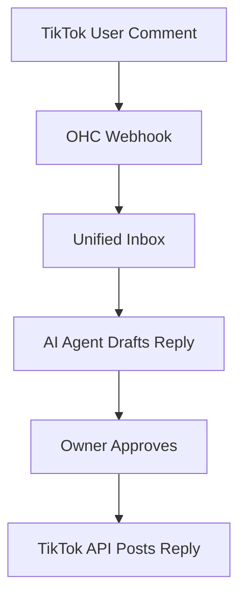
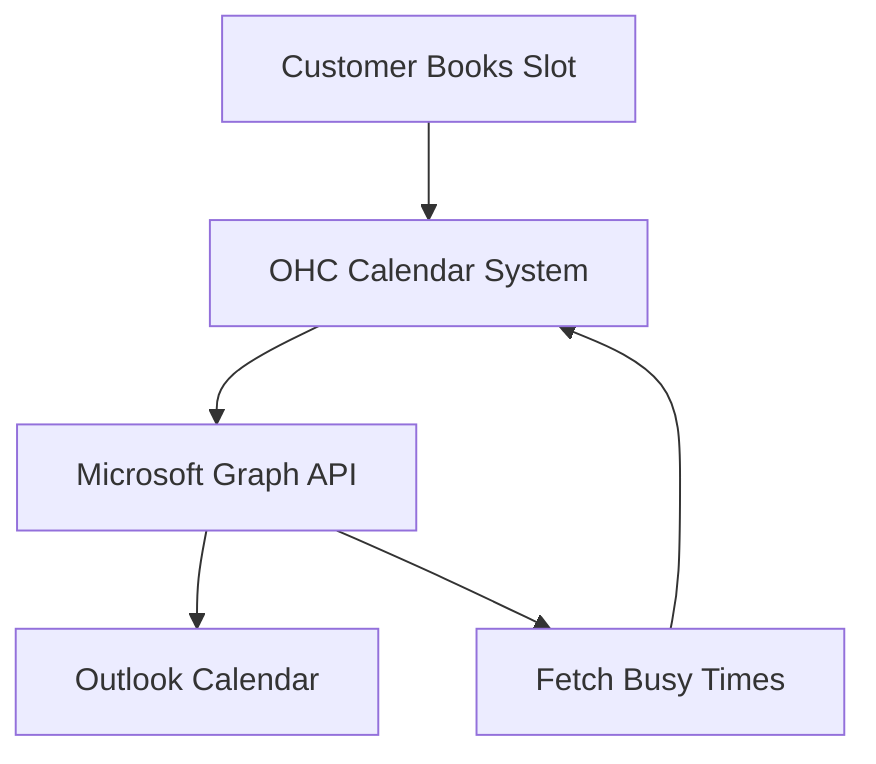
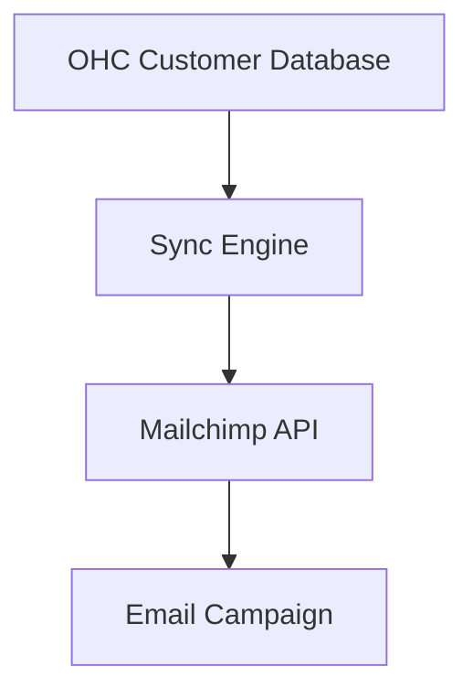
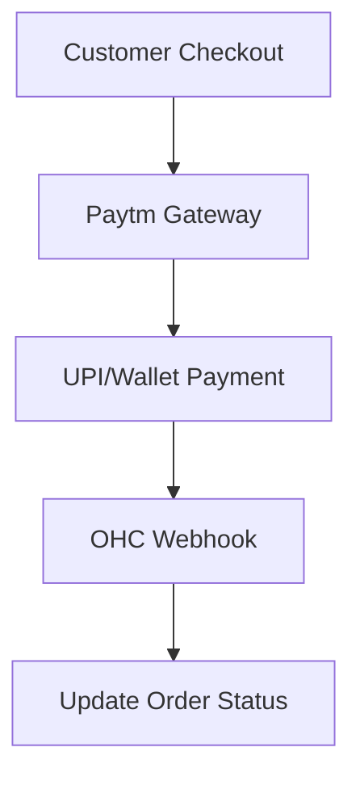
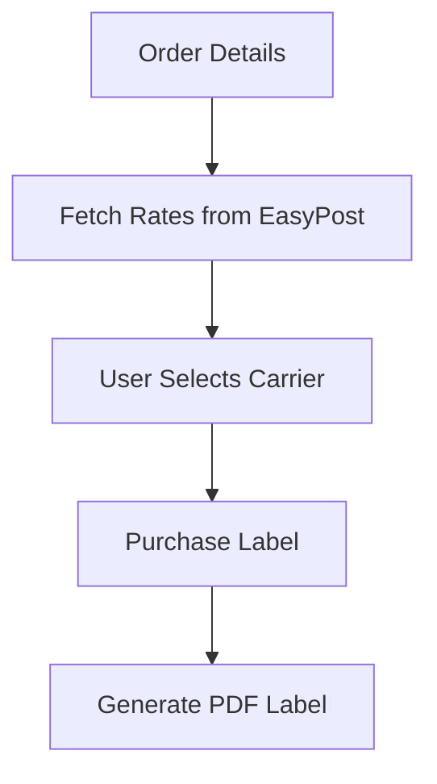
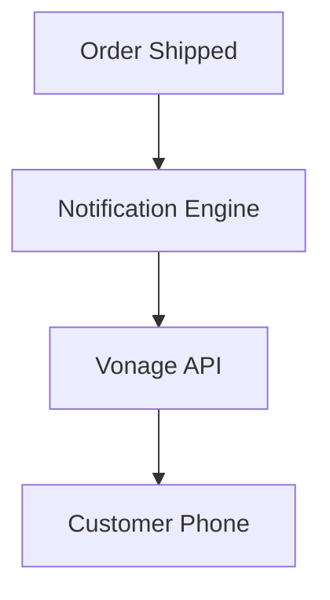
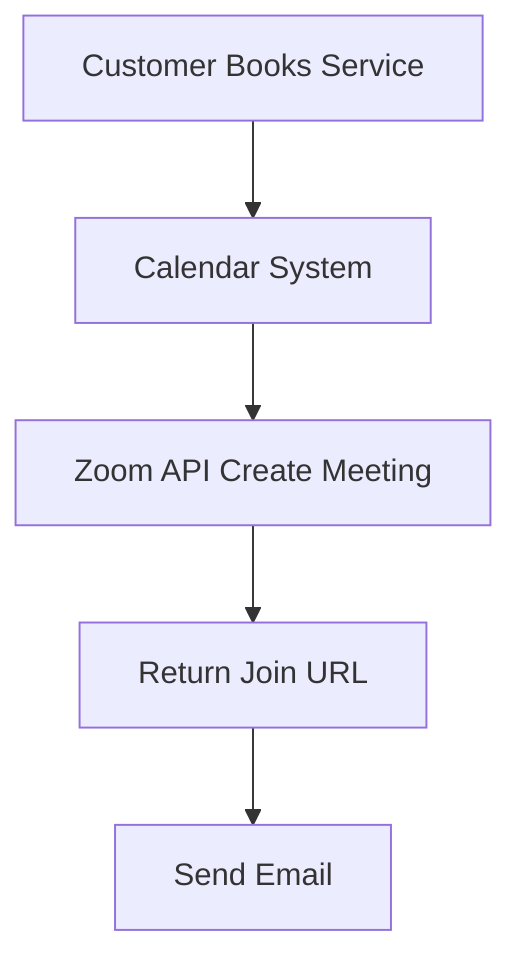

## [Social Media] Issue Brief: TikTok Comments Integration

**Title**: Scout 🔍: Integrate TikTok Comments for Unified Inbox
**Problem Statement**:
Small business owners are going viral on TikTok but missing sales because they cannot keep up with comments. They need a way to manage these comments from the same unified inbox they use for everything else.
**Research Report**:
- **Tool**: TikTok for Business API.
- **Evaluation**: TikTok is a massive driver of organic growth for small businesses. Integrating it helps capture high-intent leads.
- **Ease of Use**: Users connect their TikTok Business account via OAuth.
- **Pricing**: Free API usage.
- **Cloud vs. Standalone**: Works in both Cloud and Standalone.
**Design Doc**:
- User goes to "Operations" -> "Social Media".
- Clicks "Connect TikTok" and authorizes the app.
- Incoming comments are routed to the OHC Unified Inbox.
- The user (or AI agent) can reply.

**Implementation Prompt**:
Implement the TikTok API integration to fetch and reply to video comments. Add TikTok to the Social Media integrations page with an OAuth flow. Update the Unified Inbox to support comments.
**Priority**: P1
**Estimated Scope**: Medium
## [Calendar] Issue Brief: Outlook Calendar Sync

**Title**: Scout 🔍: Native Microsoft Outlook Calendar Integration
**Problem Statement**:
Many traditional small businesses run entirely on Microsoft Office 365 and Outlook. They need native booking synchronization without switching providers.
**Research Report**:
- **Tool**: Microsoft Graph API.
- **Evaluation**: Critical for capturing established small business segments.
- **Ease of Use**: Single-click OAuth sign-in to Microsoft.
- **Pricing**: Free API usage.
- **Cloud vs. Standalone**: Works in both Cloud and Standalone environments.
**Design Doc**:
- User navigates to "Sales" -> "Calendar Sync".
- Selects "Microsoft Outlook" and authenticates.
- OHC reads availability and blocks off busy times on the booking page.
- New appointments are pushed directly to the Outlook Calendar.

**Implementation Prompt**:
Integrate Microsoft Graph API to support Outlook Calendar. Provide an OAuth connection flow. Ensure the OHC booking widget respects Outlook free/busy times.
**Priority**: P1
**Estimated Scope**: Medium
## [Email Marketing] Issue Brief: Mailchimp Campaign Sync

**Title**: Scout 🔍: Mailchimp Audience Integration
**Problem Statement**:
Business owners want to send beautiful newsletters using Mailchimp. Manually exporting CSV files of customer emails is tedious and leads to outdated lists.
**Research Report**:
- **Tool**: Mailchimp Marketing API.
- **Evaluation**: Mailchimp is the most recognizable email marketing tool.
- **Ease of Use**: OAuth connection maps OHC customer tags to Mailchimp audiences.
- **Pricing**: Free for OHC; Mailchimp has its own pricing.
- **Cloud vs. Standalone**: Fully compatible with both modes.
**Design Doc**:
- "Marketing" dashboard includes an "Email Providers" section.
- User connects Mailchimp.
- Any new customer added to OHC is automatically synced to Mailchimp.

**Implementation Prompt**:
Create a one-way sync from OHC to Mailchimp. When a customer is created or updated in OHC, push their email, name, and tags to Mailchimp.
**Priority**: P2
**Estimated Scope**: Small
## [Payment] Issue Brief: Paytm Integration for India

**Title**: Scout 🔍: Paytm Payment Gateway for the Indian Market
**Problem Statement**:
Small business owners in India rely heavily on UPI and local wallets. They need a localized payment gateway to accept funds smoothly.
**Research Report**:
- **Tool**: Paytm Payment Gateway API.
- **Evaluation**: Essential for entering the Indian market.
- **Ease of Use**: Users paste their Merchant ID and API Key.
- **Pricing**: Standard transaction fees for the merchant.
- **Cloud vs. Standalone**: Works in both modes.
**Design Doc**:
- "Settings" -> "Payments" -> "Add Gateway".
- User selects Paytm and enters credentials.
- Checkout pages dynamically show Paytm as an option.

**Implementation Prompt**:
Integrate Paytm as a payment option. Update the checkout UI to support Paytm. Ensure webhook listeners update order statuses.
**Priority**: P1
**Estimated Scope**: Medium
## [Shipping] Issue Brief: EasyPost for Multi-Carrier Shipping

**Title**: Scout 🔍: EasyPost Integration for Label Generation
**Problem Statement**:
Small e-commerce owners spend hours manually copying addresses to carrier websites to buy shipping labels. They need to instantly print labels from OHC.
**Research Report**:
- **Tool**: EasyPost API.
- **Evaluation**: EasyPost aggregates dozens of carriers into one API.
- **Ease of Use**: User connects EasyPost to OHC.
- **Pricing**: EasyPost charges per label.
- **Cloud vs. Standalone**: Fully functional in both modes.
**Design Doc**:
- "Operations" -> "Orders".
- User clicks "Buy Shipping Label".
- OHC fetches rates from EasyPost.
- User selects a rate, and a PDF label is generated.

**Implementation Prompt**:
Implement an EasyPost integration to fetch shipping rates. Allow the user to purchase a label and download the PDF.
**Priority**: P1
**Estimated Scope**: Large
## [SMS] Issue Brief: Vonage SMS Notifications

**Title**: Scout 🔍: Vonage SMS for Global Notifications
**Problem Statement**:
Business owners need to send appointment reminders via SMS to reduce no-shows and keep customers informed.
**Research Report**:
- **Tool**: Vonage SMS API.
- **Evaluation**: Vonage provides competitive global pricing for transactional SMS.
- **Ease of Use**: Users simply toggle "Send SMS Updates" in their settings.
- **Pricing**: Per-message cost.
- **Cloud vs. Standalone**: Works in both environments.
**Design Doc**:
- "Marketing" -> "Notifications".
- User enables SMS notifications for Orders or Appointments.
- When an event occurs, OHC calls the Vonage API.

**Implementation Prompt**:
Integrate the Vonage SMS API to send outbound text messages. Add UI toggles for enabling SMS notifications.
**Priority**: P2
**Estimated Scope**: Medium
## [Video] Issue Brief: Zoom Meeting Auto-Generation

**Title**: Scout 🔍: Zoom API for Automatic Meeting Links
**Problem Statement**:
Consultants need meeting links generated automatically upon booking.
**Research Report**:
- **Tool**: Zoom API.
- **Evaluation**: Zoom is the ubiquitous standard for video calls.
- **Ease of Use**: Standard OAuth flow to connect Zoom.
- **Pricing**: Free API usage.
- **Cloud vs. Standalone**: Works securely in both setups.
**Design Doc**:
- "Sales" -> "Integrations" -> "Video".
- User connects Zoom.
- When a booking occurs, OHC creates a Zoom meeting.

**Implementation Prompt**:
Integrate the Zoom API using OAuth. Modify the booking engine to generate a unique meeting link when an online service is booked.
**Priority**: P1
**Estimated Scope**: Medium
