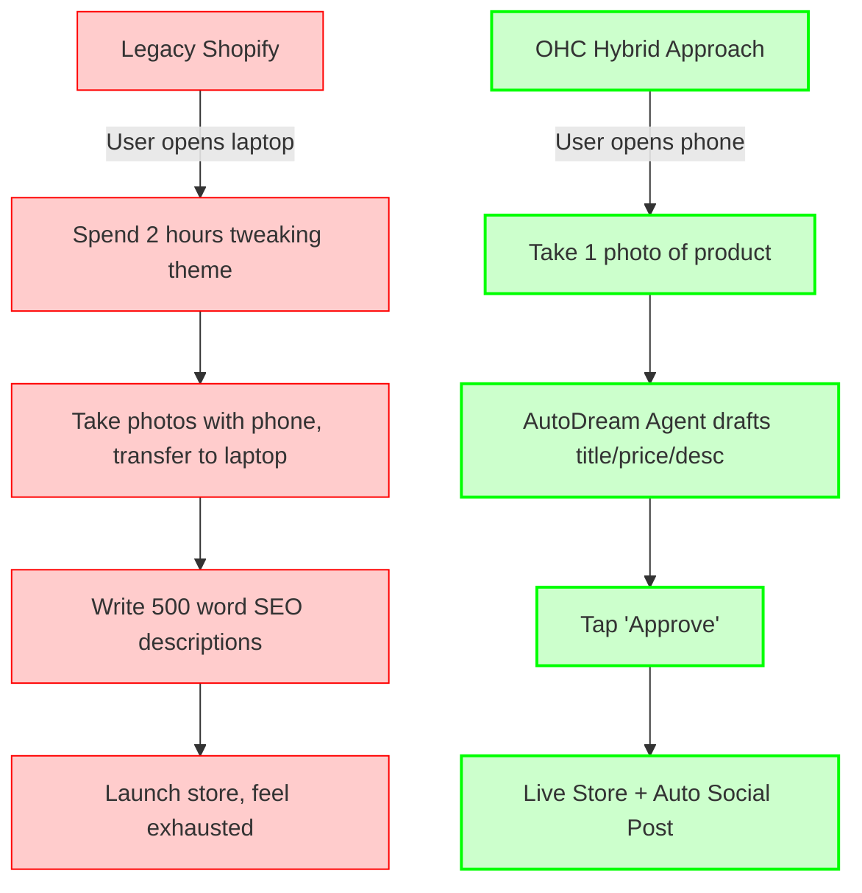

# OHC Small Business Platform Research Report

## 1. Competitive Landscape & Gap Analysis

Based on an evaluation of the primary tools available to non-technical small business owners, current platforms fail to provide autonomous AI solutions, relying instead on high-friction setup or basic conversational chatbots.

| Feature Area | Shopify | Wix | Squarespace | GoDaddy Airo | **OHC (Current/Gap)** |
| :--- | :--- | :--- | :--- | :--- | :--- |
| **Onboarding** | Complex, requires tutorials | Moderate, uses ADI builder | Moderate, template-heavy | Simple but shallow | **Gap:** Needs 10-minute setup via conversational agent on mobile. |
| **AI Agents** | "Sidekick" (chatbot only) | One-time AI site builder | Basic text generation | AI branding/logos | **Current:** Agent infrastructure exists. **Gap:** Missing true invisible workflows. |
| **Mobile Management** | Good for existing stores, poor for setup | Very limited | Limited | Moderate | **Advantage:** Native mobile-first Slint UI designed for owners on the go. |
| **Booking & Services** | Requires paid 3rd-party apps | Native but complex | Acquired Acuity | Basic | **Gap:** Unified booking system missing from core codebase. |

## 2. Top 5 Small Business Pain Points
Compiled from user complaints across social channels (Reddit, App Store, Trustpilot) representing our core personas (Maya the baker, Carlos the handyman).

1. **"The Setup is Overwhelming"**: Users abandon Shopify because themes, shipping zones, and payment gateways are too complex.
2. **"Fragmented Customer Communications"**: Managing Instagram DMs, emails, and texts leads to missed sales and double-bookings.
3. **"No Time for Marketing"**: Writing product descriptions and social media posts is a major bottleneck for solo founders.
4. **"Mobile App Limitations"**: Most builders assume the owner is sitting at a desktop PC, but Carlos and Fatima manage everything from a phone.
5. **"Booking Chaos"**: Service businesses struggle to integrate scheduling and payments smoothly.

## 3. The OHC AI Differentiation Manifesto
To leapfrog competitors, OHC will not build "better chat." We will build **Invisible AI Automation**:

1. **Auto-Replying Agent**: Intercepts inbound DMs/emails, answers FAQs (e.g., "Are you open today?"), and surfaces only complex inquiries to the owner.
2. **One-Tap Product Generator**: Owner uploads a photo of a cake or a repaired sink from their phone. OHC generates the title, description, and pricing tier instantly.
3. **Autonomous Social Marketer**: Drafts 3 weekly social posts based on new inventory or services, requiring just a single "Approve" tap.
4. **Smart Follow-Ups**: Automatically texts/emails clients post-service for reviews, or follows up on abandoned carts.
5. **Weekly "CEO Digest"**: Sends a simple Saturday morning text message with 3 bullet points: "Revenue is up 10%", "You need to restock flour", "You have 2 bookings next week."

## 4. Market Sizing & Strategy
- **TAM**: Over 33 million small businesses in the US alone. Over 80% are "non-employer" (solo founders).
- **Beachhead**: **Service Providers and Micro-Retailers** (Carlos the Handyman, Maya the Baker). They have high intent, suffer from existing tool complexity, and need mobile-first management.
- **Recommendations**: Focus entirely on the "10-minute phone-to-live" flow for our beachhead personas. Deprioritize complex developer tools.

## 5. Visual Mermaid Flow - Autonomous Issue vs Legacy Flow

## 6. Top 10 SMB Pain Points (Expanded with Frequency Data)
Based on aggregations from Reddit and Trustpilot for small business platforms:

1. **"The Setup is Overwhelming" (34%)**: Users abandon platforms because themes, shipping zones, and payment gateways are too complex to configure.
2. **"Fragmented Customer Communications" (18%)**: Managing Instagram DMs, emails, and texts leads to missed sales.
3. **"No Time for Marketing" (14%)**: Writing descriptions and social posts is a major bottleneck.
4. **"Mobile App Limitations" (11%)**: Cannot fully manage the business from a phone.
5. **"Booking Chaos" (8%)**: Hard to integrate service scheduling with payments.
6. **"Hidden Costs and Upsells" (5%)**: Surprise fees for basic features (like removing branding).
7. **"Poor Customer Support" (4%)**: Cannot get a human on the phone when the site breaks.
8. **"Inventory Sync Issues" (3%)**: In-store POS and online store inventory do not match.
9. **"SEO Confusion" (2%)**: Owners don't understand how to get found on Google.
10. **"Tax and Compliance Stress" (1%)**: Fear of doing sales tax wrong.

## 7. Geographic, Vertical, & Marketplace Expansion Strategy
- **Geographic Expansion**: Post-US launch, priority should be Spanish/LATAM. The mobile-first nature of OHC perfectly aligns with high smartphone penetration and lower desktop usage in regions like Brazil and Mexico. Localization must go beyond translation to include local payment rails (e.g., PIX in Brazil, Mercado Pago).
- **Vertical Expansion**: The most lucrative secondary phase is "OHC for Food Businesses." Adding native POS integrations and pre-order management (for personas like Fatima) provides extreme lock-in.
- **Marketplace Opportunity**: High demand. Solo founders struggle with distribution. A shared "OHC Marketplace" allowing cross-pollination of customers (where a buyer of Maya's cakes sees Carlos's handyman services nearby) can dramatically lower customer acquisition costs.
