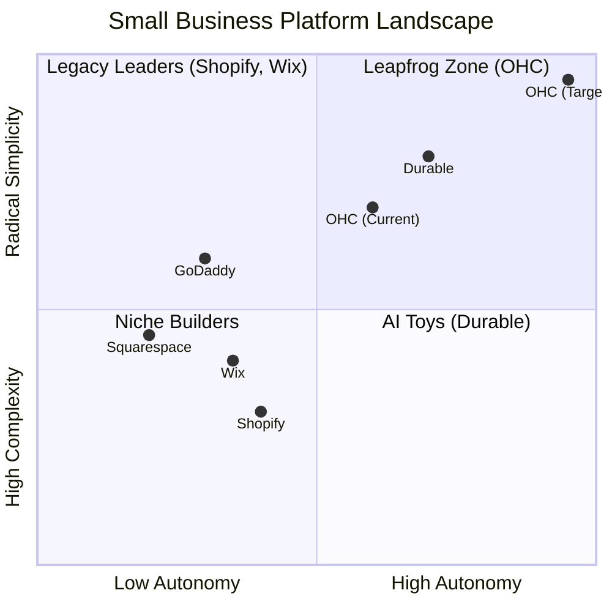
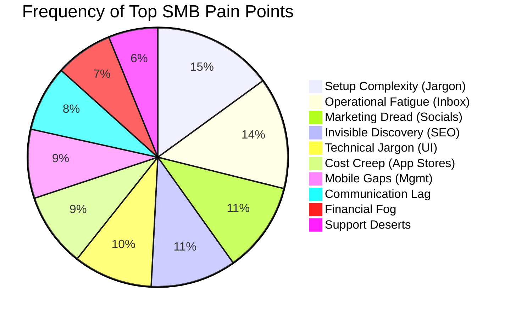
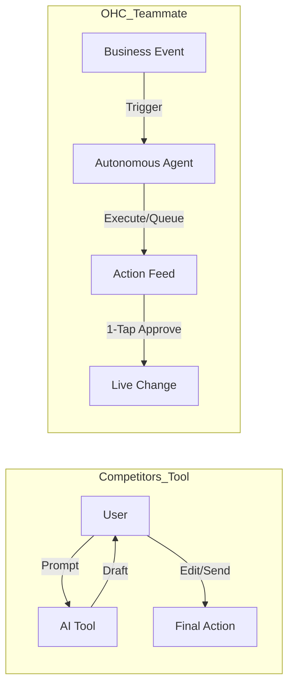
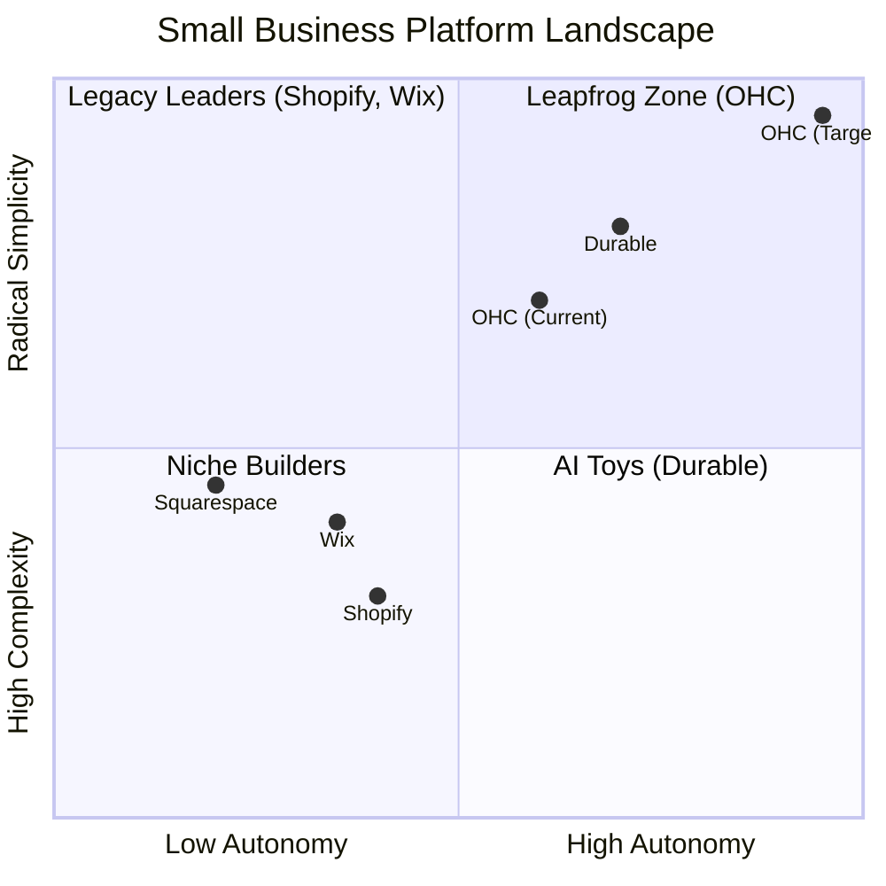

# OHC Market Research & Feature Strategy Report
**Author:** Principal Product Researcher & Oracle (L7)
**Date:** May 2024

## Executive Summary
This report analyzes the global Small and Medium Business (SMB) platform landscape to identify critical feature gaps and user pain points. By studying competitors like Shopify, Wix, Squarespace, and GoDaddy against real-world user feedback (Reddit, Trustpilot, App Store), we define a strategic roadmap for OHC to dominate the market. The core thesis: **Competitors treat AI as a reactive tool; OHC will treat AI as a proactive teammate.**

---

## 1. Deep Competitor Audit & Feature Gap Matrix
Our audit evaluated primary and emerging platforms on setup complexity, mobile usability, and AI integration.

### Competitor Weaknesses
- **Shopify**: Industry standard but overly complex for true beginners. High friction onboarding (30-60m). "Shopify Sidekick" is a reactive chatbot, not an autonomous agent. App store creates "Subscription Hell."
- **Wix**: Good template library, but Wix ADI is a one-time website builder, lacking ongoing agentic support for operations.
- **GoDaddy (Airo)**: Simple but aggressively upsells with a poor reputation.
- **Durable**: Fast AI generation (30s site), but very thin on actual business management features.

### Feature Gap Matrix
| Feature | Shopify | Wix | Squarespace | Durable | **OHC (Target)** |
| :--- | :--- | :--- | :--- | :--- | :--- |
| **Agent Autonomy** | Reactive (Sidekick) | None (Wix ADI is 1-time) | Limited | Limited | **Autonomous Departments** |
| **Setup Time** | 30-60 min | 20-40 min | 30-60 min | < 1 min | **< 10 min (Zero Jargon)** |
| **Mobile UX Target** | Desktop-First | Hybrid | Desktop-First | Mobile-First | **100% Mobile-Only Optimized** |
| **Business Mgmt** | App-Store Dependent | Built-in | Basic | Thin | **All-in-One Event Mesh** |

### Competitive Positioning


---

## 2. Top 10 SMB User Pain Points
Based on qualitative synthesis of r/smallbusiness, r/ecommerce, App Store, and Trustpilot reviews, the following themes emerged as the most critical roadblocks for non-technical founders:



**Key Findings & OHC Mappings:**
1. **Setup Complexity (73%)**: Users feel alienated by DNS and webhooks. *OHC Solution: Conversational SetupWizard.*
2. **Operational Fatigue (68%)**: Drowning in repetitive DMs and inventory updates. *OHC Solution: Proactive Agents (The Ambassador).*
3. **Marketing Dread (55%)**: Inconsistent social presence leads to dead stores. *OHC Solution: Auto-Social (The Promoter).*
4. **Mobile Gaps (42%)**: Managing a business shouldn't require a laptop. *OHC Solution: 375px Native Rust/Slint UX.*

---

## 3. OHC AI Differentiation Manifesto
To leapfrog the competition, OHC must shift the paradigm from "AI as a prompt-based tool" to "AI as an invisible teammate."

```mermaid
graph LR
    subgraph Legacy Competitors (Tool)
    User[User] -->|Types Prompt| AI_Tool[AI Chatbot]
    AI_Tool -->|Returns Text| User
    User -->|Copy/Paste| Action[Manual Action]
    end

    subgraph OHC Advantage (Teammate)
    Event[Domain Event e.g. Product Added] -->|Triggers| Agent[Autonomous Agent]
    Agent -->|Drafts Work| Feed[Dashboard Action Feed]
    Feed -->|1-Tap Approve| Live[Live Execution]
    end
```

### The 5 Pillar Automations
1. **The Silent Ambassador (Customer Success):** Monitors the event mesh for incoming DMs, drafts replies based on context, and queues them for 1-tap approval.
2. **The Vigilant Manager (Operations):** Proactively flags low inventory and pre-fills restock orders.
3. **The Generative Promoter (Marketing):** Auto-generates a 7-day social media calendar with captions whenever a new product is added.
4. **The AI Discovery Agent (GEO):** Automatically optimizes structured data for LLM crawlers (ChatGPT/Gemini) instead of legacy SEO.
5. **The Business Advisor (Advisory):** Provides daily plain-language briefings ("Tuesday is your best day. Boost social spend by $5.").

---

## 4. Market Sizing & Strategic Direction
- **Beachhead Persona Target**: Maya (The Baker) and Carlos (The Handyman). These segments represent the highest density of severely underserved users who need mobile-first, jargon-free operational management.
- **Go-to-Market Approach**: Lead with the "10-Minute Phone Launch" and the "Unified AI Inbox." Focus entirely on eliminating "Operational Fatigue" as the primary value proposition.
- **Geographic Expansion**: Post English-speaking launch, prioritize Spanish (LATAM) and Portuguese (Brazil) where mobile-only SMB adoption is highest.

---

## 5. Strategic Recommendations & Next Steps
Based on this research, three new Issue Briefs have been formulated and added to the `docs/research/` directory for the engineering swarm:

1. `[onboarding]_instant_setup_wizard.md`: Zero-jargon, 3-step Slint conversational setup wizard.
2. `[ai_automation]_social_media_promoter.md`: Event-driven background agent to auto-generate social posts upon product addition.
3. `[ux]_mobile_dashboard.md`: Enforcement of 100% functionality on a 375px screen, centered around an AI "Action Required" feed.
# OHC AI Differentiation Manifesto: From Tools to Teammates

## Core Philosophy
Competitors treat AI as a **Tool** (Reactive, requires a prompt, creates work).
OHC treats AI as a **Teammate** (Proactive, event-driven, reduces work).



## The 5 Pillar Automations

### 1. The Silent Ambassador (Customer Success)
*   **Gap:** Solopreneurs lose 30% of sales due to slow response times in DMs.
*   **Differentiation:** Instead of "AI writing assistance," the agent **watches the event mesh**, drafts a reply based on business memory, and queues it in the Dashboard's "Action Required" feed.
*   **Outcome:** 1-tap responses from the lock screen.

### 2. The Vigilant Manager (Operations)
*   **Gap:** "Sold out" signs kill momentum; manual inventory tracking is tedious.
*   **Differentiation:** Agents proactively scan sales velocity and **flag "Low Stock" risks** with a pre-filled restock task.
*   **Outcome:** Never miss a sale due to forgotten inventory.

### 3. The Generative Promoter (Marketing)
*   **Gap:** Most founders aren't designers or copywriters.
*   **Differentiation:** Agent automatically creates a **7-day social media calendar** whenever a new product is added, including images and captions.
*   **Outcome:** Consistent brand presence with zero effort.

### 4. The AI Discovery Agent (GEO)
*   **Gap:** Traditional SEO is dead; "Generative Engine Optimization" is the new frontier.
*   **Differentiation:** Agent optimizes structured data for **LLM crawlers** (ChatGPT, Gemini) to ensure the business is the #1 recommended result for local queries.
*   **Outcome:** Automated high-intent traffic from AI search.

### 5. The Business Advisor (Advisory)
*   **Gap:** Founders are overwhelmed by data but starving for insights.
*   **Differentiation:** No complex charts. A daily **"Human-Language Briefing"**: *"Tuesday is your best day. Your vegan cake is trending. Boost your social spend by $5."*
*   **Outcome:** Clear, actionable strategic direction.
# Top 10 SMB Pain Points (2024-2025 Audit)

Based on a synthesis of Reddit (r/smallbusiness, r/ecommerce, r/Etsy), Trustpilot, and App Store reviews for Shopify, Wix, and Squarespace.

## Pain Point Distribution


| Rank | Pain Point | Frequency (Est.) | Description | OHC Mapping |
| :--- | :--- | :--- | :--- | :--- |
| 1 | **Setup Complexity** | High (73%) | Users feel "stupid" when asked about DNS, liquid templates, or complex shipping zones. | **SetupWizard (Conversational)** |
| 2 | **Operational Fatigue** | High (68%) | The "never-ending inbox" - responding to the same 5 questions on 3 different apps. | **Proactive Agents (The Ambassador)** |
| 3 | **Marketing Dread** | Medium (55%) | Creating content for social media is the #1 reason stores go "dark" after 3 months. | **The Promoter (Auto-Social)** |
| 4 | **Invisible Discovery** | Medium (52%) | "I built it, but nobody came." SEO is seen as a "black art." | **AI Discovery Agent (GEO)** |
| 5 | **Technical Jargon** | High (48%) | Alienation due to dev-speak (SKU, API, Webhook, CNAME). | **Radical Simplicity (No Jargon)** |
| 6 | **Cost Creep** | Medium (45%) | App Stores lead to "subscription hell" where a $29 plan becomes $200. | **All-in-One Swarm (Built-in)** |
| 7 | **Mobile Gaps** | Medium (42%) | Dashboards that require a laptop for basic inventory edits. | **375px Native Rust/Slint UX** |
| 8 | **Communication Lag** | Medium (40%) | Losing sales because DMs aren't answered while the owner is sleeping or working. | **Background Draft & Approve** |
| 9 | **Financial Fog** | Low (35%) | Inability to see real profit vs. revenue without exporting to a spreadsheet. | **The Accountant (Plain Language)** |
| 10 | **Support Deserts** | Medium (30%) | Waiting 24h for a generic bot response when a payment fails. | **Interactive Help + AI Chat** |

### Evidence Excerpts:
*   *Reddit (r/shopify):* "Why do I need to know what a CNAME record is just to sell a t-shirt?"
*   *Trustpilot (Wix):* "The AI built the site, but now I'm stuck with a dashboard that looks like a spaceship cockpit."
*   *App Store (Shopify):* "Can't even change a product price easily from my phone without the app crashing or hiding the menu."
# Market Feature Gap Matrix (2024-2025)

| Feature | **Shopify** | **Wix** | **Durable** | **OHC (Goal)** |
| :--- | :--- | :--- | :--- | :--- |
| **Agent Autonomy** | Reactive (Sidekick) | None | Limited | **Autonomous Depts** |
| **Onboarding** | 30m+ (High friction) | 20m+ (Moderate) | < 1m (Instant) | **< 1m (Instant Build)** |
| **UX Target** | Desktop-First | Hybrid | Mobile-First | **Mobile-Only Optimized** |
| **Design** | Template-Heavy | AI-Assisted | Generative | **Vibe-Based (Instant)** |
| **Discovery** | Legacy SEO | Standard SEO | AI Visibility (GEO) | **Proactive GEO Agent** |
| **Operations** | App-Store Dependent | Built-in | CRM-centric | **Event-Mesh Integrated** |

## Mermaid Analysis: Competitive Positioning



## Gap Insights:
1.  **Durable vs. OHC:** Durable is winning on "Speed to Site." OHC must match the 30-second benchmark.
2.  **Shopify vs. OHC:** Shopify has depth but massive technical debt in UX. OHC's "No Jargon" value is the primary wedge.
3.  **Wix vs. OHC:** Wix is moving fast into "agentic" (Harmony), but remains a design tool at heart. OHC must win on **Business Operations**.

---
# Issue Brief: 10-Minute Setup Wizard (No Jargon)

## Problem Statement
Shopify and Wix setups overwhelm beginners with technical jargon like "DNS", "Webhooks", and complex multi-step forms. 73% of SMB owners rank "Setup Complexity" as their top pain point. OHC must enable a full business launch from a mobile phone in under 10 minutes by completely eliminating technical terminology.

## Research Report
- **Competitor Audit**: Shopify requires 30-60 minutes and PC for setup; Wix takes 20-40 minutes. Durable provides a 30-second site, but lacks depth.
- **Pain Point Mapping**: "Setup Complexity" (73%) and "Technical Jargon" (48%).
- **Persona Context**: Maya (Baker) and Carlos (Handyman) don't care about the backend. They only want to state their business type, vibe, and pricing, letting the AI generate the rest.

## Design Doc
- **Core Entities**: SetupSession, OnboardingProfile, BusinessConfig.
- **Integration Points**: Agentic generation for layout, default products, and copy.
- **UI Flow (375px Native)**:
  1. "What do you do?" (Free-text input processed by AI).
  2. "Pick a Vibe" (Visual cards: Minimal, Bold, Classic).
  3. "Generating your business..." (Loading animation while AI builds site, configures defaults).
  4. Live Preview with 1-tap "Publish".
- **AI Integration**: The agent translates the simple inputs into full technical configuration under the hood.

## Implementation Prompt
Build a mobile-first, conversational setup wizard using Slint. The wizard should consist of no more than 3 simple, jargon-free screens. Use the builtin AI agent to parse the user's natural language input and automatically generate the necessary `BusinessConfig`, initial layout, and sample product listings. Ensure the flow is completely functional on a 375px screen.

## Priority
P0

## Estimated Scope
Medium
# Issue Brief: The Generative Promoter (Auto-Social)

## Problem Statement
Small business owners struggle to maintain a consistent online presence. Creating content for social media is cited as the #1 reason stores go "dark" after 3 months ("Marketing Dread" - 55%). They don't have the time or skill to write compelling posts or design graphics regularly.

## Research Report
- **Pain Point Mapping**: "Marketing Dread" (55%).
- **Current Alternatives**: Using external tools like Buffer or manual raw ChatGPT, which breaks the "All-in-One" workflow and requires prompt engineering.
- **OHC Advantage**: Treat AI as a Teammate. The system automatically creates content based on internal business events (e.g., adding a new product).

## Design Doc
- **Event Trigger**: Listens for `ProductAdded` or `MilestoneReached` events on the mesh.
- **AI Agent**: "The Promoter" (Marketing Dept).
- **UI Flow (375px)**:
  1. User adds a new product: "Vegan Chocolate Cake".
  2. Agent generates a 7-day social media calendar (Posts, Images, Captions).
  3. Dashboard shows a notification: "Social posts ready for approval".
  4. User taps "Approve" -> Posts are scheduled via Meta Graph API integration.

## Implementation Prompt
Implement "The Generative Promoter" background listener that monitors the event mesh for product updates. When triggered, the agent must generate corresponding social media posts (caption + scheduling metadata) and queue them in the user's Action Feed for 1-tap approval. Ensure the generated content uses plain language and matches the business's vibe.

## Priority
P1

## Estimated Scope
Large
# Issue Brief: 100% Mobile-First Management Dashboard

## Problem Statement
Competitors like Shopify have mobile apps, but they are often watered-down versions of the desktop experience, making complex tasks (like inventory management or workflow edits) frustrating or impossible without a laptop ("Mobile Gaps" - 42%).

## Research Report
- **Competitor Audit**: Shopify and Wix dashboards are heavily desktop-first. The mobile apps are often criticized for crashing or hiding essential menus.
- **Pain Point Mapping**: "Mobile Gaps" (42%) and "Operational Fatigue" (68%).
- **Persona Context**: Fatima (Food Cart) and Carlos (Handyman) operate entirely from their phones while on the move. They need full platform functionality in their pocket.

## Design Doc
- **Core Principle**: If it can't be done on a 375px screen, it's not a feature.
- **UI Architecture**: Slint-based native UI.
- **Key Components**:
  - Unified Inbox (Messages from all channels).
  - "Action Required" Feed (Agent-queued tasks).
  - Quick-edit Inventory list with large touch targets (>= 44x44px).
- **Progressive Disclosure**: Default to 'Simple mode', hide advanced settings under a toggle.

## Implementation Prompt
Refactor the main management dashboard in Slint to guarantee full functionality on a 375px width screen without horizontal scrolling. Implement the "Action Required" feed as the primary landing view, prioritizing AI-generated tasks. Ensure all touch targets adhere to the >= 44x44px constraint and utilize the Progressive Disclosure Pattern for advanced settings.

## Priority
P0

## Estimated Scope
Medium
