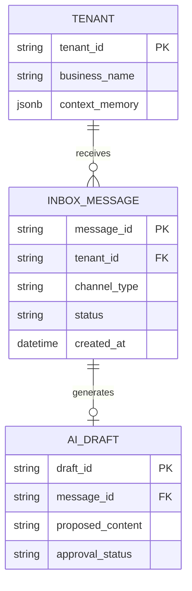

# [Issue] Architect Omnichannel Unified Inbox with Autonomous Agent

## Title
Implement Omnichannel Unified Inbox & Autonomous Inquiry Responder

## Problem Statement
Small business owners (like Maya the baker and Carlos the handyman) suffer from "Customer Communication Chaos." They lose track of leads and inquiries scattered across Instagram DMs, WhatsApp, SMS, and email. Solopreneurs lose up to 30% of sales simply due to slow response times or forgotten messages. They need a single, centralized inbox where an AI "Silent Ambassador" watches the communication stream, proactively drafts context-aware replies (e.g., answering "do you do vegan cakes?"), and presents them for a quick 1-tap approval from their phone's lock screen.

## Research Report
*   **User Pain Point:** Managing multiple communication apps (Instagram, WhatsApp Business, Email, SMS) causes context switching and dropped leads.
*   **Competitor Analysis:**
    *   **Shopify:** Requires third-party apps (e.g., Gorgias, Inbox) which have complex setups and lack proactive, deep AI business context (they act as simple chatbots or macro repliers).
    *   **Wix:** Has a unified inbox, but it is passive. It requires the user to manually read and type responses.
    *   **GoDaddy:** Basic messaging integration, but no autonomous agents.
*   **OHC Advantage:** Shift from an AI *Copilot* (requires prompt) to an AI *Teammate*. The AI watches the event mesh of incoming messages, uses the business's memory (inventory, pricing, policies), drafts the perfect reply, and queues it in an "Action Feed" for a 1-tap approval.

## Design Doc

### Architecture Diagram

#### Entity-Relationship Model



#### System Architecture

```mermaid
graph TD
    subgraph External Channels
        IG[Instagram DMs]
        WA[WhatsApp]
        SMS[SMS / Twilio]
        Email[Email Inbound]
    End

    subgraph OHC Event Mesh
        Ingress[Webhook Ingress API]
        Queue[NATS Hybrid Event Mesh]
    End

    subgraph AI Customer Success Dept
        Agent[Autonomous Responder Agent]
        Memory[(Business Memory & Context)]
        Drafting[Context-Aware Drafting Engine]
    End

    subgraph Core Platform
        Ledger[Unified Inbox Data Store]
        ActionFeed[Mobile Action Feed API]
    End

    subgraph Client
        Mobile[OHC Mobile App - 375px]
    End

    IG --> Ingress
    WA --> Ingress
    SMS --> Ingress
    Email --> Ingress

    Ingress --> Queue
    Queue --> Agent
    Agent -->|Fetch Context| Memory
    Agent --> Drafting
    Drafting --> Ledger
    Ledger --> ActionFeed
    ActionFeed --> Mobile
    Mobile -->|1-Tap Approve| Queue
    Queue -->|Dispatch| Ingress
```

### UI Wireframes & Mobile UX Flow (375px First)
*   **Lock Screen Notification:** "Maya, new IG DM from @john. AI drafted a reply. Tap to review."
*   **Action Feed Screen (375px):**
    *   A clean, translucent glass card layout (macOS/UniFi style).
    *   **Header:** Customer Name & Channel Icon (e.g., Instagram logo).
    *   **Original Message:** "Hi! Do you make vegan chocolate cakes for this Saturday?"
    *   **AI Draft:** "Hi John! Yes, we have a delicious Vegan Chocolate Fudge cake. We can have it ready for Saturday if you order by tomorrow. It's $45. Shall I send the deposit link?"
    *   **Action Buttons:** Large "Approve & Send" (Primary, Green), "Edit" (Secondary), "Dismiss" (Tertiary).
*   **Mobile UX Flow:** User receives a notification -> Taps into the Action Feed -> Reads the AI drafted reply -> Taps "Approve & Send". The message is dispatched invisibly through the correct channel.

### AI Agent Integration Points
*   **The Silent Ambassador:** Listens to incoming events on the unified messaging queue.
*   **Context Fetching:** Before drafting, the agent queries the Catalog (for vegan cakes), Availability (for this Saturday), and Pricing (to quote $45).
*   **Drafting & Queuing:** Generates the reply and saves it to the Inbox Ledger as `status: PENDING_APPROVAL`.

### Key Design Decisions
*   **Event-Driven Architecture:** Decoupling the ingestion of messages from the processing ensures high availability and fast ingestion even if the AI takes a few seconds to draft a response.
*   **Human-in-the-Loop (1-Tap):** We do not auto-send messages immediately to prevent hallucination errors. The 1-tap approval builds trust with the business owner.
*   **Multi-tenant Isolation:** All incoming messages and AI drafts are strictly partitioned by `tenant_id` at the database and messaging queue layers to ensure Zero Trust security.
*   **Security & Identity:** Secure identity (SPIFFE/SPIRE) must be guaranteed across all components, particularly between the AI Responder Agent and the Ingress Webhooks to ensure no cross-tenant message contamination occurs.
*   **Performance & Offline Targets:**
    *   **Latency:** The AI draft generation and queueing must occur within < 500ms to ensure the action feed feels instantaneous.
    *   **Offline Capability:** The mobile client must be able to load previously cached action feeds and queue approval actions offline, synchronizing them smoothly when connectivity returns.
    *   **Payload Size:** Webhook payloads to the external channels should be strictly optimized and < 25KB to maintain performance on low-end mobile networks.

## Implementation Prompt
**Context:** We are building the Omnichannel Unified Inbox for OneHumanCorp.
**Task:** Implement the backend event ingestion, the Unified Inbox data model, and the AI drafting coordination pipeline.
**Acceptance Criteria:**
1. System can ingest messages from at least two mocked external providers (e.g., IG, SMS).
2. Incoming messages are strictly isolated by `tenant_id`.
3. The AI Agent service listens to the ingress queue, fetches mocked business context, and successfully generates a draft reply.
4. The draft reply is exposed via a GraphQL/REST API for the mobile action feed, labeled as `PENDING_APPROVAL`.
5. An approval mutation successfully dispatches the message back to the mocked external provider.

## Priority
P0

## Estimated Scope
Large
