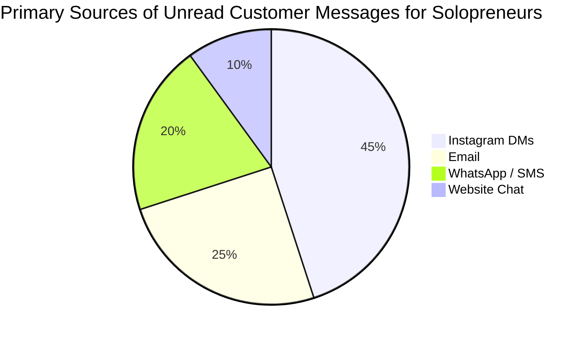
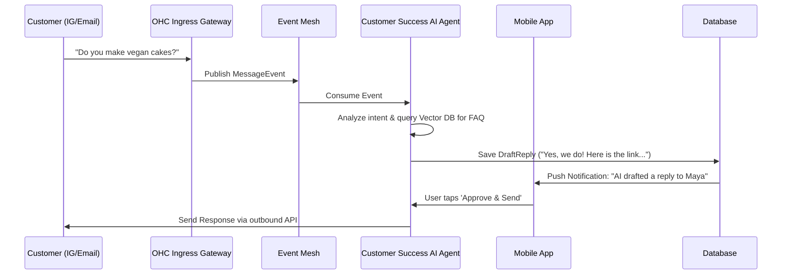

# OneHumanCorp (OHC) Market Research & Issue Brief: The Mobile-First AI Triage Inbox

## Problem Statement

Small business owners—especially solopreneurs like home bakers, freelance handymen, and boutique owners—are overwhelmed by the sheer volume of customer communication spanning Instagram DMs, SMS, WhatsApp, and email. This fragmentation leads to:

*   **Missed Leads & Revenue:** A DM asking for a quote is buried under 20 spam messages or comments.
*   **Burnout:** Owners like Maya (the baker) are up at 2 AM answering basic questions ("do you do vegan cakes?").
*   **Context Switching:** Jumping between 4-5 different apps to manage a single customer relationship.

Current solutions like Shopify Sidekick or Wix AI are *chatbots* that help the owner navigate the platform, not *autonomous agents* that handle external customer operations. There is no existing tool in the market that provides a truly unified, mobile-first, AI-triaged inbox out-of-the-box for non-technical users.

## Research Report

Our deep dive into the SMB market reveals critical pain points and significant opportunities where OHC can leapfrog incumbents.

### Top 10 SMB Pain Points (Aggregated from Reddit, App Store, and Trustpilot)

1.  **Initial Setup Complexity:** The 30-60 minute onboarding flows of Shopify and Squarespace are alienating to non-technical users.
2.  **Mobile Management Restrictions:** Most platforms treat mobile apps as companions for checking stats, not primary tools for running the business.
3.  **Disjointed Ecosystems:** Combining storefronts, booking systems, and customer messaging requires duct-taping multiple plugins (often via Zapier).
4.  **Poor AI Integration:** Current "AI features" are reactive tools (like generating a product description on click), rather than proactive, autonomous agents.
5.  **No Meaningful Free Tier:** High upfront costs block micro-businesses from starting.
6.  **Ineffective Social Media Integration:** Marketing is siloed from sales; a comment on an Instagram post doesn't seamlessly become an order.
7.  **Customer Communication Overload:** DMs and emails pile up without any intelligent sorting or automated replies.
8.  **Lack of Proactive Business Intelligence:** Dashboards are complex and require the owner to find insights, rather than pushing actionable advice.
9.  **Inventory Sync Issues:** Friction when trying to track physical and online inventory without expensive POS systems.
10. **Complicated Payment and Quote Setup:** Taking custom deposits often means sending a manual Venmo request or paying for complex third-party tools.

### Feature Gap Matrix

| Feature | Shopify | Wix | OHC (Current) | OHC (Target Advantage) |
| :--- | :--- | :--- | :--- | :--- |
| **Setup time** | 30-60 min | 20-40 min | Discovery | **< 10 min** |
| **Technical knowledge needed** | Low | Low | Discovery | **Zero** |
| **AI agents (invisible)** | Sidekick (Reactive chat) | Wix AI (Limited) | Foundational | **Built-in, Autonomous** |
| **Mobile-first management** | Partial (View stats) | Partial | Foundational | **Native, Full-Featured** |
| **Unified Messaging** | Plugins required | App Market add-ons | Not implemented | **Built-in, AI-Triaged** |

### OHC AI Differentiation Manifesto

To definitively win the SMB market, OHC will not build "AI tools." We will build "AI Employees." Our core focus areas for immediate impact are:

1.  **The Auto-Responder (Customer Success Dept.):** AI that triages messages across all channels, drafts replies, and handles basic FAQs autonomously while the owner sleeps.
2.  **The Operational Copywriter (Marketing Dept.):** AI that doesn't just write descriptions when asked, but proactively suggests copy for new products and auto-generates social posts based on inventory updates.
3.  **The Proactive Analyst (Advisory Dept.):** "Push" analytics. Instead of a dashboard, the owner gets a plain-language notification: "You had 8 orders this week. Vegan cake requests doubled. Consider adding a vegan chocolate option."
4.  **The Revenue Retriever (Sales Dept.):** Autonomous follow-ups on abandoned carts, pending quotes, and dormant subscriptions without any manual trigger needed.
5.  **Dynamic Setup (Operations Dept.):** Creating a store layout and configuring settings based on natural language or voice inputs ("I sell custom guitars and need to take 50% deposits").

---

## Design Doc: The Mobile-First AI Triage Inbox

**Core Concept:** A single, unified inbox within the OHC mobile app where messages from Instagram, Email, WhatsApp, and Web Chat land. The "Customer Success Ambassador" (AI Agent) intercepts these messages, tags them, and either drafts a reply for approval or auto-responds based on confidence levels.

### Architecture (High-Level)

*   **Entities:** `Conversation`, `Message`, `CustomerContext`, `DraftReply`.
*   **Integration Points:**
    *   Ingestion via webhooks (Instagram Graph API, SendGrid/Mailgun inbound parse, Twilio WhatsApp).
    *   Routing through the Hybrid Event Mesh.
    *   Processing by the `Customer Success` AI agent queue (PostgreSQL `SKIP LOCKED` pattern).
*   **Mobile UX Flow (375px native):**
    1.  User opens the app to the "Inbox" tab.
    2.  Messages are pre-sorted into tabs: "Needs Reply", "Drafted by AI", "Auto-Resolved".
    3.  Tapping a message opens the chat thread. The UI explicitly highlights AI drafts in a subtle glassmorphism container.
    4.  User can hit "Send Draft", edit the draft, or type a manual reply.

## Implementation Prompt

**Title:** Implement the Unified AI Triage Inbox

**Objective:** Build the end-to-end flow for the Mobile-First AI Triage Inbox, allowing business owners to see messages from multiple channels in one place and review AI-generated draft responses.

**Critical User Journey (CUJ):**
1.  A simulated customer message (e.g., from an Instagram DM webhook mockup) arrives in the system.
2.  The backend routes the message to the Customer Success AI Agent.
3.  The Agent generates a draft response based on the tenant's context (mocked LLM response).
4.  The business owner logs into the OHC mobile app (simulated via Flutter Web/Desktop for E2E).
5.  The owner navigates to the "Inbox" tab.
6.  The owner sees the new message under the "Drafted by AI" section.
7.  The owner reviews the AI draft, taps "Approve & Send".
8.  The system marks the conversation as resolved and records the outbound action.

**Acceptance Criteria:**
*   **100% E2E Test Coverage:** The CUJ described above must be fully automated in a UI-driven test starting from login, navigating to the inbox, and clicking "Approve". No network mocking; use a mocked AI provider if necessary for determinism.
*   **Mobile-First UI:** The Flutter UI must be responsive, verified to work correctly at 375px width (no horizontal scrolling).
*   **Premium Aesthetic:** The AI draft UI component must utilize the OHC Glassmorphism token library (`backdrop-filter: blur(20px) saturate(200%)`).
*   **Resilience:** The backend ingestion and AI processing must utilize the standard queue pattern (`SKIP LOCKED`) and include retry logic for transient LLM failures.

**Priority:** P0
**Estimated Scope:** Large

