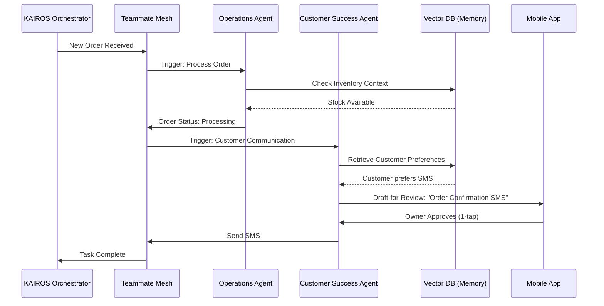

# [architecture] AI Agent Department Architecture

## Problem Statement

Small business owners—from bakers to handymen—often lack the technical expertise, time, and budget to manage the complex software stack required to run a modern business. Current platforms (Shopify, Wix, Squarespace) offer tools but still require the user to configure, connect, and operate them. The gap is not a lack of tools, but a lack of *execution capability*. Owners need a system that doesn't just provide a dashboard, but actively does the work for them. They need a team, but can't afford one.

## Research Report

Our analysis of the market (Shopify, Wix, Squarespace, GoDaddy) reveals that AI is currently treated as an add-on or a chatbot (e.g., Shopify Sidekick, Wix AI). It assists with specific tasks but does not possess autonomous operational capabilities spanning the entire business lifecycle.

To achieve the OHC Promise (zero technical knowledge, live in <10 minutes, mobile-first), AI must be elevated from a tool to foundational infrastructure. We propose organizing the AI agents into "Departments"—friendly, understandable functional areas that mirror a real business structure. This reduces cognitive load and aligns the system's capabilities with the owner's mental model.

## Design Doc

### 1. Overview
This document outlines the architecture for the OHC AI Agent Departments. These agents run invisibly in the background, handling tasks autonomously or drafting them for review, enabling non-technical owners to focus on their core craft.

### 2. Department Structure
The AI agents are grouped into 7 functional departments:

*   **Operations ("The Manager"):** Order processing, booking calendars, inventory tracking, fulfillment, refunds.
*   **Marketing & Advertising ("The Promoter"):** Website design, SEO, social media, promotional content, QR codes, link-in-bio pages.
*   **Sales & Acquisition ("The Salesperson"):** Quotes, lead follow-up, referral tracking, upselling.
*   **Customer Success ("The Ambassador"):** Message replies, order updates, review requests, re-engagement.
*   **Finance & Payments ("The Accountant"):** Payment processing, financial reports, subscription billing, tax summaries.
*   **Legal & Compliance ("The Protector"):** Terms/policies, contracts, GDPR, licenses, liability disclaimers.
*   **Business Advisory ("The Advisor"):** Weekly health reports, action suggestions, seasonal trends, pricing recommendations.

### 3. Architecture Details

#### 3.1 Triggers and Coordination
Agents operate on three primary triggers:
1.  **Scheduled (Cron):** Routine tasks (e.g., Weekly health report on Monday at 8 AM).
2.  **Event-Driven:** Reactive tasks initiated by system events (e.g., New Order placed -> Process Order -> Send Confirmation).
3.  **On-Demand:** Explicit requests from the user via the mobile dashboard.

Coordination between departments is managed by the KAIROS Orchestrator using a Shared Task List and the Teammate Mesh (Redis Pub/Sub). Distributed locks (`ohc:lock:{tenant_id}:{resource_type}:{resource_id}`) ensure safe, concurrent operations and prevent race conditions.

#### 3.2 Memory and Context
To provide personalized and context-aware service, agents rely on a unified memory architecture:
*   **Short-Term Context:** Data relevant to the current session or specific active task payload (e.g., the details of an order currently being processed).
*   **Long-Term Memory:** Historical data and user preferences stored as vector embeddings using `pgvector` in PostgreSQL. This allows agents to recall past interactions (e.g., "Customer Y prefers gluten-free options") and identify long-term trends.

#### 3.3 Approval Workflows
To build trust and maintain safety, agent actions are categorized by risk:
*   **Auto-Execute:** Low-risk, reversible actions (e.g., updating internal tags, generating internal reports). The agent performs these autonomously.
*   **Draft-for-Review:** High-risk, external-facing actions (e.g., sending emails to customers, publishing social media posts, issuing refunds). The agent prepares a draft and sends a push notification to the owner. The owner can approve or reject the action with a single tap in the mobile app.

#### 3.4 Tier-Based Limits and Throttling
Agent usage is governed by the user's SaaS tier. Usage is tracked per `tenant_id` using OpenTelemetry metrics.
*   **Free:** 1 Department, 100 actions/month.
*   **Starter:** 3 Departments, 1,000 actions/month.
*   **Pro:** 10 Departments, Unlimited actions.
*   **Business:** Unlimited Departments, Unlimited actions.

The KAIROS Orchestrator enforces rate limiting and quotas to ensure fair resource allocation and prevent noisy-neighbor issues.

### 4. Process Flow Diagram

## Implementation Prompt

**To the Implementer:**
Implement the foundational framework for the AI Agent Departments. Focus first on establishing the KAIROS Orchestrator routing and the core interfaces for the Operations and Customer Success agents.
1. Define the base Agent interface supporting Scheduled, Event-Driven, and On-Demand triggers.
2. Implement the Draft-for-Review workflow engine, ensuring high-risk actions are paused and routed to a pending queue for mobile app approval.
3. Integrate `pgvector` for long-term memory retrieval within the agent execution context.
4. Ensure all cross-department communication utilizes the Teammate Mesh and Redis distributed locks for safe concurrency.
5. Instrument all agent executions with OpenTelemetry metrics tied to the `tenant_id` for tier-based usage tracking.

**Priority:** P0
**Estimated Scope:** Large
