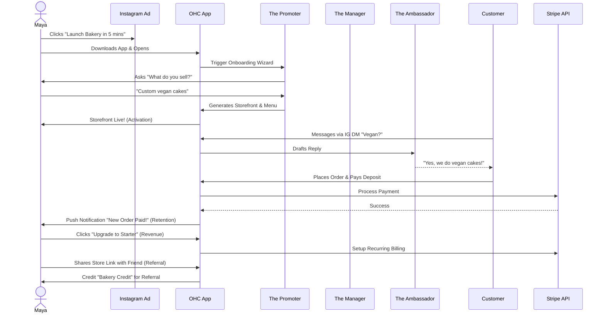
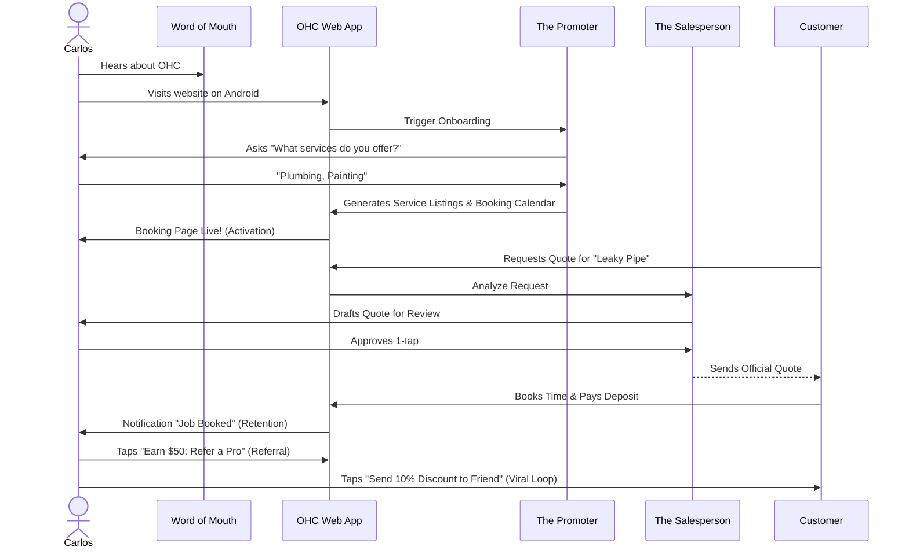

# Architecture Brief: End-to-End Business Journey

## Title
Architectural Mapping of the End-to-End Business Journey for OHC Personas

## Problem Statement
The OneHumanCorp (OHC) platform must serve a diverse set of real-world small business owners (e.g., Maya the Baker, Carlos the Handyman, Priya the Boutique Owner, Leo the Music Tutor, and Fatima the Food Cart Operator) who share a common goal: launching and growing their business entirely from a mobile device without technical expertise in under 10 minutes. Currently, the overarching business journeys—from initial acquisition to sustainable revenue generation and referral loops—lack a unified architectural vision. We need a cohesive architectural map of the end-to-end user journeys for these personas to ensure that the system naturally supports their progression through Acquisition, Onboarding, Activation, Retention, Revenue generation, and Referral, while identifying critical friction points where non-technical users might abandon the platform.

## Research Report

### Competitive Analysis
- **Shopify:** Powerful but overly complex for a quick start. Requires desktop setup, knowledge of themes (Liquid), and extensive plugin configuration. Fails the "under 10 minutes" test for true beginners.
- **Wix / Squarespace:** Good templates, but the "drag and drop" interface is too cumbersome on mobile. They are website builders first, not integrated business management platforms. "Vibe coding" (ADI) exists but still requires too many manual tweaks.
- **GoDaddy:** Offers quick site generation, but the backend tools for actually running the business (inventory, bookings, AI agents) are siloed and feel disjointed.
- **OHC Advantage:** "Born live." Zero setup. Mobile-first constraint ensures that every aspect of the business can be managed from a 375px screen. AI Agents handle the heavy lifting invisibly.

### Context and Personas
The business journey is evaluated against the following core personas:
1.  **Maya (Home Baker, 28)**: Needs a mobile-first storefront, photo catalog, Instagram DM integration, order management with deposit payments, and an AI agent to handle inquiries. Runs everything from iPhone.
2.  **Carlos (Handyman, 42)**: Requires clean service listings, a robust booking system with deposits, a unified customer inbox, and an AI quote generator. Android phone only.
3.  **Priya (Boutique Owner, 35)**: Wants omnichannel support (in-store/online), product variants (size/color), POS integration (tap-to-pay), inventory sync, and actionable daily analytics.
4.  **Leo (Music Tutor, 22)**: Needs subscription-based packages, schedule syncing, automated meeting links, AI follow-up for inactive students, and a strong public profile (link-in-bio).
5.  **Fatima (Food Cart Operator, 50)**: Prioritizes extreme simplicity, pre-order management, multi-language UI (Arabic + English), phone notifications on new orders, printable daily order lists, and fast low-data mobile performance.

### Journey Stages
-   **Acquisition**: Organic search, social media ads (Instagram/TikTok), or word-of-mouth. The call-to-action (CTA) promises a functional business setup in under 10 minutes.
-   **Onboarding**: A highly guided, AI-driven wizard flow. Crucial to minimize initial input; deferring advanced configurations (like custom domains). Minimum inputs: Business name, type, and basic contact info.
-   **Activation**: The "Aha!" moment. A live storefront, the first booking, or the first payment. Achieved within Day 1 (ideally under 10 minutes).
-   **Retention**: Kept engaged through actionable notifications (e.g., new order alerts) and AI-generated weekly health reports.
-   **Revenue**: Transitioning from a free tier to a paid plan. Triggered by hitting specific milestones (e.g., reaching product/action limits, needing custom domains). CTA presented as soft prompts from the Business Advisory AI.
-   **Referral**: Creating a viral loop through referral discounts and shareable success metrics.

### Identified Friction Points
1.  **Cognitive Overload during Onboarding**: Requesting too much setup information upfront.
2.  **Payment Gateway Integration**: Technical jargon during Stripe connection.
3.  **Inventory/Calendar Sync**: Difficulties mapping real-world availability to digital systems.
4.  **Language and Accessibility Barriers**: Interfaces assuming high technical literacy or english fluency.

## Design Doc

### Key Design Decisions
-   **Progressive Profiling**: Request absolute minimum required data initially.
-   **AI-First Setup**: "The Promoter" agent generates initial layout/copy based on minimal prompts.
-   **Mobile-First Constraint**: All flows designed at 375px breakpoint.
-   **Asynchronous Processing**: Background agents handle non-critical setup tasks.
-   **Visual Excellence Mandate**: Glassmorphism, Outfit + Inter typography, subtle motion.

### Phase 1: Business Journey Maps

#### 1. Maya (The Home Baker) Journey

#### 2. Carlos (The Handyman) Journey

### Phase 2: Data Model Architecture

The data model is built on a "Shared Database, Shared Schema" strategy in PostgreSQL, heavily secured via Row Level Security (RLS). Every request is scoped to a `tenant_id`. In local standalone mode, it gracefully degrades to SQLite.

#### Key Invariants
1. **Mandatory Tenant Scoping:** Every entity table MUST contain `tenant_id`. No cross-tenant joins are permitted without explicit admin bypass.
2. **RLS-First Security:** The session variable `app.current_tenant` must be set for PostgreSQL RLS policies to evaluate correctly.
3. **Agent Isolation:** Agents execute within the boundary of a single tenant and cannot "see" data outside of it.
4. **Semantic Memory:** `pgvector` is used for storing AI context (e.g., past successful promotional campaigns for Priya's boutique).

#### Entity-Relationship Diagram (Mermaid.js)

### Phase 3: AI Agent Department Architecture

OHC’s agents operate as invisible staff members, categorized into functional departments a small business owner inherently understands.

#### Departments
- **Operations ("The Manager"):** Inventory updates, booking confirmation, fulfillment status.
- **Marketing ("The Promoter"):** Vibe coding initial storefront, generating social media drafts, running SEO.
- **Sales ("The Salesperson"):** Quote generation, lead follow-up.
- **Customer Success ("The Ambassador"):** Inbox replies, welcome sequences, handling refunds.
- **Finance ("The Accountant"):** P&L reports, reconciling Stripe payments.
- **Legal ("The Protector"):** Boilerplate TOS generation, GDPR compliance checks.
- **Advisory ("The Advisor"):** High-level insights ("Tuesday mornings are slow, run a 10% flash sale").

#### Execution & Triggers
Departments run asynchronously via the **KAIROS Orchestrator** on the Teammate Mesh message bus.
- **Event-Driven:** "The Manager" marks an order complete -> Triggers "The Ambassador" to draft a thank-you note.
- **Cron/Schedule:** "The Advisor" runs weekly health checks.
- **On-Demand:** User requests via chat interface.

#### Memory Storage & Context
- Uses `autodream_memories` table with `pgvector` embeddings.
- Retains context per customer (e.g., "Maya's customer prefers vegan options").

#### Approval Workflows
To build trust, actions are categorized by risk:
- **Auto-Execute:** Internal updates (marking inventory low).
- **Draft-for-Review:** External facing actions (sending quotes, publishing Instagram posts). The user sees a Glassmorphism card in their mobile task feed and performs a "1-Tap Approval" to dispatch.

## Implementation Prompt
**To Implementer Agent:**
Implement the foundational data models, AI agent scaffolding, and mobile UI required for the unified Acquisition to Activation journey.
1. Implement the `tenant_id` based RLS schema per the ER diagram.
2. Scaffold the 7 Agent Departments in the backend with appropriate message bus listeners for state handoffs (using distributed locks).
3. Build the mobile-first (375px) onboarding UI wizard that dynamically selects Smart Blocks based on user input. Include cross-device state resume to explicitly repopulate all UI form input fields.
4. Ensure interactions feel premium (Glassmorphism, correct typography) and handle optimistic UI updates for "Draft-for-Review" AI approvals.
Include comprehensive E2E tests verifying the 10-minute "born live" storefront setup.

## Priority
P0

## Estimated Scope
Large
