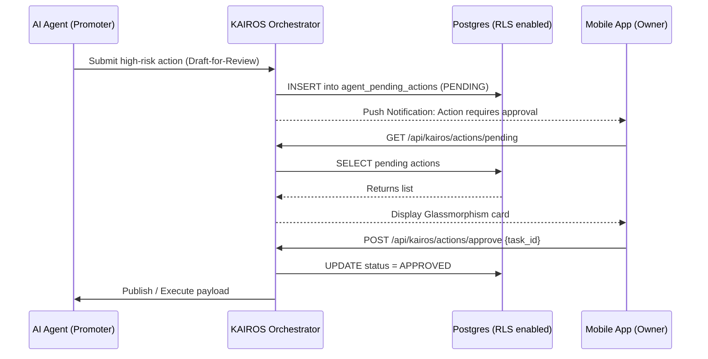

# Research Report: KAIROS AI Agent Approval Workflow Engine

## Priority: P1
## Estimated Scope: Medium

## 1. Overview
The OHC AI Agent Department Architecture introduces a **Draft-for-Review** workflow for high-risk actions generated by AI agents. This report proposes a scalable, secure, and mobile-first architectural design to track, display, and resolve pending high-risk actions (e.g., publishing social media posts, refunding payments, drafting customer emails) via a 1-tap approval system.

## 2. Findings & Context
- The system must capture high-risk actions before they execute and present them to the business owner.
- The business owner makes decisions primarily via the mobile app interface (375px mobile breakpoint).
- Row Level Security (RLS) must be enabled on all tenant-specific tables to enforce multi-tenancy.
- Existing infrastructure relies on PostgreSQL for shared cloud states and SQLite for local states, so database designs must accommodate both dialects where appropriate.
- Currently, `src/server/orchestration/kairos/mesh_api.go` contains stubbed routes for `handleGetPendingActions`, `handleApproveAction`, and `handleRejectAction`.

## 3. Database Architecture Proposal
A new table, `agent_pending_actions`, should be introduced to store draft actions requiring manual approval.

### Schema Requirements:
- `id`: Unique identifier (UUID in Postgres, TEXT in SQLite).
- `tenant_id`: The business owner's tenant identifier (enforced via RLS).
- `agent_id`: The agent issuing the action.
- `risk_level`: e.g., `HIGH`, `CRITICAL`.
- `payload`: The structured content of the action (JSONB in Postgres, TEXT in SQLite).
- `status`: One of `PENDING`, `APPROVED`, `REJECTED`, or `EXPIRED`.
- `created_at` / `updated_at`: Standard timestamps.

### RLS Policy:
For PostgreSQL, the table must be strictly isolated:
```sql
ALTER TABLE agent_pending_actions ENABLE ROW LEVEL SECURITY;
CREATE POLICY tenant_isolation_policy ON agent_pending_actions
USING (tenant_id = current_setting('app.current_tenant', true));
```
Additionally, `agent_pending_actions` must be appended to the `tenantTables` list in the overarching tenant isolation migration (e.g., `20260429010000_tenant_isolation_rls.go`).

## 4. API Endpoints
The backend implementation in `MeshAPI` (`src/server/orchestration/kairos/mesh_api.go`) will implement the actual logic by interacting with the database provider `db.Provider`.

1. **GET `/api/kairos/actions/pending`**
   - Fetches a list of `PENDING` actions scoped to the authenticated `tenant_id`.
2. **POST `/api/kairos/actions/approve`**
   - Receives `{ "task_id": "..." }`.
   - Transitions `status` to `APPROVED` for the specified action.
   - Enqueues the approved payload to the execution pipeline (via `TeammateMesh`).
3. **POST `/api/kairos/actions/reject`**
   - Receives `{ "task_id": "..." }`.
   - Transitions `status` to `REJECTED`.

## 5. Mobile UX Flow (375px First)
Given the core value of "Radical Simplicity," the UI must be highly accessible.
1. **Push Notification:** The owner receives a push notification ("Your Promoter Agent has drafted an Instagram post").
2. **Dashboard Feed:** In the OHC Flutter app, a Glassmorphism card appears at the top of the dashboard feed highlighting the pending action.
3. **Action Details:** Tapping the card opens a bottom-sheet modal detailing the action, with the payload formatted into plain language.
4. **1-Tap Resolution:** Two prominent, thumb-friendly buttons (≥ 44x44px) at the bottom:
   - A primary "Approve" button (OHC Premium Token primary color).
   - A secondary "Reject" button (Ghost button styling).

## 6. Architecture Diagram



## 7. Implementation Plan for Implementer Agent
1. Create DB migration `20260502000000_kairos_approval_engine.go`.
2. Update the `db.Provider` interface with methods: `CreatePendingAction`, `GetPendingActions`, `ApproveAction`, and `RejectAction`.
3. Provide the implementation in `SqliteProvider` and `PgProvider`.
4. Inject `db.Provider` into `MeshAPI` and replace stub logic in the handlers.
5. Create comprehensive tests in `mesh_api_test.go` and `provider_test.go`.
