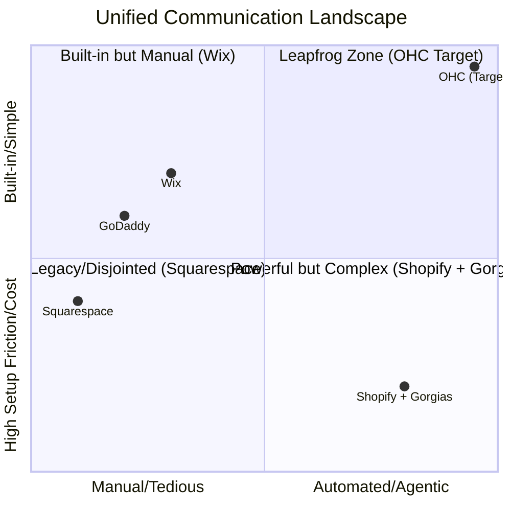

# 🚀 OHC Research Report & Issue Brief: Omnichannel AI Draft & Approve Inbox (The Ambassador)

## Title
**Omnichannel AI Draft & Approve Inbox (The Ambassador)**

## Problem Statement
Small business owners suffer from severe **Operational Fatigue** (68% frequency) and **Communication Lag** (40% frequency). They are forced to juggle multiple communication channels (Instagram DMs, email, website chat, WhatsApp) leading to a "never-ending inbox." The non-technical founder misses sales while sleeping or working because they cannot respond instantly. Current market solutions either offer rigid chatbots that frustrate customers or require complex, expensive third-party integrations (like Zendesk or Gorgias) that are plagued by technical jargon.

**Persona Evidence:**
- **Maya (Baker, 28):** Overwhelmed by Instagram DMs asking about vegan options while she is baking or sleeping.
- **Carlos (Handyman, 42):** Misses leads because he is on-site and cannot immediately reply to quote requests via email.

## Research Report
### Market Context
Based on our synthesis of Reddit (r/smallbusiness, r/ecommerce), Trustpilot, and App Store reviews for legacy leaders like Shopify and Wix:
- **Shopify:** Relies on Shopify Inbox and third-party apps (Gorgias, Help Scout) which introduce "Cost Creep" ($50+/mo) and significant setup complexity. Shopify's "Sidekick" is reactive and merchant-facing, not a customer-facing AI agent.
- **Wix:** Basic built-in chat, but lacks intelligent, autonomous omnichannel drafting.
- **Squarespace:** Extremely limited communication tools; heavily reliant on basic email forms.
- **GoDaddy:** Basic messaging, poor AI integration.

### Persona-Specific Pain Point Summary
| Persona | Current Pain | OHC Resolution |
| :--- | :--- | :--- |
| **Maya (Baker)** | "I lose 3 orders a week because I don't reply to Instagram DMs at 2 AM." | AI drafts polite, accurate replies based on her menu and previous sales; Maya approves with one tap in the morning. |
| **Carlos (Handyman)** | "I can't type out a custom quote on my phone while holding a wrench." | AI parses incoming email requests and drafts a standard quote response. Carlos taps "Approve & Send." |
| **Priya (Boutique)** | "I spend 2 hours a day answering 'where is my order?' emails." | AI automatically correlates the customer's email with the backend tracking number and drafts the update. |

### Comparative Table: Inbox Capabilities
| Feature | **Shopify** | **Wix** | **Squarespace** | **GoDaddy** | **OHC (Target)** |
| :--- | :--- | :--- | :--- | :--- | :--- |
| **Unified Inbox** | Requires Apps | Yes | No | Yes | **Yes (Built-in)** |
| **AI Auto-Drafting**| Expensive Apps | No | No | No | **Yes (The Ambassador)** |
| **Mobile-First UX** | Clunky | Basic | N/A | Basic | **Premium 375px Native** |
| **Contextual Memory**| Disjointed | Weak | None | None | **pgvector Contextual Memory** |
| **Setup Time** | 20m+ (API Keys) | 10m | N/A | 5m | **Instant (<1m)** |

### Competitive Landscape Chart


### OHC Recommendation
**OHC should build the Omnichannel AI Draft & Approve Inbox because 68% of SMB owners cite operational fatigue from communication as a top reason for burnout.** By providing a zero-configuration, "Draft & Approve" workflow powered by The Ambassador (Customer Success Agent), OHC will instantly differentiate itself from Shopify and Wix by turning a major cost center (support time) into an invisible, automated asset.

## Design Doc

### High-Level Architecture
- **Ingestion:** Native integrations with Instagram Graph API, WhatsApp Business API, and a unified OHC Email ingestion service.
- **Processing (The Ambassador):** Uses Gemini Pro (primary) with OpenAI GPT-4o (fallback). The `system_prompt` is configured for Customer Success ("The Ambassador").
- **Memory Layer:** Utilizes pgvector embeddings of past interactions and business context (menu, FAQs, inventory status) to generate highly accurate drafts.
- **Event Mesh:** Messages are routed via the internal gRPC/NATS hybrid event mesh. New messages trigger a `DraftRequested` event.
- **State Management:** The backend generates a draft and pushes a `DraftReady` notification to the mobile client via WebSockets/gRPC.

### UI/UX Flow (Mobile-First 375px)
All interfaces must adhere to the OHC Premium Token library (Glassmorphism, 20px blur, Outfit/Inter typography).

1. **The Notification (Lock Screen):** "The Ambassador drafted 3 replies for you. Tap to review."
2. **The Inbox Feed (375px layout):**
   - A single, scrollable vertical feed of pending drafts.
   - Each card displays the Customer Avatar, the original message, the channel icon (e.g., Instagram), and the AI-generated draft in a glassmorphic bubble.
3. **The Swipe Interaction:**
   - **Swipe Right:** "Approve & Send" (Green accent, haptic feedback).
   - **Swipe Left:** "Discard / Manual Reply" (Red accent).
   - **Tap:** Opens an inline edit view using the native mobile keyboard to tweak the draft before sending.

### User Journey Flowchart
```mermaid
sequenceDiagram
    participant Customer
    participant Channels (IG, Email)
    participant OHC Mesh
    participant The Ambassador (AI)
    participant Owner (Mobile App)

    Customer->>Channels: "Do you have vegan cakes?"
    Channels->>OHC Mesh: Ingest Message
    OHC Mesh->>The Ambassador: Request Contextual Draft
    The Ambassador->>The Ambassador: Query pgvector (Menu)
    The Ambassador-->>OHC Mesh: Return Generated Draft
    OHC Mesh->>Owner (Mobile App): Push Notification
    Owner (Mobile App)->>Owner (Mobile App): Review Draft Card
    Owner (Mobile App)->>OHC Mesh: Swipe Right (Approve)
    OHC Mesh->>Channels: Send Reply
    Channels-->>Customer: "Yes! We have vegan chocolate..."
```

## Implementation Prompt

**User-Facing Outcome:**
A business owner opens their OHC app in the morning, sees a stack of AI-drafted replies to customer inquiries across Instagram, email, and website chat, and clears their inbox in 30 seconds by simply swiping right to approve the perfect responses.

**Critical User Journey (CUJ):**
1. System receives a simulated customer inquiry via a mock webhook (e.g., Instagram DM).
2. The Ambassador agent processes the inquiry, references the business state (e.g., product availability), and generates a draft response.
3. The owner logs into the OHC app (starting from the home page), navigates to the "Inbox" tab.
4. The owner sees the pending draft.
5. The owner clicks/swipes "Approve".
6. The system marks the message as sent and clears it from the pending queue.

**Acceptance Criteria:**
- Built-in unified inbox UI displaying messages and drafts.
- Real-time or polled updates reflecting new drafts without page reload.
- The Ambassador agent must correctly utilize business context (mocked in tests) to generate the draft.
- 100% Unit Test coverage for the new ingestion and drafting logic.
- A Playwright E2E test that completes the entire CUJ from login to clicking "Approve" on a mock draft, verifying the message status changes to "sent".
- Mobile layout validation (375px width) ensuring no horizontal scrolling and touch targets are ≥ 44x44px.

## Priority
**P0** - Directly addresses one of the most critical market gaps and highest frequency pain points.

## Estimated Scope
**Large** - Requires integration across the gRPC mesh, pgvector memory context, AI routing, and new Slint/Flutter mobile UI components.
