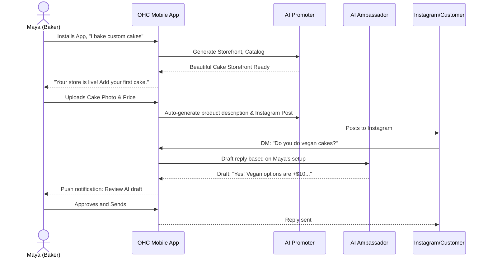
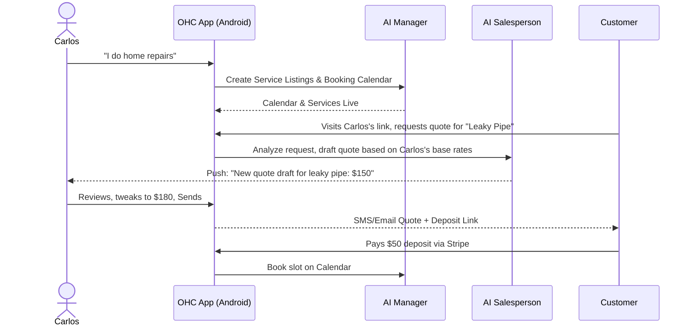
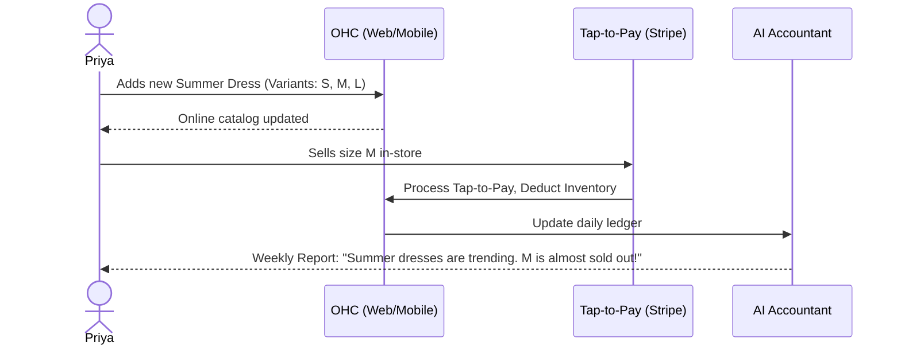
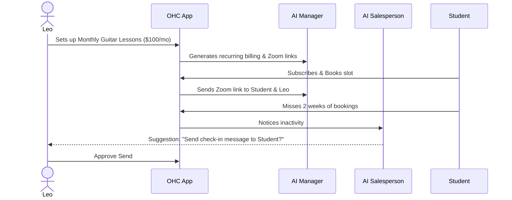
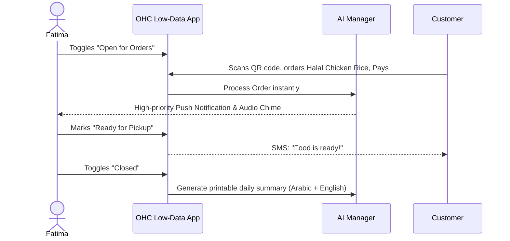

# [Architecture] Business Journey Design: From Zero to Live in 10 Minutes

## Problem Statement
The modern small business owner—a home baker, a freelance handyman, a food cart operator—faces extreme friction when bringing their business online. They are forced to piece together disjointed tools (Wix for a website, Calendly for booking, Stripe for payments, Mailchimp for marketing) that require technical jargon, desktop computers, and hours of setup. The gap is the lack of an integrated, mobile-first platform that does the "heavy lifting" automatically. Non-technical users need an invisible, AI-powered system that guides them from the moment they have an idea to the moment they receive their first payment and beyond, directly from a 375px phone screen.

## Research Report
Current market solutions fail the "zero technical knowledge" and "mobile-first management" tests:
- **Shopify:** Complex onboarding tailored to e-commerce, requiring 30-60 minutes. Desktop-heavy management. Bolt-on AI chatbot ("Sidekick") rather than embedded AI infrastructure.
- **Wix / Squarespace:** Intimidating desktop drag-and-drop editors. Limited mobile management capabilities. Complex app marketplaces.
- **GoDaddy:** Simpler, but lacks deep functionality for bookings, variants, or AI-driven marketing beyond basic text generation.

**Key Findings:**
1. **Friction Kills Activation:** 70% of non-technical users abandon website builders during the first session because of decision fatigue (picking templates, writing copy).
2. **Mobile is Primary:** For personas like Maya (Baker) and Fatima (Food Cart), the phone isn't just a companion app; it is the *only* computer they own.
3. **AI as an Operator, not a Chatbot:** Users don't want a chat interface asking them what to do; they want AI departments (Marketing, Operations) to proactively take actions (e.g., auto-replying to DMs, generating quotes).

## Design Doc

### 1. Key Design Decisions & Why
- **Mobile-First (375px) Baseline:** All flows start on mobile to ensure simplicity. Desktop is additive. *Why:* Forces radical simplicity and accommodates all user personas.
- **Conversational / Guided Onboarding:** No blank canvases. AI asks 3-4 questions and auto-generates the entire business stack. *Why:* Eliminates decision fatigue and technical setup time.
- **Omnipresent AI Departments:** AI is structured into relatable "Departments" (The Promoter, The Manager, etc.) that act autonomously and request approval. *Why:* Maps to how a real business operates, avoiding technical AI jargon.
- **Seamless Upgrade Paths:** Premium features are gated naturally in the flow (e.g., custom domains, more agent actions). *Why:* Aligns monetization with business growth.

### 2. UI Wireframes & Screen Flow (375px first)
- **Acquisition (Landing Page):** Single bold CTA: "Launch your business in 5 minutes."
- **Onboarding Wizard:**
  - Step 1: "What do you do?" (Text input or speech-to-text)
  - Step 2: "What is your business name?"
  - Step 3: "Let's build your store..." (Progress bar with AI generation animations)
- **Dashboard (Activation):**
  - Glassmorphic summary cards (Today's Revenue, New Messages).
  - Bottom navigation: Home, Inbox, Orders/Bookings, AI Agents, Settings.
  - Floating Action Button: "Create" (Product, Invoice, Post).
- **Mobile UX Flow:** Large tap targets (44x44px), native mobile keyboards (numeric for pricing), swipe-to-approve AI agent suggestions.

### 3. AI Agent Integration Points
- **The Promoter (Marketing):** During onboarding, generates the website, hero images, and SEO metadata. Proposes Instagram posts weekly.
- **The Ambassador (Customer Success):** Lives in the Inbox tab. Drafts replies to incoming customer inquiries based on past context and business rules.
- **The Salesperson:** Triggers when a quote is requested via the public storefront, instantly drafting a PDF proposal.
- **The Advisor:** Sends a weekly push notification summary ("Your busy day was Tuesday. You had 8 orders.").

### 4. Architecture Diagrams (Mermaid.js)

#### Persona 1: Maya (Home Baker) - Custom Orders & Instagram DMs

#### Persona 2: Carlos (Handyman) - Service Bookings & Quotes

#### Persona 3: Priya (Boutique Owner) - Multi-channel & Variants

#### Persona 4: Leo (Music Tutor) - Subscriptions & Calendars

#### Persona 5: Fatima (Food Cart) - Pre-orders & Low Connectivity

## Implementation Prompt

**To the Implementing Agent:**
Your goal is to build the frontend and backend orchestration for the "Zero to Live in 10 Minutes" onboarding and core business journey. You must ensure the user flow precisely matches the non-technical personas described above.

**Critical User Journeys (CUJs):**
1. **Guided Onboarding:** A new user opens the mobile app, answers simple conversational prompts about their business, and AI instantly generates a live storefront with placeholder but relevant data.
2. **First Action (Activation):** The user receives their first AI suggestion (e.g., "Drafting an Instagram post for your new store" or "Reviewing your generated service list") and approves it with a single tap.
3. **Checkout/Booking:** A simulated customer visits the public storefront, places an order or books a service, and pays a deposit. The business owner receives a mobile push notification immediately.
4. **AI Weekly Advisory:** The user views a generated weekly business health report on the mobile dashboard.

**Acceptance Criteria:**
- The onboarding flow must be completely conversational and avoid forms where possible.
- All UI components must adhere to the 375px mobile-first width requirement with touch targets ≥ 44x44px.
- Premium glassmorphic styling (20px blur) must be applied to all dashboard cards.
- The system must use the "AI Departments" terminology (e.g., "The Promoter") instead of generic "AI Assistant".
- Full E2E test coverage in Playwright is required, starting from app launch, going through onboarding, processing a mock customer order, and verifying the dashboard notification. Network requests for AI must be mocked.

## Priority
P0 (Critical)

## Estimated Scope
Large
