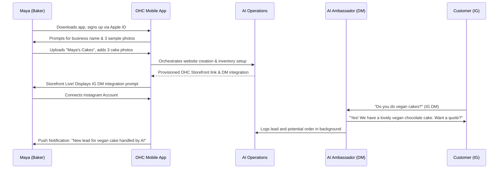
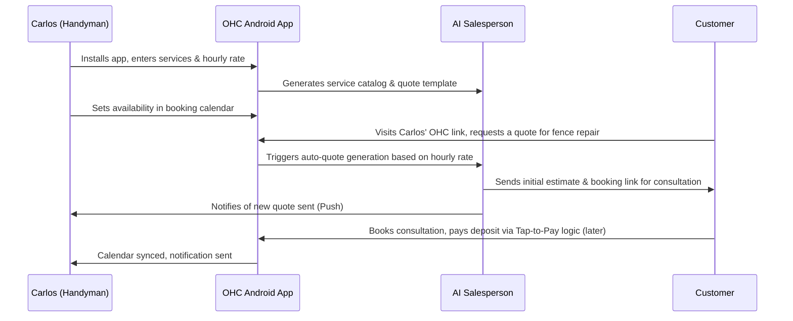
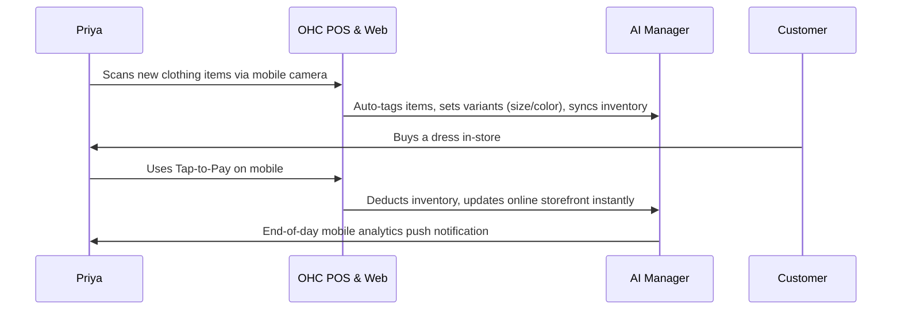
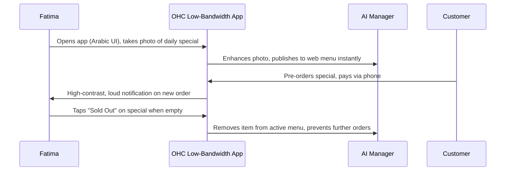
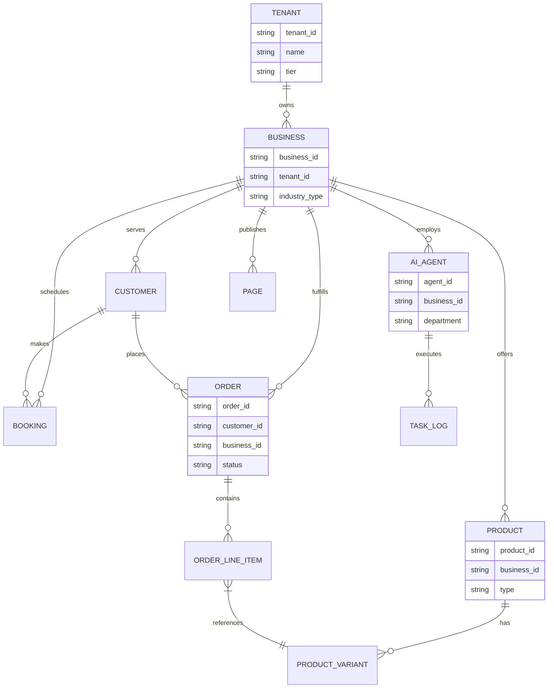

[Product Architecture] OHC Core Architecture & Business Journey Deep-Dive

**Problem Statement:**
The current system architecture must be formally documented to guarantee that every technical implementation aligns perfectly with the goal of enabling non-technical small business owners to launch and run their businesses entirely from mobile in under 10 minutes. There is a gap in explicitly linking the multi-tenant data isolation logic and the AI KAIROS orchestration workflows directly back to specific customer personas.

**Research Report:**
- **Codebase Constraints:** Multi-tenancy must support both Postgres shared-database modes (via `app.current_tenant` RLS isolation) and Standalone isolated SQLite deployments. Mobile UX parity is prioritized, operating against the API headless mode.
- **Competitive Gap vs Shopify/Wix:** Competitors provide static templates and require manual app integration. OHC provides an active swarm of agents that handle tasks proactively without manual app configuration.
- **Data Access Invariants:** The `business_id` and `tenant_id` scopes must strictly control AI vector search and task orchestration to prevent leakage across businesses.

**Implementation Prompt:**
"Implementer Agent: Using this architectural blueprint, implement the required backend data models and KAIROS orchestration endpoints. Ensure that every entity strictly links to a `tenant_id`. You must design the specific SQL DDL, Protobuf, and Rust function signatures based on the relationships defined in the ER diagram below. Ensure 100% test coverage for tenant isolation constraints."

**Priority:** P0
**Estimated Scope:** Large

---

## Design Doc: Phase 1: Business Journey Mapping

### Personas

#### 1. Maya (Baker, 28)
- **Profile:** Sells custom cakes via Instagram DMs. Runs everything from an iPhone.
- **Needs:** Beautiful storefront, deposit-based custom orders, AI agent for Instagram DM handling.

#### 2. Carlos (Handyman, 42)
- **Profile:** Word-of-mouth business, Android phone only.
- **Needs:** Service listings, booking calendar, quote generator, offline capabilities.

#### 3. Priya (Boutique Owner, 35)
- **Profile:** In-store and online sales, needs inventory sync.
- **Needs:** Variants, tap-to-pay, email newsletter, daily analytics.

#### 4. Fatima (Food Cart, 50)
- **Profile:** Halal food pre-orders, limited English, low-end Android.
- **Needs:** Photo menu, sold-out toggles, bilingual UI, printable daily order list.

---

## Phase 2: Architecture (Entities & Data Model)

The OHC platform utilizes a multi-tenant hybrid data architecture, capable of operating in shared cloud environments or isolated standalone SQLite deployments. Strict Row-Level Security (RLS) guarantees tenant isolation in the shared PostgreSQL instances.

### Entity-Relationship Diagram

### Access Patterns & Invariants
- **Multi-Tenancy:** A business owner can only read/write data associated with their `tenant_id`. In PostgreSQL, this is enforced transparently via `SET app.current_tenant` in connection lifecycle hooks before acquiring the connection from the pool.
- **Offline-First:** Mobile apps utilize local SQLite (encrypted via SQLCipher `OHC_SQLITE_KEY` in standalone mode). Background sync resolves conflict via event-sourcing and last-write-wins depending on the entity type.
- **AI Agent Context:** Agents query customer history using tenant-scoped vector search and relational joins, constrained strictly to the `business_id` to prevent cross-business data leakage.

### Migration Strategy
- **Evolution:** Migrations are applied automatically on application startup.
- **Zero-Downtime:** Adding columns or non-blocking indexes only. Destructive changes (like dropping columns) require multi-phase rollouts (add new, backfill, switch reads/writes, drop old).
- **Standalone:** SQLite schema migrations mirror PostgreSQL migrations but utilize conditional SQL abstractions.

---

## Phase 3: AI Integration (AI Agent Departments)

The KAIROS engine handles all complexity through a distributed state machine routing tasks to friendly, business-oriented "Departments".

### Departments

1. **Operations ("The Manager")**
   - **Trigger:** Event-driven (e.g., `OrderPlaced`, `InventoryLow`).
   - **Action:** Coordinates fulfillment, updates inventory levels, requests refund approvals from the owner.
2. **Marketing & Advertising ("The Promoter")**
   - **Trigger:** Scheduled (e.g., weekly social media post) or On-Demand (generating a new QR code).
   - **Action:** Designs storefront updates, drafts Instagram captions, handles SEO automatically.
3. **Sales & Acquisition ("The Salesperson")**
   - **Trigger:** Customer inquiry (DM, contact form) or abandoned cart.
   - **Action:** Generates customized quotes, follows up on unbooked consultations.
4. **Customer Success ("The Ambassador")**
   - **Trigger:** Message received, order shipped.
   - **Action:** Replies to common inquiries ("Are you open today?"), sends tracking info, politely asks for reviews post-fulfillment.
5. **Finance & Payments ("The Accountant")**
   - **Trigger:** Scheduled (End of day/month), Event (Payment received).
   - **Action:** Processes payouts, flags failed subscriptions, generates simplified P&L statements.

### Coordination & Budgeting
- **Transitions:** Handled via KAIROS distributed state machine (`PENDING -> IN_PROGRESS -> COMPLETED`).
- **Approval:** High-risk actions (e.g., refunds, publishing new pages) default to "Draft for Review", requiring the owner to tap an "Approve" push notification. Low-risk actions (e.g., answering "What are your hours?") auto-execute.
- **Limits:** Actions are throttled by the tenant's tier. E.g., Free Tier limits AI actions to 100/mo. Once exhausted, actions pause and alert the owner to upgrade.

---

## Phase 4: Mobile UX Flows & Visual Excellence

Every interaction is designed under the **Visual Excellence Mandate**: Premium feel (Glassmorphism, Outfit + Inter typography) and strict adherence to the **"grandmother test"**.

### Core UX Flows (375px Base)

1. **The 10-Minute Launch Flow:**
   - **Screen 1 (Splash):** Soft gradient, "What's your business called?"
   - **Screen 2 (Category):** Large touch targets for Business Type (Physical, Service, Food, etc.).
   - **Screen 3 (Magic Setup):** "Our AI is building your store..." with a subtle pulsing animation.
   - **Screen 4 (Success):** Confetti burst. "You're live. Add your first product."

2. **Daily Operations Dashboard:**
   - **Hero Section:** Large, legible current daily revenue.
   - **Action Cards:** Swipable cards for immediate actions (e.g., "Review Quote for John", "Approve Instagram Post").
   - **Bottom Nav:** Home, Inbox, Store, Insights.

3. **Offline Mode:**
   - Visual indicator: A subtle frosted glass banner at the top reading "Working offline. Syncing when connected." All core actions (taking orders, adding inventory) remain instant.

### Design Tokens
- **Typography:** Display (Outfit, bold, distinct), Body (Inter, highly legible).
- **Motion:** 200ms ease-in-out for transitions. No harsh snapping.
- **Accessibility:** High contrast ratios, native large text support, bilingual RTL/LTR layout capabilities (e.g., for Arabic in Fatima's flow).

---
*End of Design Document.*
