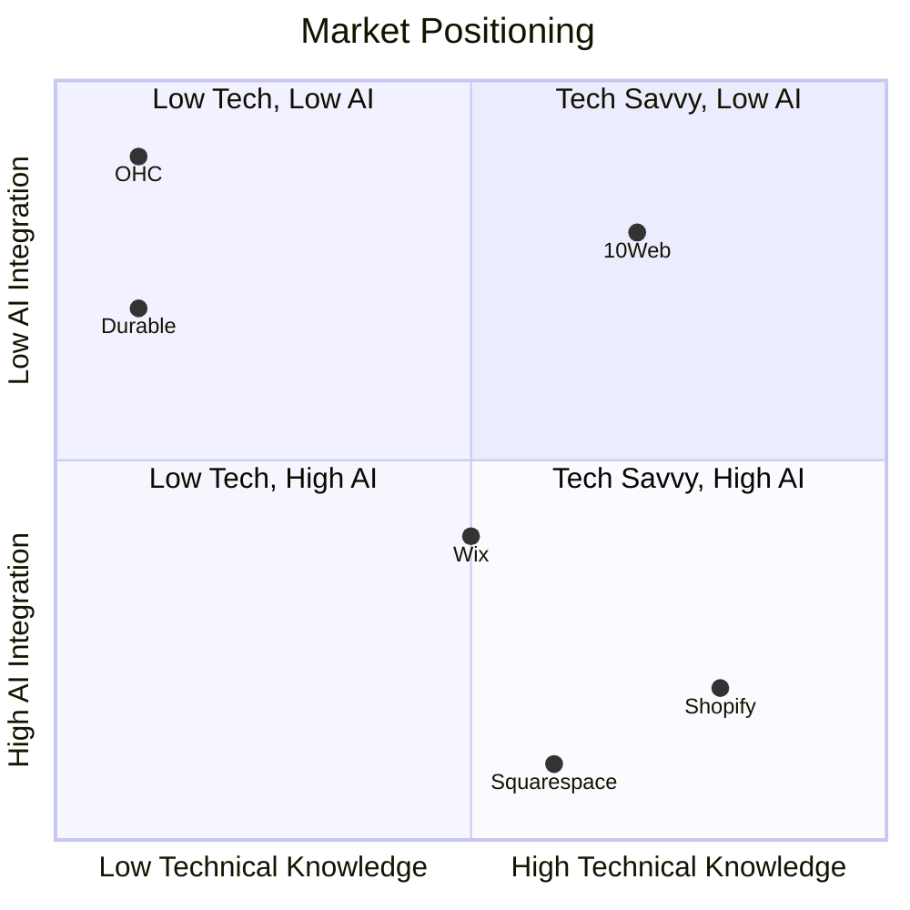
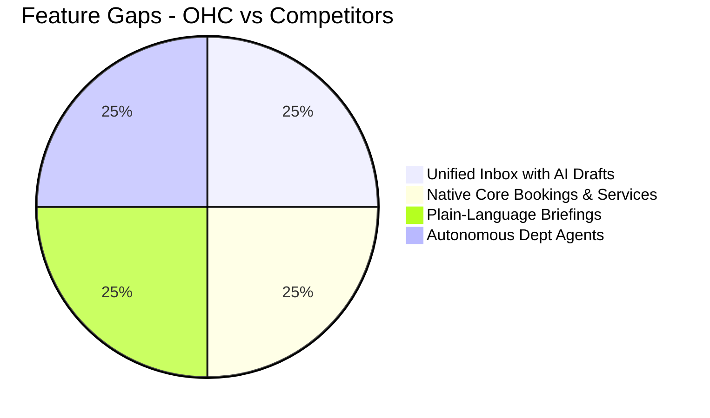

# Research Report: SMB Market, Competitors, and AI Differentiation

This research report documents the deep competitor audit, SMB user pain point research, AI differentiation strategy, market sizing, and the feature gap matrix.

## Track 1: Deep Competitor Audit

### Shopify
- **Onboarding Flow**: Geared towards users with some technical or e-commerce background. Often requires 30-60 minutes to set up correctly.
- **Time to Live Store**: 30-60 min.
- **Mobile App Quality**: Strong for managing existing stores, poor for initial setup.
- **AI Features**: Shopify Magic (AI generated text) and Shopify Sidekick (chat-based assistant). Not truly autonomous agents.
- **Pricing / Free Tier**: No useful free tier (only trials). Paid plans start around $39/month.
- **Biggest User Complaints**: Too complex for beginners, expensive with paid apps needed for basic features (Trustpilot, Reddit).

### Wix
- **Onboarding Flow**: Easier setup with templates and Wix ADI (AI Design Intelligence) which asks questions to generate a site.
- **Time to Live Store**: 20-40 min.
- **Mobile App Quality**: Limited for editing the site, better for basic management.
- **AI Features**: Wix ADI (one-time site generation), Wix AI text/image generators. Not agentic post-launch.
- **Pricing / Free Tier**: Has a free tier but with Wix ads and no custom domain.
- **Biggest User Complaints**: Performance (slow loading sites), difficult to change templates later, cluttered editor.

### Squarespace
- **Onboarding Flow**: Template-driven, very visual. Good for creatives and restaurants.
- **Time to Live Store**: 30-60 min.
- **Mobile App Quality**: Limited mobile management capabilities.
- **AI Features**: AI text generation, limited overall AI integration.
- **Pricing / Free Tier**: No meaningful free tier (trial only).
- **Biggest User Complaints**: Rigid templates, difficult to customize beyond standard options, missing deep e-commerce features compared to Shopify.

### Zyro / Hostinger Builder
- **Onboarding Flow**: Very simple, cheap, and fast.
- **Time to Live Store**: 10-20 min.
- **Mobile App Quality**: Basic.
- **AI Features**: AI text and logo generation, basic AI builder.
- **Pricing / Free Tier**: Very cheap, no free tier.
- **Biggest User Complaints**: Limited functionality, not scalable.

### Rising AI-Native Competitors

#### Durable
- **AI Focus**: Generates a full business website in 30 seconds. Offers a unified platform with CRM, invoicing, and AI assistance.
- **Differentiation**: Positions itself as an "AI business builder" rather than just a website builder.
- **Threat Level to OHC**: High. They are executing a similar vision of an all-in-one platform for non-technical users powered by AI.

#### 10Web
- **AI Focus**: AI website builder on top of WordPress. Aimed at agencies and users who want WordPress power with AI speed.
- **Differentiation**: "Vibe Coding" frontend generation.
- **Threat Level to OHC**: Medium. Still relies on WordPress complexity underneath.

#### Hocoos
- **AI Focus**: AI website builder asking 8 questions to generate a site. Includes booking, stores, and blogs.
- **Differentiation**: Very simple onboarding.
- **Threat Level to OHC**: Medium. Similar target audience but less comprehensive AI agent ecosystem.

## Competitive Landscape

## Track 2: SMB User Pain Point Research (Top 10)

1. **Overwhelming Initial Setup**: "I just want to sell my cakes, but I have to configure shipping zones, tax rates, and connect 3 apps." (Source: Shopify Reddit/Reviews)
2. **Managing Customer Inquiries Across Channels**: "I lose track of who asked what on Instagram DMs, WhatsApp, and email." (Source: SMB Forums)
3. **Manual Quoting and Booking**: "I spend hours every week just going back and forth on email trying to schedule a time and send a quote." (Source: Trustpilot reviews for Wix/Squarespace)
4. **No Unified Mobile Management**: "I can't build or properly manage my Shopify store from my phone while I'm on the go." (Source: App Store reviews)
5. **Inventory Sync Issues**: "I accidentally sold the same dress in-store and online." (Source: Retailer forums)
6. **Marketing Paralysis**: "I know I need to post on social media and do SEO, but I have no idea how or the time to do it." (Source: Marketing subreddits)
7. **Expensive 'App Tax'**: "Shopify is $39/mo, but to get subscriptions, reviews, and a booking calendar, I need 4 apps costing $100/mo." (Source: Shopify community)
8. **Following Up with Leads**: "I forget to follow up with people who asked for a quote but didn't buy." (Source: Sales discussions)
9. **Lack of Actionable Insights**: "I have analytics, but I don't know what to *do* with the data. 'Traffic is down 5%' doesn't help me." (Source: E-commerce forums)
10. **Complicated Payment Setup**: "Getting approved for a merchant account or setting up multiple payment gateways is confusing." (Source: Small business groups)

### Persona-Specific Pain Point Summaries

*   **Maya (The Home Baker):**
    *   **Pain Points:** #1 (Overwhelming Setup), #2 (Managing DMs), #4 (No Unified Mobile Management).
    *   **Summary:** Maya runs her business entirely from her phone via Instagram DMs. Existing platforms are too complex to set up on a phone and don't natively integrate with her DM workflow to answer common questions like "do you do vegan cakes?" while she sleeps.
*   **Carlos (The Freelance Handyman):**
    *   **Pain Points:** #3 (Manual Quoting and Booking), #8 (Following Up with Leads).
    *   **Summary:** Carlos loses money because quoting is a manual, back-and-forth process. When he is busy on a job, he misses calls and forgets to follow up with interested prospects.
*   **Priya (The Boutique Owner):**
    *   **Pain Points:** #5 (Inventory Sync Issues), #6 (Marketing Paralysis), #7 (Expensive App Tax).
    *   **Summary:** Priya struggles to keep her physical and online inventory synced without paying for expensive third-party apps. She wants to do email marketing but finds the process overwhelming.
*   **Leo (The Music Tutor):**
    *   **Pain Points:** #3 (Manual Quoting and Booking), #8 (Following Up with Leads).
    *   **Summary:** Leo's scheduling is chaotic. He needs a system that handles booking and subscription payments automatically, and an AI to follow up with students who haven't booked a lesson in a while.
*   **Fatima (The Food Cart Operator):**
    *   **Pain Points:** #1 (Overwhelming Initial Setup), #4 (No Unified Mobile Management).
    *   **Summary:** Fatima needs an extremely simple, mobile-first interface in her native language to manage pre-orders for pickup. Complex platforms are inaccessible to her due to language barriers and overly complicated interfaces.

## Track 3: AI Differentiation Research

**OHC AI Differentiation Manifesto - The 5 Core Automations**

1. **Invisible Storefront Generation (Operations & Marketing)**: Instead of a chat bot or a one-time questionnaire (like Wix or Hocoos), the Operations agent continuously updates the storefront based on the user's natural language inputs (e.g., "Add my new vegan chocolate cake for $40").
2. **Autonomous Customer Inquiry Drafting (Customer Success)**: The Customer Success agent automatically drafts replies to Instagram DMs, emails, and website chats based on the business's knowledge base (policies, inventory, past interactions), ready for the owner's 1-tap approval. This solves Pain Point #2.
3. **Proactive Marketing Content Creation (Marketing & Advertising)**: The Promoter agent automatically generates social media posts (text + image suggestions) based on new product additions or upcoming holidays, scheduling them autonomously. This solves Pain Point #6.
4. **Intelligent Follow-ups (Sales & Acquisition)**: The Salesperson agent tracks sent quotes and unbooked inquiries, automatically sending gentle, personalized follow-ups after a set period without manual intervention. This solves Pain Point #8.
5. **Plain-Language Daily/Weekly Briefings (Business Advisory)**: The Advisor agent synthesizes complex analytics into a simple daily SMS or push notification: "You had 3 sales yesterday. The new cake is popular. You should post about it on Instagram today." This solves Pain Point #9.

## Track 4: Market Sizing & Strategic Direction

- **TAM**: ~33 million small businesses in the US alone (SBA). Globally, hundreds of millions. A significant portion (often cited ~30-40%) lack a proper website or use only social media (like Instagram).
- **Beachhead Market**: The "Side Hustler" or "Micro-business" (Personas: Maya the Baker, Leo the Tutor). High density, very underserved by complex tools like Shopify.
- **Geographic Expansion**: Start English-US/UK. Expand to Spanish/LATAM (huge micro-entrepreneurship culture, mobile-first).
- **Vertical vs Horizontal**: Launch horizontally with strong foundational primitives (products, services/bookings, digital goods). Later, verticalize with specific agent knowledge bases.

## Track 5: Feature Gap Matrix

| Feature | Shopify | Wix | Durable | OHC (Vision) | OHC Advantage |
| :--- | :--- | :--- | :--- | :--- | :--- |
| **Setup Time** | 30-60 min | 20-40 min | < 1 min | **< 10 min** | True mobile-first, zero-config onboarding. |
| **Mobile-First Mgt** | Partial | Partial | Yes | **Yes (100%)** | Full platform functionality on a 375px screen. |
| **AI Agents** | Sidekick (Chat) | One-time Builder | Basic Assistant | **Autonomous Depts** | AI acts as employees, not just a chatbot. |
| **Unified Inbox** | Requires Apps | Basic | CRM included | **Built-in & AI Assisted** | Centralized DMs/Emails with auto-drafted replies. |
| **Bookings & Services** | Requires Apps | Separate App | Included | **Native Core** | Booking is a first-class citizen alongside physical products. |
| **Actionable Insights** | Dashboards | Dashboards | Basic | **Plain-Language Briefs** | AI translates data into simple "do this next" advice. |

