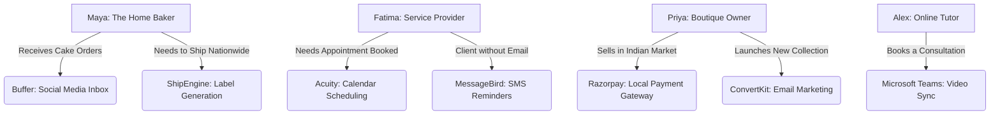

# 🔎 Tool Integration Research Q2: Expanding Small Business Capabilities

This report outlines high-priority integrations across 7 critical domains designed to solve real-world problems for non-technical small business owners (e.g., Maya the Home Baker, Fatima the Local Service Provider).

## Executive Summary

To fulfill the Radical Simplicity ethos of One Human Corp (OHC), we are expanding our ecosystem beyond basic tools to deeply integrate workflows that small business owners currently patch together manually. This research prioritizes tools that operate seamlessly in both Cloud and Standalone modes without requiring technical setup from the user.

---

## 🌟 Persona Mapping & Architecture Flow

The integrations are designed around core personas:

---

## 📊 Competitive Integration Matrices

### 1. Unified Communications & Marketing

| Category | Recommended Tool | Core Persona | Problem Solved | Starting Price | Cloud/Local | Priority |
|---|---|---|---|---|---|---|
| **Social Media** | **Buffer** | Maya | Consolidates Instagram, Facebook, TikTok DMs into one inbox. | ~$6/channel | API/Proxy | P1 |
| **Email Mktg.** | **ConvertKit** | Priya | Easy, beautiful newsletters for boutique owners/creators. | $9/mo | API Keys | P1 |
| **SMS/Notifs.** | **MessageBird** | Fatima | Global SMS reach for customers who do not use email. | Pay-per-SMS | API Keys | P2 |

### 2. Operations, Booking & Fulfillment

| Category | Recommended Tool | Core Persona | Problem Solved | Starting Price | Cloud/Local | Priority |
|---|---|---|---|---|---|---|
| **Calendar** | **Acuity** | Fatima | Powerful appointment types and automated scheduling. | $16/mo | OAuth/API | P2 |
| **Payments** | **Razorpay** | Priya (India) | Accept UPI and local Indian payment methods seamlessly. | ~2% / tx | OAuth/API | P2 |
| **Shipping** | **ShipEngine** | Maya | Auto-generates shipping labels from multiple carriers at once. | Pay-per-label | API Keys | P1 |
| **Video** | **MS Teams** | Alex | Auto-generates B2B meeting links on booking without hassle. | Included (365) | OAuth | P3 |

---

## 🔬 Detailed Research Summaries

### 1. Social Media: Buffer
- **Why**: Maya spends 2 hours a day jumping between Instagram, Facebook, and TikTok apps just to reply to order inquiries. Buffer provides a clean API to funnel these into OHC's unified inbox.
- **Design Concept**: Users authorize Buffer via OAuth. OHC pulls messages via API, and the Customer Success Agent drafts context-aware replies for Maya to approve with one tap.

### 2. Calendar & Scheduling: Acuity
- **Why**: Service providers need complex appointment types (e.g., 30-min consultation vs. 2-hour deep clean) that simple tools don't handle well.
- **Design Concept**: Users connect Acuity. The OHC agent can view availability in real-time and provide booking links directly to customers in chat.

### 3. Email Marketing: ConvertKit (Kit)
- **Why**: Boutique owners need to announce new collections visually without learning complex enterprise marketing automation.
- **Design Concept**: OHC customer lists automatically sync to ConvertKit tags. The Marketing Agent can draft newsletters inside OHC and push them to ConvertKit as drafts.

### 4. Payment Processing: Razorpay
- **Why**: Stripe does not adequately cover local payment methods (like UPI) in India, alienating a massive market of small sellers.
- **Design Concept**: If a user selects India during onboarding, Razorpay becomes the default checkout engine, handling webhooks to automatically mark OHC orders as "Paid".

### 5. Shipping & Logistics: ShipEngine
- **Why**: Manually copying addresses to the USPS or UPS website leads to errors and wastes time.
- **Design Concept**: When Maya clicks "Ship Order", OHC pings the ShipEngine API to instantly return a printable PDF label and tracking number, which is then texted to the customer.

### 6. SMS & Notifications: MessageBird
- **Why**: Many local businesses serve clients who prefer or exclusively use SMS rather than email (e.g., Fatima's elderly clients). MessageBird offers superior international routing.
- **Design Concept**: Operations Agent uses the MessageBird API to send automated "Your order is ready" or "Appointment tomorrow at 2 PM" texts.

### 7. Video Conferencing: Microsoft Teams
- **Why**: B2B consultants often already pay for Office 365 and need secure video links generated automatically when a client books a meeting.
- **Design Concept**: Connected via Graph API, when a meeting is created in OHC, a Teams link is attached automatically and synced to the client's invite.
