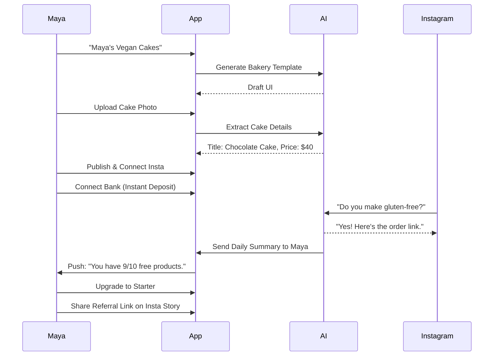
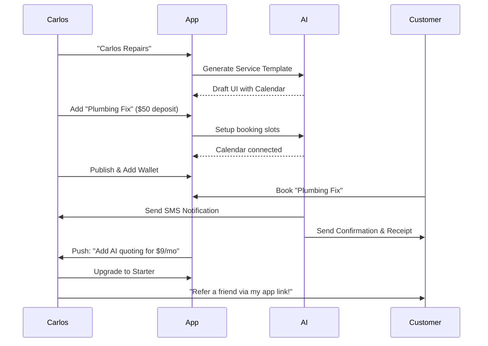
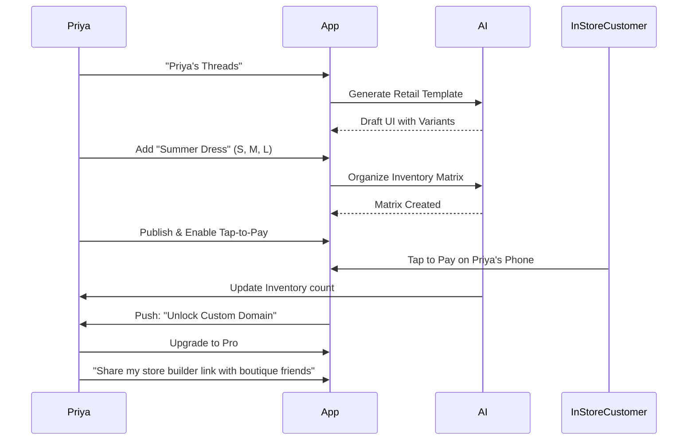
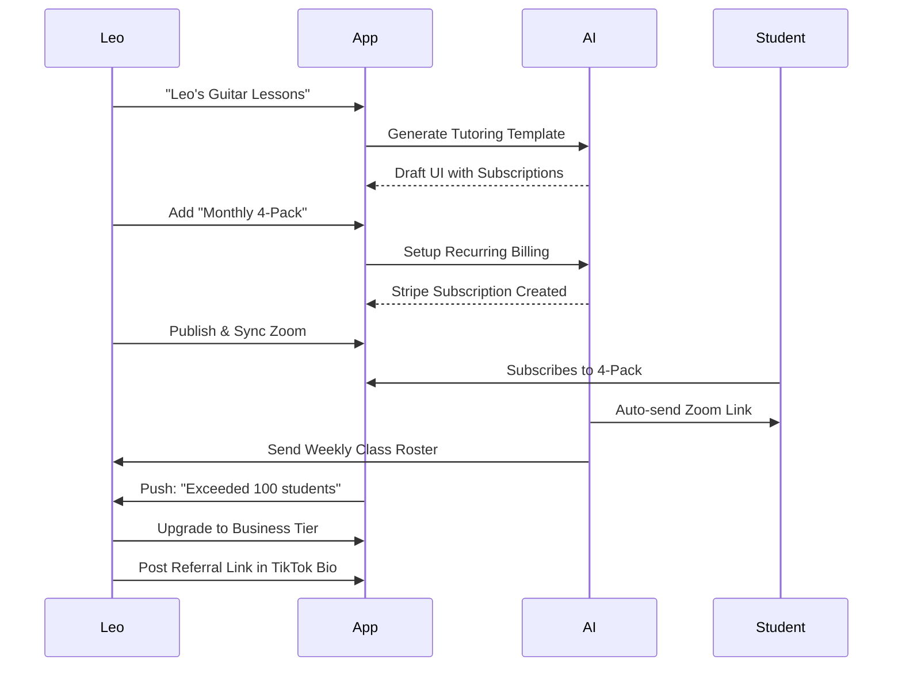
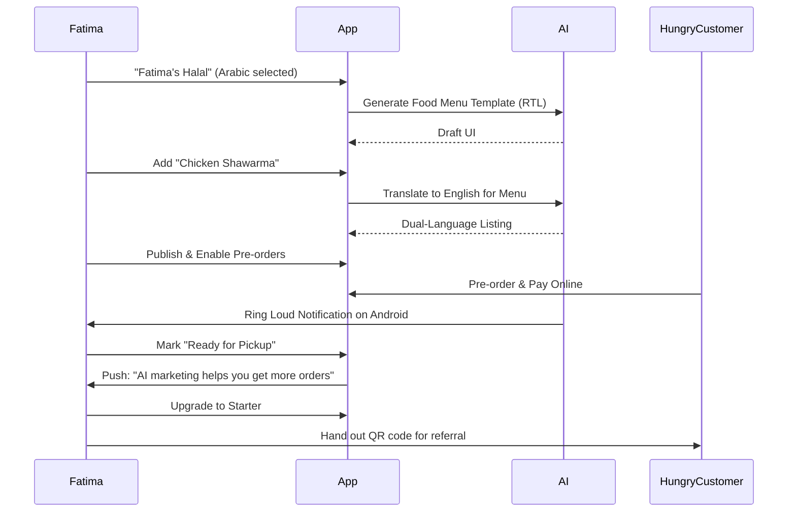

# [architecture] End-to-End Business Journey Architecture

## Title
OHC End-to-End Business Journey Architecture

## Problem Statement
Small business owners—bakers, handymen, boutique owners, tutors, and food cart operators—need a frictionless path from zero to a live business in under 10 minutes. The complexity of websites, domain setup, payments, and marketing is overwhelming. The business journey needs to be simple, mobile-first, and natively infused with AI to handle the heavy lifting invisibly.

## Research Report
The current market offerings (Shopify, Wix, Squarespace) have too high a learning curve for micro-businesses. Most users abandon setup due to excessive configuration. Our target personas need targeted experiences:
- **Maya (Baker)**: Needs deposit-based custom orders and an AI agent to handle Instagram DMs.
- **Carlos (Handyman)**: Needs service listings, booking calendar, deposits, and quotes.
- **Priya (Boutique Owner)**: Needs physical/online inventory sync, product variants, and in-person tap-to-pay.
- **Leo (Music Tutor)**: Needs subscription packages, booking calendar, and auto-generated meeting links.
- **Fatima (Food Cart)**: Needs multilingual pre-order menu with simple toggles on a low-end Android device.

## Design Doc

### Key Design Decisions
- **Mobile-First Everything**: The primary device for setup and management is mobile. Complex flows must be chunked or simplified.
- **AI-Led Onboarding**: Instead of forms, use an conversational UI or minimal inputs to generate the initial site.
- **Frictionless Activation**: The goal is "first product added, first payment received" within the first session.

### Mobile UX Flow (375px first)
1. **Acquisition (Wireframe)**: Landing page emphasizing "Live in 10 minutes." with a single "Start Now" button.
2. **Onboarding (Wireframe)**: Full-screen modal with conversational UI: "What's your business name?" -> "What do you sell?" -> AI generation loading screen (Glassmorphism blur, Outfit headings).
3. **Activation (Wireframe)**: Dashboard view. "Add Product" button is prominent. "Connect Bank" card shown below.
4. **Retention (Wireframe)**: Daily push notification leading to an Insights tab.
5. **Revenue (Wireframe)**: Upgrade banner appearing only when limits (e.g., product count) are reached.
6. **Referral (Wireframe)**: A dedicated "Share" tab with a one-tap link generator for social bios, featuring a prominent CTA: "Invite a fellow owner and both get 1 month Pro free."

### Identified Friction Points
- **Friction Point 1**: Choosing a template. *Solution*: AI generates a customized draft instead of showing a template gallery.
- **Friction Point 2**: Connecting payments. *Solution*: Defer full KYC. Allow instant deposit collection to OHC wallet, prompt for KYC on first withdrawal.
- **Friction Point 3**: Adding products. *Solution*: Allow uploading photos; AI extracts details (name, price, description) automatically.

### AI Agent Integration Points
- **Onboarding Generation**: AI builds the initial structure.
- **Operations Manager**: Handles basic order updates and fulfillment notifications.
- **Customer Success Ambassador**: Manages simple customer inquiries (e.g., "Do you offer vegan cakes?").

### Architecture Diagrams

#### Maya (Baker) Full Journey

#### Carlos (Handyman) Full Journey

#### Priya (Boutique Owner) Full Journey

#### Leo (Music Tutor) Full Journey

#### Fatima (Food Cart) Full Journey

## Implementation Prompt
Implement the End-to-End Business Journey flow. Focus on the mobile-first onboarding experience where a user can input minimal details (business name, type) and an AI agent generates a draft site. The flow should cover acquisition, onboarding, activation, retention, revenue, and referral. Ensure the UX is intuitive, passes the 'grandmother test', and uses the OHC premium design tokens (Glassmorphism, Outfit + Inter typography).

## Priority
P0

## Estimated Scope
Large
