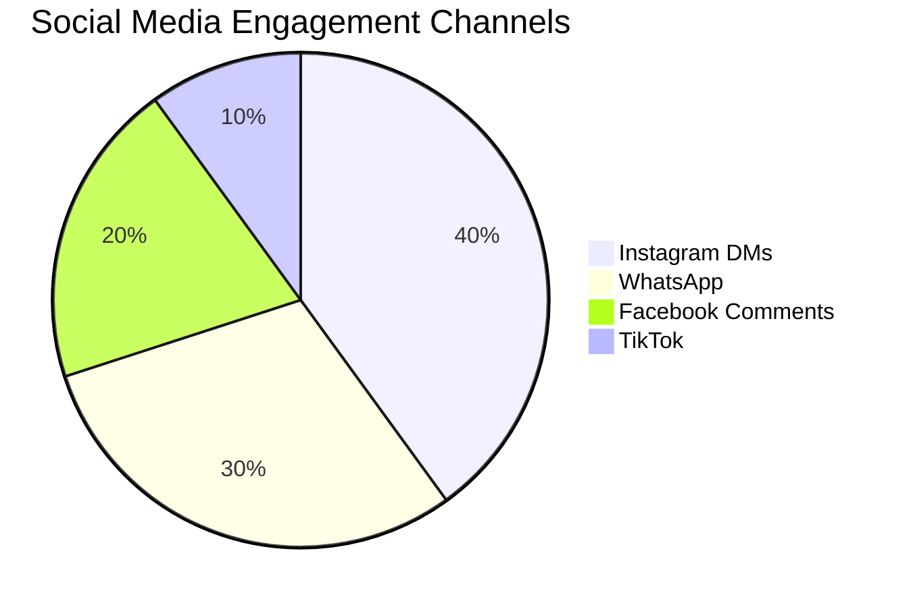
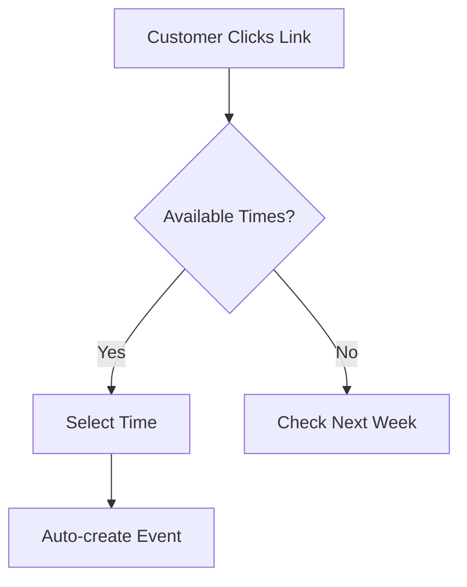
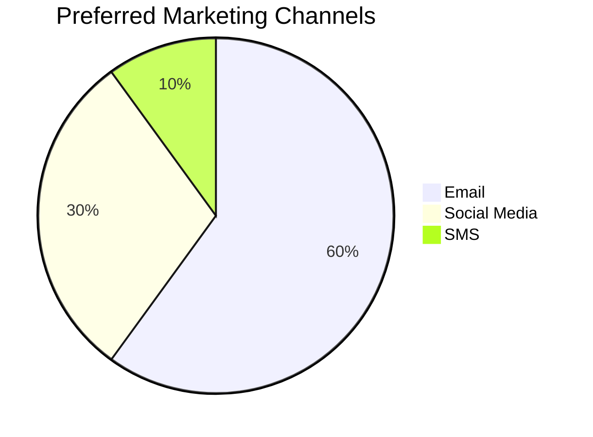
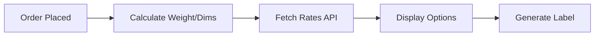

# OHC Tool Integration Research Q4

## 1. Social Media Integration
**Title:** Implement Unified Social Media Inbox
**Problem Statement:** Small business owners (like Fatima) juggle Instagram DMs, Facebook comments, WhatsApp messages, and TikTok comments across multiple apps. This leads to missed messages, slow response times, and lost sales. A unified inbox would allow them to see and reply to all customer messages in one place.
**Research Report:**
- **Tools Evaluated:** ManyChat, Meta Business Suite, Twilio Flex.
- **Ease of Use:** Meta Business Suite is clunky; ManyChat is easier but focuses heavily on automation. A simple unified feed is best.
- **Pricing:** Twilio Flex is pay-as-you-go; ManyChat starts around $15/mo.
- **Compatibility:** Works in both Cloud (webhooks) and Standalone (local polling/sync).
- **Reputation:** Twilio is highly reliable for developers; ManyChat is popular among creators.

| Feature | Meta Business Suite | ManyChat | Twilio Flex |
| :--- | :--- | :--- | :--- |
| **Unified Inbox** | Yes | Yes | Yes |
| **Ease of Use** | Low | High | Medium |
| **Pricing** | Free | $15/mo+ | Pay-as-you-go |
| **Best For** | Basic Needs | Automation | Custom Built |
**Design Doc:**
- **Trigger:** Webhooks from social platforms when a new message/comment is received.
- **Action:** OHC aggregates messages into a single UI timeline.
- **User Interface:** A simple "Inbox" tab in OHC showing the platform icon, sender, and message, with a direct reply box.
**Implementation Prompt:** Create a unified inbox view where business owners can connect their Instagram, Facebook, and WhatsApp accounts. New messages should appear in a single chronological feed. Users must be able to type a reply in OHC, and the message should be sent back to the respective platform natively.
**Priority:** P0
**Estimated Scope:** Large

## 2. Calendar & Scheduling
**Title:** Integrate Smart Calendar Booking
**Problem Statement:** Service-based business owners waste time going back and forth via email/text to find meeting times. They need a simple link to share that syncs with their personal calendar to prevent double-booking.
**Research Report:**
- **Tools Evaluated:** Calendly, Cal.com, Acuity Scheduling.
- **Ease of Use:** Calendly is the industry standard; Cal.com is open-source and very developer-friendly.
- **Pricing:** Calendly starts free, then $10/mo; Cal.com has a generous free tier for individuals.
- **Compatibility:** Both support Cloud and Standalone (via API).
- **Reputation:** Both are highly regarded. Cal.com is praised for flexibility.

| Feature | Calendly | Cal.com | Acuity |
| :--- | :--- | :--- | :--- |
| **Free Tier** | Basic | Generous | Limited Trial |
| **Open Source** | No | Yes | No |
| **Timezone Support**| Yes | Yes | Yes |
**Design Doc:**
- **Trigger:** User shares a booking link generated by OHC.
- **Action:** Customer books a slot; OHC syncs this to the owner's Google/Outlook calendar.
- **User Interface:** A "Scheduling" settings page to connect calendars and set availability hours, plus a copyable public link.
**Implementation Prompt:** Integrate a scheduling system (e.g., Cal.com API) so business owners can connect their existing calendars. Provide a customizable public booking page where clients can select available times. Ensure timezone conversions are handled automatically and double-bookings are prevented.
**Priority:** P1
**Estimated Scope:** Medium

## 3. Email Marketing
**Title:** Enable Simple Email Campaigns
**Problem Statement:** Owners want to announce sales or updates to their customer list but find tools like Mailchimp too complex and expensive. They need a simple way to blast plain-text or basic template emails.
**Research Report:**
- **Tools Evaluated:** Mailchimp, SendGrid, Resend.
- **Ease of Use:** Mailchimp is bloated for basic needs. Resend is very developer-focused but allows for building a simple UI on top.
- **Pricing:** Resend is very cheap (pay-per-email); Mailchimp gets expensive fast based on list size.
- **Compatibility:** Cloud (API).
- **Reputation:** Resend is loved for deliverability and modern APIs.

| Feature | Mailchimp | Resend | SendGrid |
| :--- | :--- | :--- | :--- |
| **Ease of Setup** | Low | High (for devs) | Medium |
| **Pricing** | High | Low | Low |
| **Deliverability** | Good | Excellent | Good |
**Design Doc:**
- **Trigger:** Owner selects a segment of customers in OHC and drafts a message.
- **Action:** OHC sends the email via provider API.
- **User Interface:** A "Campaigns" tab with a WYSIWYG editor, recipient list selector, and a "Send" button.
**Implementation Prompt:** Build a lightweight email campaign tool. Allow users to select customer segments (e.g., "All Customers", "Past 30 Days") and draft a simple text/image email. Integrate with an API like Resend to handle delivery, and provide basic open-rate tracking.
**Priority:** P2
**Estimated Scope:** Medium

## 4. Payment Processing
**Title:** Integrate Alternative Local Payment Gateways
**Problem Statement:** While Stripe is great, small businesses in LATAM or Asia need local options like Mercado Pago or Paytm to reduce fees and support local payment habits.
**Research Report:**
- **Tools Evaluated:** Mercado Pago (LATAM), Paytm (India), Razorpay (India).
- **Ease of Use:** Razorpay has excellent APIs; Mercado Pago is standard for LATAM.
- **Pricing:** Variable by region, typically 2-3% per transaction.
- **Compatibility:** Cloud & Standalone.
- **Reputation:** Razorpay is highly rated; Mercado Pago is ubiquitous in its market.
| Feature | Mercado Pago | Razorpay | Paytm |
| :--- | :--- | :--- | :--- |
| **Region** | LATAM | India | India |
| **API Quality** | Medium | High | Medium |
| **Local Support**| Yes | Yes | Yes |
**Design Doc:**
- **Trigger:** Customer checks out on an OHC-generated invoice or storefront.
- **Action:** OHC routes the payment to the configured local gateway.
- **User Interface:** "Payments" settings page with toggles for different regional providers and API key inputs.
**Implementation Prompt:** Expand payment options beyond Stripe. Add support for Mercado Pago (LATAM) and Razorpay (India). Allow the business owner to select their preferred gateway in settings, so invoices and checkout links route through the chosen provider.
**Priority:** P1
**Estimated Scope:** Large

## 5. Shipping & Logistics
**Title:** Automated Shipping Rate & Label Generation
**Problem Statement:** Manually calculating shipping costs and buying labels at the post office is time-consuming. Owners need auto-calculated rates at checkout and one-click label printing.
**Research Report:**
- **Tools Evaluated:** Shippo, EasyPost.
- **Ease of Use:** Both provide simple APIs to aggregate carriers (USPS, FedEx, DHL).
- **Pricing:** Pay-per-label (usually just a few cents + postage).
- **Compatibility:** Cloud & Standalone.
- **Reputation:** Both are reliable, Shippo has slightly better out-of-the-box UI elements.

| Feature | Shippo | EasyPost |
| :--- | :--- | :--- |
| **Carrier Support**| 85+ | 100+ |
| **Pricing** | $0.05/label | 120k free/yr |
| **API Quality** | Good | Excellent |
**Design Doc:**
- **Trigger:** Order is packed and ready to ship.
- **Action:** OHC requests a label from the API and provides a PDF to the owner.
- **User Interface:** An "Orders" view with a "Buy Shipping Label" button, prompting for package dimensions.
**Implementation Prompt:** Integrate a shipping API (like EasyPost). When an order is ready, allow the business owner to input package dimensions/weight, view live carrier rates, purchase the label directly within OHC, and print the resulting PDF.
**Priority:** P2
**Estimated Scope:** Medium

## 6. SMS & Notifications
**Title:** Reliable SMS Notifications for Customers
**Problem Statement:** Many customers (especially in areas with low smartphone penetration or language barriers) prefer SMS over email for appointment reminders and order updates.
**Research Report:**
- **Tools Evaluated:** Twilio, MessageBird.
- **Ease of Use:** Twilio is the industry standard with extensive docs.
- **Pricing:** Twilio is roughly $0.0079 per text in the US; international rates vary.
- **Compatibility:** Cloud & Standalone.
- **Reputation:** Twilio is the gold standard for reliability.
| Feature | Twilio | MessageBird |
| :--- | :--- | :--- |
| **Global Reach** | Excellent | Good |
| **Pricing** | Low | Medium |
| **API Quality** | Excellent | Good |
**Design Doc:**
- **Trigger:** System events (e.g., "Appointment tomorrow", "Order shipped").
- **Action:** OHC triggers an SMS via API.
- **User Interface:** "Notifications" settings to toggle SMS on/off and customize templates.
**Implementation Prompt:** Implement SMS notifications using Twilio. Provide business owners with customizable templates for appointment reminders and order confirmations. Ensure the system handles opt-outs (STOP replies) automatically to remain compliant.
**Priority:** P0
**Estimated Scope:** Small

## 7. Video Conferencing
**Title:** Auto-Generate Meeting Links
**Problem Statement:** Online tutors, consultants, and coaches need a unique Zoom or Google Meet link generated automatically for every booking to prevent uninvited guests.
**Research Report:**
- **Tools Evaluated:** Zoom API, Google Workspace API.
- **Ease of Use:** Google Meet is seamless if using Google Calendar; Zoom requires OAuth.
- **Pricing:** Zoom requires a paid plan for API access; Meet is included in Workspace.
- **Compatibility:** Cloud & Standalone.
- **Reputation:** Both are ubiquitous.
| Feature | Google Meet | Zoom |
| :--- | :--- | :--- |
| **Integration** | Easy (w/ Calendar) | Complex (OAuth) |
| **Cost** | Free with Gmail | Paid plan needed |
| **Familiarity** | High | Very High |
**Design Doc:**
- **Trigger:** A new calendar booking is created.
- **Action:** OHC requests a meeting link via API and attaches it to the calendar invite.
- **User Interface:** "Integrations" page to connect Zoom or Google accounts.
**Implementation Prompt:** Allow business owners to connect their Zoom account or Google Workspace. When a new consultation is booked via the scheduling tool, automatically generate a unique video conferencing link and include it in the confirmation emails sent to both the owner and the customer.
**Priority:** P2
**Estimated Scope:** Medium
