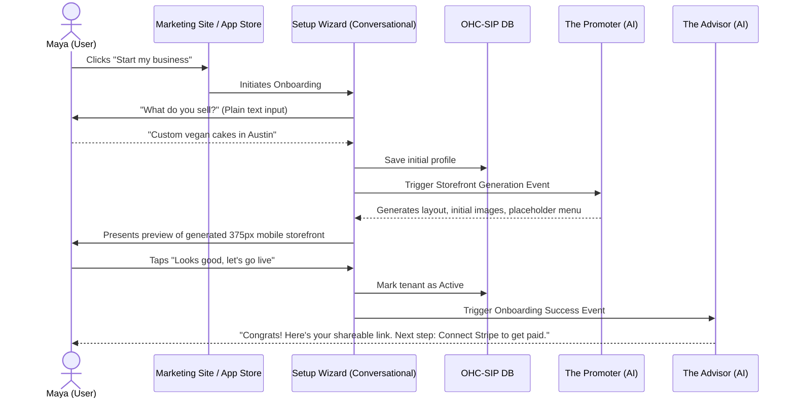
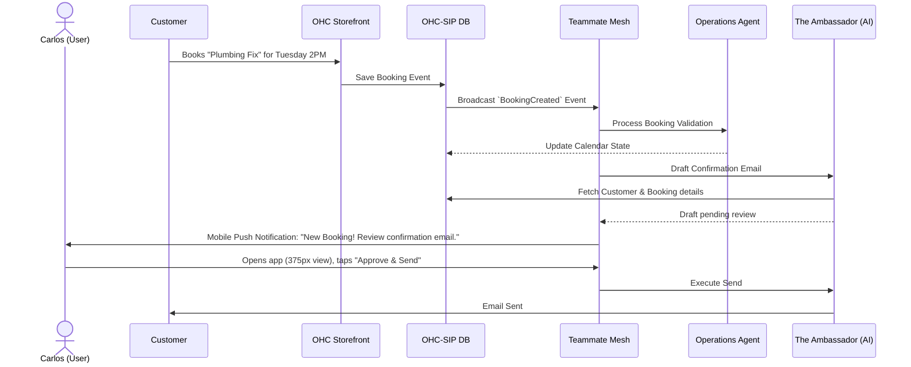

# Issue Brief: End-to-End Business Journey Architecture

## Problem Statement
Small business owners (e.g., Maya the Baker, Carlos the Handyman) struggle with platform onboarding that asks for technical details (like DNS records, shipping zones) right away. They experience high abandonment rates because the "zero to live" process feels like setting up a complex software suite rather than starting a business. Additionally, ongoing operations quickly cause "operational fatigue." OHC needs a seamless, end-to-end user journey that guides users from acquisition to activation and beyond, completely abstracted from technical jargon and heavily assisted by AI agents, enabling a launch in under 10 minutes.

## Research Report
Analysis of competitive platforms (Shopify, Wix, Squarespace) and user feedback shows:
- **Acquisition & Onboarding**: 73% of users complain about "Setup Complexity." Competitors require too much configuration upfront.
- **Activation**: New users struggle to see value immediately. The "aha" moment is delayed until a complete storefront is built.
- **Retention**: Engagement drops after setup because day-to-day operations become overwhelming.
- **Opportunity**: OHC can differentiate by defining a conversational, AI-driven onboarding flow. The journey must immediately activate the user by generating a functional storefront (even if partial) and then using proactive AI agents (like The Business Advisor) to drive retention and upselling.

## Design Doc

### Business Journey Mapping & Architecture

#### 1. Journey Invariants & Design Principles
- **Time to Value**: "Idea to live business" in under 10 minutes.
- **Progressive Profiling**: Only ask for essential information initially (Business Name, Type, Core Offering). Defer everything else (custom domain, complex tax settings) to later stages or let AI infer it.
- **Mobile-First UX**: The entire onboarding and management journey must be frictionless on a 375px mobile screen.

#### 2. Sequence Diagrams (Mermaid.js)

**Maya (The Home Baker) - Acquisition to Activation**

**Carlos (The Handyman) - Retention & Day-to-Day Operation**

### Mobile UX Flow (375px First)

1.  **Welcome & Context**:
    *   Single input field: "Describe your business in a sentence."
    *   Large, native mobile keyboard activation. No distracting navigation.
2.  **Magic Loading State**:
    *   Engaging skeleton screens while *The Promoter* agent builds the site in the background (glassmorphism spinner, simple text: "Designing your storefront...", "Writing your first menu...").
3.  **The "Aha" Moment (Preview)**:
    *   Full-screen preview of the generated mobile storefront.
    *   Bottom sheet with a primary CTA: "Publish my business" and secondary "Tweak design".
4.  **Dashboard (Post-Activation)**:
    *   Card-based layout (VerticalBox to prevent horizontal scroll).
    *   Top Card: Shareable Link/QR Code.
    *   Action Feed: "The Advisor suggests: Connect your bank to accept your first payment."

### AI Agent Integration Points
-   **The Promoter**: Triggered during the initial Setup Wizard to instantly generate content, layout, and SEO metadata based on the one-sentence description.
-   **The Advisor**: Watches the tenant's activation state. If they stall, it sends a plain-language push notification or email with a single next step.
-   **The Ambassador & Operations**: Handle post-launch lifecycle events (bookings, orders) to minimize Carlos's operational fatigue.

## Implementation Prompt
Implement the backend journey orchestration and the frontend mobile Setup Wizard.
1.  **Backend**: Create the onboarding event flow within the KAIROS Orchestrator. When a user submits their business description, publish an `OnboardingStarted` event to the Teammate Mesh to trigger *The Promoter* agent for asynchronous storefront generation. Implement an endpoint to poll/stream generation status to the client.
2.  **Frontend**: Build the Flutter/Slint UI for the Setup Wizard ensuring a strict 375px mobile-first layout. The UI must include the initial text input screen, the "magic loading" state, the storefront preview, and the transition to the main dashboard. Ensure all copy is jargon-free and passes the "grandmother test."

Do not define specific SQL DDL or API routes; design the service interfaces and component boundaries to support this flow.

## Priority
P0

## Estimated Scope
Large
