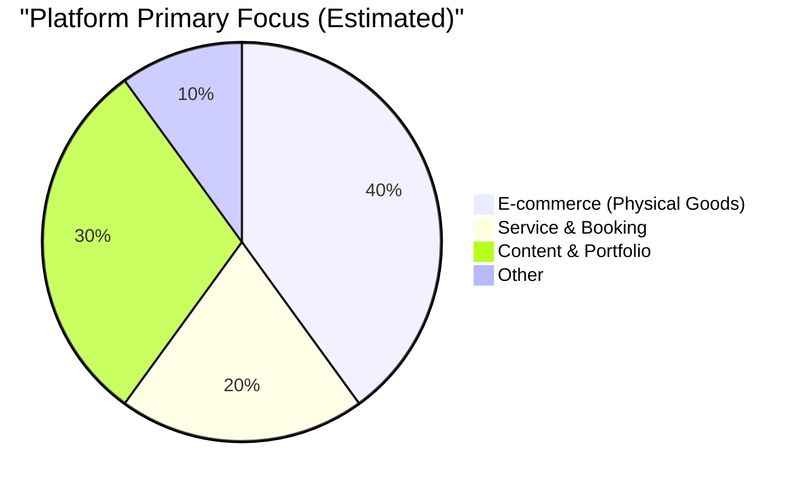
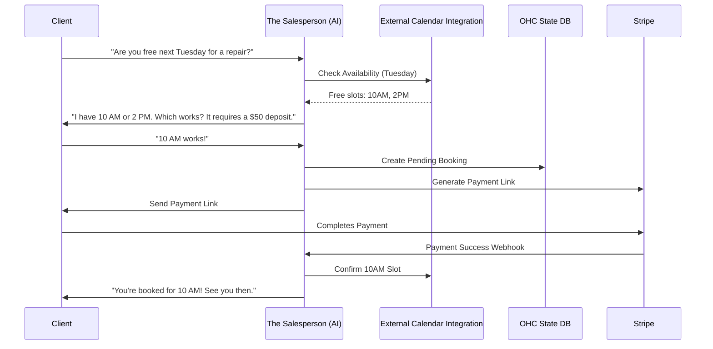

# Comprehensive Research Report: The Smart Business Platform

## 1. Top 10 SMB Pain Points
Based on analysis of Shopify, Wix, Squarespace, GoDaddy, Reddit (r/smallbusiness, r/ecommerce), and Trustpilot:
1. **Website Complexity for Beginners:** Overwhelmed by navigating confusing interfaces and themes.
2. **Back-and-Forth Scheduling:** Wasting hours finding a time that works for clients (Service Businesses).
3. **Ghosting/Lost Leads:** Forgetting to follow up with potential clients who inquired but didn't book or buy.
4. **Deposit & Payment Friction:** Uncomfortable asking for deposits or struggling to set up integrated payment gateways.
5. **Inventory Management Fatigue:** Writing descriptions, taking photos, and syncing stock across channels is too manual.
6. **Customer Service Overload:** Answering the same repetitive questions ("Do you have vegan options?", "What are your hours?") via DM/email.
7. **Marketing & SEO Mystery:** No idea how to get found on Google or what to post on social media.
8. **Mobile Management Limits:** Inability to run the full business effectively from a phone while on the go.
9. **Fragmented Tools:** Having to stitch together separate tools for booking, invoicing, and website.
10. **Hidden Costs & Aggressive Upsells:** Surprise fees on platforms like GoDaddy, making budgeting difficult.

### Persona-Specific Pain Points
* **Maya (The Home Baker):** "I hate having to reply to every Instagram DM asking for prices while I'm baking. I need a way to easily take custom orders with a deposit from my phone."
* **Carlos (The Freelance Handyman):** "I lose jobs because I'm busy fixing things and can't reply to leads fast enough. I need automatic quotes and a simple booking system."
* **Priya (The Boutique Owner):** "Keeping my in-store inventory synced with my online shop is a nightmare. I also don't know how to do email marketing."
* **Leo (The Music Tutor):** "Students cancel or forget to book their next lesson. I need a subscription model and an automated system to remind them."
* **Fatima (The Food Cart Operator):** "I need a super simple pre-order menu that works in Arabic and English, and sends me a notification when an order comes in so I can prepare it."

## 2. OHC AI Differentiation Manifesto
While competitors treat AI as a reactive chatbot (Shopify Sidekick) or a one-time setup tool (Wix ADI, GoDaddy Airo), OHC will deploy **Invisible Autonomous Agents**.

**The 5 AI Automations OHC Will Implement First:**
1. **The Salesperson (Autonomous Booking & Lead Recovery):** Automatically negotiates booking times via chat and follows up with abandoned leads. (Recovers lost revenue).
2. **The Ambassador (Auto-Replying Customer Service):** Drafts responses to common customer DMs and emails based on business knowledge and past interactions. (Saves hours per day).
3. **The Promoter (Auto-Generated Marketing):** Automatically drafts social media posts and optimizes the website for SEO. (Removes the biggest marketing barrier).
4. **The Manager (Smart Inventory & Descriptions):** Automatically writes product descriptions from a single photo and alerts when stock is low. (Saves time on catalog management).
5. **The Advisor (Plain-Language Business Insights):** Sends weekly, easy-to-understand reports ("Tuesday was your busiest day. Consider a mid-week promotion"). (Makes owners feel smart and supported).

## 3. Market Sizing & Strategic Direction
* **Beachhead Market:** Service-based solopreneurs (like Carlos the Handyman and Leo the Tutor). They have acute pain points around booking and follow-ups, and current ecommerce-focused platforms (Shopify) serve them poorly.
* **Geographic Expansion:** After English, target Spanish/LATAM. High density of micro-businesses operating via WhatsApp.
* **Vertical Expansion:** "Horizontal first, Vertical later." Win the general solopreneur market with radical simplicity before building deep vertical features (like complex restaurant POS).

## 4. Feature Gap Matrix: OHC vs Competitors

| Feature | Shopify | Wix | Squarespace | GoDaddy | OHC (Current) | OHC (Target Advantage) |
|---|---|---|---|---|---|---|
| **Setup Time** | 30-60 min | 20-40 min | 30-60 min | 20-40 min | < 10 min | **Fastest, AI-driven** |
| **Mobile Management** | Partial | Partial | No | No | **Full (375px first)** | **100% Mobile Native** |
| **Autonomous AI Agents** | No (Chatbot) | No (Setup only) | No | No | **Yes (Background)** | **True Automation** |
| **Booking & Services** | Poor | Complex Plugin | Good, Static | Basic | **Missing/In Progress** | **Conversational Booking** |
| **Useful Free Tier** | No | Limited | No | No | **Yes** | **Low Barrier to Entry** |

---

# Issue Brief: AI-Driven Smart Booking & Automated Follow-Up

## Problem Statement
Small business owners focused on services suffer from scheduling chaos and lost leads. The back-and-forth negotiation is time-consuming, and when clients ghost, the owner loses revenue. Competitors provide static booking widgets but do not autonomously engage clients or follow up.

## Research Report
Based on analysis of competitor booking solutions:
- **Shopify:** Primarily e-commerce, terrible for pure service bookings.
- **Wix & Squarespace:** Offer robust booking plugins, but require the user to drive traffic to a static calendar link.
- **Opportunity:** OHC can deploy "The Salesperson" agent to handle booking negotiations conversationally, capture intent, automatically present available slots, and proactively follow up if the client abandons the flow.

## Design Doc
### High-Level Architecture
- **Agent Integration:** "The Salesperson" agent intercepts inquiries.
- **Calendar Sync:** Integration to read free/busy times and write confirmed appointments.
- **Follow-Up State Machine:** Background job tracks abandoned booking flows and schedules follow-up actions.
- **Deposit Handling:** Seamless integration with Stripe.

### Mobile UX Flow (375px First)
- **Bookings Dashboard:** Clean, day-view calendar.
- **Lead Pipeline:** Swipeable list of "Active Inquiries" and "Needs Follow-Up".
- **Approval:** 1-tap approval for AI-drafted follow-up messages.

## Implementation Prompt
Implement the Smart Booking engine integrated with "The Salesperson" AI agent. Connect the agent to a calendar service and Stripe payment flow. Detect abandoned booking flows and automatically queue a draft follow-up message. Create a 375px-optimized "Lead Pipeline" screen for the owner to view and approve these messages.

## Priority
P0

## Estimated Scope
Medium
