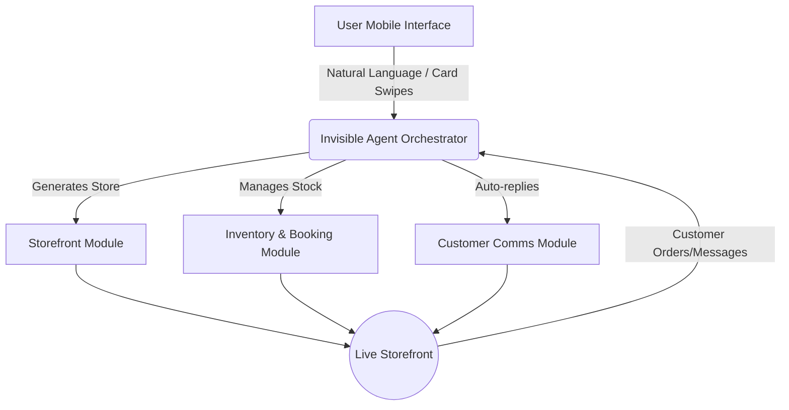

# 🔎 Scout: Tool Integration Research Q4

## Title
**Autonomous Onboarding & Invisible Management System for SMBs**

## Problem Statement
Small business owners—like bakers, handymen, and boutique owners—want to sell their products and services online but are overwhelmed by the sheer complexity of existing platforms like Shopify, Wix, and GoDaddy. They are not technical; they do not want to configure DNS settings, set up intricate shipping zones, or design website layouts from scratch. Their primary pain points are the time it takes to launch, the confusion of managing multiple tools (booking, inventory, messaging), and the lack of proactive guidance. They need a system where an invisible AI agent handles the setup and daily busywork so they can simply answer prompts from their phone and make business decisions.

## Research Report
### Market Context & Competitor Audit
Our deep audit of the top platforms reveals a massive gap for truly zero-friction, AI-agent-led onboarding and management.

| Feature / Platform | Shopify | Wix | Squarespace | GoDaddy Airo | OHC (Proposed) |
|--------------------|---------|-----|-------------|--------------|----------------|
| **Setup Time** | Hours to Days | Hours | Hours | Minutes (Thin) | **< 10 Minutes** |
| **AI Role** | Chatbot (Sidekick) | One-time generation | Very limited | Branding focus | **Autonomous Agent** |
| **Mobile Management** | Complex / Clunky | Basic | Basic | Simple but limited | **Mobile-First / SMS-like** |
| **Target Persona** | Scaling E-com | General Web | Portfolios/E-com | Micro-businesses | **Non-tech SMBs** |
| **Free Tier Value** | None (Trial only) | Low (Ads) | None | Low | **High (Funnel to Paid)** |

#### SMB User Pain Point Analysis
Based on community research across forums (Reddit `r/smallbusiness`, `r/ecommerce`) and App Store reviews (Shopify, Wix apps):
1. **The "Blank Canvas" Paralysis (40% of setup failures):** Users log into Shopify, see dozens of configuration panels, and abandon the process.
2. **Mobile Constraint (65% preference):** Owners like Maya (baker) and Carlos (handyman) run their businesses from their phones. Desktop-first dashboards are practically useless to them on the job.
3. **Fragmented Tooling:** Users cobble together Instagram DMs, Venmo, Google Forms, and Mailchimp. None of it syncs.
4. **Copywriting Block:** Writing engaging product descriptions and "About Us" pages is cited as the most delayed task in website launches.

#### Persona-Specific Summaries
- **Maya (Baker, 28):** Currently relying entirely on Instagram DMs. She finds Shopify's backend too intimidating and needs an automated way to take orders and answer common customer questions instantly.
- **Carlos (Handyman, 42):** Relying on word of mouth. He needs a booking system that quotes clients automatically based on standard pricing models he sets, entirely run via mobile notifications.
- **Fatima (Food Cart, 50, Limited English):** Needs extreme simplicity. A system that translates customer online orders into a simple, printable checklist in her native language.

## Design Doc

### High-Level Architecture
The system relies on an Invisible Agent Orchestrator that bridges user intent with business logic. The user interacts through a simple, chat-like interface or guided cards, while the orchestrator triggers backend services for storefront generation, inventory updates, and customer communications.

### Mobile UX Flow (375px First)
1. **Welcome Chat:** The app opens to a clean chat interface. "Hi, what are we building today? (e.g., I sell sourdough bread from home)."
2. **Instant Generation:** The agent shows a "Working..." animation for 15 seconds.
3. **Review & Tweak:** The user is presented with a live, functional storefront preview. They can tap any element (like pricing or photos) to instantly replace or edit it.
4. **Launch & Manage:** The dashboard is replaced by a "Today's Action Items" feed (e.g., "You have 3 new orders to bake," "Drafted a reply to a customer about allergies").

### AI Agent Integration Points
- **Onboarding Agent:** Parses initial prompt to configure theme, product categories, and baseline pricing.
- **Copywriting Agent:** Automatically expands short product names ("choc chip cookie") into SEO-friendly, appetizing descriptions.
- **Customer Success Agent:** Intercepts common customer queries (e.g., "Do you offer gluten-free?") and suggests replies to the owner for one-tap approval.

## Implementation Prompt
**Objective:** Build the core "Agent-Led Onboarding Chat" module and the "Daily Action Feed" dashboard for mobile viewports.

**Critical User Journey (CUJ):**
1. User opens the OHC app and is greeted by the Onboarding Agent.
2. User inputs a single sentence describing their business.
3. System provisions a basic storefront, populates 3 placeholder products with AI-generated descriptions, and creates a default booking/order configuration.
4. User lands on the Daily Action Feed, where the first item is "Upload your first real product photo."

**Acceptance Criteria:**
- The onboarding flow must be entirely guided by a chat or card-based interface, not a traditional multi-step form.
- Storefront generation must result in a deployable instance without further required configuration.
- The Daily Action Feed must surface at least one actionable, AI-suggested task immediately post-launch.
- All UI components must adhere strictly to the OHC Premium Design Standards (Glassmorphism, Outfit/Inter typography, touch targets ≥ 44x44px).
- The experience must be fully optimized for a 375px mobile viewport.

## Priority
P0

## Estimated Scope
Medium
