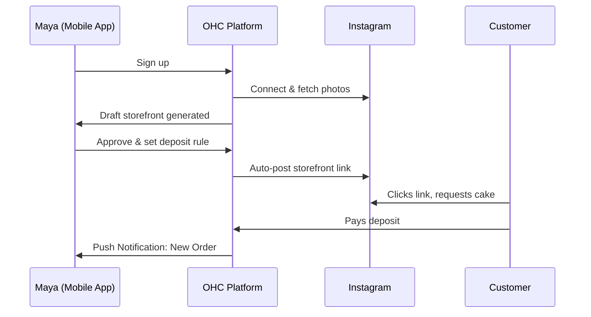
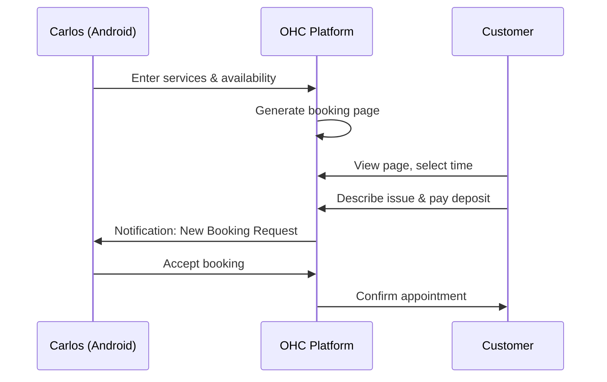
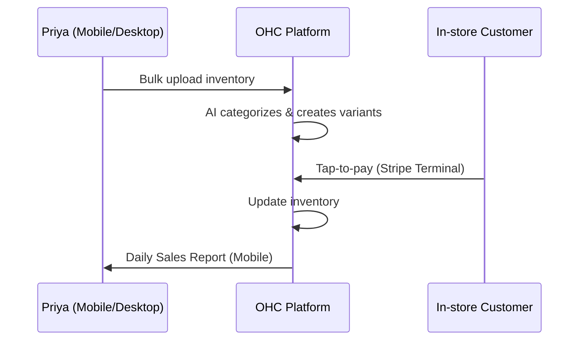
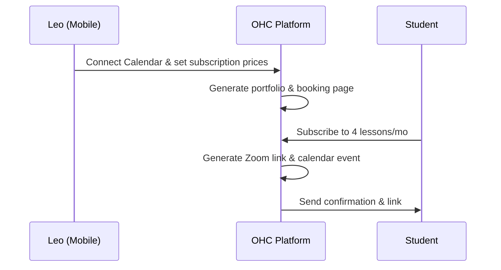
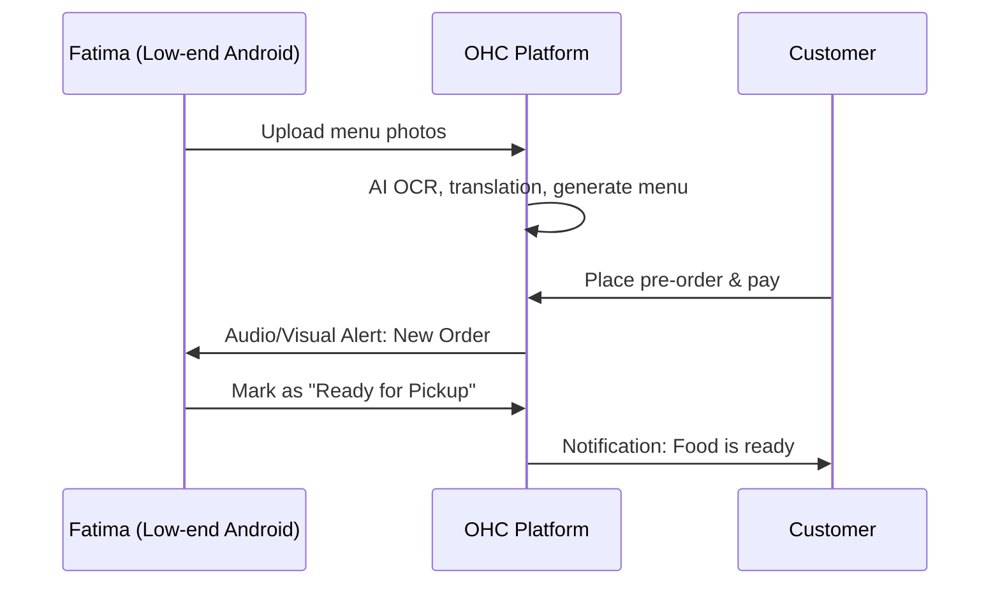

# OHC Business Journey Architecture

## 1. Overview
This document defines the complete end-to-end user journey for small business owners on the OneHumanCorp (OHC) platform. It maps the experience for our core personas—Maya, Carlos, Priya, Leo, and Fatima—identifying friction points in traditional platforms (Shopify, Wix, Squarespace) and detailing how OHC's AI-native, mobile-first approach eliminates them.

## 2. Persona User Journeys

### 2.1 Maya — The Home Baker
**Acquisition:** Discovers OHC via an Instagram ad showing a "Link in Bio to Storefront in 5 mins" feature.
**Onboarding:** Connects her Instagram account. The AI Marketing Agent pulls her photos and generates a catalog. She sets up Stripe with a single tap for deposits.
**Activation:** First custom cake deposit received within 2 hours.
**Retention:** Daily push notifications of orders. The AI Customer Success Agent drafts replies to her DMs.
**Revenue Upgrade:** Upgrades to Starter tier to get a custom domain when she reaches 100 orders.
**Friction Point in Competitors:** Setting up a deposit-based custom order form on Shopify is complex and requires third-party apps.

### 2.2 Carlos — The Freelance Handyman
**Acquisition:** Referred by another contractor. Landing page CTA: "Get Booked Today."
**Onboarding:** Types "I fix plumbing and paint." AI generates service listings and prices.
**Activation:** First booking received via Google Search integration.
**Retention:** Uses the mobile inbox daily to manage quotes and accept bookings.
**Friction Point in Competitors:** Complex calendar and deposit setups on Wix overwhelm him.

### 2.3 Priya — The Boutique Owner
**Acquisition:** Searching for "POS that syncs with online store."
**Onboarding:** Uploads a CSV of her inventory. AI categorizes products and creates variants.
**Activation:** First in-store tap-to-pay transaction using Stripe Terminal.
**Retention:** Reviews daily mobile analytics. AI Advisor suggests reordering trending items.
**Friction Point in Competitors:** Point-of-sale integration and multi-variant inventory management are often clunky and desktop-focused.

### 2.4 Leo — The Music Tutor
**Acquisition:** Sees a TikTok video about "The ultimate link-in-bio for creators."
**Onboarding:** Connects Google Calendar. AI generates subscription packages (e.g., 4 lessons/mo).
**Activation:** First student signs up for a recurring subscription.
**Retention:** AI Agent auto-follows up with inactive students.
**Friction Point in Competitors:** Managing subscriptions and automatic Zoom link generation usually requires stringing multiple tools together (e.g., Calendly + Stripe + Squarespace).

### 2.5 Fatima — The Food Cart Operator
**Acquisition:** Community outreach flyer.
**Onboarding:** Takes photos of her menu. AI extracts text, prices, and translates to English/Arabic.
**Activation:** First pre-order received via customer's phone.
**Retention:** Uses the printable daily order list. App functions smoothly on slow data.
**Friction Point in Competitors:** Most platforms are too complex, English-only, and data-heavy for her phone.

## 3. Key Design Decisions

1. **AI-Driven Onboarding:** Instead of blank canvases, users provide raw inputs (photos, text, Instagram links), and AI generates a complete, ready-to-review draft.
2. **Mobile-First Management:** All critical actions (approving quotes, viewing analytics, updating inventory) are optimized for a 375px screen.
3. **Unified Inbox:** A single interface for all customer communications (IG DMs, emails, web chat), with AI drafting responses.

## 4. Implementation Prompt for Implementer Agents
**Task:** Build the AI-Driven Onboarding Wizard flow for the Mobile App.
**User Journey:** The user opens the app, is prompted to either connect a social media account or upload photos/describe their business in plain text. The system passes this context to the AI Marketing Agent, which generates a complete initial storefront data model (catalog, basic theme, contact info).
**Acceptance Criteria:**
1. Screen must render perfectly on 375px width.
2. Form inputs must use native mobile keyboards.
3. Upon submission, show an optimistic UI loading state while the AI Agent processes the payload.
4. Render the generated draft storefront for user approval.

## 5. Priority
P1

## 6. Estimated Scope
Medium
