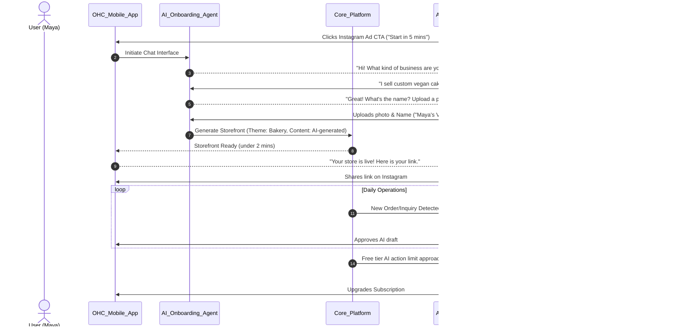
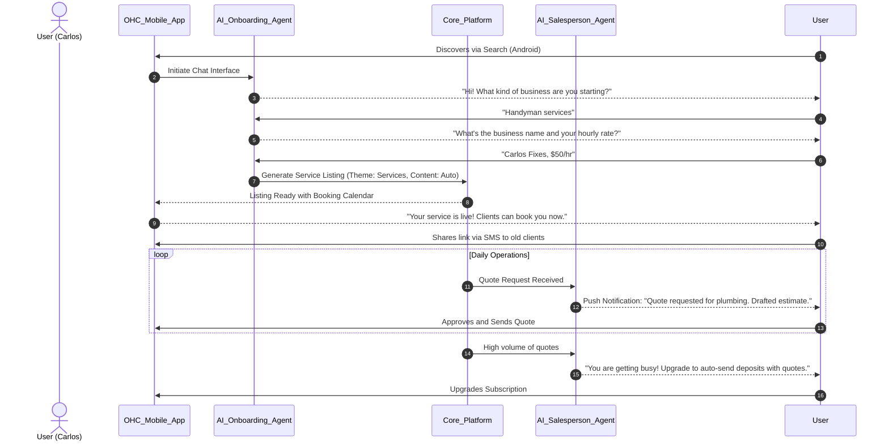
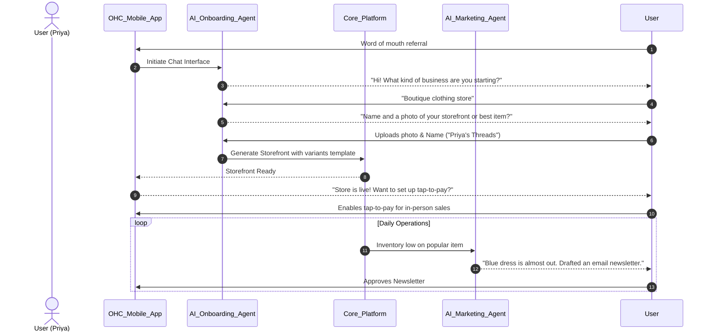
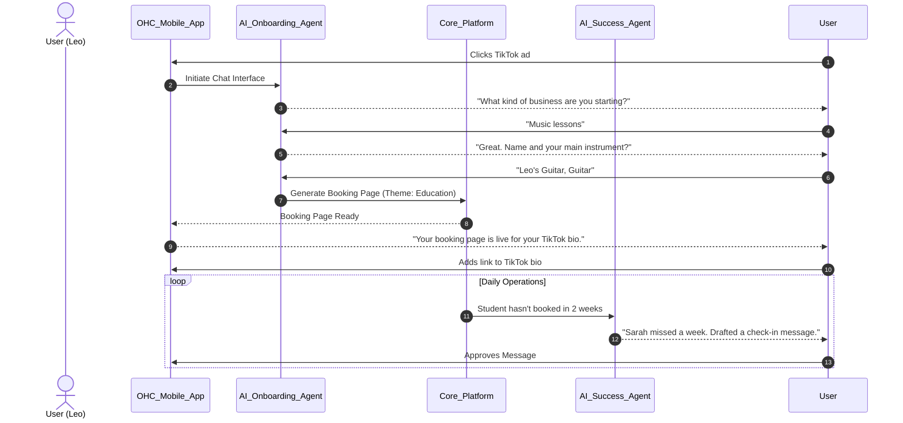
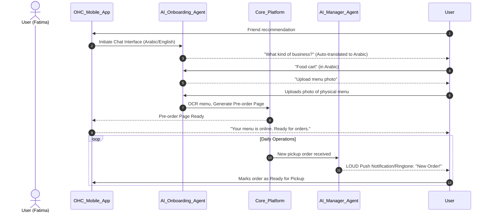

# Title: Business Journey Architecture

## Problem Statement
Small business owners (bakers, handymen, boutique owners) often lack the technical skills, time, or patience to navigate complex software to get their business online. The current landscape of tools (Shopify, Wix, Squarespace) requires manual configuration, reading manuals, and understanding concepts like DNS, payment gateways, and SEO. This creates a massive friction point, leading to abandoned setups and lost revenue. A non-technical user needs to go from zero to a live, functional business in under 10 minutes without touching code or dealing with complex configurations. The OneHumanCorp (OHC) platform must guide them intuitively through acquisition, onboarding, activation, retention, revenue generation, and referral, with AI handling all the background complexity.

## Research Report
### Market Context & Competitive Analysis
The small and medium business (SMB) software market is highly fragmented. Solutions like Shopify and Wix are powerful but have steep learning curves.
- **Shopify**: Excellent for e-commerce but requires significant setup time. Onboarding is focused on store configuration rather than immediate value realization.
- **Wix/Squarespace**: Template-driven website builders that require manual drag-and-drop and configuration. Not truly mobile-first for management.
- **Link-in-bio tools (Linktree, Stan Store)**: Easy to set up but lack depth for complex businesses (e.g., inventory management, complex booking flows).

### User Personas & Pain Points
Based on the OneHumanCorp vision, we must solve for specific personas:
1. **Maya (Baker, 28)**: Needs a mobile-first flow to set up a storefront, take deposits, and have an AI handle Instagram DMs. Friction: Setting up deposit structures and managing inquiries manually.
2. **Carlos (Handyman, 42)**: Needs service listings, bookings, and quoting via Android. Friction: Generating quotes and managing a calendar manually.
3. **Priya (Boutique Owner, 35)**: Needs inventory sync and tap-to-pay. Friction: Keeping online and offline inventory synchronized.
4. **Leo (Music Tutor, 22)**: Needs lesson bookings and auto-generated meeting links. Friction: Manual scheduling and follow-ups.
5. **Fatima (Food Cart, 50)**: Needs pre-orders and multilingual support (Arabic/English) on a low-end Android. Friction: Complex interfaces and language barriers.

### Core Journey Phases
1. **Acquisition**: Users typically discover OHC via organic search, social media ads (Instagram/TikTok), or friend referrals. The CTA must be immediate and low-commitment (e.g., "Launch your business in 5 minutes").
2. **Onboarding**: A conversational, AI-driven setup wizard. Minimum inputs required: Business Name, Business Type (from matrix), and Primary Goal (e.g., "sell cakes", "book appointments"). Everything else (branding, DNS, complex settings) is deferred or handled by AI.
3. **Activation**: The "Aha!" moment. A live storefront generated instantly, the first product added via photo upload, or a test transaction completed. Success is defined as having a shareable link within 10 minutes.
4. **Retention**: Daily engagement loops. Push notifications for new orders, daily AI summaries ("The Manager" reporting on traffic/inquiries), and easy mobile management.
5. **Revenue**: The upgrade path. Users on the Free tier are nudged to Starter when they hit limitations (e.g., needing more AI actions or a custom domain), presented seamlessly in the context of their growth.
6. **Referral**: Built-in viral loops, such as "Powered by OneHumanCorp" on free tier sites, or easy sharing of referral links for platform credit.

## Design Doc

### Architecture Diagram: End-to-End User Journey

### UI Wireframes & Screen Flow (375px Mobile First)
**Visual Mandate**: Glassmorphism (`backdrop-filter: blur(15px) saturate(200%)`), Outfit (Headings), Inter (Body). Touch targets ≥ 44x44px.

1. **Landing/Acquisition Screen**:
   - Clean, full-screen background image of a successful business owner.
   - Large, clear CTA: "Launch Your Business Free".
   - Minimal friction: Only requires phone number or Google/Apple Sign-In.
2. **AI Chat Onboarding Screen**:
   - Chat interface mimicking SMS.
   - Bubbles for AI questions, large tap targets for user responses or camera integration.
   - Progress indicator: "2 questions left".
3. **The Dashboard (Post-Activation)**:
   - Greeting: "Good morning, Maya."
   - Top card (Glassmorphic): "Your store is live. [Share Link]"
   - Metrics grid: Today's Views, New Orders.
   - "Suggested Actions" from the AI Advisor: e.g., "Add another product photo."

### Key Design Decisions
1. **Conversational Onboarding**: Replaces traditional multi-page form wizards. It feels natural, works perfectly on mobile, and allows the AI to infer configuration settings rather than asking the user explicitly.
2. **Deferred Configuration**: We do not ask for DNS, complex shipping rules, or tax settings upfront. The focus is purely on getting a catalog item or service listed and a link generated.
3. **Mobile-First Dashboard**: The primary management interface is the mobile app. The dashboard is action-oriented (approving AI drafts, viewing orders) rather than configuration-oriented.

## Implementation Prompt
**To Implementer Agent:**
Implement the end-to-end conversational onboarding flow for the OHC mobile application (375px viewport target).

**Customer User Journey (CUJ):**
1. A new user opens the app and taps "Start".
2. They are greeted by an AI chat interface that asks exactly three questions: Business Name, Business Type (select from list: Products, Services, Food, etc.), and a prompt to upload one photo.
3. Upon completing the chat, the system automatically provisions a basic storefront using default templates and the provided inputs.
4. The user is redirected to the main dashboard, which displays a success message, their live shareable link, and a placeholder for their first metric (Views: 0).

**Acceptance Criteria:**
- The onboarding flow must be fully functional on mobile viewports (375px width).
- The UI must utilize the OHC Glassmorphism design tokens (blur, saturation) and typography (Outfit, Inter).
- The flow must strictly require no more than three inputs before generating the initial store state.
- Ensure touch targets for inputs and buttons are at least 44x44px.
- The outcome must be a state transition to the active dashboard with a generated store link.
- Create Playwright E2E tests covering this exact journey, ensuring no silent failures and appropriate timeouts.

## Priority
`P0`

## Estimated Scope
Large
