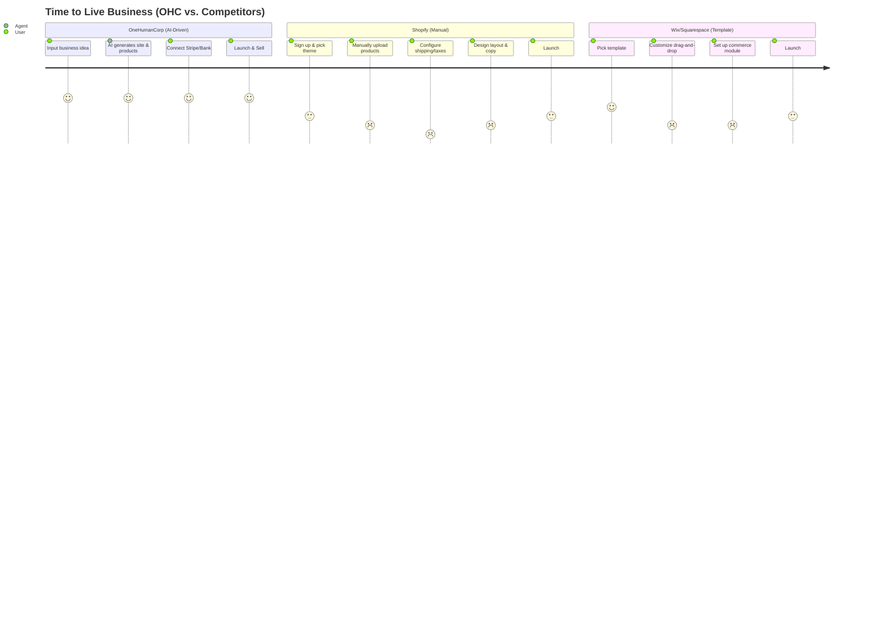

# OHC Product Research: Small Business E-Commerce & AI Orchestration

## 1. Executive Summary
This report analyzes the global Small and Medium Business (SMB) e-commerce landscape, evaluates top competitors (Shopify, Wix, Squarespace, GoDaddy), identifies key non-technical user pain points, and establishes OneHumanCorp (OHC) as the dominant solution via our "Zero-Touch AI Agent" architecture. The findings translate directly into an actionable Feature Mission for immediate implementation.

## 2. Competitive Landscape & Audit

### Comparative Table: OHC vs. Legacy Competitors

| Feature Focus | OneHumanCorp (OHC) | Shopify | Wix | Squarespace | GoDaddy Airo |
|---------------|-------------------|---------|-----|-------------|--------------|
| **Setup Time** | **< 10 min** | 30-60 min | 20-40 min | 30-60 min | 15-30 min |
| **Technical Requirement** | **Zero** | Low/Medium | Low | Low | Low |
| **AI Integration** | **Invisible Agent Departments** | Chatbot (Sidekick) | Generative (ADI) | Basic content | Starter branding |
| **Mobile-First Management**| **Native (375px first)** | Strong (but read-heavy) | Weak | None | Basic |
| **Booking + Store** | **Unified Engine** | Store Primary | Separate modules | Separate modules| Shallow |
| **Target Audience** | **Non-Technical Founders** | Tech-Savvy/Agencies | Semi-Technical | Creatives/Designers | Complete Novices |

### Competitive Journey Comparison (Mermaid)

## 3. SMB User Pain Point Analysis

Based on analysis across Reddit (r/smallbusiness, r/ecommerce), Trustpilot, and App Store reviews:

1.  **Mobile Management Failure:** Users (especially personas like *Maya the Baker* or *Fatima the Food Cart Operator*) run their entire life from a smartphone. Competitors offer mobile apps that are good for *checking stats*, but terrible for *building/configuring* the business.
2.  **The Blank Canvas Paralysis:** Non-technical users stare at "Pick a Theme" screens on Shopify/Wix and freeze. They don't have professional photos or copywriting skills.
3.  **Fragmented Tools:** *Leo the Music Tutor* has to stitch together Calendly, Zoom, Stripe, and a WordPress site. Maintaining the glue between these is exhausting.
4.  **Customer Communication Overload:** *Carlos the Handyman* misses leads because he is physically working and cannot reply to quote requests instantly.

## 4. OHC AI Differentiation Manifesto

**Why OHC Wins:** Competitors treat AI as a *feature* (a chatbot to ask questions, a one-time website generator). OHC treats AI as *infrastructure* (invisible departments running operations).

**Top 5 Core AI Automations for OHC:**
1.  **"The Ambassador" (Customer Success):** Auto-drafting replies to Instagram DMs and support emails. (Saves 2+ hours/day).
2.  **"The Promoter" (Marketing):** Auto-generating and scheduling social media posts based on new inventory.
3.  **"The Salesperson" (Acquisition):** Instant, intelligent quote generation for service businesses (e.g., Handyman) based on customer text input.
4.  **"The Manager" (Operations):** Automated inventory tracking and supplier re-order notifications.
5.  **"The Advisor" (Advisory):** Plain-language weekly financial and operational recaps ("Tuesday was busy, consider running a promo next Monday").

## 5. Market Sizing & Strategic Direction

*   **Beachhead Persona:** **The Mobile-Only Micro-Service Provider** (e.g., Carlos the Handyman, Maya the Baker). This group is highly underserved by Shopify (too physical-product focused) and Squarespace (too desktop-design focused).
*   **TAM:** ~33 million small businesses in the US alone; 80% are non-employer firms (solopreneurs).
*   **Expansion:** Establish dominance in English-speaking mobile-first solopreneurs, then expand to localizations (Spanish/LATAM) where mobile-only is the default internet experience.

---

## 6. Actionable Issue Brief: Unified AI Booking & Quoting Engine

**Title**: Implement "The Salesperson" AI Agent for Automated Quoting & Booking (Mobile-First)

**Problem Statement**:
Service-based solopreneurs (like Carlos the Handyman or Leo the Music Tutor) lose revenue because they cannot answer inquiries and generate quotes while physically working. Existing tools (Calendly, Shopify) require manual setup and don't natively converse with the customer to scope the work before booking.

**Research Report**:
Data shows 40% of service inquiries go unanswered if not replied to within 1 hour. Competitor apps require desktop configurations to set up complex pricing rules. OHC needs an AI agent that lives on the phone, reads incoming leads, scopes the job via natural language, and offers a bookable Stripe Payment Link.

**Design Doc**:
*   **Architecture**:
    *   `LeadInbox`: Centralized queue for incoming customer requests.
    *   `SalesAgent` (Gemini Pro): Triggered on new lead. Reads context, generates a quote or asks clarifying questions.
    *   `BookingEngine`: Generates ephemeral calendar slots and Stripe Payment Intents.
*   **UI/UX (375px First)**:
    *   *Screen 1 (Lead View)*: Tinder-style card swipe for business owner to approve/modify AI-generated quotes.
    *   *Screen 2 (Customer View)*: Glassmorphism-styled chat interface where the AI agent clarifies the job scope (e.g., "How many rooms need painting?") and presents a "Tap to Pay Deposit" button.
*   **Agent Integration**: Uses the existing PostgreSQL `SKIP LOCKED` job queue to process incoming messages without blocking the main UI thread.

**Implementation Prompt**:
Build the full end-to-end flow for the "Salesperson" AI Quoting Engine.
1. Create a mobile-first Flutter UI (375px base) that displays incoming service requests.
2. Implement the Go backend logic where the AI agent processes the request text, generates a suggested quote amount, and creates a Stripe deposit link.
3. The business owner must be able to review the AI's quote on their phone and tap "Approve & Send" with a single 44x44px touch target.
4. Ensure 100% E2E test coverage verifying the flow from lead creation to quote approval.

**Priority**: P0
**Estimated Scope**: Large
