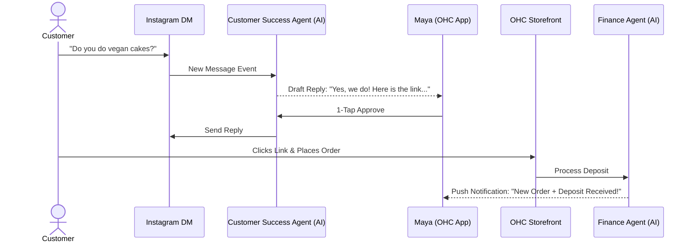
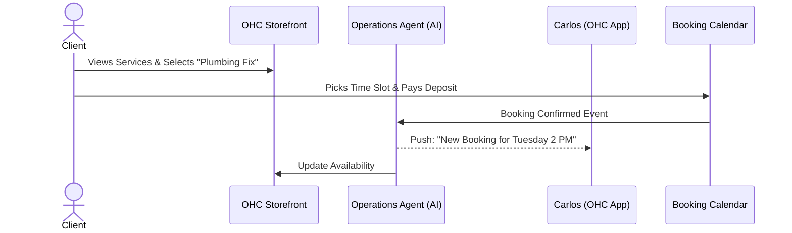

# [research] Business Journey Architecture

## 1. Problem Statement
Non-technical small business owners often struggle with the complexity of setting up and running their operations online. Current platforms (Shopify, Wix, Squarespace) require a learning curve, manual configuration, and separate tools for website, bookings, payments, and marketing. OHC aims to solve this by providing a unified, AI-driven platform where anyone can launch and manage a business in under 10 minutes without touching code or dealing with jargon. The challenge is defining a seamless, mobile-first end-to-end user journey across diverse business types (physical products, services, food & beverage) that minimizes friction and maximizes early activation and sustained retention.

## 2. Research Report
### Market & Competitive Analysis
- **Shopify:** Powerful but complex. Geared towards semi-technical or larger SMBs. Setup takes 30-60 minutes and requires understanding of themes, apps, and inventory management. No built-in AI for full business management (only a chat sidekick).
- **Wix/Squarespace:** Strong website builders but complex for non-technical users. Requires manual drag-and-drop design. Booking and store integrations can be confusing.
- **GoDaddy:** Basic setup is fast, but limited in depth. AI is rudimentary.

### OHC Value Proposition
OHC differentiates by treating AI as infrastructure rather than a bolted-on chatbot. The AI handles the heavy lifting (design, SEO, auto-replies, inventory). The platform is mobile-first, targeting users who run their business entirely from their phones (e.g., a baker selling on Instagram, a handyman on the go).

### Key Findings & Pain Points
- **Onboarding Drop-off:** Users abandon setup if asked too many technical questions upfront (e.g., DNS, payment gateway config).
- **Activation Time:** Success requires the first "aha" moment (e.g., a published site or first product listed) within 10 minutes.
- **Retention:** Users return if the app provides actionable value daily (e.g., new order notifications, AI-generated health reports).
- **Complexity:** Terminology like "SKUs", "SEO", "DNS", and "Stripe Webhooks" alienates non-technical users.

## 3. Design Doc: Business Journey Architecture

### End-to-End User Journey

#### 1. Acquisition
- **Maya (Baker):** Sees an Instagram ad highlighting "Sell your cakes directly from DMs in 5 mins." Clicks to download the OHC app.
- **Carlos (Handyman):** Referred by a friend. Signs up via mobile web browser.

#### 2. Onboarding (Zero to Live in < 10 mins)
The onboarding is a conversational, wizard-like flow powered by AI. No technical jargon.
- **Step 1: Basics:** "What's the name of your business?" / "What do you do?" (AI categorizes the business type).
- **Step 2: Theme/Vibe:** "Pick a style that fits your brand" (Visual choices: Elegant, Playful, Professional).
- **Step 3: Core Offering:** "Add your first product or service." (e.g., Maya adds a "Custom Birthday Cake" photo and price).
- **Step 4: Get Paid:** Connect bank account/Stripe via a simplified flow ("Where should we send your money?").
- **Outcome:** AI instantly generates a live, mobile-optimized storefront and a unique OHC subdomain link.

#### 3. Activation
- The user shares their newly created link in their Instagram bio or via WhatsApp.
- The first "Aha" moment: Receiving the first order or booking notification on their phone.
- AI sends a congratulatory push notification and suggests the next step ("Great job! Want to add another product?").

#### 4. Retention & Daily Use
- **Morning Briefing:** AI Business Advisor sends a plain-language summary: "Good morning Maya! You have 3 cake orders due this week. Tuesday is your busiest day."
- **Customer Interaction:** AI Customer Success drafts replies to DMs or emails for review.
- **Continuous Improvement:** AI Marketing suggests a new promotional campaign or SEO optimization.

#### 5. Revenue & Upgrading
- **Trigger:** Reaching the limits of the Free tier (e.g., 10 products or 100 AI actions/month) or needing a custom domain.
- **Upgrade Path:** Frictionless in-app upgrade to Starter or Pro tier. Clear value proposition ("Upgrade to get a custom `.com` domain and unlimited AI actions").

#### 6. Referral (Viral Loop)
- Satisfied users share their OHC storefront link, which includes a subtle "Powered by OHC" badge (removable on paid tiers).
- App prompts for referrals after successful milestones (e.g., "You've made your first $500! Share OHC with a friend.").

### Architecture Diagrams

#### Maya (Baker) - Custom Cake Order Journey

#### Carlos (Handyman) - Booking Journey

### Key Design Decisions
- **Mobile-First Everything:** The entire management dashboard and onboarding flow are designed for a 375px mobile screen. Complex data (like analytics) is distilled into simple, plain-language summaries by the AI.
- **AI as an Invisible Assistant:** The user doesn't configure "agents." They interact with "Departments" (e.g., "The Manager", "The Accountant") that proactively suggest actions or summarize data.
- **Progressive Disclosure:** Advanced features (variants, complex shipping rules) are hidden by default and only revealed when the AI detects the user needs them or when explicitly requested.
- **Frictionless Onboarding:** Defer non-critical setup (like detailed policies) until after the core value (a live store) is delivered. AI generates default policies.

## 4. Implementation Prompt
**Task for Implementer:**
Implement the new mobile-first onboarding wizard flow for the OHC Flutter app.

**User Journey (CUJ):**
A new user (e.g., a baker) downloads the app, opens it, and goes through a conversational 4-step wizard:
1. Business Name & Category.
2. Visual Style Selection (Visual cards, not dropdowns).
3. Add First Item (Photo, Name, Price).
4. Simplified Payment Setup (Connect Bank).

After step 4, the user should land on their new mobile dashboard, and a "Store Live!" success animation should play, showing them their shareable link.

**Acceptance Criteria:**
- The flow must be built in Flutter, targeting mobile (iOS/Android).
- All screens must strictly adhere to the OHC Premium Token library (Glassmorphism, Outfit/Inter typography).
- Layouts must be flawless on a 375px wide screen without horizontal scrolling.
- Use native mobile keyboards appropriately (e.g., numeric keypad for price input).
- State must be managed (using Riverpod or the project's chosen state management) so users don't lose progress if they minimize the app.
- The final step must trigger an API call to the Go backend to provision the tenant and initial data (mock this API call for the UI implementation phase).
- Ensure 100% E2E test coverage for this specific flow using Playwright/Flutter testing tools.

## 5. Metadata
- **Priority:** P0 (Critical path for user acquisition)
- **Estimated Scope:** Large
