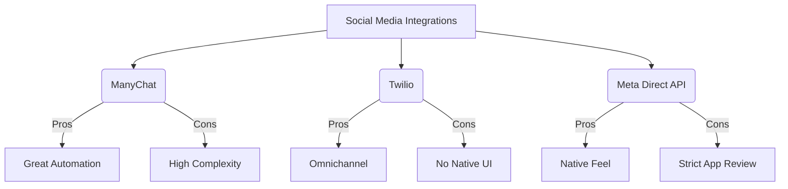
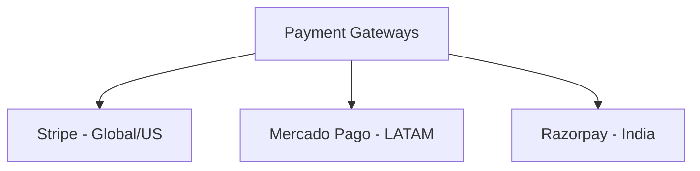

# OHC Integration Research Report

## Executive Summary

This report evaluates key third-party tools across seven integration categories critical to small business owners. The focus remains strictly on the end-user perspective: how these tools solve immediate pain points, their ease of use, pricing, and how they bridge the gap between OHC's capabilities and business needs. Our evaluations strictly consider both Cloud (multi-tenant) and Standalone (local, private) viability.

---

## 1. Social Media Integration: Unified Messaging

### Problem Statement
Small business owners, especially those selling physical goods or services online, are overwhelmed by managing inquiries across Instagram DMs, Facebook Messenger, and WhatsApp. Missing a DM often means missing a sale. They need a unified inbox that brings all conversations into one place, enabling them to reply seamlessly and leverage AI to draft responses.

### Persona Pain Point Summary
**Sarah (Bakery Owner):** Spends 2 hours every evening replying to Instagram DMs asking about custom cake availability. Often loses track of which customer messaged on WhatsApp vs. Instagram.

### Research Report
- **ManyChat:** Excellent for Instagram and Facebook automation, but can feel complex for a non-technical user. Pricing starts at $15/mo. Good webhook support.
- **Twilio Conversations:** Highly developer-focused. Can bridge WhatsApp and SMS, but lacks a native, easy-to-use interface for the end-user. Pricing is pay-as-you-go.
- **Meta Graph API (Direct Integration):** Offers the most seamless experience for the user (just "Connect to Facebook"), but requires stringent app review on our end.

### Competitive Landscape & Feature Gap

### Comparative Table

| Tool | Ease of Use (for SBO) | Pricing | Cloud Viability | Standalone Viability |
|------|-----------------------|---------|-----------------|----------------------|
| ManyChat | Medium | $15/mo | Yes | Yes (via Webhooks) |
| Twilio | Low | Pay-as-you-go | Yes | Yes |
| Meta API | High | Free (API usage) | Yes | Hard (OAuth callbacks) |

### Actionable Recommendation
**OHC should do a Meta Direct API integration because direct native OAuth flows provide the lowest friction for non-technical users, avoiding the need for them to learn a third-party platform.**

### Design Doc
- **Trigger:** User navigates to "Settings > Channels" and clicks "Connect Instagram".
- **Action:** Standard OAuth popup. Once connected, incoming DMs appear in the OHC "Inbox" tab.
- **Mobile UX (375px):** A clean inbox list view. Tapping a message opens a chat thread. AI suggested replies appear above the keyboard.
- **AI Integration:** LLM analyzes the incoming message and suggests 3 quick-reply buttons.

### Implementation Prompt
Implement a unified inbox UI that aggregates messages. The user must be able to authenticate their social accounts via a simple button click. Ensure messages can be read and replied to within the OHC interface, displaying the platform icon (e.g., Instagram) next to the message.

**Priority:** P0
**Estimated Scope:** Large

---

## 2. Calendar & Scheduling: Frictionless Booking

### Problem Statement
Service-based businesses (consultants, tutors, hair stylists) waste hours playing "email ping-pong" to find a suitable meeting time. They need a way to share a simple booking link that syncs with their real-time availability.

### Persona Pain Point Summary
**Fatima (Online Tutor):** Double-books students because her personal Google Calendar isn't synced with her manual appointment notebook.

### Research Report
- **Calendly:** The industry standard. Very easy for end-users. Pricing starts free, but premium features are $10+/mo. Excellent API.
- **Cal.com:** Open-source, highly customizable. Great API and webhook support. Very developer-friendly, and offers a white-label potential.
- **Google Calendar API (Direct):** Requires us to build the scheduling logic (conflict checking) ourselves. High effort, low initial cost.

### Comparative Table

| Tool | Ease of Use (for SBO) | Pricing | Cloud Viability | Standalone Viability |
|------|-----------------------|---------|-----------------|----------------------|
| Calendly | High | $10/mo | Yes | Yes |
| Cal.com | High | Free/Varies | Yes | Yes |
| Google Cal API| High | Free | Yes | Hard (OAuth callbacks) |

### Actionable Recommendation
**OHC should integrate Cal.com because its open-source nature allows for deeper, white-labeled embedding within our UI, preventing the user from needing to manage a separate subscription.**

### Design Doc
- **Trigger:** User clicks "Create Booking Link" in OHC.
- **Action:** Generates a unique OHC-branded URL to share with clients.
- **Mobile UX (375px):** A simple dashboard showing upcoming bookings and a prominent "Share Link" button.
- **AI Integration:** AI suggests meeting durations and buffer times based on the service type.

### Implementation Prompt
Create a "Bookings" tab where users can connect their existing calendar and generate a shareable scheduling link. The external booking page should be mobile-optimized and allow clients to pick a time slot.

**Priority:** P1
**Estimated Scope:** Medium

---

## 3. Email Marketing: Customer Retention

### Problem Statement
Small business owners struggle to re-engage past customers. They have customer data but no easy way to send visually appealing newsletters or promotional offers without learning complex marketing software.

### Persona Pain Point Summary
**Carlos (Retail Shop Owner):** Wants to email customers about a holiday sale but finds Mailchimp too confusing and expensive for his list of 500 people.

### Research Report
- **Mailchimp:** Extremely popular but notoriously expensive as lists grow. Complex UI for a simple user.
- **SendGrid:** Great for transactional emails, but lacks a friendly drag-and-drop campaign builder for the end-user.
- **MailerLite:** Very clean interface, generous free tier (up to 1,000 subscribers). Good API.

### Comparative Table

| Tool | Ease of Use (for SBO) | Pricing | Cloud Viability | Standalone Viability |
|------|-----------------------|---------|-----------------|----------------------|
| Mailchimp | Medium | High | Yes | Yes |
| SendGrid | Low | Low | Yes | Yes |
| MailerLite | High | Low/Free | Yes | Yes |

### Actionable Recommendation
**OHC should integrate with MailerLite because its generous free tier and simple UI align perfectly with the budget and technical constraints of our target small business owners.**

### Design Doc
- **Trigger:** User selects "Send Campaign" from the "Customers" list.
- **Action:** Syncs selected customers to the marketing tool and opens a simplified composer.
- **Mobile UX (375px):** A single-column email composer with large text fields and image upload buttons.
- **AI Integration:** AI drafts the email subject line and body based on a brief prompt (e.g., "Holiday sale 20% off").

### Implementation Prompt
Build a "Campaigns" interface that allows users to select a segment of their customers and send a broadcast email. The drafting experience must be simplified, utilizing AI to overcome writer's block.

**Priority:** P2
**Estimated Scope:** Medium

---

## 4. Payment Processing: Global Reach

### Problem Statement
Businesses need to accept online payments seamlessly. While Stripe is the default in the US, businesses in emerging markets require localized solutions that support their specific currencies and payment methods (e.g., Pix in Brazil).

### Persona Pain Point Summary
**Mateo (Freelancer in Argentina):** Cannot easily use Stripe due to local currency restrictions and needs a solution like Mercado Pago to accept local transfers.

### Research Report
- **Stripe:** The gold standard. Incredible API, but lacks deep penetration or favorable terms in some LATAM/Asian markets.
- **Mercado Pago:** Essential for LATAM. Supports local payment methods seamlessly. The API is functional but less refined than Stripe.
- **Razorpay:** The dominant force in India. Excellent API and support for UPI.

### Comparative Table

| Tool | Regional Focus | Ease of Use | Cloud Viability | Standalone Viability |
|------|----------------|-------------|-----------------|----------------------|
| Stripe | Global/US | High | Yes | Yes |
| Mercado Pago | LATAM | Medium | Yes | Yes |
| Razorpay | India | High | Yes | Yes |

### Actionable Recommendation
**OHC should implement a modular payment gateway architecture starting with Stripe and Mercado Pago, because forcing LATAM users onto Stripe introduces massive conversion friction and currency exchange fees.**

### Design Doc
- **Trigger:** User generates an invoice and clicks "Add Payment Link".
- **Action:** OHC generates a checkout URL via the connected gateway.
- **Mobile UX (375px):** Invoices display a prominent "Pay Now" button leading to a mobile-optimized checkout flow.
- **AI Integration:** AI flags overdue invoices and suggests polite follow-up messages.

### Implementation Prompt
Develop a generic payment interface allowing users to connect either Stripe or Mercado Pago. Generating an invoice should automatically create a localized payment link.

**Priority:** P0
**Estimated Scope:** Large

---

## 5. Shipping & Logistics: Fulfilling Orders

### Problem Statement
E-commerce and physical goods sellers struggle with calculating accurate shipping rates and generating labels. Manually copying addresses to a carrier's website is error-prone and slow.

### Persona Pain Point Summary
**Sarah (Bakery Owner):** Wastes an hour copying customer addresses into the USPS website to print shipping labels for her nationwide cookie deliveries.

### Research Report
- **Shippo:** Excellent API, aggregates multiple carriers. Very good pricing for small volumes.
- **EasyPost:** Highly developer-focused. Extremely reliable API, but slightly less "out-of-the-box" UI for the end-user.
- **ShipStation:** Very feature-rich, but often overkill and too expensive for a micro-business.

### Comparative Table

| Tool | Ease of Use | Carrier Coverage | Cloud Viability | Standalone Viability |
|------|-------------|------------------|-----------------|----------------------|
| Shippo | High | Broad | Yes | Yes |
| EasyPost | Medium | Broad | Yes | Yes |
| ShipStation| Low | Broad | Yes | Yes |

### Actionable Recommendation
**OHC should integrate Shippo because it offers the best balance of multi-carrier aggregation and straightforward API integration without forcing the small business owner to learn a complex logistics dashboard.**

### Design Doc
- **Trigger:** User marks an order as "Ready to Ship".
- **Action:** OHC fetches live rates, user selects one, and OHC generates a printable PDF label.
- **Mobile UX (375px):** Order detail screen features a "Buy Label" button. Post-purchase, a tracking number is automatically saved.
- **AI Integration:** Optical Character Recognition (OCR) to parse handwritten addresses from customer DMs.

### Implementation Prompt
Add a "Fulfillment" step to orders. Users should be able to view shipping rates, purchase a label, and download it as a PDF directly from the order screen.

**Priority:** P1
**Estimated Scope:** Medium

---

## 6. SMS & Notifications: Instant Reach

### Problem Statement
Email open rates are declining. For urgent communications (appointment reminders, delivery updates), business owners need to send SMS messages. This is especially critical for users with lower tech literacy.

### Persona Pain Point Summary
**Fatima (Online Tutor):** Students often miss email reminders for their lessons. An SMS reminder 1 hour before would drastically reduce no-shows.

### Research Report
- **Twilio:** The industry standard for SMS. Incredible global reach. Requires dealing with A2P 10DLC compliance in the US, which is a nightmare for small businesses.
- **MessageBird:** Strong international presence. Good alternative to Twilio, slightly more user-friendly compliance flows.
- **ClickSend:** Very straightforward API. Easier compliance onboarding for smaller senders.

### Comparative Table

| Tool | Ease of Use (Compliance) | Global Reach | Cloud Viability | Standalone Viability |
|------|--------------------------|--------------|-----------------|----------------------|
| Twilio | Low | Excellent | Yes | Yes |
| MessageBird | Medium | Excellent | Yes | Yes |
| ClickSend | High | Good | Yes | Yes |

### Actionable Recommendation
**OHC should abstract the SMS provider (e.g., using Twilio under the hood) and handle the A2P 10DLC registration on behalf of the user, because forcing small business owners to navigate telecom compliance will result in a 90% drop-off rate.**

### Design Doc
- **Trigger:** User enables "SMS Reminders" in settings.
- **Action:** System automatically dispatches SMS based on calendar events or order status.
- **Mobile UX (375px):** A simple toggle switch in settings: "Send SMS reminders to customers".
- **AI Integration:** AI condenses long updates into 160-character SMS-friendly text.

### Implementation Prompt
Implement automated SMS dispatching for key events (e.g., appointment reminders). The complexity of carrier registration must be hidden from the user. Provide a simple toggle to enable/disable.

**Priority:** P2
**Estimated Scope:** Medium

---

## 7. Video Conferencing: Virtual Services

### Problem Statement
Consultants, tutors, and remote service providers need to generate video meeting links automatically when a booking is made. Manually creating and emailing Zoom links is tedious.

### Persona Pain Point Summary
**Fatima (Online Tutor):** Has to manually create a Google Meet link for every new tutoring session and email it to the student.

### Research Report
- **Zoom API:** Universal recognition. The API is robust but OAuth flow can be slightly clunky for the end-user.
- **Google Meet (via Calendar API):** Extremely seamless if the user is already using Google Calendar. Free.
- **Whereby:** Browser-based, no app required. Excellent embedded API. Great for users who want the video call directly inside OHC.

### Comparative Table

| Tool | End-User Friction | Pricing | Cloud Viability | Standalone Viability |
|------|-------------------|---------|-----------------|----------------------|
| Zoom | Medium (Requires App) | Free/Paid | Yes | Yes |
| Google Meet | Low | Free | Yes | Yes |
| Whereby | Low (Browser only) | Paid API | Yes | Yes |

### Actionable Recommendation
**OHC should default to Google Meet generation via the Calendar integration because it is free and pervasive, but should investigate Whereby for a future fully-embedded "in-app" consulting experience.**

### Design Doc
- **Trigger:** An online appointment is booked.
- **Action:** A meeting link is automatically generated and attached to the calendar event.
- **Mobile UX (375px):** The appointment detail screen features a large, prominent "Join Meeting" button.
- **AI Integration:** Post-meeting, AI offers to transcribe the audio and summarize key takeaways for the business owner.

### Implementation Prompt
When a digital service booking is confirmed, automatically generate a Google Meet or Zoom link. Display this link clearly on both the business owner's dashboard and the customer's confirmation page.

**Priority:** P1
**Estimated Scope:** Small
