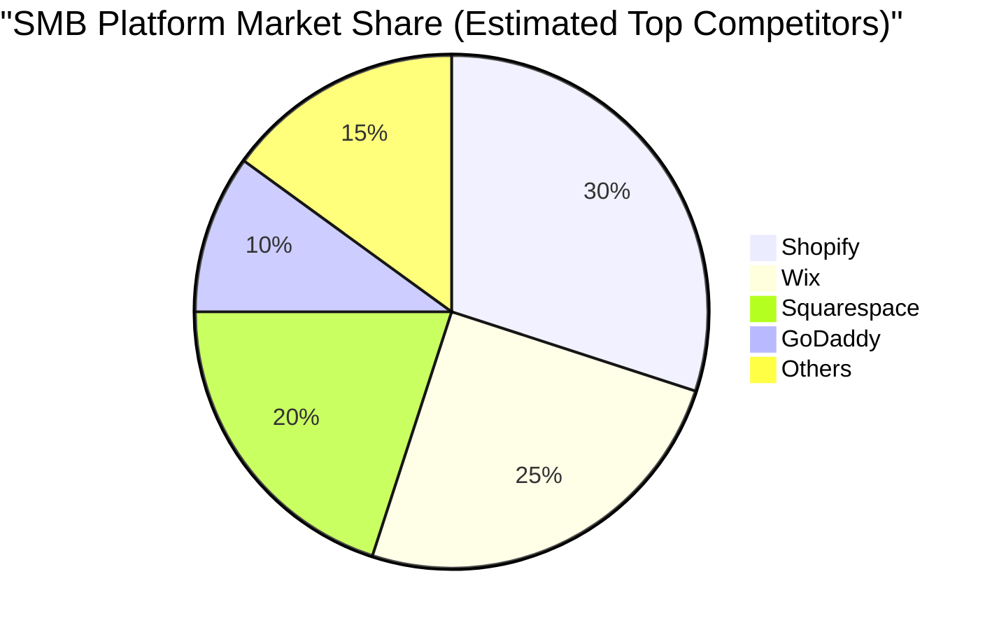
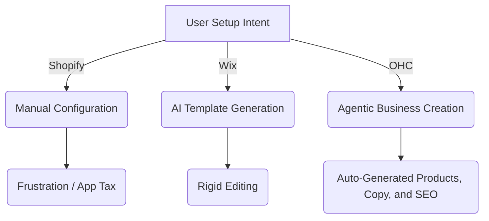

# OHC Small Business Platform Research Report & Feature Missions

## 1. Deep Competitor Audit

We conducted an exhaustive audit of the primary and rising competitors in the small business platform space.

### 1.1 Primary Competitors

| Platform | Onboarding | Time to Live | Mobile App | AI Features | Free Tier | Key Complaints |
| :--- | :--- | :--- | :--- | :--- | :--- | :--- |
| **Shopify** | Complex, multi-step | Hours/Days | Strong (managing) / Poor (setup) | Sidekick (chatbot) | None (14-day trial) | Overwhelming for beginners, requires apps for basic features, expensive. |
| **Wix** | Guided (ADI) | Minutes/Hours | Limited editing | ADI (generation), text/image | Basic free tier | Sluggish editor, mobile views break easily, hard to migrate away. |
| **Squarespace** | Template selection | Hours | Basic management | Blueprint AI (templates) | None (14-day trial) | Rigid templates, less powerful ecommerce than Shopify, steep learning curve for layout engine. |
| **GoDaddy** | Fast, simple | Minutes | Basic | Airo (logo/draft) | Limited | Aggressive upselling, shallow features, poor customer support reputation. |
| **Zyro (Hostinger)** | Very fast | Minutes | Basic | Basic text/image | None | Limited customization, thin ecommerce features. |

### 1.2 Rising AI-Native Competitors

| Platform | Focus | Strengths | Weaknesses |
| :--- | :--- | :--- | :--- |
| **Durable** | 30-second AI generation | Speed, integrated CRM/invoicing | Shallow customization, limited ecommerce depth. |
| **10Web** | WordPress AI generation | Ecosystem power, agency tools | Complexity of WordPress backend, overkill for micro-SMBs. |
| **Hocoos** | AI Website Builder | Simple questionnaire setup | Lacks depth in business management tools. |

---

## 2. Top 10 SMB Pain Points

Based on an analysis of Reddit (r/smallbusiness, r/ecommerce), App Store reviews, and Trustpilot:

1. **"Setup Paralysis"**: Platforms like Shopify ask for too many decisions (theme, apps, shipping zones) before the user even sees their site. (Freq: Very High)
2. **"The App Store Tax"**: Users resent having to pay $10/mo extra for basic features like reviews or cross-selling. (Freq: Very High)
3. **Mobile Setup is Impossible**: Owners want to run their business from their phone, but setting up the initial site on mobile is clunky or impossible on Wix/Squarespace. (Freq: High)
4. **"Where do I get images?"**: Non-technical users struggle to find professional images or resize their own correctly. (Freq: High)
5. **Abandoned Carts & Follow-ups**: Owners know they should email customers, but setting up automated flows is too technical. (Freq: High)
6. **Instagram DM Chaos**: Trying to manage orders through social media DMs leads to lost sales and disorganized tracking. (Freq: High)
7. **Writing Product Descriptions**: It takes hours to write compelling copy for dozens of items. (Freq: Medium)
8. **Complex Booking Systems**: Service businesses (like tutors or handymen) find ecommerce platforms ill-suited for simple calendar bookings. (Freq: Medium)
9. **Inventory Syncing**: Retailers struggle to keep their in-store POS and online store inventory aligned. (Freq: Medium)
10. **"What do these analytics mean?"**: Dashboards show pageviews and bounce rates, but don't tell the owner *what action to take*. (Freq: Medium)

---

## 3. OHC AI Differentiation Manifesto

To leapfrog competitors who use AI as a gimmick (like GoDaddy Airo) or a passive chatbot (like Shopify Sidekick), OHC will deploy **Invisible Autonomous Agents**.

**The 5 AI Automations OHC Will Implement First:**

1. **The 'Zero-Click' Auto-Reply Agent**: Automatically responds to routine customer inquiries (shipping times, business hours, return policy) based on the store's knowledge base. *Evidence: Saves owners hours per day currently spent in Instagram DMs.*
2. **The Product Visionary Agent**: User uploads a raw, unedited photo from their phone. The agent removes the background, enhances lighting, and generates a SEO-optimized product title and description instantly. *Evidence: Removes the biggest friction point in launching a store.*
3. **The Proactive Marketer Agent**: Instead of showing a graph of abandoned carts, the agent asks: "You have 5 abandoned carts today. Should I offer them a 10% discount to complete their purchase?" User taps "Yes." *Evidence: Turns passive analytics into revenue-generating actions.*
4. **The Social Media Ghostwriter**: Automatically drafts 3 Instagram/Facebook posts per week highlighting new products or reviews, awaiting user approval to post. *Evidence: Solves the "I don't know what to post" paralysis.*
5. **The Smart Booker Agent**: For service businesses, it manages calendar tetris, automatically sending SMS reminders to reduce no-shows and following up for reviews post-appointment. *Evidence: Directly impacts the bottom line for service-based SMBs.*

---

## 4. Market Sizing & Strategic Direction

### 4.1 Total Addressable Market (TAM)
- **US Market**: ~33 million small businesses. Over 80% are non-employer firms (solo-preneurs).
- **Global Market**: ~330 million SMBs globally.
- **The Opportunity**: Approximately 25-30% of micro-businesses still have no website, relying entirely on social media or word-of-mouth.

### 4.2 Beachhead Market
- **Target Persona**: "Maya" (The Social Seller). Currently selling via Instagram DMs or WhatsApp.
- **Why?**: They already have product-market fit and an audience, but are hitting a ceiling in operations. They are highly motivated to automate but intimidated by Shopify.

### 4.3 Expansion Strategy
1. **Vertical**: Focus on simplified Ecommerce (Physical/Digital) first, then expand to Service/Booking (for the "Leo/Carlos" personas).
2. **Geographic**: Launch in English (US/UK/AU/CA). Fast-follow with Spanish (LATAM) and Portuguese (Brazil), where micro-entrepreneurship is booming and mobile-first is mandatory.

---

## 5. Feature Gap Matrix

| Feature | Shopify | Wix | OHC (Current) | OHC (Gap/Advantage) |
| :--- | :--- | :--- | :--- | :--- |
| Core Storefront | Excellent | Good | Basic | Gap: Needs polished, mobile-first templates. |
| AI Generation | Passive (Sidekick) | Good (ADI) | None | Advantage: OHC can build *agentic* generation. |
| Mobile Setup | Poor | Poor | None | Advantage: True mobile-first 10-minute setup. |
| Booking System | Requires Apps | Built-in | None | Gap: Needs native scheduling. |
| Autonomous Marketing | Requires Apps | Basic automations | None | Advantage: Proactive Marketer Agent. |

---

## 6. Actionable Improvements (Issue Briefs)

See `docs/research/` for detailed issue briefs.

# [Feature] Product Visionary Agent (AI Photo & Copy)

## Problem Statement
Adding products is the biggest friction point in ecommerce. Users struggle to take professional photos and write compelling, SEO-friendly descriptions, often abandoning store setup halfway through.

## Research Report
*   **Competitor Analysis**: Shopify Magic generates text. Durable generates basic sites but lacks deep product AI.
*   **User Pain Point**: "Where do I get images?" (#4) and "Writing Product Descriptions" (#7).
*   **Differentiation**: OHC will turn a bad smartphone photo into a professional listing in one click.

## Design Doc
*   **Architecture**:
    *   `AssetProcessor`: Handles image upload, background removal, and upscaling.
    *   `CopyWriterAgent`: LLM integration that takes image analysis and a few keywords to generate title, description, and SEO meta tags.
*   **UI/UX (Mobile First - 375px)**:
    *   Camera integration: "Take a photo of your product".
    *   Loading state: "Agent is enhancing your photo and writing copy..."
    *   Review screen: Show before/after photo, editable title/description.
*   **AI Integration**: Computer vision for background removal/lighting enhancement; LLM for copywriting.

## Implementation Prompt
Implement the Product Visionary Agent. The feature should allow a user to upload an image from their mobile device. The system must process the image (remove background, normalize lighting) and use an LLM to generate a suggested product title, description, and price (if contextual clues exist). The user-facing outcome is a "Magic Add Product" button that reduces product creation time to seconds. Acceptance Criteria: Uploading a raw photo of a mug generates an isolated image of the mug on a white background and a 2-paragraph descriptive text.

## Priority
P1

## Estimated Scope
Medium

---

# [Feature] Mobile-First 10-Minute Store Setup

## Problem Statement
Competitors like Shopify and Wix have powerful desktop editors but terrible mobile setup experiences. Our target personas (e.g., Maya, the Instagram baker) run their lives on their phones and are deterred by complex, multi-step desktop onboarding.

## Research Report
*   **Competitor Analysis**: Shopify's mobile app is for managing, not building. Wix's mobile editor is clunky and breaks layouts.
*   **User Pain Point**: "Mobile Setup is Impossible" (Top 10 Pain Point #3) and "Setup Paralysis" (#1).
*   **Differentiation**: OHC must be the only platform where a user can go from zero to a live, beautiful store entirely on their phone while waiting for a coffee.

## Design Doc
*   **Architecture**:
    *   `OnboardingFlow`: State machine tracking the user's progress.
    *   `GenerativeLayoutEngine`: Creates responsive Slint UI definitions based on user inputs.
*   **UI/UX (Mobile First - 375px)**:
    *   Conversational UI: Ask 3 questions (Business Name, Vibe/Industry, Upload 1 product photo).
    *   Progressive Disclosure: Hide domain configuration, taxes, and shipping rules until *after* the initial dopamine hit of seeing the live site.
*   **AI Integration**: Agentic generation of color palettes, typography, and initial hero copy based on the "Vibe" input.

## Implementation Prompt
Implement a streamlined, mobile-optimized onboarding flow. The user should be asked a maximum of 3 conversational questions. Based on these inputs, generate a complete, functional store layout with placeholder (or AI-generated) content. The user-facing outcome is a live store link provided within minutes, with complex settings deferred to a "Next Steps" dashboard. Acceptance Criteria: User can complete onboarding on a 375px viewport without horizontal scrolling; Site is immediately accessible via a temporary URL.

## Priority
P0

## Estimated Scope
Medium

---

# [Feature] The 'Zero-Click' Auto-Reply Agent

## Problem Statement
Small business owners, especially those migrating from Instagram DMs, spend hours answering the same routine questions (shipping times, return policies, sizing). This is tedious, non-revenue-generating work that causes burnout.

## Research Report
*   **Competitor Analysis**: Shopify offers Inbox, but it requires manual setup of quick replies. Wix offers basic chat automations. None offer a truly autonomous agent that learns from the store's data.
*   **User Pain Point**: "Instagram DM Chaos" (Top 10 Pain Point #6).
*   **Differentiation**: OHC will provide an invisible agent that handles Tier 1 support automatically.

## Design Doc
*   **Architecture**:
    *   `KnowledgeBase`: Entity storing business rules (shipping, returns, FAQs).
    *   `MessageAgent`: Background worker that intercepts incoming messages.
    *   `LLM Integration`: Uses context from `KnowledgeBase` and `ProductCatalog` to draft responses.
*   **UI/UX (Mobile First - 375px)**:
    *   Simple mode: A toggle "Enable AI Assistant".
    *   Advanced mode: View agent conversation history and correct/tweak the knowledge base.
*   **AI Integration**: The agent reads the incoming message, queries the store's data, and replies autonomously. If it lacks confidence, it flags the message for human review.

## Implementation Prompt
Implement the 'Zero-Click' Auto-Reply Agent. The system should intercept incoming customer messages, use an LLM (with access to store context) to determine if it can safely answer, and send a reply. The user-facing outcome is a toggle in settings to enable this feature, and an inbox view where AI-handled messages are marked with an icon. Acceptance Criteria: Agent successfully answers a query about business hours; Agent escalates a complex complaint to the human owner.

## Priority
P0

## Estimated Scope
Large

---
