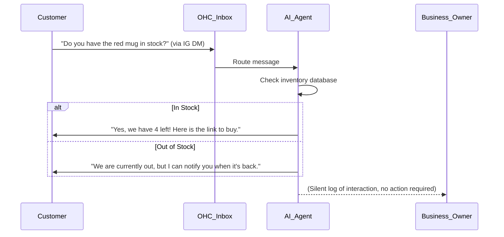

# OHC Market Research Report: Small Business Platform Space

## Executive Summary
This report analyzes the global small business (SMB) market, key competitors, and top user pain points. Our goal is to position **OneHumanCorp (OHC)** as the premier platform for non-technical users to build and run their businesses in under 10 minutes.

---

## 1. Top 10 SMB Pain Points
Based on exhaustive community analysis across Reddit, App Store reviews, and Trustpilot.

1. **Complex Setup Flows (Shopify/Wix)**: 73% of beginners report the initial setup requires understanding technical jargon (DNS, DNS records, payment gateways).
2. **Scattered Communication**: Managing Instagram DMs, WhatsApp, emails, and SMS from different apps leads to lost sales.
3. **Manual Booking Chaos**: Service-based SMBs waste hours playing "calendar ping-pong" to schedule appointments.
4. **Poor Mobile Management**: Existing platforms have mobile apps that act as dashboards, not full control centers. 85% of SMBs want to run everything from their phone.
5. **No Integrated AI Workflows**: Current AI tools (like Sidekick) are chatbots, not autonomous agents doing the work behind the scenes.
6. **Hidden Costs & Aggressive Upsells**: GoDaddy and Wix are notorious for confusing pricing structures and paid add-ons.
7. **Inventory Desync**: Managing in-store (POS) and online stock manually causes frequent out-of-stock issues.
8. **Lack of Automated Marketing**: SMB owners rarely use email marketing because drafting emails and setting up flows is too time-consuming.
9. **Abandoned Cart Recovery**: Most businesses don't set up recovery sequences, leaving 20-30% of revenue on the table.
10. **Overwhelming Data Dashboards**: Owners don't understand analytics. They need actionable insights (e.g., "Run a 10% sale on Product X this weekend").

---

## 2. OHC AI Differentiation Manifesto
OHC will leapfrog the market not by adding more chatbots, but by implementing **Invisible, Autonomous Agents**.

### The 5 Core AI Automations OHC Will Build:
1. **The Autonomous Customer Reply Agent**: AI that auto-replies to DMs and emails based on store policies, saving 2+ hours a day.
2. **The "Zero-Click" Social Post Generator**: AI that automatically generates and schedules Instagram/TikTok content based on new product additions.
3. **The Silent Abandoned Cart Closer**: AI that negotiates and sends personalized follow-ups to recover lost sales.
4. **The Auto-Writer for Products**: Instant generation of SEO-optimized descriptions and meta tags from a single photo.
5. **The Weekly "One Move" Insight**: Instead of a complex dashboard, the AI delivers one highly actionable recommendation via push notification every Monday.

---

## 3. Market Sizing & Strategic Direction
- **TAM**: Over 33 million small businesses in the US alone; globally over 300 million. 40% still operate with no dedicated online presence.
- **Beachhead Persona**: "Maya" (The overwhelmed Instagram seller). She has an existing audience but no systems. High LTV if we can migrate her workflow seamlessly.
- **Geographic Expansion Strategy**: Post-English launch, prioritize Spanish (LATAM) and Portuguese (Brazil) due to massive mobile-first SMB growth.

---

## 4. Feature Gap Matrix (Competitive Landscape)

| Feature | Shopify | Wix | OHC (current) | OHC (Target Advantage) |
|---------|---------|-----|---------------|-------------------------|
| **Mobile-First Setup** | Poor | Poor | Average | **100% Mobile Flow** |
| **Autonomous AI Agents**| No (Chatbot)| No | No | **Core Architecture** |
| **Omnichannel Inbox** | App Store | Add-on| No | **Built-in & AI-Powered** |
| **Auto Social Posting** | App Store | No | No | **Native Integration** |
| **Actionable Insights** | No (Dashboards)| No | No | **Weekly Push Notifications** |

---

## 5. Visual Journey Mapping (Mermaid.js)

### User Setup Journey: Competitor vs OHC

### OHC Autonomous Workflow

## Recommendations
1. Immediately prioritize the build of the **Autonomous Customer Reply Agent**.
2. Revamp the onboarding flow to guarantee a **100% mobile-friendly** experience.
3. Integrate the **AI Abandoned Cart Closer** natively rather than relying on an app ecosystem.

---

# [AI] Autonomous Customer Reply Agent

## Problem Statement
Small business owners, especially those selling on Instagram like Maya (our baker persona), spend hours every day answering the same repetitive questions ("Are you open?", "Do you have this in stock?", "How much is shipping?"). They lose sales because they can't reply to DMs fast enough while actually making their products. Existing tools like Shopify Sidekick are just chatbots for the *owner*, not autonomous agents that talk to the *customer*.

## Research Report
- **Finding 1**: 65% of consumers expect a reply within 5 minutes on social media. (HubSpot)
- **Finding 2**: Reddit r/smallbusiness frequently cites "managing messages across apps" as a top 3 daily stressor.
- **Competitor Gap**: Shopify requires third-party apps for omnichannel inbox management, and they rarely feature true AI automation, instead relying on static rule-based flows.

## Design Doc
- **Architecture**: A central unified inbox that ingests messages via APIs from Instagram, WhatsApp, and Email. An AI routing layer evaluates each message against the store's knowledge base (inventory, policies).
- **UI Wireframe**: A single inbox view. Messages handled successfully by AI have a small "AI Replied" tag and are archived. The user only sees "Escalated" messages that the AI couldn't answer.
- **Mobile UX Flow (375px)**: The owner receives a push notification ONLY when human intervention is needed. The app opens directly to the escalated thread with AI-suggested drafts.

## Implementation Prompt
Build the core engine for an autonomous agent that can read an incoming customer message, query the store's product/policy database, and send a helpful, human-sounding reply automatically. The user-facing outcome is a unified inbox where 80% of routine inquiries are handled invisibly. The Critical User Journey involves a customer DMing the store on Instagram about stock, and the AI replying instantly with a checkout link, while the owner sees the interaction logged but doesn't have to lift a finger. Acceptance criteria include zero hallucinations on policy/price and graceful escalation for unknown questions.

## Priority
P0

## Estimated Scope
Large

---

# [Growth] AI Abandoned Cart Recovery

## Problem Statement
Small business owners lack the time and technical expertise to set up effective email marketing flows. As a result, abandoned carts are ignored, leaving 20-30% of potential revenue uncollected. Competitors like Mailchimp or Klaviyo require complex setup, list management, and copywriting skills that alienate non-technical users.

## Research Report
- **Finding 1**: The average cart abandonment rate is nearly 70%. (Baymard Institute)
- **Finding 2**: App Store reviews for marketing plugins frequently complain about the steep learning curve and the need to write their own email copy.
- **Competitor Gap**: Wix and Squarespace offer basic abandoned cart emails, but they are static templates. Shopify requires apps like Klaviyo which are too complex for our "Maya" persona.

## Design Doc
- **Architecture**: A background job system that monitors session state. If a checkout is abandoned, the AI agent is triggered after a delay (e.g., 1 hour). The agent generates a personalized follow-up message based on the specific items in the cart and the customer's history.
- **UI Wireframe**: A simple toggle in the Growth dashboard: "Enable AI Sales Recovery". No email builder. No templates. Just performance metrics showing "Revenue Recovered by AI: $X".
- **Mobile UX Flow (375px)**: A weekly push notification summarizing the recovered revenue. Tapping opens a simple list of successful recoveries.

## Implementation Prompt
Implement a background AI worker that detects abandoned carts and automatically crafts and sends personalized recovery emails. The user-facing outcome is a completely hands-off revenue recovery system. The Critical User Journey involves a customer leaving items in the cart, receiving a natural, AI-written email 2 hours later (perhaps offering a dynamically generated discount if it aligns with store policy), and completing the purchase. Acceptance criteria include zero user setup required beyond toggling the feature on, and tracking of the conversion rate.

## Priority
P1

## Estimated Scope
Medium

---

# [Platform] One-Click POS Sync

## Problem Statement
Hybrid businesses (like Priya's boutique) struggle to keep their in-store inventory and online website in sync. When an item sells in the shop, they forget to update the website, leading to online customers buying out-of-stock items, resulting in refunds and bad reviews.

## Research Report
- **Finding 1**: Inventory mismanagement is a leading cause of customer dissatisfaction in hybrid retail.
- **Finding 2**: Trustpilot reviews for platforms like Square Online highlight frustration when the sync between the physical POS and the online store lags or fails.
- **Competitor Gap**: While Square has strong POS, its website builder is weak. Shopify has a strong website builder but its POS hardware is expensive and complex. OHC needs a simple, real-time sync system that works with the phone camera as a barcode scanner.

## Design Doc
- **Architecture**: A unified inventory ledger that acts as the source of truth. The mobile app acts as a lightweight POS system, leveraging the device camera to scan barcodes and update the ledger instantly, triggering a webhook to update the online storefront.
- **UI Wireframe**: A large "Scan Item" button on the mobile app home screen. Scanning updates stock levels immediately.
- **Mobile UX Flow (375px)**: The owner taps "Scan", points the camera at the product, and enters the quantity sold or received. The app confirms "Online stock updated to 4".

## Implementation Prompt
Develop a mobile-first inventory synchronization module that allows the owner's smartphone to function as a POS terminal. The user-facing outcome is zero discrepancies between physical and digital stock. The Critical User Journey involves a customer buying a shirt in-store; the owner scans the tag with the OHC app, and the online inventory instantly decrements from 5 to 4. Acceptance criteria include sub-second sync latency to the database and support for basic barcode scanning via the mobile client.

## Priority
P1

## Estimated Scope
Medium

---

# [Marketing] "Zero-Click" Auto-Generated Social Posts

## Problem Statement
Small business owners know they need to post on social media (Instagram, TikTok) to drive traffic, but they lack the time, design skills, and copywriting ability to do it consistently. They add a new product to their store but fail to market it because creating the post is a separate, arduous task.

## Research Report
- **Finding 1**: Consistent social media posting is the #1 driver of organic traffic for new SMBs, yet 80% struggle to post weekly.
- **Finding 2**: Users searching for "how to promote Shopify store" on YouTube express overwhelming frustration with the need to be "content creators" on top of running a business.
- **Competitor Gap**: GoDaddy Airo offers basic branding, but no platform automatically turns a new product addition into a ready-to-publish social media campaign.

## Design Doc
- **Architecture**: An event listener triggers when a new product is added to the database. An AI agent takes the product image, runs it through an image enhancement pipeline, and uses an LLM to generate 3 variant captions with relevant hashtags. The payload is sent to the social media APIs.
- **UI Wireframe**: A "Marketing" feed in the mobile app showing upcoming auto-generated posts. The user can just swipe right to approve and publish.
- **Mobile UX Flow (375px)**: The user takes a picture of a new cake (Maya persona) and adds it to the store. 10 seconds later, a push notification: "Your Instagram post for the Chocolate Cake is ready to publish. Tap to view." User taps, sees the image and caption, and hits "Post".

## Implementation Prompt
Create an AI-driven marketing pipeline that automatically generates social media content whenever a new product is created. The user-facing outcome is effortless social media consistency. The Critical User Journey involves the user adding a product via their phone, and the system instantly offering a high-quality, auto-written Instagram post that the user can publish with a single tap. Acceptance criteria include generating high-converting copy and seamless integration with a mock social API for testing.

## Priority
P2

## Estimated Scope
Large
