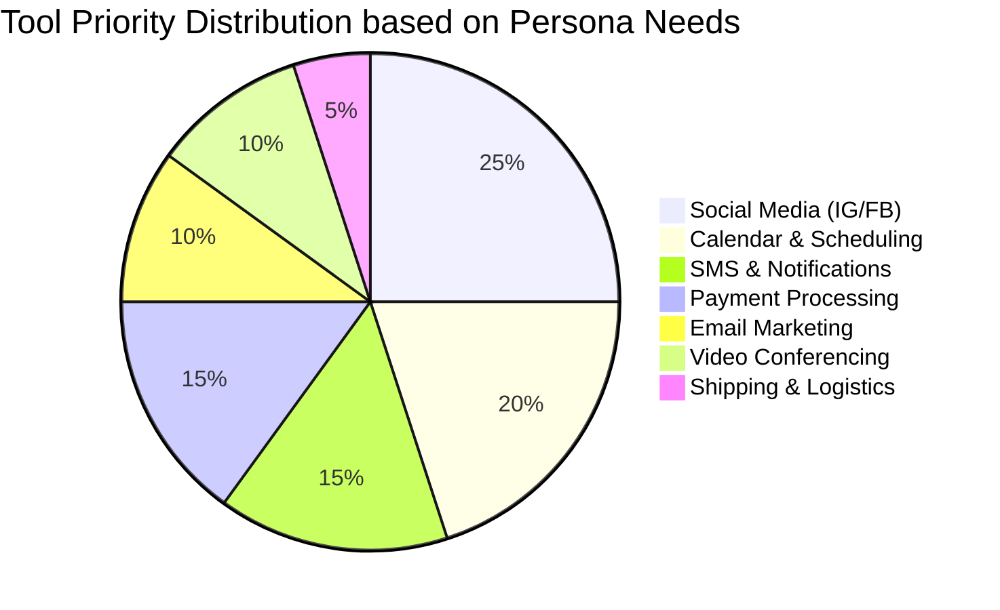
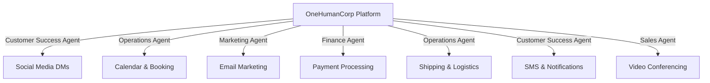

# Autonomous Task Definition: Tool Integration Research Report

## Executive Summary
This report analyzes 7 core tool categories identified for integration into the OneHumanCorp (OHC) platform. It assesses leading tools across Social Media, Calendar & Scheduling, Email Marketing, Payment Processing, Shipping & Logistics, SMS & Notifications, and Video Conferencing to empower our non-technical small business personas.

```yaml
issue_id: OHC-INT-001
status: Proposed
```

## Persona-Specific Pain Point Summaries

| Persona | Key Pain Points |
|---|---|
| **Maya (Home Baker)** | Overwhelmed by IG DMs; manual custom order tracking; missed follow-ups. |
| **Carlos (Handyman)** | Missing appointments; manual quoting; needs SMS alerts for clients. |
| **Priya (Boutique Owner)** | Managing in-store vs. online inventory; manual email campaigns for new stock. |
| **Leo (Music Tutor)** | Zoom link creation hassle; manual calendar sync; missing no-show reminders. |
| **Fatima (Food Cart)** | Needs low-friction pre-order flows; heavy reliance on SMS due to language limits. |

## Competitive Landscape & Feature Gap Heatmap





---

## 1. Social Media Integration
**Tool Evaluated:** Meta Graph API (Instagram & WhatsApp Business)

### Problem Statement
Maya receives dozens of IG DMs daily ("do you do vegan cakes?"). She loses track of orders in her DMs and cannot respond while she sleeps or bakes. She needs her OHC Customer Success Agent to automatically draft and send replies based on her catalog.

### Research Report
- **Tool:** Meta Graph API (Instagram Messaging API & Cloud API for WhatsApp).
- **Pros:** 100% market dominance for our personas. Deep native integration possible.
- **Cons:** OAuth flow can be confusing for non-technical users. Requires Facebook Business Page link.
- **Pricing:** WhatsApp charges per conversation. Instagram API is largely free for typical use limits.
- **Environment:** Works in Cloud; Standalone needs cloud-relay webhook handler.

### Design Doc
- **Trigger:** Webhook received from Meta when a DM is sent to the user's IG.
- **Action:** OHC "Customer Success" Agent processes the message, queries vector memory for business knowledge, and uses the API to send a reply.
- **User View:** A "Unified Inbox" in the OHC app showing IG and WhatsApp messages alongside web chat. A simple "Connect Instagram" button handles OAuth.

### Implementation Prompt
Implement the Meta Graph API integration to allow users to link their Instagram Professional account. OHC should receive DMs via webhooks and display them in a Unified Inbox UI. Ensure the "Connect" flow handles all OAuth steps gracefully and redirects the user back to the app on success or failure.

- **Priority:** P0
- **Estimated Scope:** Large

---

## 2. Calendar & Scheduling
**Tool Evaluated:** Google Calendar API

### Problem Statement
Leo (Music Tutor) and Carlos (Handyman) manage bookings manually. Double bookings happen frequently, and Leo forgets to send Zoom links. They need OHC to read their real-life availability and inject new bookings directly into their phone's calendar.

### Research Report
- **Tool:** Google Calendar API
- **Pros:** Ubiquitous on Android and widely used on iOS. Robust API.
- **Cons:** Tricky edge cases with recurring events and timezones.
- **Pricing:** Generous free tier.
- **Environment:** Works seamlessly in both Cloud and Standalone (OAuth).

### Design Doc
- **Trigger:** A customer books a time slot on the public OHC profile.
- **Action:** Operations Agent checks real-time availability via Google Calendar API, creates the event, and stores the event ID.
- **User View:** A "Sync with Google Calendar" toggle in the Operations settings. Bookings appear natively on the user's phone calendar.

### Implementation Prompt
Build an integration with Google Calendar API. Add a "Sync Google Calendar" button in the Operations settings. When synced, the booking engine must block out times where the user has existing Google Calendar events (busy). When a new OHC booking is made, insert it into their Google Calendar.

- **Priority:** P0
- **Estimated Scope:** Medium

---

## 3. Email Marketing
**Tool Evaluated:** Resend

### Problem Statement
Priya wants to tell her 500 local customers that new summer dresses arrived, but she doesn't know how to use Mailchimp. She needs OHC's Marketing Agent to automatically draft and send a beautiful email.

### Research Report
- **Tool:** Resend API
- **Pros:** Extremely developer-friendly, fast, excellent deliverability.
- **Cons:** Lacks built-in visual drag-and-drop builders (but our AI generates the HTML, so this is fine).
- **Pricing:** Very affordable ($20/mo for 50k emails).
- **Environment:** Cloud only (relies on verified domains).

### Design Doc
- **Trigger:** Priya tells the Marketing Agent, "Email my customers about the new summer dresses."
- **Action:** Agent generates React Email template, fetches the customer list from the CRM, and dispatches via Resend API.
- **User View:** A simple prompt box in the Marketing tab. The user reviews the drafted email visually and clicks "Send."

### Implementation Prompt
Integrate the Resend SDK. Create a service that accepts HTML content (generated by the Marketing Agent) and a list of customer IDs. Resolve the customer IDs to emails using the tenant's CRM database, and send the batch email via Resend. Display delivery status (sent, bounced) in the OHC app.

- **Priority:** P1
- **Estimated Scope:** Medium

---

## 4. Payment Processing (Alternative Markets)
**Tool Evaluated:** Mercado Pago

### Problem Statement
While Stripe covers the US/EU, OHC users in Latin America cannot use it. A user in Brazil or Mexico needs to accept local payment methods (like PIX in Brazil) to get paid for their services.

### Research Report
- **Tool:** Mercado Pago API
- **Pros:** Dominant in LATAM. Supports local alternative payment methods natively.
- **Cons:** API documentation can be fragmented. Settlement times vary by country.
- **Pricing:** Varies locally (typically ~3.99% + fixed fee).
- **Environment:** Cloud and Standalone.

### Design Doc
- **Trigger:** Customer initiates checkout from a LATAM-based OHC storefront.
- **Action:** Finance Agent creates a Mercado Pago preference and redirects to the payment screen or displays a PIX QR code.
- **User View:** Business owners in supported countries see "Connect Mercado Pago" instead of Stripe. Customers see local payment options.

### Implementation Prompt
Implement Mercado Pago as an alternative payment provider. Abstract the payment layer so the storefront checkout flow can seamlessly switch between Stripe and Mercado Pago based on the tenant's region settings. Ensure webhook handlers process payment confirmation for PIX and credit cards.

- **Priority:** P2
- **Estimated Scope:** Large

---

## 5. Shipping & Logistics
**Tool Evaluated:** Shippo API

### Problem Statement
Priya ships clothing across the country. She currently goes to the post office and types addresses manually to get shipping rates. She needs OHC to calculate shipping at checkout and give her a ready-to-print label.

### Research Report
- **Tool:** Shippo API
- **Pros:** Unified API for USPS, UPS, FedEx, DHL. Great rates.
- **Cons:** Requires accurate weight/dimensions for products.
- **Pricing:** $0.05 per label + postage (very cheap).
- **Environment:** Cloud and Standalone.

### Design Doc
- **Trigger:** Customer enters shipping address at checkout; Priya clicks "Fulfill" on an order.
- **Action:** Operations Agent fetches live rates during checkout. Upon fulfillment, purchases the label via Shippo.
- **User View:** Customers see exact shipping costs. Priya sees a "Print Label" button on the order detail screen.

### Implementation Prompt
Integrate the Shippo API to provide real-time shipping rate calculation at checkout based on cart weight and destination address. Add a flow in the order management UI allowing the user to purchase and download a PDF shipping label for standard orders.

- **Priority:** P2
- **Estimated Scope:** Medium

---

## 6. SMS & Notifications
**Tool Evaluated:** Twilio

### Problem Statement
Fatima's food cart customers need to know when their order is ready for pickup. They don't check email, and Fatima doesn't have time to call them. She needs the system to text them automatically.

### Research Report
- **Tool:** Twilio Programmable SMS
- **Pros:** Global reach, highly reliable.
- **Cons:** A2P 10DLC compliance in the US is strict and requires business registration.
- **Pricing:** ~$0.0079 per message in the US.
- **Environment:** Cloud only (requires central webhook handling for replies).

### Design Doc
- **Trigger:** Fatima taps "Ready for Pickup" on the OHC mobile app.
- **Action:** Customer Success Agent dispatches an SMS via Twilio: "Your order from Fatima's Cart is ready!"
- **User View:** Seamless background process. Fatima just taps a button. Customer gets a text.

### Implementation Prompt
Integrate the Twilio Go SDK. Build an SMS notification service triggered by order state changes (`OrderReadyForPickup`, `OrderShipped`). The service must format a concise message and send it to the customer's phone number. Provide a UI toggle for users to enable/disable SMS notifications for their customers.

- **Priority:** P1
- **Estimated Scope:** Medium

---

## 7. Video Conferencing
**Tool Evaluated:** Zoom API

### Problem Statement
Leo teaches guitar online. He manually creates a Zoom meeting for every booking and emails the link to his students. He needs OHC to generate the link automatically when a student books a lesson.

### Research Report
- **Tool:** Zoom API (Server-to-Server OAuth or standard OAuth)
- **Pros:** The default choice for online meetings. Everyone has it installed.
- **Cons:** Zoom's app approval process is rigorous.
- **Pricing:** Free for basic 40-min meetings.
- **Environment:** Cloud (OAuth callback needed).

### Design Doc
- **Trigger:** A customer books a service marked as "Online Meeting".
- **Action:** Operations Agent calls Zoom API to create a meeting, retrieves the join URL, and attaches it to the booking record.
- **User View:** Leo sees "Zoom link attached" on his schedule. The student receives the link in their confirmation email and calendar invite.

### Implementation Prompt
Implement Zoom OAuth and Meeting creation. When a user creates a Service, add a "Location" option of "Online (Zoom)". If selected, require them to connect their Zoom account. When a booking occurs for this service, automatically generate a Zoom meeting link and include it in the confirmation payload.

- **Priority:** P2
- **Estimated Scope:** Medium

---

## Recommendations & Next Steps
1. **Immediate Focus (P0):** Social Media (IG) and Google Calendar integrations are critical for the Maya and Leo personas to adopt the platform.
2. **Design First:** Begin with the UI/UX mockups for the Unified Inbox (IG/WhatsApp) using the OHC Glassmorphism design system.
3. **Architecture:** Ensure the OHC Agent backplane can securely handle OAuth tokens per tenant without exposing them to the agent prompts directly.
