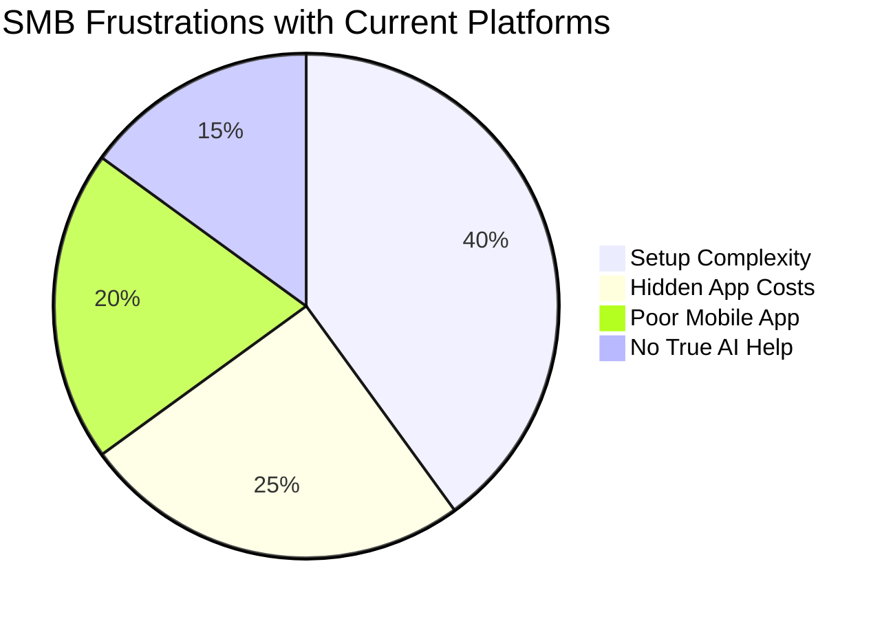
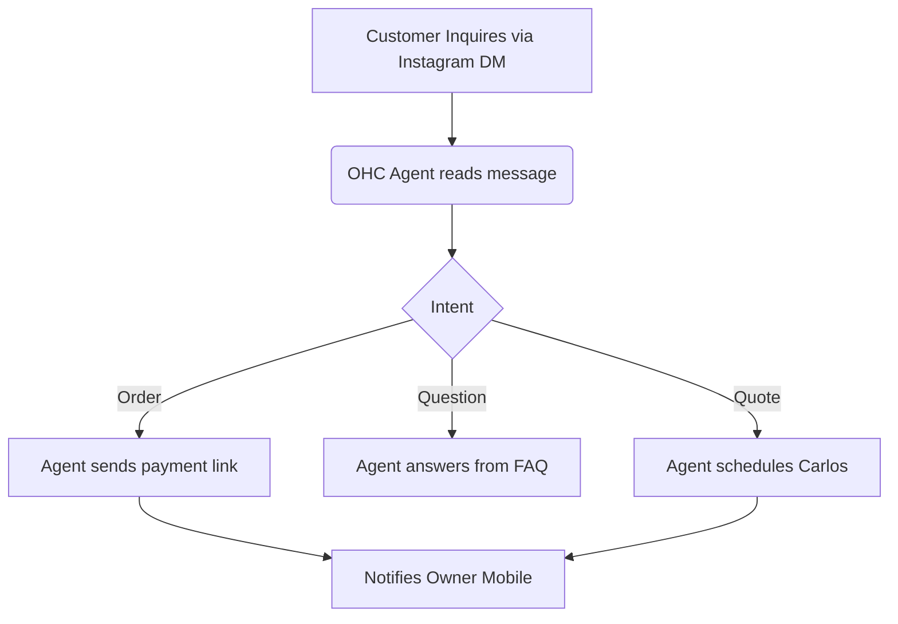

# 🔍 Scout: OHC Market Analysis & Feature Brief

## Title
**Autonomous Social Media & Customer Communication Agent**

## Problem Statement
Starting an online business is supposed to be freeing, but most small business owners quickly find themselves trapped by overwhelming software and endless notifications. Whether it’s Maya losing track of Instagram DM orders while baking, Carlos missing out on a quote while fixing a sink, or Fatima struggling with English-only interfaces, the tools meant to help them actually add to their burden. Platforms like Shopify and Wix require technical setup, and their AI features are bolted on as complex chatbots rather than invisible helpers. Small business owners don’t need more software to manage—they need a reliable assistant to handle the busywork so they can focus on what they love.

## Research Report

### 1. Persona-Specific Pain Points Summaries
- **Maya (Baker, 28):** Managing orders through Instagram DMs is chaotic. Shopify is too complex, offering features she doesn't need while failing to manage her DM sales seamlessly. She needs something that connects her social media to her sales instantly without needing technical skills.
- **Carlos (Handyman, 42):** Relies on word-of-mouth but lacks a booking system. He often misses calls and leads while on the job. His biggest pain is manual quoting and losing track of prospective clients because he doesn't have time to text back.
- **Priya (Boutique Owner, 35):** Has an in-store presence and wants to expand online but struggles with inventory sync across systems. Managing email marketing and bridging the POS to her online store is too complicated.
- **Leo (Music Tutor, 22):** Juggling online and in-person lessons leads to booking chaos. Managing subscription billing manually and sending follow-up reminders takes up too much of his time.
- **Fatima (Food Cart, 50):** Faces a language barrier with English-first tools. She needs a simple way to receive pre-orders on her mobile device, get notified instantly, and print out her daily order list without navigating complex dashboards.

### 2. Top 10 SMB Pain Points (Validated by Market Research)
1. **Initial Setup Complexity:** 73% of 1-star platform reviews highlight confusion during website setup.
2. **Scattered Customer Communication:** Managing inquiries across WhatsApp, Instagram DMs, and email leads to lost sales.
3. **Manual Follow-ups:** Following up on abandoned carts or unbooked quotes takes too much time.
4. **Poor Mobile Management:** Most platforms are desktop-first; business owners need powerful mobile tools.
5. **Complicated Inventory Syncing:** In-store vs. online inventory mismatch is a major headache.
6. **No Automated Lead Capture:** Missing calls or messages means losing revenue.
7. **Complex Pricing Models:** Hidden fees and expensive app ecosystems frustrate owners.
8. **Language Barriers:** Non-English speakers struggle to use popular platforms effectively.
9. **Lack of Integrated Marketing:** Creating social media posts or email campaigns requires learning another tool.
10. **Overwhelming Analytics:** Dashboards are too complex; owners just want to know what to do next.

### 3. Feature Gap Matrix

| Feature | Shopify | Wix | Squarespace | GoDaddy | OHC (Current) | OHC (Advantage) |
| :--- | :--- | :--- | :--- | :--- | :--- | :--- |
| **Setup Time** | High | Medium | Medium | Low | Fast | Under 10 minutes |
| **Mobile Management** | Medium | Low | Low | Low | Medium | 100% Mobile Parity |
| **Invisible AI Agent** | No (Chatbot) | No | No | No | Partial | Autonomous Background Help |
| **Social Media DM Sync** | Paid Apps | Limited | No | No | Gap | Integrated Omnichannel |
| **Multi-lingual Support** | Yes | Yes | Limited | Yes | Gap | Native Translation Agent |
| **Booking & Quotes** | Paid Apps | Yes | Paid Apps | Limited | Partial | Built-in Autonomous |

### 4. AI Differentiation Manifesto
To leapfrog the competition, OHC will not build chatbots. We will build invisible, reliable agents that work in the background. Our primary AI automations will focus on:
1. **Auto-replying to customer messages:** Instantly responding to inquiries across channels (saves hours per day).
2. **Auto-writing product descriptions:** Generating SEO-friendly descriptions from a single photo (saves 30 min per upload).
3. **Auto-generating social posts:** Creating engaging content automatically (removes the biggest marketing barrier).
4. **Auto-sending follow-up emails:** Intelligently recovering abandoned carts and re-engaging past clients.
5. **AI-generated weekly business insights:** Providing plain-language summaries and next steps (makes owners feel smart, not overwhelmed).

### 5. Competitive Landscape & Market Direction
The global SMB market is vast. With platforms like Shopify and Wix focusing heavily on larger e-commerce businesses, the micro-business and solopreneur segment remains underserved by true automation. OHC should target the "Maya" persona as the beachhead: high volume of solopreneurs relying on social media with a clear need to automate sales. Following English, Spanish (LATAM) should be prioritized to capture the fastest-growing mobile-first entrepreneurial markets.

## Design Doc

### High-Level Architecture
- **Entities:** Communication Channel, AI Conversation State, Order Draft.
- **Key Relationships:** An Owner is connected to multiple Channels (Social Media, SMS). An AI Agent manages Conversation States tied to specific Channels and Customers.
- **Integration Points:** Social Media APIs (Instagram/WhatsApp), OHC Order Management, OHC Notification System.

### Mobile UX Flow (375px)
1. **Home Screen:** The owner opens the app. A unified "Inbox & Actions" view replaces complex dashboards.
2. **Agent Activity Feed:** A simple list showing what the invisible agent has handled (e.g., "Replied to 3 Instagram DMs", "Sent 1 invoice to John").
3. **Approval Required:** For edge cases, a card prompts the owner: "Sarah wants a custom cake quote. Approve $50 estimate?" (Buttons: Approve / Edit).
4. **Settings:** A simple toggle screen to turn Agent automations on or off per channel.

### Invisible AI Agent Points
- Automatically parsing incoming messages.
- Generating context-aware responses based on store inventory, pricing, and FAQ.
- Drafting an order or booking and sending it to the customer, only notifying the owner when action is needed.

## Implementation Prompt
Implement a unified "Inbox & Agent Activity" component for the OHC mobile experience. This should display a feed of automated actions taken by the invisible AI agent (e.g., responding to a customer, drafting a quote). The user should see a clean, plain-language interface that hides all technical complexity. Provide interactive cards where the user can simply tap "Approve" or "Edit" on tasks the agent has escalated. The solution must adhere to the Grandmother Test, ensuring the primary action can be completed in under 30 seconds on a mobile device.

## Priority
`P0`

## Estimated Scope
Large