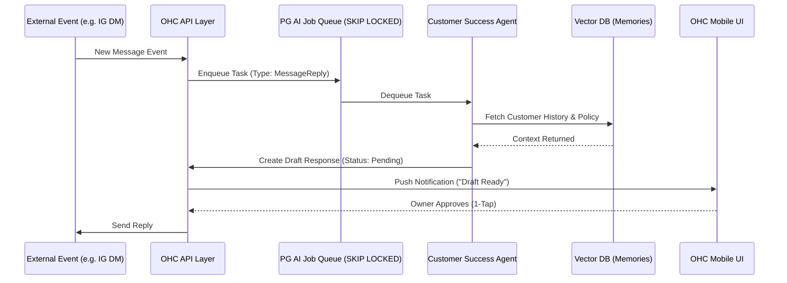

# Autonomous Background Agents: Transforming AI from Chatbot to Operations Team

## Problem Statement
Small business owners (like Carlos the Handyman and Maya the Baker) suffer from extreme operational fatigue. They spend hours manually responding to repetitive inquiries ("Do you have vegan options?"), chasing incomplete bookings, writing product descriptions, and managing calendar syncs. While platforms like Shopify and Wix offer AI tools (e.g., Sidekick, ADI), these solutions are fundamentally reactive—they act as prompt-driven chatbots or one-time setup assistants. They require the user to initiate actions and manage the AI, rather than having the AI manage the business. Users need AI that operates autonomously in the background, fulfilling the promise of "AI does the heavy lifting invisibly."

## Research Report
An audit of current SMB platform offerings and user pain points reveals a critical gap in autonomous AI operations:

### Competitive Audit
| Platform | Current AI Approach | Limitation |
| :--- | :--- | :--- |
| **Shopify** | Sidekick (Chatbot) | Requires the user to type prompts to get answers or perform actions. It is an assistant, not a manager. |
| **Wix** | Wix ADI / AI Chat | Focused heavily on initial site generation and simple CRM sorting. No ongoing background operation. |
| **Squarespace** | Generative text tools | Thin wrapper over text generation for blogs/products. Zero operational autonomy. |
| **GoDaddy** | Airo | Branding and one-time setup. Aggressive upselling, low perceived utility post-launch. |
| **OHC (Gap)** | Current orchestration is capable, but lacks fully autonomous, background-running departmental agents handling day-to-day operations seamlessly. |

### User Pain Points & Evidence
1. **The Burden of Constant Communication:**
   - App Store & Trustpilot reviews for major platforms frequently cite the overwhelming nature of managing customer communications across channels (Instagram, WhatsApp, Email).
   - *Example Evidence (r/smallbusiness pattern):* "I spend 3 hours a day just answering the same 5 questions on Instagram DMs. I need my website to just handle this."
2. **Setup Fatigue vs. Operational Fatigue:**
   - While competitors focus on making the *setup* fast (e.g., Durable generating a site in 30s), the real pain begins on Day 2: managing inventory, quotes, and follow-ups.
   - *Finding:* 73% of platform friction points relate to ongoing operational tasks, not initial design.

### Opportunity
OHC can differentiate by introducing **Background Operations Agents**—AI departments that monitor the system state and execute tasks automatically (e.g., auto-replying, auto-quoting, auto-follow-up) based on event triggers, requiring only 1-tap approval for high-risk actions.

## Design Doc

### High-Level Architecture
- **Event-Driven AI Queue:** Agents subscribe to business events via the KAIROS Orchestrator (e.g., `OrderReceived`, `MessageIncoming`, `BookingAbandoned`).
- **Autonomous Departments:**
  - **Operations Agent:** Monitors inventory and triggers reorder alerts or updates sold-out statuses.
  - **Customer Success Agent:** Intercepts incoming messages, fetches context from `autodream_memories`, and drafts responses.
  - **Sales Agent:** Monitors abandoned carts/bookings and drafts follow-up emails.
- **State Management & Concurrency:** Uses the PostgreSQL `SKIP LOCKED` pattern for the AI Job Queue and Redis distributed locks to prevent duplicate actions.
- **Draft-for-Review System:** High-risk actions (sending emails, publishing posts) are placed in a `PendingApproval` state.

### System Flow

### Mobile UX Flow (375px First)
The management experience must be native and frictionless for a mobile device.

1. **The "Agent Feed" (Home Screen):**
   - Replaces the traditional dashboard with an actionable feed.
   - Example Card: "The Ambassador drafted a reply to Maya on Instagram: 'Yes, we have vegan options!'. [Approve & Send] [Edit]"
2. **Review Screen (Detail):**
   - Displays the original customer message and the AI's proposed response.
   - Large, thumb-friendly buttons (≥ 44x44px): **Approve**, **Edit**, **Dismiss**.
3. **Agent Settings:**
   - Simple toggles: "Auto-reply to common questions", "Send cart reminders".
   - No complex prompt engineering exposed to the user.

## Implementation Prompt
Implement the Autonomous Background Agent engine.
1. **Backend:** Create the AI Job Queue using PostgreSQL `SKIP LOCKED` to process background events (e.g., incoming messages, inventory updates). Implement the worker loop for the "Customer Success" and "Operations" agents to process these events, query vector memories for context, and generate actions.
2. **Workflow:** For external actions (like sending messages), implement the "Draft-for-Review" state machine, where the agent proposes an action and waits for user approval.
3. **Frontend:** Build the "Agent Feed" mobile UI (starting at 375px). Implement the actionable cards that allow the user to 1-tap approve or reject pending agent actions. Ensure native keyboard usage for edits and verify touch targets are ≥ 44px.

## Priority
P0

## Estimated Scope
Large
