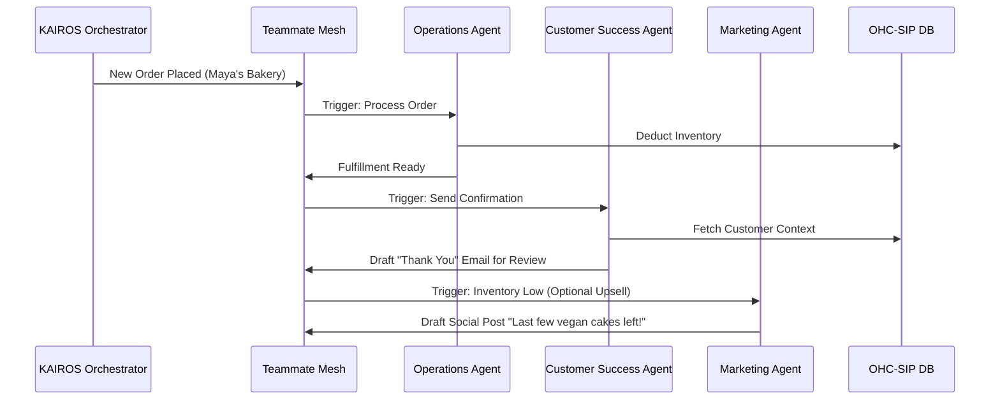

# Research Report: AI Agent Department Architecture

## Title
AI Agent Department Architecture: Autonomous Operations for Non-Technical Business Owners

## Problem Statement
Small business owners (Maya, Carlos, Priya) struggle with operational fatigue and technical jargon when managing their business online. Existing platforms (Shopify, Wix, Squarespace) treat AI as a reactive tool—requiring explicit prompts and manual execution. OHC needs an architecture where AI operates as an invisible, autonomous teammate, organized into functional departments that reflect real-world business structures.

## Research Report

### Market Analysis & Feature Gap
A review of the competitive landscape (Shopify, Wix, Squarespace, GoDaddy) reveals a critical gap in AI autonomy:
- **Shopify / Wix:** AI is treated as a "Sidekick" (reactive prompting).
- **Squarespace / GoDaddy:** Limited AI features, primarily focused on initial site generation.
- **OHC Vision:** AI must be autonomous, proactive, and structured into departments that work together invisibly.

**Feature Gap Matrix:**
| Platform | Setup Time | AI Integration | Mobile UX | AI Autonomy |
| :--- | :--- | :--- | :--- | :--- |
| Shopify | 30-60 min | Reactive Prompting | Poor for setup | Low |
| Wix | 20-40 min | Reactive Generation | Partial | Low |
| Squarespace | 30-60 min | Limited | No | None |
| GoDaddy | 20-40 min | Basic (Airo) | No | Low |
| **OHC (Target)** | **< 10 min** | **Departmentalized Teammates** | **100% Mobile-First** | **High (Autonomous)** |

## Design Doc

### High-Level Architecture
OHC AI agents are organized into 7 key functional departments:
1. **Operations ("The Manager"):** Order and booking processing, inventory tracking, fulfillment.
2. **Marketing & Advertising ("The Promoter"):** Website design, SEO, social media posts.
3. **Sales & Acquisition ("The Salesperson"):** Quote generation, lead follow-up.
4. **Customer Success ("The Ambassador"):** Message replies, review requests.
5. **Finance & Payments ("The Accountant"):** Payment processing, financial reports.
6. **Legal & Compliance ("The Protector"):** Terms/policies, license tracking.
7. **Business Advisory ("The Advisor"):** Weekly health reports, trend analysis.

### Architecture Diagrams (Mermaid.js)

**Inter-Departmental Coordination Sequence:**

### Key Design Decisions
- **Mobile-First UX (375px):** All agent actions requiring user approval utilize a "Draft-for-Review" UI flow. Business owners receive push notifications and can 1-tap approve or reject drafted communications from a native-feeling mobile interface.
- **Memory Access:** Agents use `autodream_memories` with `pgvector` for semantic context retrieval, allowing them to recall seasonal trends and customer preferences.
- **Multi-Tenant Budgeting:** Agent actions are throttled based on the SaaS tier (e.g., Free = 100 actions/mo, Starter = 1,000 actions/mo), enforced at the API layer. Actions must be strictly isolated using the `tenant_id` to prevent data leakage.

## Implementation Prompt
**To Implementer Agent:**
Implement the core KAIROS Orchestrator routing for the 7 AI Agent Departments.
- Define the `ActionRisk` levels in the agent mission payload to distinguish between auto-executable actions and "Draft-for-Review" tasks.
- Create a unified queue in the database for pending approvals that the mobile-first dashboard can poll or receive via SSE.
- Implement the "Draft-for-Review" 1-tap approval API endpoints.
- Ensure all queries strictly enforce multi-tenant isolation using the `tenant_id`.
- Achieve 100% unit test coverage for the departmental routing logic. Do not prescribe specific database schemas or LLM inference engines—focus on the API contracts and the KAIROS state machine transitions.

## Priority
P0

## Estimated Scope
Large
