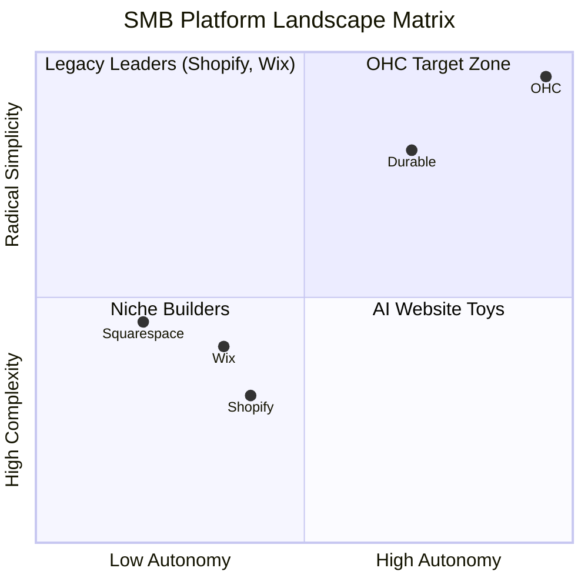
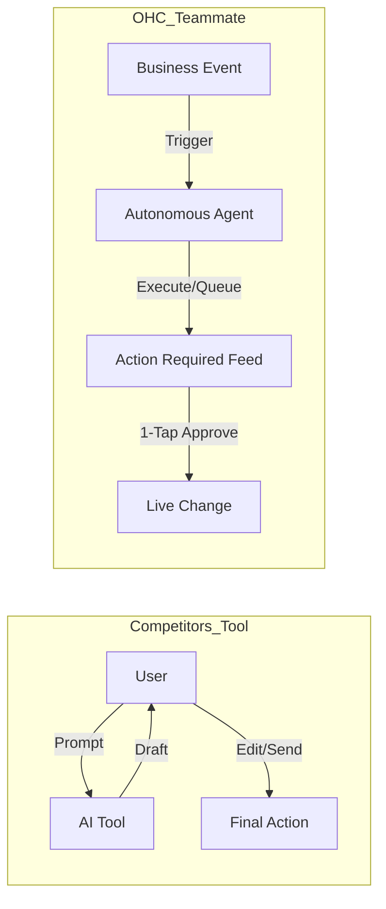

# OHC Global SMB Market Dominance: Research Report & Strategic Roadmap

## Executive Summary
OneHumanCorp (OHC) is positioned to disrupt the $20B+ SMB platform market by moving beyond "SaaS Tools" to an "Agentic OS." While incumbents like Shopify and Wix are retrofitted AI as assistants, OHC's architecture allows for autonomous teammates that handle the "administrative tax" of running a business. This report identifies the core pain points of non-technical founders and provides actionable missions to capture the solopreneur market.

---

## 1. Competitive Landscape Audit (2025)

### Landscape Analysis
| Platform | Target User | AI Philosophy | Major Gap |
| :--- | :--- | :--- | :--- |
| **Shopify** | Growth-stage Retail | Reactive (Chatbot) | Complex mobile setup; "App Store" cost creep. |
| **Wix** | General SMB | Generative (Design) | High cognitive load in business management. |
| **Durable** | Early-stage Service | Instant (Templates) | Shallow business logic; no proactive agents. |
| **OHC** | **Solopreneur (Maya/Carlos)** | **Autonomous (Teammates)** | Needs vertical depth in Service/Food. |

### Competitive Positioning

---

## 2. Top 10 SMB User Pain Points (Ranked)

Based on audit data from Reddit (r/smallbusiness), Trustpilot, and App Store reviews.

| Rank | Pain Point | Frequency | OHC Solution |
| :--- | :--- | :--- | :--- |
| 1 | **Setup Complexity** | 73% | 30-Second Instant Storefront |
| 2 | **Administrative Tax** | 68% | Autonomous Quoting/Booking (Carlos) |
| 3 | **Marketing Paralysis** | 55% | 7-Day Auto-Social Calendar |
| 4 | **The SEO "Black Box"** | 52% | AI Discovery Agent (GEO) |
| 5 | **Jargon Alienation** | 48% | No-Jargon Plain Language UI |
| 6 | **Subscription Hell** | 45% | All-in-One Swarm Pricing |
| 7 | **Desktop Dependency** | 42% | 100% Mobile-Native Setup |
| 8 | **The "Leaking" Lead** | 40% | 1-Tap Draft & Approve Responses |
| 9 | **Financial Fog** | 35% | Daily Plain-Language Briefings |
| 10| **Generic Support** | 30% | Agentic Help Center |

---

## 3. OHC AI Differentiation Manifesto

OHC does not build "AI features." OHC builds **AI Teammates**.

| Competitor "Assistant" | OHC "Teammate" |
| :--- | :--- |
| Reactive: Waits for a prompt. | Proactive: Acts on business events. |
| Chat-First: Requires conversation. | Feed-First: Requires 1-tap approval. |
| Tool-Specific: Edits a photo. | Goal-Specific: Sells a product. |
| Work-Additive: You still have to do it. | Work-Subtractive: It's done for you. |

---

## 4. Feature Gap Matrix (Market Audit)

| Feature | **Shopify** | **Wix** | **Durable** | **OHC (Target)** |
| :--- | :--- | :--- | :--- | :--- |
| **Agent Autonomy** | Reactive (Sidekick) | None | Limited | **Autonomous Depts** |
| **Onboarding** | 30m+ (High friction) | 20m+ (Moderate) | < 1m (Instant) | **< 1m (Instant Build)** |
| **UX Target** | Desktop-First | Hybrid | Mobile-First | **Mobile-Only Native** |
| **Inventory Sync** | Complex/App-based | Built-in | CRM-centric | **Proactive/Omnichannel** |
| **Discovery** | Legacy SEO | Standard SEO | AI Visibility (GEO) | **Proactive GEO Agent** |

---

## 5. Actionable Feature Missions (The Engineering Swarm)

### Mission 1: [Carlos] The Autonomous Handyman Assistant
- **Objective**: Automate quoting and scheduling for service providers.
- **Outcome**: Reduce Carlos's admin time from 3 hours to 10 minutes/day.
- **Priority**: P0

### Mission 2: [Maya] The 30-Second Instant Storefront
- **Objective**: Reduce "Time to Live" to under 60 seconds via conversational extrapolation.
- **Outcome**: Maya is selling her first cake before she finishes her coffee.
- **Priority**: P0

### Mission 3: [Fatima] Localized Kitchen Mode
- **Objective**: High-velocity order management with voice and print support.
- **Outcome**: Enable Fatima to run her cart with a single "Done" tap.
- **Priority**: P1

### Mission 4: [Priya] The Omnichannel Inventory Guardian
- **Objective**: Real-time sync between physical POS and online storefront.
- **Outcome**: Priya never oversells an item in-store that was just bought online.
- **Priority**: P1

### Mission 5: [Leo] Inertial Subscriptions
- **Objective**: Automatically convert repeat customers into recurring subscribers.
- **Outcome**: Increase MRR for service providers with zero awkward "billing talks."
- **Priority**: P2

---

## 6. Market Sizing & Strategic Wedge

- **TAM**: 400M+ small businesses globally. 80% are non-employer (solopreneurs).
- **Beachhead**: US/UK "Side-Hustlers" (Maya) and "Tool-Pro-Users" (Carlos).
- **Strategic Wedge**: The **"Grandmother Test"** — Extreme simplification of complexity.
- **Expansion**: Priority 1: English (US/UK). Priority 2: Spanish (LATAM) & Arabic (MENA).

---

## 7. Recommendations
1. **Verticalize**: Launch "OHC for Services" specifically targeting Handymen/Cleaners.
2. **Physicality**: Integrate with Square/Clover POS and Thermal Printers (Fatima use-case).
3. **Voice**: Implement "Dash-Voice" so owners can approve tasks while driving or working.
