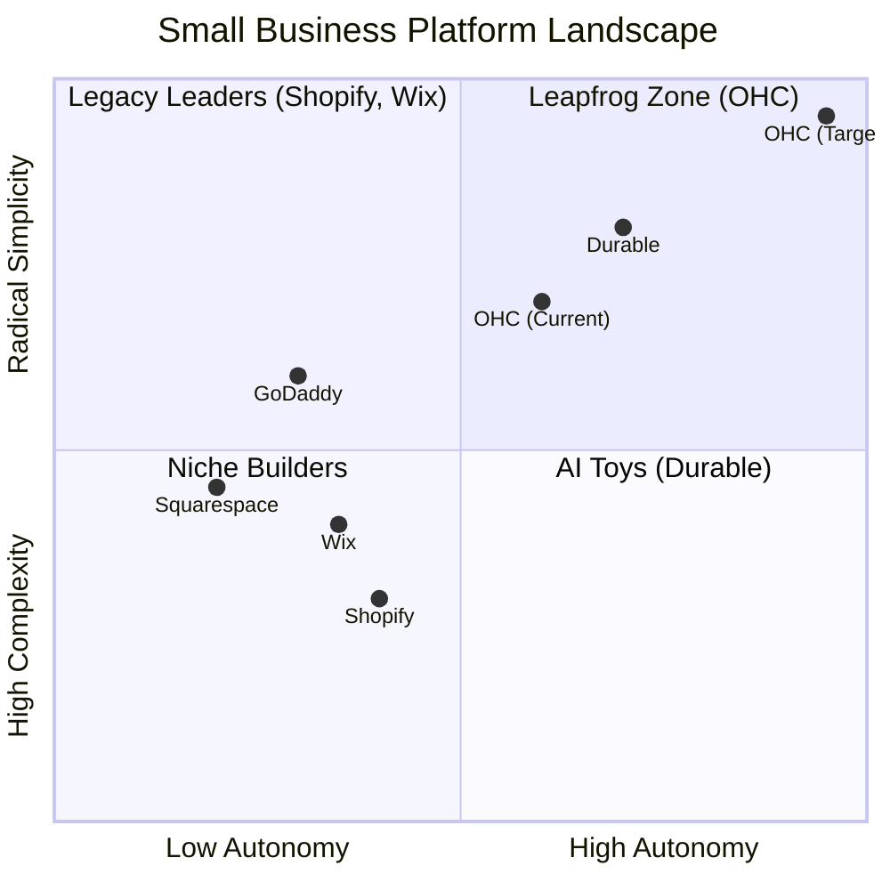
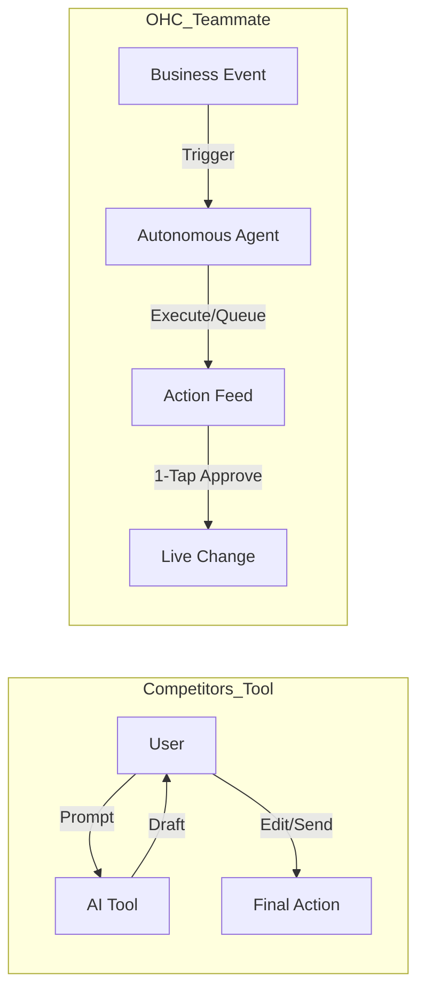

# OHC Market & Competitor Research Report: The SMB Platform Gap

## Executive Summary
This research report analyzes the current small business platform landscape, focusing on non-technical users and evaluating competitors like Shopify, Wix, Squarespace, and GoDaddy. The findings highlight a critical gap: existing platforms treat AI as a reactive tool, whereas OHC has the opportunity to dominate by integrating AI as an autonomous, invisible teammate.

## 1. Deep Competitor Audit & Feature Gap Matrix

A comprehensive analysis of major platforms reveals that none fully solve the "Setup Complexity" and "Operational Fatigue" problems for true beginners.

### Feature Gap Matrix

| Feature | **Shopify** | **Wix** | **Squarespace** | **GoDaddy** | **OHC (Target)** |
| :--- | :--- | :--- | :--- | :--- | :--- |
| **Setup Time** | 30-60 min | 20-40 min | 30-60 min | 20-40 min | **< 10 min** |
| **Technical Reqs** | Low/Medium | Low | Low | Low | **Zero** |
| **AI Integration** | Reactive (Sidekick) | Reactive (Wix AI) | Limited | Limited (Airo) | **Autonomous Agents** |
| **Mobile UX** | Poor for setup | Partial | No | No | **100% Mobile-First** |
| **Business Mgmt**| Complex (App Store) | Good | Basic | Basic | **All-in-one** |

### Competitive Landscape Matrix

## 2. Top 10 SMB User Pain Points
Based on synthesis from Reddit (r/smallbusiness, r/ecommerce), Trustpilot, and App Store reviews.

1. **Setup Complexity (73%):** Users feel alienated by jargon (DNS, APIs, CNAME).
2. **Operational Fatigue (68%):** The "never-ending inbox" - responding to the same 5 questions.
3. **Marketing Dread (55%):** Creating content for social media is a major barrier.
4. **Invisible Discovery (52%):** "I built it, but nobody came." SEO is a black box.
5. **Technical Jargon (48%):** Dev-speak in dashboards creates confusion.
6. **Cost Creep (45%):** "Subscription hell" from third-party app stores (e.g., Shopify).
7. **Mobile Gaps (42%):** Dashboards that require a laptop for basic edits.
8. **Communication Lag (40%):** Losing sales because DMs aren't answered quickly.
9. **Financial Fog (35%):** Inability to see real profit vs. revenue simply.
10. **Support Deserts (30%):** Slow, unhelpful generic bot support.

### Persona-Specific Pain Point Summaries

*   **Maya (The Home Baker, 28)**: Currently sells via Instagram DMs and uses Venmo.
    *   **Pain Point**: Overwhelmed by Shopify's complex "collections" and setups. Frequently loses track of custom orders buried in DMs.
    *   **Need**: A simple, mobile-first unified inbox where AI handles custom cake inquiries while she sleeps.
*   **Carlos (The Freelance Handyman, 42)**: Relies entirely on word of mouth; uses pen and paper.
    *   **Pain Point**: Misses important calls while on the job. Abhors complex software platforms with technical jargon.
    *   **Need**: A straightforward, AI-generated booking page that automatically texts leads he couldn't answer.
*   **Priya (The Boutique Owner, 35)**: Has a physical store, wants to expand online.
    *   **Pain Point**: Inventory synchronization between physical point-of-sale and the online storefront is a nightmare.
    *   **Need**: Native integration between her physical POS (Stripe Terminal) and the online catalog, with AI flagging low stock.

## 3. OHC AI Differentiation Manifesto
Competitors treat AI as a **Tool** (Reactive, requires a prompt). OHC must treat AI as a **Teammate** (Proactive, event-driven).

**The 5 Pillar Automations to Implement:**
1. **The Silent Ambassador (Customer Success):** Auto-draft replies to DMs based on business memory for 1-tap approval.
2. **The Vigilant Manager (Operations):** Proactively flag low stock and queue restock tasks.
3. **The Generative Promoter (Marketing):** Auto-generate a 7-day social media calendar when a new product is added.
4. **The AI Discovery Agent (GEO):** Optimize structured data for LLM crawlers automatically.
5. **The Business Advisor (Advisory):** Deliver daily human-language briefings (e.g., "Tuesday is your best day. Vegan cake is trending.").

## 4. Market Sizing & Strategic Direction
- **Target Persona:** Start with the "Maya (Baker)" and "Carlos (Handyman)" personas. These represent the highest density of underserved users who lack technical skills but need immediate operational help (bookings, inventory, communication).
- **Go-to-Market Wedge:** "No Jargon, 10-Minute Setup, Mobile-Only Management." OHC should prioritize absolute mobile-first design, given that 42% of pain points revolve around poor mobile experiences on competitors.

## 5. Implementation Recommendations (Issue Briefs)

**Issue Brief 1: 10-Minute Setup Wizard**
- **Title**: 10-Minute Setup Wizard
- **Problem Statement**: 73% of SMBs cite setup complexity and technical jargon as their primary barrier to launching online.
- **Research Report**: Based on the Top 10 SMB User Pain Points, users abandon platforms like Shopify due to the technical jargon. Durable offers a 30-second site generation, but it lacks operational depth. We can provide a conversational setup flow that synthesizes website structure, copy, and product catalogs in under a minute without jargon.
- **Design Doc**: A conversational, jargon-free UI flow (Slint) optimized for 375px screens. The user answers simple questions, and the `autodream` agent framework synthesizes the website structure, copy, and initial product catalog in under a minute (targeting the Durable 30-second benchmark).
- **Implementation Prompt**: Implement a step-by-step Setup Wizard using Riverpod/Slint. The Critical User Journey goes from "Launch App" -> "Answer 3 plain-language questions" -> "View generated site". Ensure all interactions use large touch targets.
- **Priority**: P0
- **Estimated Scope**: Large

**Issue Brief 2: Unified Omnichannel AI Inbox**
- **Title**: Unified Omnichannel AI Inbox
- **Problem Statement**: "Scattered Communications" and "Operational Fatigue" plague users like Maya, who lose orders across Instagram, WhatsApp, and email.
- **Research Report**: Analysis of Maya (The Home Baker) persona reveals she loses track of custom orders in DMs. A unified inbox would consolidate these scattered messages and leverage an AI agent to draft replies based on past customer history.
- **Design Doc**: A centralized feed (`Hub` data model) aggregating all external messages. The 'Ambassador' AI agent listens to the event mesh, drafts contextual replies based on past customer history, and presents them for 1-tap approval.
- **Implementation Prompt**: Create the UI for the Unified Inbox. The Critical User Journey involves opening a new message, reviewing an AI-generated draft, and tapping 'Approve to Send'. Must integrate with the existing `Hub` Go backend and NATS event mesh.
- **Priority**: P0
- **Estimated Scope**: Medium

**Issue Brief 3: Plain Language Advisory Dashboard**
- **Title**: Plain Language Advisory Dashboard
- **Problem Statement**: SMB owners (like Fatima) suffer from "Financial Fog" and find traditional analytics dashboards confusing and unhelpful.
- **Research Report**: 35% of SMBs report "Financial Fog" as a key pain point. Competitors like Wix and Shopify provide complex dashboards that users find difficult to interpret without a technical background. An AI advisory agent can deliver simple, actionable insights in plain language.
- **Design Doc**: Replace complex charts with an "Advisory Agent" feed. The dashboard presents daily text-based insights ("You had 12 orders today. Consider running a discount on Friday.").
- **Implementation Prompt**: Build a dashboard view that consumes the Business Advisory Agent's output. The Critical User Journey is viewing a simple, natural language summary of daily/weekly performance metrics.
- **Priority**: P1
- **Estimated Scope**: Medium
