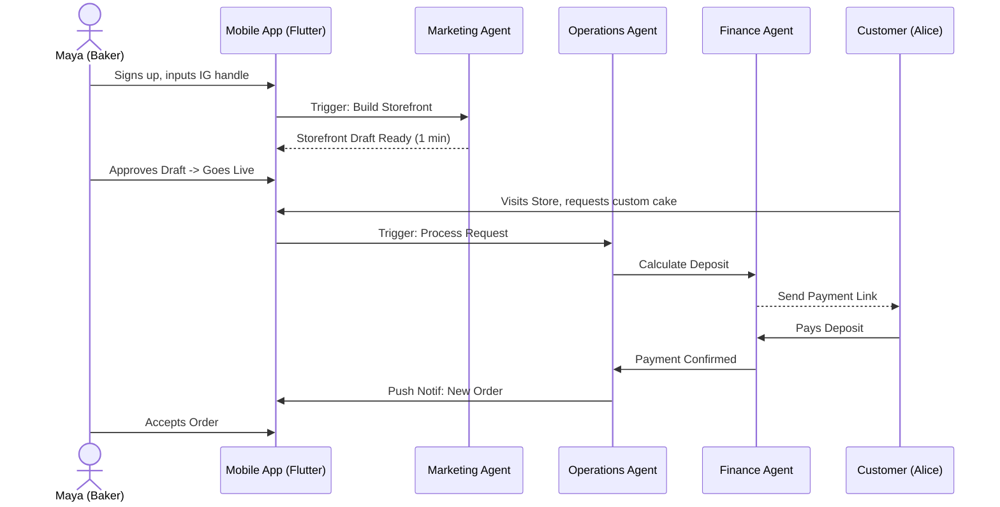

# [architecture] Business Journey Architecture Issue Brief

## Title
Business Journey Architecture: End-to-End User Journeys and AI Integration

## Problem Statement
The OneHumanCorp (OHC) platform aims to empower non-technical users to launch and manage their businesses in under 10 minutes. However, the exact sequence of events—from initial acquisition through onboarding, activation, retention, revenue, and referral—needs rigorous definition. Without a standardized, highly polished architectural flow for these journeys, the user experience risks becoming fragmented, confusing, and technical, undermining the core mission of radical simplicity. This document formalizes these critical user journeys for our key personas (Maya, Carlos, Priya, Leo, Fatima) to ensure consistent, AI-driven, and seamless experiences across the platform.

## Research Report
An analysis of the current market and competitor platforms reveals:
- **Shopify:** Complex onboarding (30-60 mins), steep learning curve, technical jargon. AI is bolted on (Sidekick).
- **Wix/Squarespace:** Simpler but still requires significant manual setup and design choices (20-40 mins).
- **GoDaddy:** Basic setups but lacks depth in business management tools.

**OHC's Differentiation:** We must achieve a <10 minute "zero-to-live" setup. This is only possible if AI Agents (Operations, Marketing, Sales, Customer Success) proactively manage the journey, shifting the paradigm from "user configuration" to "user approval."

### Persona Journeys

**Maya (Baker)**
- **Acquisition:** Instagram ad for "Setup your custom cake store in 5 mins."
- **Onboarding:** Wizard flow asking minimal questions (Business Name, Instagram Handle). AI Marketing Agent scrapes her Instagram to build the initial storefront.
- **Activation:** Receives her first deposit-based custom order.
- **Retention:** Daily morning brief via push notification from the Business Advisory Agent.

**Carlos (Handyman)**
- **Acquisition:** Word-of-mouth referral from another OHC user.
- **Onboarding:** Selects "Service Business," sets working hours, and lists 3 basic services. AI Legal Agent auto-generates terms.
- **Activation:** First customer books a time slot and pays a deposit.
- **Retention:** Immediate AI quote generation for new inquiries saves him hours of manual work.

## Design Doc

### Architecture Diagram (Maya's Journey)

### UI Wireframes & Mobile UX Flow (375px First)
1. **Welcome Screen:** "What's your business?" (Large, touch-friendly input field).
2. **AI Magic Screen:** "Building your store..." (Glassmorphism progress indicator, blur effects).
3. **Draft Review Screen:** Carousel of generated storefronts. "Looks good!" button (Bottom sheet, 44x44px touch target).
4. **Dashboard (Home):** Clean overview. "0 Orders Today." Prominent action button: "Share Store Link."

### AI Agent Integration Points
- **Onboarding:** Marketing Agent scrapes existing social presence to generate initial assets.
- **Activation:** Operations Agent handles the first transaction seamlessly, ensuring the user experiences the "aha" moment without manual configuration.
- **Retention:** Business Advisory Agent sends push notifications with actionable, plain-language insights (e.g., "Your vegan cakes are trending!").

### Key Design Decisions
- **Defer Complexity:** During onboarding, only ask for absolute essentials (Name, Primary Platform). Defer tax, advanced shipping, and detailed inventory setup until *after* the first sale or when explicitly needed.
- **Approval over Creation:** Users review AI-generated drafts rather than starting from scratch.
- **Mobile Native Keyboard:** All numerical inputs (pricing) use the native numeric keypad immediately.

## Implementation Prompt
**User-Facing Outcome:** The user should be able to complete the onboarding wizard and have a live, AI-generated storefront within 10 minutes on a mobile device.
**Critical User Journey (CUJ):** The Onboarding Flow. The user inputs their business name and an existing social media link. The Marketing Agent generates a store preview. The user approves it, and the store becomes publicly accessible.
**Acceptance Criteria:**
1. Flutter app must display the onboarding wizard.
2. The UI must be fully functional on a 375px width screen.
3. The KAIROS backend must successfully trigger the Marketing Agent to generate the storefront draft.
4. The user must be able to approve the draft via a 1-tap interaction.
5. The resulting storefront must be live and accessible via a unique URL.
6. The entire flow must be covered by a Playwright E2E test starting from login to the live storefront URL.

## Priority
P0 (Critical)

## Estimated Scope
Large
