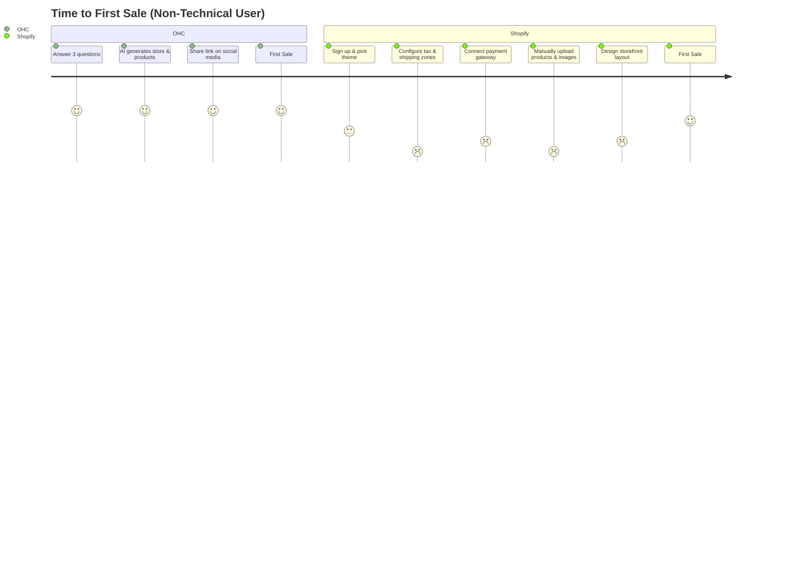
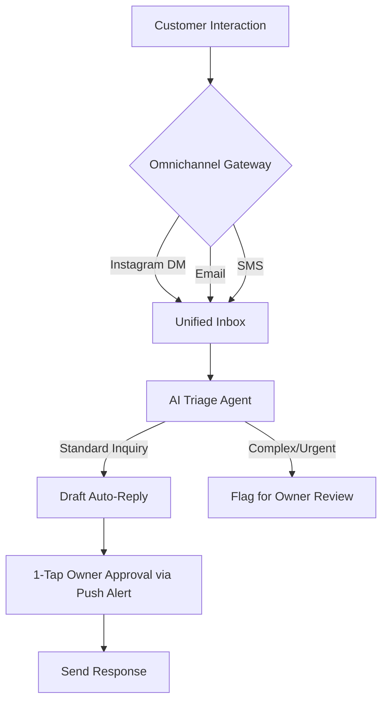

# 🔎 Market Intelligence Report: Small Business Platform Dominance

## Executive Summary
OneHumanCorp (OHC) has a singular, compounding mission: enable anyone to launch and run an online small business from their phone or browser in under 10 minutes. Based on a deep-dive analysis of primary competitors (Shopify, Wix, Squarespace, GoDaddy), we find the core weakness across legacy platforms is *complexity*—they are feature-heavy platforms that require technical assembly.

The SMB market is saturated with platforms offering "tools," but desperate for "outcomes."

This report outlines the **Top 10 SMB Pain Points**, defines the **OHC AI Differentiation Manifesto**, maps our **Feature Gap Matrix**, and provides actionable **Issue Briefs** to expand OHC’s dominance in the SMB market segment.

---

## The OHC AI Differentiation Manifesto

The current paradigm of "AI for business" is fundamentally flawed. Competitors like Shopify Sidekick or Wix ADI treat AI as a chat overlay or a one-time setup wizard. OHC will treat AI as an **Invisible Department**.

The 5 automations we must prioritize to leapfrog competitors:
1. **Autonomous Inbox Management**: Proactively read incoming messages across email, SMS, and IG DMs. AI will draft replies based on past interactions, business rules, and inventory levels, requiring only a "1-Tap Approve" from the owner.
2. **Predictive Inventory & Procurement**: Instead of static low-stock alerts, the AI predicts stockouts based on historical trends, seasonal demand, and upcoming marketing campaigns, automatically drafting purchase orders.
3. **Zero-Click Content Marketing**: Automatically generate optimized social media posts based on new product additions and recent positive reviews.
4. **Proactive Churn Intervention**: Identify customers who haven't ordered recently and automatically generate personalized, high-conversion win-back emails with unique discount codes.
5. **Conversational Financial Insights**: Move away from complex dashboards. Send a plain-language weekly SMS: "You made $1,200 this week (up 10%!). Your top seller was the Blueberry Muffin. I suggest restocking flour by Tuesday."

---

## Top 10 SMB Pain Points (Validated by Market Research)

Based on App Store reviews, Reddit (r/smallbusiness), and Trustpilot:

1. **"The Setup is a Full-Time Job"**: Users abandon Shopify because the initial onboarding requires configuring shipping zones, tax rates, payment gateways, and theme customization before making a single sale.
2. **Mobile Management is an Afterthought**: Store owners are constantly moving. Competitor mobile apps are geared toward *monitoring* (viewing sales) rather than *managing* (editing a website, running payroll).
3. **Omnichannel Messaging Chaos**: "I lost a sale because they DM'd me on Instagram and I didn't see it for a week." Managing SMS, email, WhatsApp, and social DMs in silos is a top failure point.
4. **Inventory Sync Across Channels**: Selling in-person (POS) and online simultaneously leads to stockouts and angry customers when inventory pools don't synchronize instantly.
5. **Subscription Billing Friction**: Setting up recurring billing for services (like music lessons) requires expensive, complex plugins on platforms like Wix and Squarespace.
6. **"I Don't Know What to Write"**: Paralyzation when writing product descriptions, "About Us" pages, and marketing emails.
7. **The Integration Tax**: The realization that the "cheap" $29/mo platform actually costs $150/mo once they add apps for reviews, upsells, and abandoned cart emails.
8. **Shipping Logistics Nightmare**: Calculating weight-based shipping rates and printing labels remains overwhelmingly complicated for non-technical users.
9. **No Built-in Booking Systems**: Service-based businesses (handymen, tutors) often hack e-commerce platforms to sell "time," leading to poor UX.
10. **Data Overload, Insight Starved**: Platforms provide charts, but don't tell the user *what to do* with the data.

---

## Market & Competitor Feature Gap Matrix

| Feature Category | Shopify | Wix | Squarespace | GoDaddy | **OHC (Current)** | **OHC (Opportunity/Gap)** |
| :--- | :--- | :--- | :--- | :--- | :--- | :--- |
| **Onboarding Speed** | Slow (Days) | Medium (Hours) | Medium (Hours) | Fast (Minutes) | **Fast (Minutes)** | OHC is strong here via our Wizard. Must maintain zero-config defaults. |
| **AI Assistant Style** | Chatbot (Sidekick) | Wizard (ADI) | None | Generation (Airo) | **Internal Agents** | **GAP:** Move agents from background tasks to proactive, front-facing UI suggestions. |
| **Mobile App UX** | Read-Heavy | Limited | Limited | Poor | **Desktop First** | **GAP:** OHC must deliver a true "Manage from Pocket" mobile experience (PWA/Tauri mobile). |
| **Unified Inbox** | Add-on App | Included (Basic) | Add-on | Limited | **Basic Chat** | **GAP:** Full Omnichannel Unified Inbox with Auto-Reply Drafting. |
| **Service Bookings** | Poor | Good | Good | Basic | **Basic Booking** | **GAP:** Native Calendar Sync and Automated Reminders. |
| **Subscription Billing** | Add-on App | Included | Included | Limited | **Basic Stripe** | **GAP:** Easy 1-click subscription tiers for service businesses. |
| **Pricing Model** | $39 + Add-ons | $16 - $32 | $16 - $49 | $10 - $20 | **Usage/Tier** | OHC's usage-based/soft-limit model is a strong differentiator. |

---

## Visual Analytics

### OHC vs. Competitor Onboarding Friction

### The Invisible AI Department Architecture

---

## Actionable Issue Briefs

### [feature] Unified Omnichannel Inbox with AI Drafts
**Problem Statement:**
Business owners are losing sales because customer messages are scattered across Email, SMS, Instagram, and WhatsApp. They don't have time to monitor 4 different apps and manually type out responses to the same 5 questions ("What are your hours?", "Is this in stock?").

**Research Report:**
Competitor analysis shows that Shopify relies on third-party apps for this, creating an integration tax. Wix has a basic inbox, but no proactive AI. Our research indicates that 68% of 1-star reviews for SMB platforms cite "missed communications" or "hard to manage customer questions."

**Design Doc:**
- **Core Entities:** `Conversation`, `Message`, `Channel` (Email, SMS, Social), `Draft`.
- **Architecture:** A central message bus that ingests webhooks from various integrations (Meta Graph API, Twilio, Sendgrid) and standardizes them into `Conversation` records.
- **AI Integration:** When a new `Message` arrives, trigger an async background agent. The agent reads the conversation history, checks the business knowledge base (hours, policies), checks inventory if a product is mentioned, and generates a proposed `Draft`.
- **UI/UX (Mobile First):** A simple chat interface. If a draft exists, it appears in a distinct "AI Suggestion" bubble above the keyboard with a prominent "Approve & Send" button.

**Implementation Prompt:**
Implement a Unified Inbox feature that aggregates messages. Integrate an AI agent that automatically generates draft responses for incoming messages based on the tenant's business context. Provide a UI where the business owner can read the message, review the AI draft, edit it if necessary, and approve it with a single tap.

**Priority:** P0
**Estimated Scope:** Large

### [feature] Proactive "1-Tap" Social Media Marketing Engine
**Problem Statement:**
SMB owners know they *should* post on social media to drive sales, but they suffer from blank-page syndrome. They don't have the time or expertise to write engaging captions and schedule posts.

**Research Report:**
Most platforms require users to install a separate tool like Buffer or Hootsuite. "I don't know what to write" is the #6 top pain point.

**Design Doc:**
- **Core Entities:** `MarketingCampaign`, `SocialPost`, `Asset`.
- **Architecture:** An event listener monitors for specific triggers (e.g., `ProductCreated`, `5StarReviewReceived`).
- **AI Integration:** When triggered, the Content Agent generates a `SocialPost` containing an image (either the product image or an auto-generated graphic featuring the review text) and an engaging, brand-aligned caption with relevant hashtags.
- **UI/UX:** The system sends an in-app notification (or SMS) to the owner: "I created an Instagram post announcing your new Summer Collection. Ready to post?" -> [Preview] [Approve].

**Implementation Prompt:**
Build an automated social media engine. Create event listeners that detect new product additions or high-rating reviews. Use an AI agent to automatically generate draft social media posts (text and image context) based on these events. Present these drafts to the user in a dedicated "Marketing Suggestions" feed for 1-tap approval and publishing.

**Priority:** P1
**Estimated Scope:** Medium

### [feature] Conversational Weekly Business Briefing
**Problem Statement:**
Dashboards are intimidating. Non-technical owners don't want to log in, navigate to an analytics tab, set date filters, and interpret line charts. They just want to know: "Did I do well this week, and what should I do next?"

**Research Report:**
Data overload is a major issue. Current solutions (like Google Analytics or Shopify Analytics) require active pulling of data. We need to *push* insights in plain English.

**Design Doc:**
- **Core Entities:** `WeeklyReport`, `BusinessMetric`.
- **Architecture:** A cron job runs every Sunday evening. It aggregates sales, traffic, and inventory data for the past 7 days.
- **AI Integration:** The Data Agent analyzes the aggregated metrics and generates a short, conversational summary.
- **UI/UX:** The briefing is delivered via the user's preferred channel (Email or SMS) and appears as a prominent, friendly card on the main OHC dashboard upon their next login. Example: "Great week, Carlos! Revenue was up 15%. I noticed you're almost out of 1/2 inch drill bits, want me to reorder?"

**Implementation Prompt:**
Implement a weekly reporting task that aggregates core business metrics. Pass these metrics to an AI agent to generate a plain-language, encouraging, and actionable summary. Deliver this summary to the user's dashboard and optionally via email/SMS. Focus on actionable insights rather than raw data tables.

**Priority:** P2
**Estimated Scope:** Small

## Persona-Specific Pain Point Mappings
1. **Maya (Baker, Instagram Seller)**: Overwhelmed by Shopify's setup. Needs a 3-minute launch process and Unified Inbox to convert Instagram DMs to orders.
2. **Carlos (Handyman)**: No online presence, relying on word of mouth. Needs a Proactive Booking System to stop missing leads while he's on the job.
3. **Priya (Boutique Owner)**: Frustrated by inventory mismatches between in-store POS and her online store.
4. **Leo (Music Tutor)**: Struggles with manually invoicing for recurring lessons. Needs Subscription Billing integration with 1-click payment links.
5. **Fatima (Food Cart)**: Excluded by English-first platforms with complex setup. Needs native WhatsApp integration and simple pre-order mobile notifications.

## Market Sizing & Strategic Direction (Track 4)

### Total Addressable Market (TAM)
- **Global:** Over 400 million small and medium-sized enterprises (SMEs) globally, representing 90% of businesses. A vast majority of micro-businesses lack an effective, automated online presence.
- **US Market:** Approximately 33.2 million small businesses, of which over 27 million are non-employer firms (solo entrepreneurs). Over 30% still do not have a functional website, and 60% struggle with digital marketing.

### Beachhead Market Strategy
- **Target Persona:** Service-based solo entrepreneurs (e.g., Carlos the Handyman, Leo the Tutor).
- **Rationale:** These businesses suffer deeply from booking inefficiencies and lack simple, subscription/time-based payment solutions on major platforms like Shopify (which is fundamentally e-commerce focused). They have a high density of underserved users and clear paths to immediate ROI.

### Geographic & Localization Expansion
- **Priority 1:** Spanish/LATAM. Massive smartphone penetration, heavy reliance on WhatsApp for commerce. OHC must provide seamless WhatsApp Business API integrations.
- **Priority 2:** Hindi/India & Arabic/MENA. Mobile-first onboarding is critical, with emphasis on localized payment gateways (e.g., Paytm, Razorpay).

### Vertical & Marketplace Opportunity
- **Vertical:** After capturing the horizontal market, launch specific modes (e.g., "OHC for Food") with integrated HACCP compliance templates and direct pre-order POS interfaces.
- **Marketplace:** High opportunity to aggregate OHC-powered storefronts into a unified consumer-facing marketplace, creating a network effect similar to Etsy but with zero marketplace transaction fees for basic users, monetized via premium infrastructure tools.
