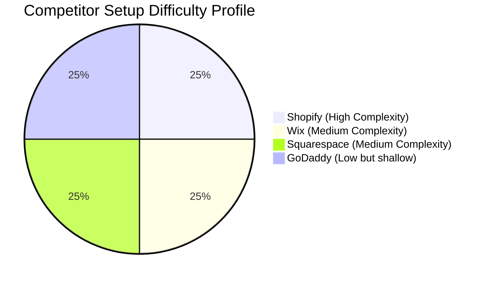
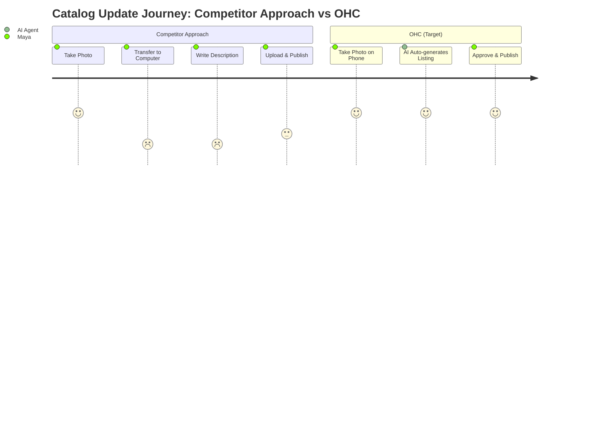

# [Feature] Invisible AI Catalog Manager

## Title
Invisible AI Catalog Manager: Auto-syncing and Auto-generating Product Listings for SMBs

## Problem Statement
Small business owners like Priya (boutique owner) and Maya (baker) struggle to maintain their online product catalogs. Taking photos, writing SEO-friendly descriptions, and syncing inventory across in-store POS and online storefronts is extremely time-consuming. Competitors like Shopify and Wix often require manual data entry, which overwhelms non-technical users. Managing these aspects from a phone is particularly clunky, hindering on-the-go business owners.

## Research Report
### Market Scope & Persona Pains
- **Market Scope:** Small businesses (service and retail) operate with limited staff and time. They need tools that eliminate administrative overhead.
- **Beachhead Market:** Retail and food businesses (like Priya and Maya) that have frequent inventory turnover and high mobile device usage.

### Competitor Audit
| Competitor | Setup Difficulty | Mobile App Quality | AI Features | Free Tier |
|---|---|---|---|---|
| **Shopify** | High | Strong for established, poor for setup | Sidekick (chat assistant, not autonomous) | None (14-day trial) |
| **Wix** | Medium | Limited mobile editor | Wix ADI (one-time site generation) | Yes, but restricted |
| **Squarespace** | Medium | Good for design, poor for ops | Basic text generation | None |
| **GoDaddy** | Low | Shallow | Airo (basic branding generation) | Basic |

### OHC vs. Competitors (Feature Gap)
| Feature | Shopify | Wix | OHC (current state) | OHC (gap/advantage) |
|---|---|---|---|---|
| Basic Product Storage | Yes | Yes | Implemented (`products` table, simple properties) | On par |
| Tier Quotas | No (Unlimited) | Varied | Implemented (Free/Starter/Pro tiers with rate limiting) | On par |
| Invisible AI Creation | No (Chatbot) | No (Text-only) | Missing | **Major Gap to fill** |

### Persona-Specific Pain Point Summary
1. **Maya (Baker):** Overwhelmed by Shopify; complex setup; no built-in AI help; can't manage from phone easily.
2. **Priya (Boutique Owner):** Inventory sync issues; unable to do email marketing easily; no POS integration.
3. **Carlos (Handyman):** No booking system; manual quoting; misses leads when busy.
4. **Leo (Music Tutor):** Manual booking chaos; no subscription billing; no AI follow-up system.
5. **Fatima (Food Cart):** No English-first tool works for her; no mobile notification on order; can't print order list.

### OHC AI Differentiation Manifesto
1. **Auto-writing product descriptions:** Saves time. User uploads photo -> Agent extracts details -> Generates listing.
2. **Auto-replying to customer messages:** Saves hours. Agent reads FAQs/catalog -> Answers routine queries.
3. **Auto-syncing inventory:** Agent detects POS transaction -> Updates online store immediately.
4. **Auto-generating social posts:** Removes marketing barrier. Agent uses product photos to schedule posts.
5. **AI-generated weekly insights:** Motivates users. (e.g. "You sold 10 more cakes this week! Keep it up.").

### Visualizations

## Design Doc
**Architecture Overview:**
- **Product Entity:** Core representation of a physical good, digital good, or service. Exists in `products` table.
- **AI Vision Integration:** Connects the upload stream to an AI vision model to extract tags, colors, and titles from raw images.
- **Agent Integration Point:** An async background worker that listens for `ImageUploadedEvent` on the teammate mesh and enqueues an `AutoGenerateListingTask`.
- **UI Flow (Mobile-First 375px):**
  1. Floating Action Button (FAB) -> "Add Item".
  2. Camera opens -> User snaps photo.
  3. Loading shimmer (Glassmorphism UI, Outfit font) -> "Agent is drafting your listing..."
  4. Form populates with Title, Price (estimate/editable), Description, and Tags.
  5. User taps "Approve" -> Published to storefront.

## Implementation Prompt
**Critical User Journey (CUJ):**
As a small business owner, I want to take a picture of a new product on my phone and have the system automatically create a complete, SEO-friendly product listing so that I don't have to spend time typing on a small screen.

**Acceptance Criteria:**
- The user can upload an image from the mobile web UI.
- An AI service analyzes the image and returns a proposed title, description, and tags.
- The UI gracefully shows a loading state and then presents the auto-filled form to the user.
- The user can edit any field before clicking "Publish".
- The published product appears in the store catalog.

## Priority
P0

## Estimated Scope
Medium
