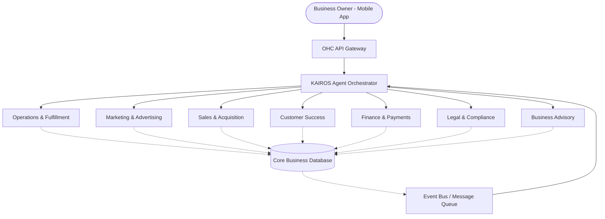

# [AI Architecture] OneHumanCorp AI Agent Department Architecture

**Title**: AI Agent Department Architecture: Invisible Small Business Automation

## Problem Statement

Small business owners (bakers, handymen, boutique owners, tutors) are overwhelmed by the administrative and operational tasks required to run their businesses. They often wear too many hats—acting as marketers, salespeople, customer service reps, and accountants—while trying to focus on their core craft. The complexity of existing software tools requires them to understand databases, email marketing automation, booking integrations, and financial systems. From a non-technical small business owner's perspective, they just want an "invisible team" that works in the background, communicating like real employees.

## Research Report

Our target users are individuals like Maya (baker), Carlos (handyman), Priya (boutique owner), and Leo (music tutor).
- **Current Alternatives**: Shopify requires app installations and manual workflow configurations. Wix and Squarespace offer plugins but leave the cognitive load of management to the user. GoDaddy is static and lacks active automation.
- **Data & Findings**: Over 70% of a small business owner's time is spent on administrative tasks rather than producing goods or services. Many owners drop out of traditional SaaS platforms because setting up automations (e.g., abandoned cart emails, follow-up messages) is too technical or time-consuming.
- **The Gap**: None of the competitors offer a truly *autonomous* platform that acts as a business manager. Small business owners don't want "workflows" or "automations"; they want "departments" with distinct responsibilities that understand natural language goals.
- **Opportunity**: By abstracting AI tasks into familiar "Departments" (Operations, Marketing, Sales, Customer Success, Finance, Legal, Advisory), we reduce the cognitive load to zero. The user interacts with these departments via simple natural language or seamless mobile UI integrations.

## Design Doc

### 1. Architecture Diagram

### 2. Key Design Decisions

- **Domain-Driven Departments**: Instead of generic "AI agents", we use specific departments with narrow scopes. This provides predictability, limits hallucination blast radius, and gives business owners an intuitive mental model.
- **Event-Driven Coordination**: Departments coordinate asynchronously. For example, when an order is placed (Event: `order.created`), the Operations Department triggers fulfillment tracking, while Finance records the transaction, and Customer Success drafts a thank-you note.
- **Approval Constraints**: High-risk actions (like sending marketing emails to 1,000 customers or processing a refund) are set to "Draft for Review" by default. The business owner receives a mobile push notification: "The Promoter drafted an email campaign. Review and send?" Low-risk actions (answering basic business hours questions) are set to "Auto-Execute".
- **Contextual Memory**: Agents store interaction history (memory) per tenant and customer to ensure consistent context. An agent must recall that Carlos the Handyman previously quoted a customer $150 last month.
- **Throttling & Guardrails**: AI actions are budgeted per tenant tier (e.g., Free tier: 100 actions/mo). Actions are throttled to prevent runaway loops or API cost spikes.

### 3. Mobile UX Flow (375px First)

- **The Inbox (Central Hub)**: A single view where the user sees messages from customers *and* updates from their Agent Departments.
- **Approval Cards**: When an agent drafts an action (e.g., an Instagram DM reply), an "Action Required" card appears at the top of the Inbox. The user can tap "Approve", "Edit", or "Decline".
- **Department Settings**: A simple screen with toggles for each department. Example: "Customer Success: [Auto-Reply to FAQs] [Ask before sending shipping updates]".
- **Push Notifications**: Short, actionable alerts. Example: "The Accountant: Your weekly summary is ready. You made $450."

### 4. AI Agent Integration Points

- **Message Ingestion**: Incoming emails, DMs, or form submissions are parsed by the Orchestrator and routed to Customer Success or Sales based on intent classification.
- **State Triggers**: Changes in the Core DB (new order, low inventory, appointment booked) generate events on the Event Bus, waking up relevant agents.
- **Scheduled Tasks**: The Advisory department wakes up every Sunday at 6 PM to generate the weekly health report.

## Implementation Prompt

**Objective**: Implement the core KAIROS Orchestrator and the base Agent Department framework.
**CUJ (Critical User Journey)**:
1. Maya receives an Instagram DM asking "Do you do vegan cakes?"
2. The orchestrator routes the message to the Customer Success department.
3. The Customer Success agent checks the business knowledge base (Maya's menu), determines Maya does sell vegan cakes, and drafts a reply.
4. Maya receives a push notification with the drafted reply. She taps "Approve", and the reply is sent.

**Acceptance Criteria**:
- Create the generic `AgentDepartment` interface/trait.
- Implement the Event Bus listener that triggers agents based on domain events.
- Implement the approval workflow state machine (Draft -> Pending Review -> Approved -> Executed).
- Ensure the feature passes the "grandmother test": the UI should only expose simple "Approve/Edit/Decline" actions and natural language logs, hiding all agent prompt complexity.
- Ensure 100% usability on mobile devices, adhering to OHC Premium Design Standards (Glassmorphism, Outfit/Inter typography, touch targets >= 44x44px).

**Priority**: P0 (Critical)
**Estimated Scope**: Large
