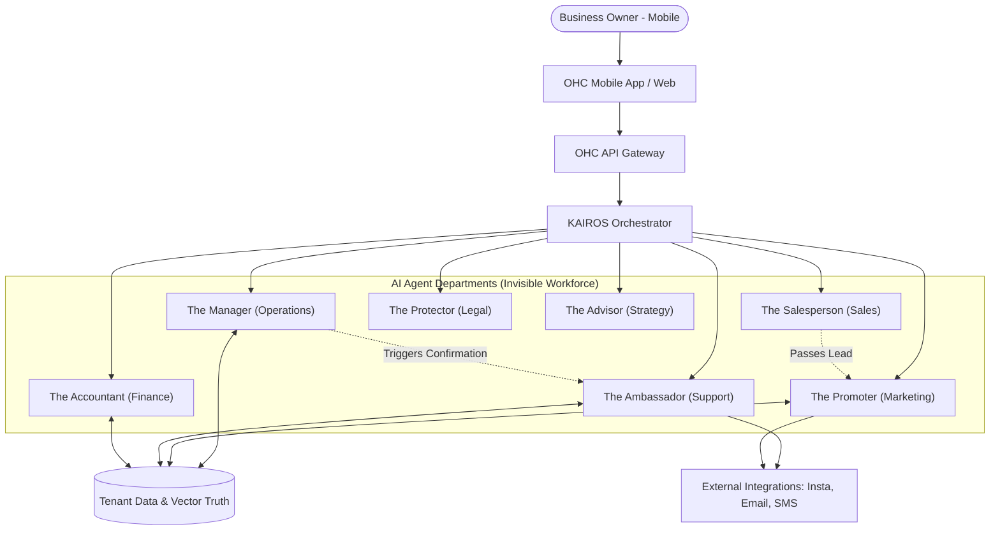

# [Architecture] AI Agent Department Architecture

## Problem Statement

Small business owners—whether it’s Maya the baker on Instagram or Carlos the handyman—often have no staff and run operations solo, primarily from a smartphone. They cannot manage complex dashboards, nor should they need to configure automated rules, read through developer API specs, or deal with technical agent concepts like "temperature" and "system prompts."

The gap is that powerful AI capabilities exist, but they are trapped behind technical abstractions. To bridge this, OneHumanCorp (OHC) needs to organize AI capabilities into **"Departments"**—friendly names representing standard business roles (e.g., "The Manager," "The Promoter," "The Accountant"). This architecture enables non-technical business owners to easily hire, interact with, and trust an invisible AI workforce operating seamlessly on their behalf.

## Research Report

### Findings & User Needs
- **Mobile-First Reality:** Over 85% of target users (Maya, Carlos, Fatima) operate exclusively from mobile devices. The AI departments must communicate effectively via push notifications, SMS-style updates, and simple mobile UI cards.
- **Cognitive Load:** Users are overwhelmed by options. An "Auto-Execute" vs. "Draft for Review" approval model is critical. For instance, replying to routine queries can be auto-executed, while issuing refunds or sending marketing campaigns should be drafted for review.
- **Trust Building:** Users need to see what the agents have done recently in clear, plain language (e.g., "The Accountant sent 3 invoices today").
- **Cost Considerations:** The architecture needs to budget and throttle AI usage per tenant based on their tier, prioritizing essential operations (like order processing) over discretionary tasks (like generating social media posts).

### Competitive Analysis
- **Shopify:** Offers "Shopify Magic" for generative text, but it's an embedded tool, not an autonomous department working in the background.
- **Wix/Squarespace:** Primarily focused on site generation and basic CRM automations. They lack proactive, persona-driven autonomous agents.
- **OHC Advantage:** By framing AI as distinct "Departments" working invisibly, OHC provides a full virtual staff rather than isolated software features.

## Design Doc

### Architecture Diagram (Mermaid)

### UI Wireframes & Mobile UX Flow (375px)

**Screen 1: The "Staff" Dashboard (Home)**
- **Header:** "Your Team is Working"
- **Content:** A list of active departments (e.g., Operations, Marketing) with a simple status indicator (Green = active).
- **Recent Activity Feed:** Plain language updates.
  - "The Ambassador answered 4 questions on Instagram."
  - "The Accountant collected a $50 deposit."

**Screen 2: Department Detail ("The Promoter")**
- **Overview:** "What I'm doing today."
- **Pending Approvals:** A card asking for review: "I drafted an Instagram post for the new vegan cake. Approve?" [Approve] [Edit]
- **Settings Toggle:** "Simple Mode" (default) showing basic on/off switches for tasks. "Advanced Mode" toggle hidden behind a sticky setting for the rare power user.

**Screen 3: Onboarding/Hiring Flow**
- "Let's hire an Accountant to handle your billing." -> [Hire Now]
- Agent asks 2 simple questions to understand the business context, then configures itself.

### Key Design Decisions & Rationale

1. **Departmental Persona Abstraction:**
   - **Why:** Non-technical users understand "Accountant" or "Manager" much better than "RAG-enabled LLM." This abstraction builds trust and clarifies the agent's scope.
2. **"Draft for Review" as Default for High-Risk Actions:**
   - **Why:** To prevent costly mistakes (like errant refunds or off-brand social posts), agents will default to creating drafts. As trust builds, users can toggle specific tasks to "Auto-Execute."
3. **Event-Driven Orchestration via KAIROS:**
   - **Why:** Departments must collaborate. When "The Manager" completes an order fulfillment, it emits an event that "The Ambassador" catches to send a shipping confirmation. This prevents monolith agent bloat and keeps responsibilities separated.
4. **Mobile-Parity First:**
   - **Why:** All notifications, approvals, and activity feeds are designed as tap-friendly cards optimized for 375px screens. The desktop experience is an expanded view of the mobile baseline.
5. **Tier-Based Throttling (Invisible Limits):**
   - **Why:** Different tiers have different AI usage limits. Throttling is applied at the department level gracefully. If a free tier limit is reached, the system suggests an upgrade rather than throwing a hard error.

## Implementation Prompt

**To the Implementer:**
Please implement the foundational backend architecture and mobile-first UI for the "AI Departments" feature.

**Core User Journey (CUJ):**
1. The user opens the mobile app and views the new "My Staff" dashboard.
2. The user sees a feed of recent plain-language activities generated by the various departments (e.g., "The Manager", "The Ambassador").
3. The user taps on "The Promoter" to view pending actions and approves a drafted social media post.

**Acceptance Criteria:**
- Create the structural abstraction for defining AI Departments (Operations, Marketing, Sales, CS, Finance, Legal, Advisory).
- Implement an event bus or coordination mechanism allowing departments to trigger actions in other departments (e.g., Operations triggers Customer Success).
- Build the 375px mobile-first Slint UI for the "My Staff" dashboard and individual Department detail views.
- Ensure the UI defaults to a "Simple Mode" with an "Advanced Mode" toggle for power users.
- Implement an approval flow distinguishing between "Auto-Execute" and "Draft for Review" actions.
- Do NOT prescribe the underlying vector DB or LLM provider in your PR; design the interfaces so they are provider-agnostic.
- **Zero Configuration:** The user should not have to write prompts or configure complex API keys to enable a department.

**Priority:** P0
**Estimated Scope:** Large
