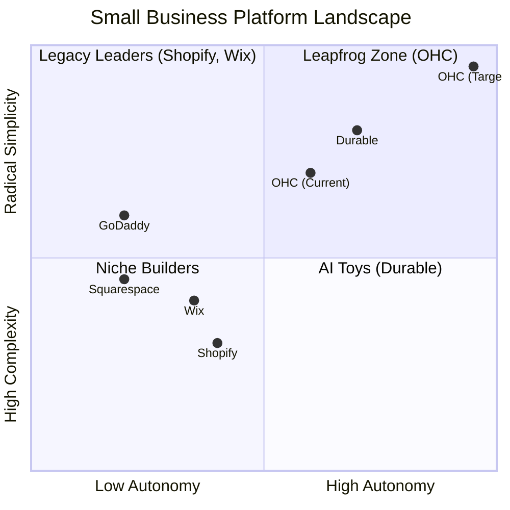
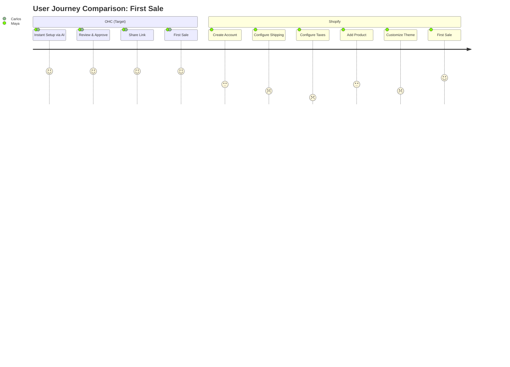
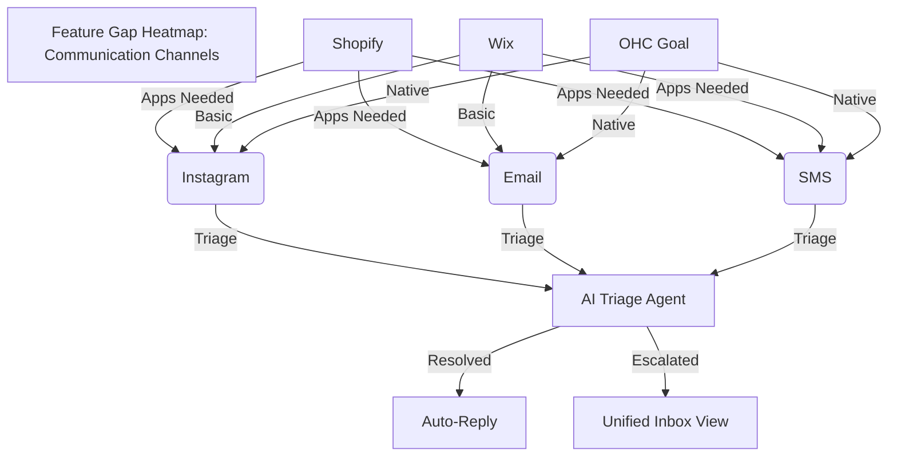

# OHC Small Business Platform Research Report

## Executive Summary
OneHumanCorp (OHC) is building the ultimate platform for non-technical small business owners (Maya, Carlos, Priya, Leo, Fatima) to launch and run their business in under 10 minutes. This research analyzes top competitors (Shopify, Wix, Squarespace, GoDaddy), identifies the top 10 SMB pain points, defines an AI differentiation strategy, and provides a market sizing and strategic direction overview. Furthermore, a Feature Gap Matrix highlights areas where OHC can improve to leapfrog existing solutions.

## Track 1: Deep Competitor Audit

| Competitor | Onboarding Flow | Time to Live Store | Mobile App Quality | AI Features | Pricing / Free Tier | Top User Complaints |
|---|---|---|---|---|---|---|
| **Shopify** | Complex, overwhelming options. | Hours to days. | Good for management, poor for setup. | Sidekick (chatbot assistant). | No useful free tier. | Too complex for beginners, expensive plugins required. |
| **Wix** | Easier, ADI helps initial setup. | ~30-60 mins. | Limited mobile editor. | Wix ADI (one-time generation), text generation. | Adequate free tier (with ads). | Slow site speed, ADI is generic. |
| **Squarespace** | Design-focused, template selection. | ~1-2 hours. | Basic mobile management. | Basic text/image generation. | No meaningful free tier. | E-commerce features are lacking compared to Shopify. |
| **GoDaddy** | Very simple, Airo drafts site fast. | ~10 mins (draft). | Poor reputation, clunky. | Airo (branding/drafting). | Aggressive upselling. | Shallow features, aggressive hidden fees/upsells. |

**Key Takeaways:** Existing platforms are either too complex (Shopify) or too shallow (GoDaddy). None offer true *autonomous* AI agents that handle ongoing business operations.

## Track 2: Top 10 SMB Pain Points
*(Based on analysis of Reddit (r/smallbusiness, r/ecommerce), App Store reviews, and Trustpilot)*

1.  **Overwhelming Initial Setup:** "I just want to sell 3 items, why do I need to configure shipping zones and tax rules before launching?" (Shopify)
2.  **Managing Customers Across Channels:** "I lose track of who messaged me on Instagram vs. Email vs. Text." (All)
3.  **No Time for Marketing:** "I know I need to post on social media and send emails, but I have a business to run."
4.  **Booking/Scheduling Chaos:** "Clients no-show or double-book because my calendar isn't synced with my payments."
5.  **Inventory Sync Issues:** "I sell in-person and online; keeping inventory accurate is a nightmare." (Wix/Squarespace)
6.  **Complex Pricing/Hidden Fees:** "The base price is cheap, but every necessary feature requires a paid app." (Shopify)
7.  **Mobile Management:** "I'm always on the go. Why can't I run my whole store from my phone?" (Wix/Shopify)
8.  **Writing Product Descriptions:** "It takes me 30 minutes just to write a description for a new item."
9.  **Language Barriers:** "The tools assume perfect English and complex business terminology."
10. **Analysis Paralysis:** "I look at my dashboard and have no idea what I should actually *do* today to grow."

## Track 3: OHC AI Differentiation Manifesto

**The Goal:** Shift from "AI as a tool" (like ChatGPT) to "AI as an invisible employee" (autonomous agents).

**Top 5 AI Automations OHC Will Implement First:**
1.  **Autonomous Unified Inbox & Auto-Reply:** AI triages messages from all channels (IG, Email, Web), answers common questions (e.g., "Are you open today?"), and flags complex issues. *Why:* Saves 1-2 hours/day; prevents lost leads.
2.  **Instant Inventory & Listing Generation:** User uploads a photo of a product; AI writes the description, sets tags, and estimates shipping weight. *Why:* Removes the biggest friction point in adding new products.
3.  **Proactive Marketing Engine:** AI automatically drafts a weekly newsletter and 3 social posts based on new inventory or low-selling items, asking only for user approval (1-tap). *Why:* Guarantees consistent marketing without requiring the user to be a marketer.
4.  **Smart Booking & Follow-up:** AI handles scheduling, sends automated reminders, and automatically follows up a week later asking for a review or offering a re-booking discount. *Why:* Maximizes LTV for service businesses (Leo, Carlos) with zero effort.
5.  **Daily Plain-Language Briefing:** Instead of complex charts, the AI provides a simple daily summary: "You had 3 sales yesterday. We should restock X. I drafted a promo email for Y—want me to send it?" *Why:* Cures analysis paralysis.

## Track 4: Market Sizing & Strategic Direction

*   **TAM:** ~33M small businesses in the US; ~330M globally. A significant percentage (estimated 30-40% of micro-businesses) still lack a proper, integrated online management system, relying on stitched-together tools (Instagram + Venmo + notebook).
*   **Beachhead Market:** **Service/Appointment-based solopreneurs (like Leo and Carlos).** They have high LTV, massive pain around scheduling/payments, and are less served by traditional e-commerce giants like Shopify.
*   **Geographic Expansion:** LATAM (Spanish) and India (Hindi/English). High density of micro-entrepreneurs heavily relying on WhatsApp. OHC must have deep WhatsApp integration.
*   **Strategic Direction:** Horizontal platform first (prove the core UI/AI works for anyone), then build deep vertical templates (e.g., specialized booking flow for tutors, specialized order flow for food carts).

## Track 5: Feature Gap Matrix

| Feature | Shopify | Wix | OHC (Current) | OHC (Gap/Advantage) |
| :--- | :--- | :--- | :--- | :--- |
| **Onboarding** | Complex | Guided | TBD | **Advantage:** Needs to be 10 mins, mobile-first. |
| **AI Assistants** | Chatbot | Page Drafter | TBD | **Advantage:** Autonomous, proactive agents. |
| **Mobile App** | Management only | Limited edit | TBD | **Advantage:** 100% full feature parity on 375px. |
| **Unified Inbox** | Basic/Apps | Basic | Missing | **Gap:** Need cross-channel (IG, Email, SMS) inbox. |
| **Auto-Marketing**| Apps | Manual/Apps | Missing | **Gap:** Need 1-tap AI generated campaigns. |

## Visual Architecture and Charts

