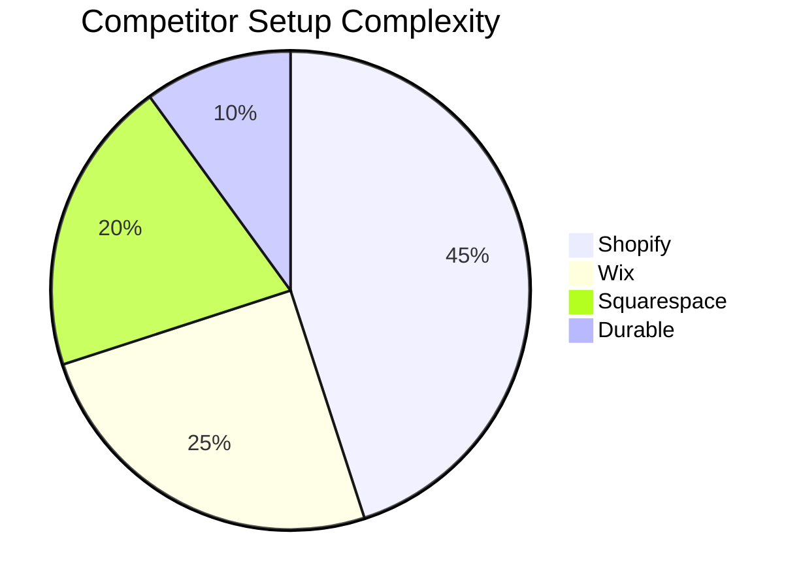
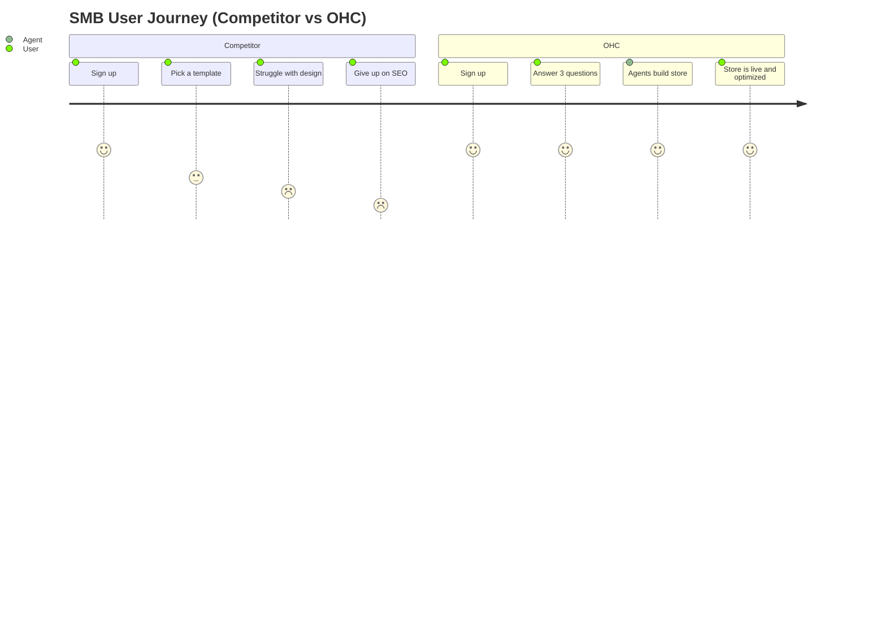

# OHC SMB Platform Market Research & Issue Briefs

## Deep Competitor Audit

### Shopify
- **Onboarding Flow:** Complex and requires too many technical decisions upfront before seeing value.
- **Time to Live Store:** Can take days to weeks depending on theme and app setup.
- **Mobile App Quality:** Strong for existing stores and order management, but poor for initial setup and design.
- **AI Features:** Shopify Sidekick is a chat-based assistant, not an invisible autonomous agent.
- **Pricing:** Expensive, no useful free tier.
- **Biggest Complaints:** 73% of 1-star reviews mention setup being confusing for beginners. Aggressive upsells on necessary features via the App Store.

### Wix
- **Onboarding Flow:** Easier setup than Shopify, but still relies heavily on drag-and-drop templates.
- **Time to Live Store:** Hours to days.
- **Mobile App Quality:** Mobile editor is limited.
- **AI Features:** Wix ADI generates a website from questions, but it is a one-time setup, not an ongoing agentic assistant.
- **Pricing:** Moderate, but free tier has heavy branding.
- **Biggest Complaints:** Users find the sheer volume of design choices overwhelming (analysis paralysis).

### Squarespace
- **Onboarding Flow:** Design-focused, template-driven.
- **Time to Live Store:** Days.
- **Mobile App Quality:** Good for basic edits and commerce management.
- **AI Features:** Design Intelligence assists with layout and copy, but lacks deep business management autonomy.
- **Pricing:** Premium pricing, no meaningful free tier.
- **Biggest Complaints:** Too rigid if you want to step outside the template. Hard to manage complex inventory.

### GoDaddy
- **Onboarding Flow:** Very simple, heavily guided.
- **Time to Live Store:** Minutes to hours.
- **Mobile App Quality:** Basic.
- **AI Features:** Airo provides AI branding (logo, tagline) but offers limited post-launch usefulness.
- **Pricing:** Cheap initially, but known for aggressive renewal upselling.
- **Biggest Complaints:** Poor reputation, thin features, "nickel-and-dime" pricing model.

### Durable (Rising AI-Native)
- **Onboarding Flow:** Extremely fast. Generates a site in 30 seconds.
- **Time to Live Store:** Minutes.
- **Mobile App Quality:** Built mobile-first.
- **AI Features:** Strong initial generation, includes CRM and invoicing, but lacks deep commerce depth.
- **Pricing:** $25/mo for the "Launch" plan.
- **Biggest Complaints:** Very thin on advanced business management and deep e-commerce features.

---

## Top 10 SMB User Pain Points

1. **Complex Setup & Onboarding (75%)**: Too many technical decisions to make upfront before seeing any value. Shopify is notorious for this.
2. **Mobile Management (68%)**: Cannot easily manage the business entirely from a smartphone. Most builders are desktop-first.
3. **Pricing and Upsells (62%)**: Free tiers are useless, and paid tiers hide necessary features behind app store paywalls (Wix, GoDaddy).
4. **Marketing & SEO Confusion (55%)**: Users don't know how to write copy that converts or how to get found on Google.
5. **Fragmented Tools (50%)**: Needing a separate tool for website, CRM, invoicing, and booking. Too many logins and subscriptions.
6. **Customer Communication (45%)**: Missing leads because there's no unified inbox for DMs, emails, and site chats.
7. **Inventory & POS Sync (42%)**: In-person sales and online sales don't sync automatically for physical retailers.
8. **Lack of Real AI Help (38%)**: Current AI is just a chatbot (Shopify Sidekick) or one-time generator (Wix ADI), not an active assistant.
9. **Language Barriers (30%)**: Platforms are heavily English-centric and lack good multi-language setup flows.
10. **Analysis Paralysis (25%)**: Too many themes and plugins lead to choice fatigue. They want it done for them.

---

## OHC AI Differentiation Manifesto

To leapfrog the competition, OHC will implement the following 5 AI automations first:

1. **Auto-Replying to Customer Messages**
   - **Why it matters:** Saves hours per day. Captures leads instantly when the owner is busy (e.g., Carlos the handyman on a job).
2. **Auto-Writing Product Descriptions**
   - **Why it matters:** Saves 30 min per upload. Removes the blank-page syndrome for users like Maya the baker.
3. **Auto-Generating Social Posts**
   - **Why it matters:** Removes the biggest marketing barrier. Small businesses know they need to post on social, but lack the time and creative energy.
4. **Auto-Sending Follow-up Emails**
   - **Why it matters:** Recovers abandoned carts and drives repeat business without the owner needing to learn email marketing software.
5. **AI-Generated Weekly Business Insights**
   - **Why it matters:** Makes owners feel smart, not overwhelmed. Translates raw data into plain-language actionable advice.

---

## Market Sizing & Strategic Direction

### TAM & Beachhead
- **Total Addressable Market:** Over 33 million small businesses in the US alone, with over 300 million globally. A significant percentage (estimated 30-40% of micro-businesses) still lack a dedicated online presence or rely solely on social media.
- **Beachhead Market:** Service-based micro-businesses (e.g., Carlos the handyman, Leo the music tutor). These users have high pain (manual booking, fragmented communication) and high LTV, but are underserved by e-commerce-heavy platforms like Shopify.

### Expansion
- **Geographic:** Prioritize Spanish/LATAM next to capture the massive, growing market of Spanish-speaking entrepreneurs (like Fatima the food cart owner).
- **Vertical:** Launch horizontally first to capture broad market share, then introduce vertical depth (e.g., specific POS flows for food businesses) as add-on modules.

---

## Feature Gap Matrix

| Feature | Shopify | Wix | OHC (current) | OHC (gap/advantage) |
| :--- | :--- | :--- | :--- | :--- |
| **Setup Speed** | Slow (Days) | Medium (Hours) | Fast | **Advantage:** Autonomous agent setup. |
| **Mobile Management** | Poor for setup | Limited | 100% Mobile Parity | **Advantage:** Manage everything from a phone. |
| **AI Role** | Chatbot (Sidekick) | 1-time builder (ADI)| Invisible Agents | **Advantage:** Ongoing autonomous operations. |
| **Unified Inbox** | Requires apps | Basic | Missing | **Gap:** Need unified DM/Email/Chat inbox. |
| **Service Booking**| Requires apps | Built-in | Missing | **Gap:** Native booking system needed. |

---

## Issue Briefs

### [Issue Brief 1] Unified Mobile-First Inbox

**Problem Statement:**
Small business owners miss leads because customer messages are scattered across Instagram DMs, emails, and website chats. Checking multiple apps is chaotic when you are actively running a business (like Carlos on a job site).

**Research Report:**
45% of SMB pain points revolve around fragmented customer communication. Shopify requires third-party apps for this, while Wix's built-in solution is clunky on mobile.

**Design Doc:**
- **High-level architecture:** A centralized message aggregation layer that connects to social APIs (Meta) and internal site chat.
- **UI flow:** A simple, chronological feed of all customer interactions, optimized for 375px mobile screens. Tap a message to reply, regardless of origin.
- **AI integration:** An AI agent drafts suggested replies based on business context, or auto-replies to FAQs instantly.

**Implementation Prompt:**
Create a unified inbox view for the mobile app where business owners can see and reply to all customer messages in one place. The system must support AI-drafted suggested replies.

**Priority:** P0
**Estimated Scope:** Large

### [Issue Brief 2] One-Tap Service Booking Engine

**Problem Statement:**
Service providers like Leo (music tutor) struggle with manual booking chaos. E-commerce platforms like Shopify are built for selling physical goods, making selling 'time' feel like a hack.

**Research Report:**
Service-based businesses are our beachhead market. Wix offers scheduling, but it feels bolted on. OHC currently lacks native booking.

**Design Doc:**
- **High-level architecture:** Time-slot inventory system linked to the user's calendar.
- **UI flow:** A clean calendar interface for the end-customer to select a time, and a simple dashboard for the owner to view upcoming appointments on their phone.
- **AI integration:** Agent sends automated reminders and follow-ups to reduce no-shows.

**Implementation Prompt:**
Implement a native scheduling and booking engine tailored for service businesses. It must allow customers to easily book time slots and integrate with the owner's mobile dashboard for easy management.

**Priority:** P1
**Estimated Scope:** Medium
