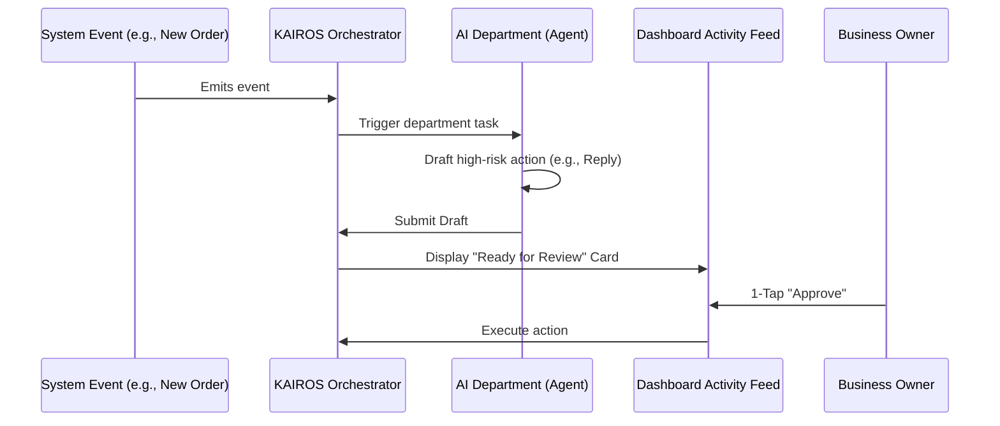

# OneHumanCorp (OHC) Architectural Research & Product Strategy Report

## Executive Summary
This report synthesizes the technical and product vision for OneHumanCorp (OHC), focusing on empowering small business owners (Maya, Carlos, Priya, Leo, Fatima) through autonomous AI agent departments and a mobile-first, zero-jargon experience. We have successfully mapped the end-to-end user journeys, evolved the data model for multi-tenancy and agentic memory, and defined the detailed architecture for all seven AI departments.

---

## 1. Product Vision & Personas
OHC is designed to bridge the "SMB Gap" by replacing manual operations with autonomous AI "employees."
- **Maya (Baker)**: Needs seamless storefront + DM automation.
- **Carlos (Handyman)**: Requires mobile quote generation + booking deposits.
- **Priya (Boutique)**: Needs omnichannel inventory + daily profit analytics.
- **Leo (Tutor)**: Requires subscription billing + calendar sync.
- **Fatima (Food Cart)**: Requires bilingual, low-data, zero-jargon mobile pre-orders.

---

## 2. AI Agent Department Architecture
The platform is organized into 7 functional departments that operate invisibly via the **KAIROS Orchestrator**.

### The 7 Departments:
1.  **Operations ("The Manager")**: Order processing, inventory, fulfillment.
2.  **Marketing ("The Promoter")**: Website design, SEO/GEO, social media.
3.  **Sales ("The Salesperson")**: Lead conversion, quote drafting, abandoned carts.
4.  **Customer Success ("The Ambassador")**: DM replies, order updates, reviews.
5.  **Finance ("The Accountant")**: Profit tracking, billing, tax preparation.
6.  **Legal ("The Protector")**: Compliance, terms, liability disclaimers.
7.  **Business Advisory ("The Advisor")**: Weekly insights, seasonal trends.

### Coordination Pattern (The "1-Tap Approval" Loop)

---

## 3. Core Architectural Pillars

### I. Data Model (The Memory Layer)
- **Multi-Tenancy**: Hardened via PostgreSQL Row Level Security (RLS) using `tenant_id`.
- **Agentic Memory**: Uses `pgvector` for "AutoDream" long-term memory retrieval.

### II. Mobile-First Performance (The Grandmother Test)
- **Targets**: LCP < 1.5s, FID < 100ms, Touch Targets ≥ 44x44px.
- **Optimistic UI**: Immediate local updates via SIPDB, background sync via Teammate Mesh.

### III. The Smart Builder
- **30-Second Launch**: "Vibe-based" generation of storefronts from a simple bio paragraph.
- **Smart Blocks**: Responsive hero, menu, and booking blocks auto-configured for the persona.

---

## 4. Visual Excellence & Design Tokens
- **Typography**: Outfit (Headings) / Inter (Body).
- **Style**: Glassmorphism (20px blur, 3% opacity white surface).
- **Motion**: Organic cubic-bezier transitions (300ms in / 200ms out).

---

## 5. Implementation Roadmap (Prioritized Tasks)
1.  **[P0] Smart Builder Core**: Implement the block registry and vibe-based generation.
2.  **[P0] Accountant Engine**: Real-time profit calculation and Stripe integration.
3.  **[P0] Agent Activity Feed**: The 1-tap approval UI for mobile users.
4.  **[P1] Salesperson Quote Bot**: Automated quoting and lead follow-ups.
5.  **[P2] Protector Compliance**: Dynamic legal policy generation and allergen/liability blocks.

---

## 6. Conclusion
OHC is positioned to leapfrog legacy competitors (Shopify, Wix) by focusing on **Autonomy** and **Simplicity**. By treating AI as departments rather than tools, we solve the "Operational Fatigue" that causes most SMBs to fail.

*Report synthesized by Jules (KAIROS Orchestrator).*
