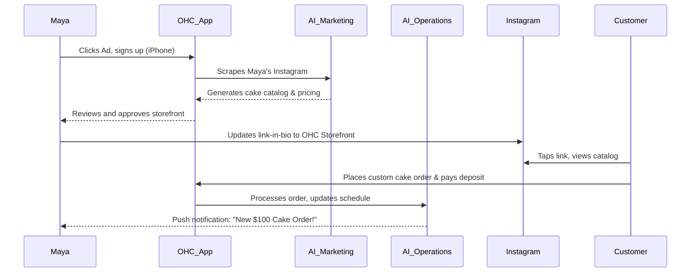
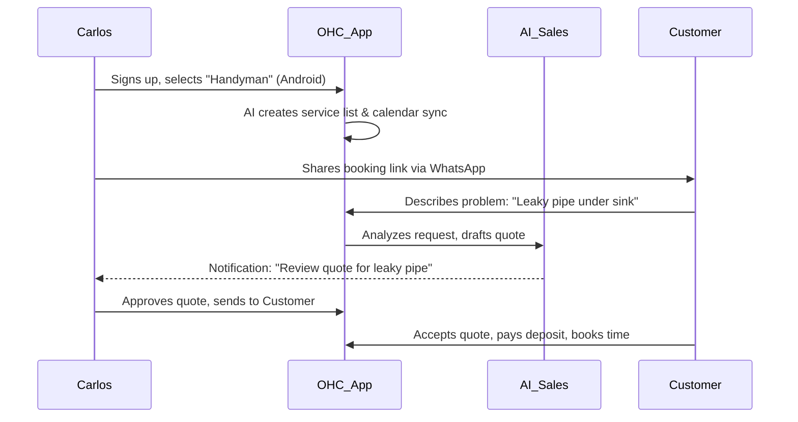
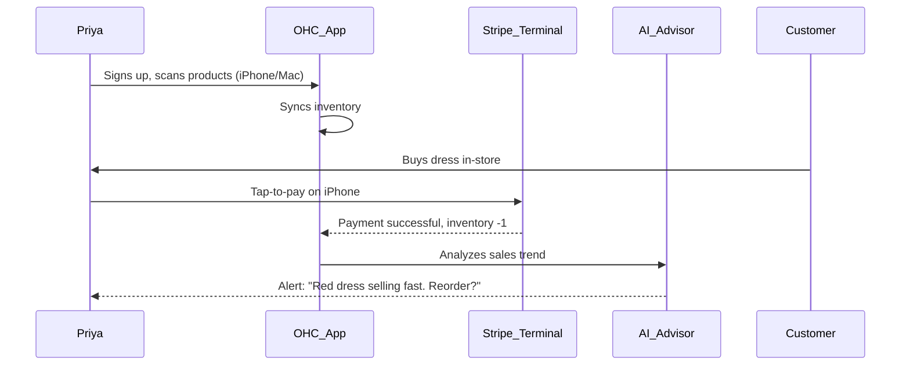
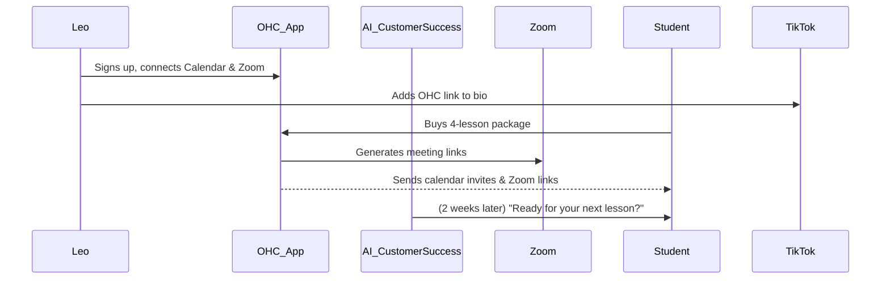
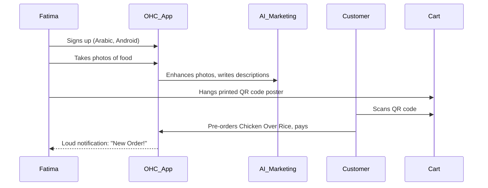

# [Architecture] Business Journey Architecture: End-to-End User Journeys

## Problem Statement
Small business owners often lack technical expertise and are overwhelmed by complex software tools. OneHumanCorp (OHC) aims to empower anyone to launch, run, and grow a business from their phone in under 10 minutes. However, current platforms (Shopify, Wix, Squarespace) fail to provide a cohesive, mobile-first experience driven by AI agents. This research doc designs the complete end-to-end user journeys for key personas to ensure a zero-friction, AI-guided business launch and management experience.

## Research Report

We analyzed the end-to-end business journey for five core personas across the six stages of the customer lifecycle: Acquisition, Onboarding, Activation, Retention, Revenue, and Referral.

### Competitive Analysis
- **Shopify**: High setup time (30-60 min), requires technical knowledge, desktop-centric management.
- **Wix/Squarespace**: Template-driven but overwhelming options, limited built-in business logic.
- **GoDaddy**: Basic tools, but non-integrated AI and limited mobile management.

OHC's differentiation lies in radical simplicity, true mobile-first management, and AI acting as invisible infrastructure rather than bolted-on chatbots.

## Design Doc: Persona Business Journeys

### 1. Maya — The Home Baker (28, non-technical)
Sells custom cakes via Instagram DMs. Runs everything from her iPhone.

- **Acquisition**: Discovers OHC via a TikTok/Instagram ad highlighting "Turn DMs into paid orders in 2 mins." The landing page CTA is "Start your cake shop for free."
- **Onboarding**: Step-by-step wizard via SMS-style chat. Needs only: Business name ("Maya's Cakes"), Instagram handle (AI scrapes photos for catalog), and Stripe deposit connection. Defer: Custom domain, advanced taxes.
- **Activation**: Day 1: First cake listed with a $50 deposit option. Week 1: Accepts first paid order via an OHC link shared in her bio. Month 1: Replaces DM back-and-forth completely.
- **Retention**: Push notifications for new paid deposits. Daily summary from "The Manager" (Operations Agent) about orders to bake tomorrow.
- **Revenue**: Upgrades from Free to Starter ($9/mo) when she exceeds 10 listed cake varieties or needs more AI actions to auto-reply to DMs. CTA presented gracefully when she reaches 80% of her Free tier AI action limit.
- **Referral**: Shares her customized OHC storefront link in her Instagram bio. The footer subtly says "Powered by OneHumanCorp - Start yours."

### 2. Carlos — The Freelance Handyman (42, non-technical)
Relies on word of mouth, needs a clean service listing, booking system, and AI quoting.

- **Acquisition**: Hears about OHC from a friend or a Facebook Group for contractors. Landing page CTA: "Get a professional booking site in 5 minutes."
- **Onboarding**: Selects "Services/Repairs" business type. AI generates standard services (Plumbing, Painting) and estimated prices based on his location. Connects Google Calendar.
- **Activation**: Day 1: Service listing goes live. Week 1: First booking made with an upfront deposit. Month 1: 5 bookings completed and reviewed.
- **Retention**: Daily morning notifications from "The Manager" showing his schedule and route. AI-generated quotes ("The Salesperson") ready for review.
- **Revenue**: Upgrades to Starter when he needs more than 100 AI actions/month for quoting and follow-ups.
- **Referral**: Sends a WhatsApp link to past clients asking for reviews; the review page offers clients to "Start your own OHC site."

### 3. Priya — The Boutique Owner (35, semi-technical)
Needs to sync in-store and online inventory, and do tap-to-pay on her phone.

- **Acquisition**: Searches Google for "mobile POS and online store sync." Landing page CTA: "Unify your boutique online and offline."
- **Onboarding**: Uploads a CSV of her current inventory, or uses phone camera to scan barcodes/items. AI auto-tags sizes and colors. Sets up Stripe Terminal for tap-to-pay.
- **Activation**: Day 1: Takes an in-store tap-to-pay payment using OHC on her iPhone. Week 1: First online order synced with inventory.
- **Retention**: Real-time inventory alerts ("Low stock on Red Dresses"). Weekly analytics report from "The Advisor" on desktop and mobile.
- **Revenue**: Upgrades to Pro ($29/mo) for custom domain, more storage, and unlimited AI customer support.
- **Referral**: Mentions the app at local small business meetups, sharing a promo code generated by "The Promoter".

### 4. Leo — The Music Tutor (22, non-technical)
Needs lesson booking, Zoom link generation, and subscription packages.

- **Acquisition**: YouTube ad targeting musicians: "Stop managing schedule, start teaching." Landing page CTA: "Set up your lesson bookings."
- **Onboarding**: Connects Google Calendar and Zoom. Sets hourly rate. "The Legal Protector" generates a cancellation policy.
- **Activation**: Day 1: TikTok link-in-bio published. Week 1: First student books a 4-lesson package.
- **Retention**: Push notifications 10 minutes before lessons with Zoom link. AI "The Salesperson" flags inactive students.
- **Revenue**: Upgrades to Starter for recurring subscription billing capabilities.
- **Referral**: Students share his portfolio link, which has an "Powered by OHC" badge.

### 5. Fatima — The Food Cart Operator (50, non-technical, limited English)
Needs a simple menu, pre-orders, and sold-out toggles.

- **Acquisition**: Local community outreach or translated Facebook ad. CTA: "Take phone orders easily" (in Arabic).
- **Onboarding**: Selects Arabic language. Takes photos of her dishes; AI "The Promoter" enhances photos and generates English/Arabic descriptions.
- **Activation**: Day 1: Prints a QR code poster for her cart. Week 1: Receives first pre-order while busy cooking.
- **Retention**: Loud, distinct push notifications for new orders on her low-end Android. Simple daily order list.
- **Revenue**: Stays on Free tier mostly; might upgrade to Starter if order volume exceeds 100/mo.
- **Referral**: Other food cart owners see her QR code poster and ask her about it.

### Friction Points & Mitigation Strategies

1. **Friction:** Blank canvas anxiety during onboarding.
   **Mitigation:** AI completely pre-fills the business based on a single sentence or an Instagram handle.
2. **Friction:** Complex payment gateway setup (Stripe KYC).
   **Mitigation:** Defer KYC until the first $50 is earned. Use "OHC internal balance" initially.
3. **Friction:** Overwhelming notification volume.
   **Mitigation:** "The Manager" rolls up low-priority events into a daily digest, only interrupting for high-value actions (new order, urgent message).
4. **Friction:** Unclear AI behavior.
   **Mitigation:** AI agents operate in "Draft Mode" by default until the user trusts them (e.g., drafts quote, user taps "Approve").

## Implementation Prompt

**To the Implementer Agent:**
Implement the end-to-end "Onboarding Wizard" focusing on the Maya persona (The Home Baker).
The user should be able to create a new tenant by providing just their business name and a brief description (or social media handle).
1. Build the Flutter UI screens (mobile-first, 375px wide) for the Onboarding flow. Use the OHC Premium Token library (Glassmorphism, Outfit/Inter typography).
2. Integrate the AI "Promoter" agent to auto-generate a starter product catalog and a basic storefront design based on the onboarding inputs.
3. Ensure the flow writes to the PostgreSQL database with correct `tenant_id` isolation.
4. Add comprehensive Playwright E2E tests covering the complete flow from home page login -> Onboarding Wizard -> Storefront preview generated. Ensure no external network requests are made in tests (mock the AI response).
5. All implementations must function correctly offline/low-connection by showing optimistic UI states and queuing background syncs.

**Priority:** P0 (Critical)
**Estimated Scope:** Large
