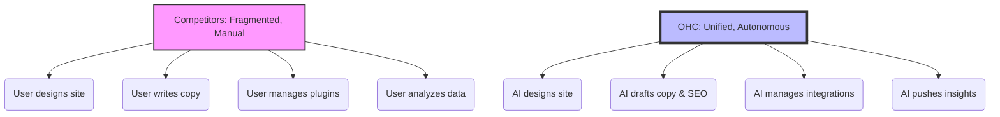

```yaml
issue_id: OHC-RES-001
Priority: P0
Estimated Scope: Large
```

# Market Research Report & Issue Brief: OHC AI-First Autonomous Onboarding

## Problem Statement

Small business owners (SMBs) with zero technical knowledge face significant friction when trying to establish an online presence. While platforms like Shopify and Wix offer powerful tools, they remain complex for beginners, often requiring 30-60 minutes to set up and demanding decision-making regarding templates, plugins, and integrations. Emerging AI builders like Durable and 10Web generate sites quickly but often fall short in providing deep, ongoing business management tools (CRM, inventory, true autonomous marketing). The core problem is that non-technical founders are forced to act as web designers, marketers, and IT administrators, rather than focusing on their core business.

## Research Report

### Competitive Landscape & Feature Gap Analysis

| Feature | OHC (Target) | Shopify | Wix | Squarespace | Durable / 10Web |
| :--- | :--- | :--- | :--- | :--- | :--- |
| **Setup Time** | < 10 mins | 30-60 mins | 20-40 mins | 30-60 mins | < 5 mins |
| **Technical Knowledge** | Zero | Low/Med | Low | Low | Zero |
| **AI Agents (Invisible)** | Yes | No (Chatbot) | No | Limited | Partial (Content) |
| **Mobile-First Mgmt** | Yes | Partial | Partial | No | Partial |
| **All-in-one Management** | Yes | Store Focus | Complex | Portfolio+Store | Basic/Limited |

### User Pain Points (Synthesized from Reviews & Feedback)

Based on an analysis of the SMB market and competitor reviews:

1.  **Complexity Overload:** Users find Shopify's plugin ecosystem and Wix's editor overwhelming. ("Shopify is too complicated for beginners.")
2.  **Blank Canvas Paralysis:** Users struggle to write copy, choose images, and design layouts from scratch.
3.  **Fragmented Tools:** Having separate tools for booking, ecommerce, CRM, and marketing is costly and confusing.
4.  **Mobile Management:** Many users run their business entirely from their phone and find competitor apps lacking full administrative capabilities.
5.  **Reactive Support:** Users want proactive insights, not just a help center when things break.

### Persona Mapping

*   **Maya (Baker, 28):** Needs zero-setup ecommerce and autonomous IG DM replies. Current platforms force her into complex inventory management she doesn't need yet.
*   **Carlos (Handyman, 42):** Needs instant quote generation and booking. Wix is too focused on design; he needs functional lead capture and scheduling.
*   **Priya (Boutique, 35):** Needs seamless POS-to-online sync without the enterprise-level complexity of Shopify.
*   **Leo (Tutor, 22):** Needs subscription billing and calendar sync without paying for multiple SaaS products.
*   **Fatima (Food Cart, 50):** Needs dead-simple, mobile-first order notifications and multi-language support.

### OHC AI Differentiation Manifesto

To leapfrog competitors, OHC will implement the following 5 core AI automations:
1.  **Invisible Website Generation:** AI designs the site based on a conversational prompt, selecting the best layout and writing the initial copy.
2.  **Autonomous Customer Success (The Ambassador):** AI handles tier-1 customer inquiries (e.g., "Do you offer vegan options?") across channels (Web, IG, WhatsApp).
3.  **Proactive Business Advisory (The Advisor):** AI sends weekly plain-language SMS/Push notifications with insights ("Tuesday was your busiest day, consider running a promo next Tuesday").
4.  **Zero-Click SEO & Marketing (The Promoter):** AI automatically optimizes product pages for search and drafts suggested social media posts when new inventory is added.
5.  **Smart Cataloging (The Operations Manager):** AI generates product descriptions and tags from a simple uploaded photo.

### Market Sizing & Beachhead Strategy
*   **Target:** Non-employer small businesses.
*   **Beachhead:** The "Service & Booking" persona (e.g., Carlos, Leo). These users are highly underserved by ecommerce-first platforms like Shopify and find Wix too design-heavy. They need simple lead capture and scheduling.

### Visualizing the OHC Advantage



## Design Doc

### High-Level Architecture
*   **Entities:** `Tenant` (Business), `Department` (AI Agent Role), `Interaction` (Customer Chat/Query), `Insight` (Weekly Report).
*   **AI Integration:** The Onboarding flow utilizes the Gemini Pro LLM to gather initial business context (Name, Industry, Goal) and simultaneously orchestrates the `Marketing & Advertising` department to generate the site structure and copy.
*   **Mobile UX Flow (375px):**
    1.  Splash Screen: "What are you building today?" (Text input or voice).
    2.  Loading Screen (AI generating): Fun facts about their industry or AI progress.
    3.  Reveal: Fully populated mobile-responsive site preview.
    4.  Action: "Publish" or "Tweak it".

## Implementation Prompt

**Critical User Journey (CUJ): Autonomous AI Onboarding**

1.  Create a mobile-first onboarding flow where a user can input a natural language description of their business (e.g., "I'm Carlos, I fix plumbing and paint houses in Austin").
2.  The system must parse this input and automatically generate a complete, functional website preview utilizing the defined Glassmorphism design system.
3.  The generated site must include relevant placeholder copy, AI-selected layout (Service listing vs Ecommerce based on prompt), and a pre-configured contact/booking form.
4.  The user must be able to view this preview on a 375px width simulation and approve it to create their `Tenant` account.
5.  **Acceptance Criteria:** The flow must be completable in under 3 minutes, require no manual drag-and-drop design, and result in a fully provisioned backend `Tenant` with an initial website state saved.
