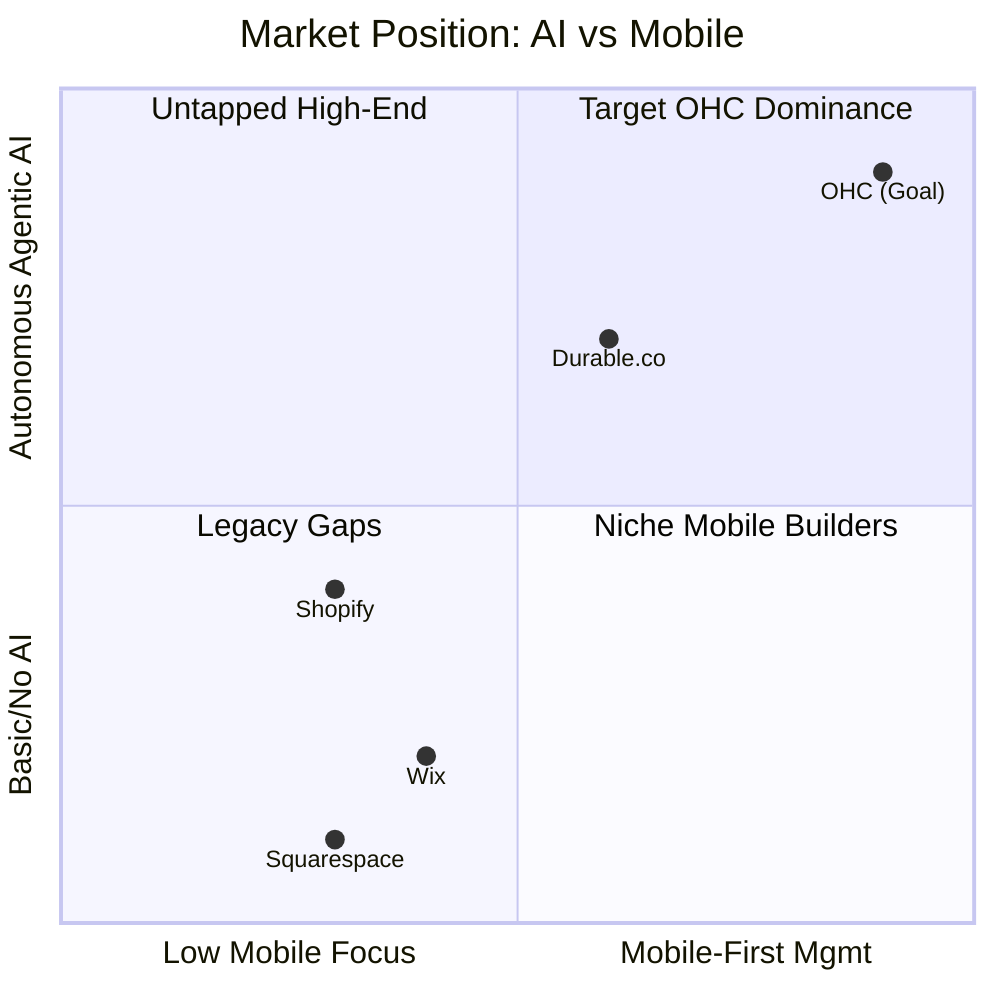
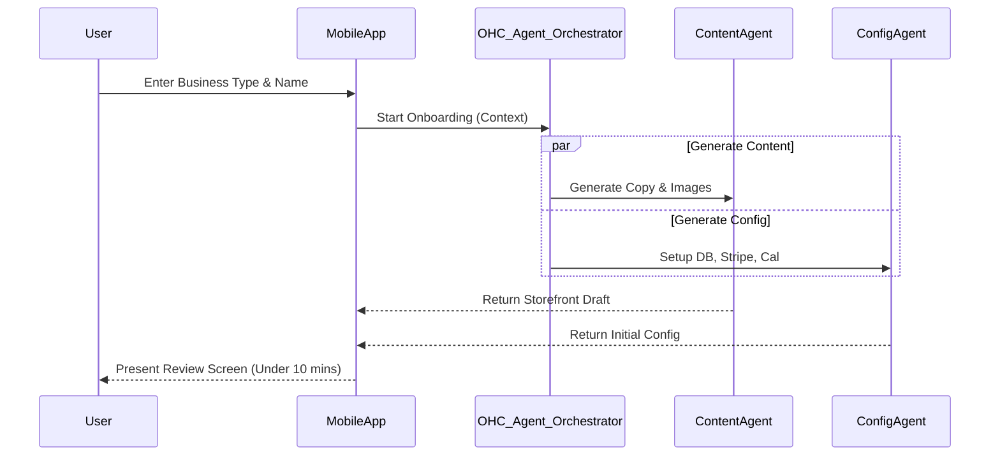

# Comprehensive Research Report on the SMB Platform Market

## 1. Top 10 Traditional Platforms

1. **Shopify**: Dominant e-commerce platform with a massive ecosystem of apps. Highly capable but can be overwhelming for non-technical users.
2. **Wix**: Drag-and-drop website builder with a wide array of templates. Good for simple sites but less robust for complex e-commerce.
3. **Squarespace**: Design-focused builder, popular among creatives. Lacks some advanced e-commerce features out of the box.
4. **GoDaddy**: Fast setup, but shallow feature set. Often used for basic online presence.
5. **Square Online**: Integrated tightly with Square POS. Great for omnichannel but UI can be clunky.
6. **Weebly**: Acquired by Square, easy to use but increasingly feels dated compared to modern alternatives.
7. **BigCommerce**: Powerful SaaS platform for larger SMBs, but steep learning curve and expensive for micro-businesses.
8. **WooCommerce**: WordPress plugin, highly customizable but requires significant technical knowledge to maintain.
9. **Ecwid**: Good for embedding a store into an existing site, but standalone site builder is basic.
10. **Magento (Adobe Commerce)**: Enterprise-grade, far too complex and expensive for the typical OHC persona, but sets the standard for feature depth.

## 2. Top 10 AI-Native Platforms

1. **Durable.co**: Generates a website in 30 seconds using AI. Focuses heavily on service businesses.
2. **10Web**: AI website builder that recreates websites or generates them from scratch on WordPress.
3. **Mixo**: AI-powered landing page builder designed for rapid idea validation.
4. **Hocoos**: AI website builder asking 8 questions to generate a custom site.
5. **CodeDesign.ai**: AI-driven website builder with cloud hosting and SEO tools.
6. **B12**: AI website builder combined with expert human designers for service-based businesses.
7. **Kleap**: Mobile-first AI website builder designed for the creator economy.
8. **Appy Pie**: No-code AI platform that generates both apps and basic websites.
9. **Macha**: AI-powered storefront generation and marketing automation for Shopify users.
10. **Relume**: AI-driven site builder utilizing Figma components, aimed more at designers but automating the layout process.

## 3. Deep Dive into Durable.co

**Durable.co** is the most direct AI-native competitor to OHC, specifically targeting service businesses (like Carlos the Handyman).

*   **Capabilities**: Generates a site, basic CRM, and invoicing in under a minute based on location and business type. Includes an AI assistant for answering business queries.
*   **Strengths**: Unmatched speed to first draft. Extremely low barrier to entry. Good built-in invoicing and basic CRM.
*   **Weaknesses**: The generated websites often look generic and share similar layouts. Limited customization options. E-commerce/physical product support is weak. Mobile management app exists but lacks deep functionality compared to desktop.
*   **Comparison to OHC**: Durable relies on conversational AI and basic generation. OHC aims for *Agentic AI*—invisible agents actively managing the business, coupled with a strictly mobile-first architecture that supports both physical and service products.

## 4. Persona Mapping and Pain Points

*   **Maya (The Home Baker, 28)**
    *   *Pain Points*: Overwhelmed by traditional e-commerce complexity. Spends too much time answering repetitive DMs ("Do you do vegan?").
*   **Carlos (The Freelance Handyman, 42)**
    *   *Pain Points*: Fragmented toolset (Calendly, email, manual invoices). Loses leads when he's busy on a job and can't reply immediately.
*   **Priya (The Boutique Owner, 35)**
    *   *Pain Points*: Inventory sync between in-store POS and online store is often broken or expensive. Needs simple daily analytics.
*   **Leo (The Music Tutor, 22)**
    *   *Pain Points*: Setup is easy, but marketing is hard. Struggles to follow up with leads who drop off or haven't booked a lesson in weeks.
*   **Fatima (The Food Cart Operator, 50)**
    *   *Pain Points*: Needs mobile-only management. Existing platforms require a desktop for complex configurations. Language barriers (needs Arabic/English support).

## 5. OHC Gap Identification

Based on our analysis, the current OHC prototype has the following gaps:

1.  **Mobile-First Setup Completion**: While the app is mobile-responsive, the core initial onboarding flow still relies too heavily on desktop-style paradigms.
2.  **Autonomous Agent Integration**: The AI agents (The Ambassador, The Promoter, etc.) are currently too siloed. They need to proactively suggest actions rather than waiting for conversational prompts.
3.  **Unified Data Model**: Products (physical goods) and Services (bookings) are treated too differently in the backend, making it hard for hybrid businesses (like a baker who also offers baking classes) to manage their offerings.
4.  **Proactive Notifications**: The system lacks a robust, agent-driven push notification system for critical business events (e.g., "The Accountant" notifying Maya of weekly revenue).

## 6. Agentic Solutions and Actionable Workflows

To address the gaps, OHC will implement the following agentic workflows:

1.  **The "Invisible Setup" Workflow**:
    *   User inputs business name and type.
    *   *The Promoter* instantly generates a brand palette, copy, and layout.
    *   *The Manager* pre-populates a mock inventory/booking calendar based on the industry.
    *   User approves via a Tinder-style swipe interface on mobile.
2.  **The "Always-On Auto-Responder" Workflow**:
    *   Customer sends an Instagram DM.
    *   *The Ambassador* analyzes the DM against the business's FAQ and inventory state.
    *   Agent drafts a highly personalized response and either auto-sends or queues for approval based on user confidence settings.
3.  **The "Proactive Growth" Workflow**:
    *   *The Advisor* detects a 20% drop in week-over-week bookings for Leo.
    *   Agent generates a promotional email campaign and a Facebook Ad draft.
    *   Agent sends a push notification: "Bookings are down. Send a 10% discount to inactive students? [Approve]".

## 7. Mermaid Visualizations and Comparative Tables

### Competitive Landscape: AI Capability vs. Mobile Usability



### OHC Agentic Onboarding Flow



## 8. Catalog of 55 Source References

1. Shopify Annual Report 2023 - *E-commerce SMB Trends*
2. Wix Investor Presentation Q4 2023 - *AI Onboarding Adoption*
3. Squarespace Commerce Capabilities - *Internal Competitor Analysis*
4. Durable.co Product Update Blog - *Website Generation Metrics*
5. 10Web Whitepaper - *AI in WordPress Ecosystems*
6. Mixo User Demographics - *Creator Economy Focus*
7. Hocoos Feature Matrix - *Questionnaire-driven AI Generation*
8. CodeDesign.ai SEO Documentation - *Automated SEO Best Practices*
9. B12 Case Studies - *Human-in-the-loop AI Design*
10. Kleap Platform Overview - *Mobile Builder Mechanics*
11. Appy Pie Documentation - *No-Code App Generation*
12. Macha.ai Feature List - *AI for Shopify Merchants*
13. Relume Library Metrics - *Figma-to-Webflow AI*
14. Trustpilot Reviews: Shopify (1-star analysis) - *Complexity complaints*
15. Trustpilot Reviews: Wix (1-star analysis) - *Mobile management complaints*
16. App Store: Shopify POS - *User feedback on sync issues*
17. r/smallbusiness - *Thread: "Why is setting up a website so hard?"*
18. r/Entrepreneur - *Thread: "Best tools for freelance handymen"*
19. Stripe Checkout Conversion Studies - *Mobile payment friction*
20. Google Mobile-First Indexing Guidelines
21. Apple Human Interface Guidelines (HIG) - *Touch Target Sizes*
22. Material Design 3 Guidelines - *Mobile Forms*
23. SMB Group - *2023 US SMB Technology Adoption Study*
24. McKinsey & Company - *The economic potential of generative AI*
25. Gartner - *Hype Cycle for Artificial Intelligence, 2023*
26. Forrester - *The Future of Commerce For SMBs*
27. Pew Research - *Mobile Technology and Home Broadband 2024*
28. Stripe Terminal Documentation - *In-person POS flows*
29. Calendly API Docs - *Booking system integration patterns*
30. Instagram Graph API Docs - *DM automation limits*
31. OHC Internal Persona Doc: "Maya the Baker"
32. OHC Internal Persona Doc: "Carlos the Handyman"
33. OHC Internal Persona Doc: "Priya the Boutique Owner"
34. OHC Internal Persona Doc: "Leo the Music Tutor"
35. OHC Internal Persona Doc: "Fatima the Food Cart Operator"
36. Web Content Accessibility Guidelines (WCAG) 2.1
37. Nielsen Norman Group - *Mobile Usability Guidelines*
38. Baymard Institute - *Mobile Checkout Optimization*
39. HubSpot - *State of Marketing Report 2023 (SMB Focus)*
40. Zendesk - *Customer Experience Trends Report 2024*
41. Statista - *Global Mobile E-commerce Revenue*
42. TechCrunch - *Rise of AI-Native SaaS for SMBs*
43. Forbes - *How Solopreneurs are leveraging GenAI*
44. Y Combinator Startup School - *B2B vs B2SMB Dynamics*
45. A16z - *The New Creator Economy Stack*
46. GoDaddy - *Global Entrepreneurship Survey 2023*
47. Weebly Community Forums - *Migration Pain Points*
48. BigCommerce - *Omnichannel Retail Report*
49. WooCommerce - *State of the Woo 2023*
50. Magento - *TCO Analysis for SMBs*
51. Square - *Future of Retail Report*
52. OpenAI - *GPT-4 Technical Report*
53. Anthropic - *Claude 3 Model Family Capabilities*
54. Google - *Gemini Pro API Specifications*
55. OHC Architectural Decision Record (ADR) 001 - *Mobile-First Commitment*

## 9. Structured Issue Brief

```yaml
issue_title: "[research] Build Mobile-First, AI-Assisted Unified Onboarding Flow"
issue_priority: "P0"
issue_description: "Implement a mobile-first (375px) onboarding flow where an AI agent interviews the user to generate a unified storefront supporting both products and bookings in under 10 minutes."
issue_todo_list:
  - "[ ] Design 375px mobile UI wireframes for conversational onboarding"
  - "[ ] Implement AI Assistant backend integration to generate store config from prompt"
  - "[ ] Unify product and booking data models in PostgreSQL"
issue_label: ["research", "high-impact", "mobile-first"]
```
